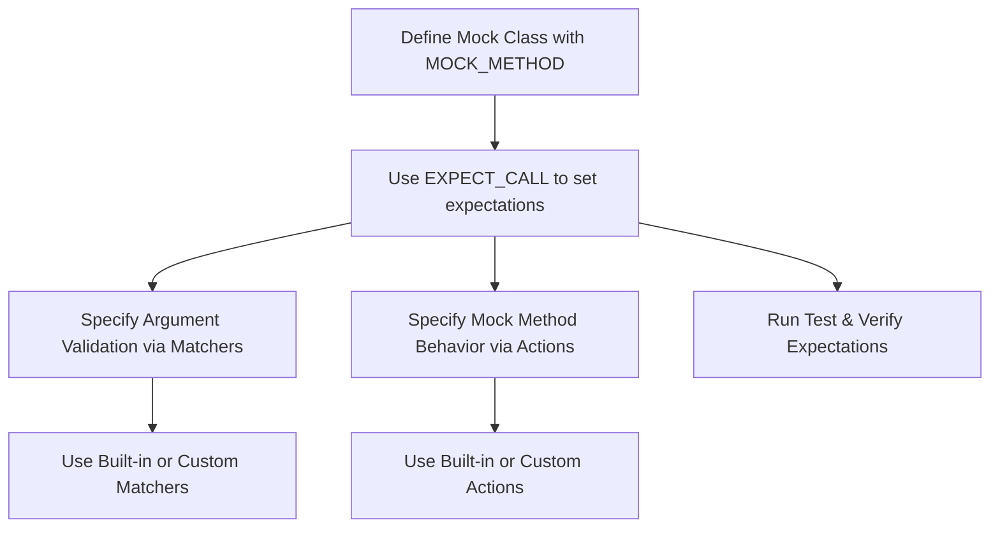

# Custom Actions and Matchers in GoogleMock

Extend the power of GoogleMock by creating and using custom actions and matchers to verify complex behaviors and values in your C++ tests. This guide walks you through how to design custom actions and matchers, and provides practical examples that reflect real-world usage.

---

## Overview

GoogleMock's default actions and matchers cover most common scenarios, but sometimes your tests require special logic or more flexible checks that built-in facilities don't provide. Custom actions define exactly what your mock methods do when called, while custom matchers let you specify detailed criteria for argument verification beyond simple equality or built-in predicates.

---

## Prerequisites

- Familiarity with GoogleMock basics, including defining mock classes and setting expectations.
- Understanding of standard matchers and actions within GoogleMock.
- Working C++ environment with GoogleMock installed.

---

## What You Will Achieve

By following this guide, you'll be able to:

- Define your own custom matchers for complex argument validation.
- Implement custom actions to tailor mock method behavior.
- Use parameterized matchers and actions for reusable, flexible test code.
- Understand when and how to combine multiple actions or matchers.

---

## Time Estimate

Expect to spend 30 to 45 minutes implementing and experimenting with custom actions and matchers for your mocks.

---

# Creating Custom Matchers

Matchers in GoogleMock inspect arguments passed to mocked methods to decide whether they satisfy your test conditions.

### Simple Custom Matcher Using `MATCHER` Macro

The `MATCHER` macro offers a concise way to define a matcher without boilerplate. It lets you name the matcher and write the matching logic inline.

```cpp
#include <gmock/gmock.h>

// Matches integer values divisible by 7.
MATCHER(IsDivisibleBy7, "Checks if value is divisible by 7") {
  return (arg % 7) == 0;
}

// Usage in a test:
EXPECT_CALL(mock, SomeMethod(IsDivisibleBy7()));
```

This matcher compares the argument against your condition, returning true for matches and false otherwise.

#### Adding Custom Failure Messages

You can enhance diagnostics by streaming extra info to the `result_listener`:

```cpp
MATCHER(IsDivisibleBy7, "") {
  if ((arg % 7) == 0) return true;
  *result_listener << "the remainder is " << (arg % 7);
  return false;
}
```

If the match fails, the message will now include the remainder, helping diagnose why.

### Parameterized Matchers

Use the `MATCHER_P` macro to add parameters to your matcher.

```cpp
MATCHER_P(InClosedRange, bound, "") {
  return arg >= 0 && arg <= bound;
}

// Usage:
EXPECT_CALL(mock, SomeMethod(InClosedRange(10)));
```

You can create multi-parameter matchers with `MATCHER_P2`, `MATCHER_P3`, and so forth.

### Writing Matcher Classes Manually

For advanced use or wider reuse, implement a matcher class with the required interface:

```cpp
class SumEqualsMatcher {
 public:
  using is_gtest_matcher = void;

  explicit SumEqualsMatcher(int expected) : expected_sum_(expected) {}

  bool MatchAndExplain(const Foo& foo, std::ostream* os) const {
    return foo.bar() + foo.baz() == expected_sum_;
  }

  void DescribeTo(std::ostream* os) const {
    *os << "bar() + baz() equals " << expected_sum_;
  }

  void DescribeNegationTo(std::ostream* os) const {
    *os << "bar() + baz() does not equal " << expected_sum_;
  }

 private:
  const int expected_sum_;
};

::testing::Matcher<const Foo&> SumEquals(int expected_sum) {
  return ::testing::Matcher<const Foo&>(SumEqualsMatcher(expected_sum));
}

// Usage
EXPECT_CALL(mock, Method(SumEquals(5)));
```

---

# Creating Custom Actions

Actions define what a mocked method does when called.

### Using Lambdas or Function Objects

The simplest custom actions are lambdas or function objects:

```cpp
EXPECT_CALL(mock, Compute(_))
    .WillOnce([](int x) { return x * 2; });

// Or
struct MultiplyBy {
  int factor;
  int operator()(int x) const { return x * factor; }
};
EXPECT_CALL(mock, Compute(_)).WillOnce(MultiplyBy{3});
```

### Using `ACTION` Macros

For lightweight boilerplate, define actions like this:

```cpp
ACTION(IncrementArg0) {
  return ++(*arg0);
}

EXPECT_CALL(mock, Modify(_))
    .WillOnce(IncrementArg0());
```

### Parameterized Actions

Parameterized macros like `ACTION_P` and `ACTION_P2` accept values:

```cpp
ACTION_P(Add, n) {
  return arg0 + n;
}

EXPECT_CALL(mock, Calculate(_))
    .WillOnce(Add(5));
```

### Composite Actions

You can do multiple actions in order via `DoAll()`:

```cpp
using ::testing::DoAll;
using ::testing::SetArgPointee;
using ::testing::Return;

EXPECT_CALL(mock, Update(_))
    .WillOnce(DoAll(SetArgPointee<0>(42), Return(true)));
```

The return value of the last action is used.

### Using `Invoke` to Redirect Calls

Use `Invoke` to call an existing function, method, or lambda:

```cpp
bool MyFunc(int x) { return x > 0; }
EXPECT_CALL(mock, Check(_)).WillOnce(::testing::Invoke(MyFunc));
```

---

# Practical Examples

### Custom Matcher Example

```cpp
MATCHER_P(HasFieldWithValue, expected, "Checks field value") {
  return arg.get_value() == expected;
}

EXPECT_CALL(mock, Method(HasFieldWithValue(42)));
```

### Custom Action Example

```cpp
ACTION_P(SetIntTo, value) {
  *arg0 = value;
}

EXPECT_CALL(mock, Mutate(_))
    .WillOnce(SetIntTo(100));
```

### Combining Matchers and Actions

```cpp
EXPECT_CALL(mock, Foo(Ge(5)))
    .WillOnce(Invoke([](int x) { return x * 10; }));
```

---

# Best Practices & Tips

- **Use `ON_CALL` to set default behavior**, `EXPECT_CALL` to assert specific calls.
- **Prefer matchers for clarity:** `_` for any argument, specific matchers for constraints.
- **Remember side-effect-free matchers:** Matchers must not alter program state.
- **Use `RetiresOnSaturation`** for expectations with bounded call counts to avoid sticky expectations causing confusing failures.
- **Suppress uninteresting call warnings with `NiceMock`**, unless testing strict call patterns.
- **Isolate complex custom behavior into helper functions or classes** for maintainable tests.

---

# Troubleshooting

- **Matcher doesn't compile:** Check for argument type mismatches; use `SafeMatcherCast<T>(matcher)` if necessary.
- **Action produces unexpected results:** Confirm action matches mock method signature; use lambdas for complex logic.
- **Too many/few actions warning:** Ensure number of `WillOnce()` and `WillRepeatedly()` calls matches or correctly bounds the expected cardinality.
- **Uninteresting call warnings:** Add `EXPECT_CALL` or convert to `NiceMock` if calls are expected but not interesting.

---

# Next Steps

After mastering custom actions and matchers:

- Explore [Using Mocks to Isolate Dependencies](../mocking-and-advanced-patterns/using-mocks) to deepen understanding of mock usage.
- Consult [Mocking Best Practices and Patterns](../mocking-and-advanced-patterns/mocking-best-practices) to improve test robustness.
- Review [Matchers Reference](../reference/matching.md) and [Actions Reference](../reference/actions.md) for built-in components.

---

# References

- [gMock Cookbook](https://google.github.io/googletest/gmock_cook_book.html#WritingNewMatchers)
- [Mocking Reference: Actions and Matchers](https://google.github.io/googletest/reference/mocking.html#actions)
- [Using Mocks to Isolate Dependencies Guide](../guides/mocking-and-advanced-patterns/using-mocks)
- [gMock for Dummies](https://google.github.io/googletest/gmock_for_dummies.html)

---

# Summary Diagram: How Custom Actions and Matchers Fit in GoogleMock



---

This documentation empowers you to create tailored, expressive, and maintainable mocks by extending GoogleMock's core with custom behaviors and argument validations, crucial for sophisticated C++ testing scenarios.
