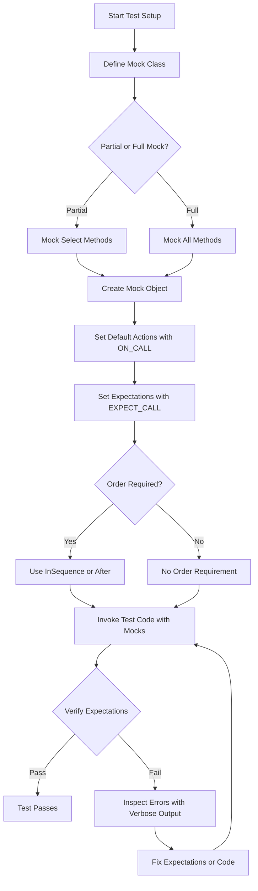

# Advanced Mocking Patterns

Explore advanced mocking techniques in GoogleMock to build complex, reliable, and maintainable test suites. This guide covers partial mocks, controlling mock strictness with `NiceMock` and `StrictMock`, comprehensive argument matching, combining mocks with parameterized tests, and handling exceptional scenarios.

---

## 1. Understanding Partial Mocks

Partial mocks let you override specific methods in a derived mock class while using real implementations for others. This approach helps you avoid over-mocking, enabling tests to exercise real code paths selectively.

### How to Create a Partial Mock

1. Derive a mock class from the interface or class with virtual methods.
2. Use `MOCK_METHOD` to mock only the methods you wish to override.
3. For the rest, inherit the real implementations.

```cpp
class RealClass {
 public:
  virtual int Compute(int x) { return x * 2; }
  virtual int Fetch() { return 42; }
  virtual ~RealClass() = default;
};

class PartialMock : public RealClass {
 public:
  MOCK_METHOD(int, Compute, (int x), (override));
  // Fetch() uses the real implementation from RealClass.
};

TEST(PartialMockTest, AllowsRealAndMockedMethods) {
  PartialMock mock;
  EXPECT_CALL(mock, Compute(5)).WillOnce(Return(10));

  EXPECT_EQ(mock.Compute(5), 10);    // Mocked call
  EXPECT_EQ(mock.Fetch(), 42);       // Real call
}
```

### Best Practices

- Use partial mocks sparingly, ideally when realistic default behavior is useful.
- Avoid mocking complex internal state unnecessarily.
- Remember that non-virtual methods cannot be mocked without advanced templates.

---

## 2. Controlling Mock Strictness: Nice, Naggy, and Strict Mocks

GoogleMock supports three mock strictness modes to tailor uninteresting call behavior:

| Mock Type     | Behavior on Uninteresting Calls                |
|---------------|------------------------------------------------|
| `NiceMock`    | Suppresses warnings (quiet on uninteresting calls) |
| `NaggyMock`   | (Default) Warns on uninteresting calls         |
| `StrictMock`  | Treats uninteresting calls as test failures    |

### Using Strictness Modifiers

Wrap your mock class with the desired strictness modifier:

```cpp
using ::testing::NiceMock;
using ::testing::NaggyMock;
using ::testing::StrictMock;

class MockFoo {
 public:
  MOCK_METHOD(void, DoThis, (), ());
};

// Quiet mock
NiceMock<MockFoo> nice_mock;
// Default warning mock
NaggyMock<MockFoo> naggy_mock;
// Strict failing mock
StrictMock<MockFoo> strict_mock;
```

### Constructor Arguments

All mock constructors are inherited, so you can forward arguments normally:

```cpp
NiceMock<MockBar> nice_bar("hello", 42);
```

### Recognizing Strictness

Use `testing::Mock::IsNice()`, `.IsNaggy()`, and `.IsStrict()` to programmatically check strictness.

### Caveats

- Only works for mock methods defined directly in the mock class using `MOCK_METHOD`.
- Does not affect unexpected calls (calls that do not match any expectation).

---

## 3. Advanced Argument Matching

Effective mocks depend on precise argument matchers. GoogleMock offers powerful features:

### Basic Matchers

- Use `_` for wildcards matching any value.
- Built-in matchers like `Eq()`, `Ne()`, `Lt()`, `Gt()`, `NotNull()`, `Pointee()`, and more.

### Combined Matchers

Use combinators like `AllOf()`, `AnyOf()`, and `Not()` to compose complex conditions.

```cpp
EXPECT_CALL(mock, Foo(AllOf(Gt(0), Lt(10))));  // foo called with 1 to 9
```

### Multi-Argument Matching: `.With()` Clause

Match all arguments as a tuple or specify relationships:

```cpp
// Example: first argument is less than second
EXPECT_CALL(mock, SetPosition(_, _))
    .With(Lt());
```

Use `Args<>()` to select particular arguments.

### Matching Members and Properties

- `Field(&Class::field, matcher)` matches a member field.
- `Property(&Class::getter, matcher)` matches the result of a getter method.

### Handling Pointer Arguments

- Use `NotNull()` and `IsNull()` for pointer validation.
- Use `Pointee(matcher)` to match the value pointed to.

### Custom Matchers

Define matchers with `MATCHER()` or `MATCHER_P()` macros or implement the matcher interface directly.

---

## 4. Combining Mocks with Parameterized Tests

GoogleTest supports parameterized tests combined with mocks for scalable testing scenarios.

### Basic Pattern

1. Define a parameterized test fixture inheriting from `::testing::TestWithParam<T>`.
2. Create mocks inside the fixture.
3. Use `GetParam()` to customize mock expectations per test case.

```cpp
using ::testing::Return;

class FooTest : public ::testing::TestWithParam<int> {
 protected:
  MockFoo mock_foo;
};

TEST_P(FooTest, ReturnsExpectedValue) {
  int param = GetParam();
  EXPECT_CALL(mock_foo, GetNumber())
      .WillOnce(Return(param * 10));

  EXPECT_EQ(ProcessFoo(&mock_foo), param * 10);
}

INSTANTIATE_TEST_SUITE_P(MyParamTests, FooTest, ::testing::Values(1, 2, 3));
```

### Tips

- Set expectations inside the test body using `GetParam()`.
- Use `NiceMock` or `NaggyMock` in parameterized tests to reduce noise.

---

## 5. Handling Edge Cases in Mocks

### Mocking Methods with Move-Only Types

Move-only types like `std::unique_ptr` can be mocked directly using `MOCK_METHOD`. Use lambdas or actions in `WillOnce`/`WillRepeatedly` to return fresh instances.

```cpp
MOCK_METHOD(std::unique_ptr<Buzz>, MakeBuzz, (StringPiece text), (override));

EXPECT_CALL(mock, MakeBuzz("hello"))
    .WillRepeatedly([](StringPiece) {
      return std::make_unique<Buzz>(AccessLevel::kInternal);
    });
```

### Avoid Returning Moved-From Values Multiple Times

Do not use `Return(std::move(...))` with `WillRepeatedly`; the moved-from object becomes invalid.

### Mocking Non-Virtual Methods

Mocking non-virtual methods requires alternative techniques, like template-based injection or splitting responsibilities. See the [Mocking Non-Virtual Methods](docs/gmock_cheat_sheet.md#MockingNonVirtualMethods) recipe.

### Mocking Overloaded Methods

Specify each overloaded method separately using exact signatures in `MOCK_METHOD`. Use `Const(mock)` wrapper to disambiguate const overloads.

---

## 6. Best Practices & Troubleshooting

### Expectation Ordering

- Set `EXPECT_CALL` _before_ the mock method is called.
- Use `InSequence` or `.After()` clauses to enforce call order.

### Sticky Expectations

By default, expectations remain active even after saturated; use `.RetiresOnSaturation()` to retire them when done.

### Controlling Default Behavior

- Use `ON_CALL` to define default actions without setting expectations.
- Avoid overusing `EXPECT_CALL` for calls you don't want to verify.

### Avoid Common Pitfalls

- Do not set expectations after exercising the mock.
- Use `Mock::VerifyAndClearExpectations(&mock)` to verify early if needed.
- Beware of `ON_CALL` and `EXPECT_CALL` precedence (last one wins).

### Handling Uninteresting and Unexpected Calls

- Uninteresting calls: no matching `EXPECT_CALL`. Default behavior applies.
- Unexpected calls: some `EXPECT_CALL`s exist, but no match for the invocation.
- Use strictness modifiers to control handling.

### Debugging Tips

- Run tests with `--gmock_verbose=info` to trace mock calls and matches.
- Check argument printing for mismatches.

---

## 7. Next Steps

- Explore [Writing Your First Test](guides/core-testing-workflows/writing-basic-tests) for foundational unit testing.
- Learn [Setting Up Expectations and Actions](guides/mocking-and-advanced-scenarios/setup-expectations-actions) for mastering mocks.
- Deep dive into [gMock Cookbook](https://google.github.io/googletest/gmock_cook_book.html) for practical recipes.
- Refer to the [Mocking Reference](docs/reference/mocking.md) for detailed API usage.

---

## Diagram: Advanced Mocking Flow



---

<Tip>
Remember that mocks emphasize specifying intended behavior, not implementing it. Always write tests focusing on what should happen, not how GoogleMock works internally.
</Tip>

<Note>
Uninteresting calls generate warnings with `NaggyMock`, are ignored silently with `NiceMock`, and cause failures with `StrictMock`. Choose the mode fitting your test needs.
</Note>

<Warning>
Avoid modifying mock objects after calling `Mock::VerifyAndClearExpectations()`, as this causes undefined behavior.
</Warning>