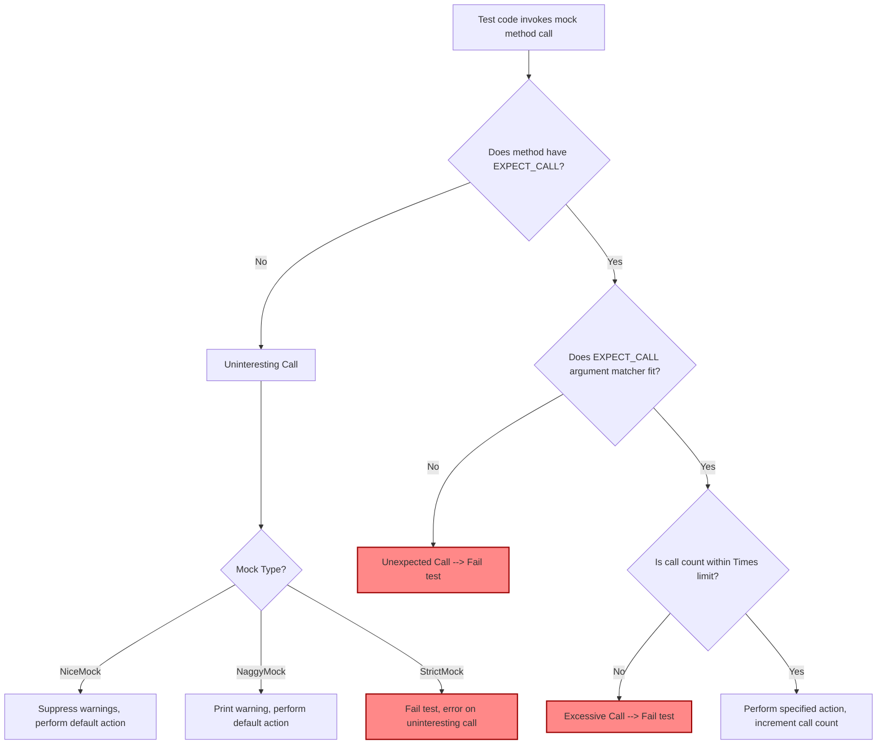

# Advanced Mocking Patterns & Test Design

Explore sophisticated mocking techniques in GoogleMock to handle complex testing requirements. This guide dives into advanced mock behaviors like partial mocks, and detailed control of mock strictness using NiceMock, NaggyMock, and StrictMock. It also covers call ordering with sequences and ordering constraints, and shares best practices for maintaining clarity and robustness in large-scale test suites.

---

## 1. The Landscape of Mock Strictness

Mock objects can behave differently depending on how strictly they enforce calls to their methods. GoogleMock categorizes mock objects as **Nice**, **Naggy**, or **Strict**, helping you tailor test feedback to your needs.

- **NaggyMock** (default behavior): Prints warnings when uninteresting calls occur (calls to mock methods that have no `EXPECT_CALL` set).
- **NiceMock**: Suppresses warnings about uninteresting calls, making tests less noisy.
- **StrictMock**: Treats any uninteresting call as an error, causing test failures.

### Why choose among these? 

- Use **NaggyMock** when developing or debugging tests, to catch potential unexpected calls.
- Use **NiceMock** in stable test environments where you want cleaner test output without noise from uninteresting calls.
- Use **StrictMock** to enforce zero tolerance for unexpected method calls, enforcing tight contract adherence in tests.

### How to declare strictness explicitly

Wrap your mock class with one of the following templates:

```cpp
using ::testing::NiceMock;
using ::testing::NaggyMock;
using ::testing::StrictMock;

// Given a mock class MockFoo:
NiceMock<MockFoo> nice_mock_foo;    // Warnings suppressed
NaggyMock<MockFoo> naggy_mock_foo;  // Warnings printed (default behavior)
StrictMock<MockFoo> strict_mock_foo; // Errors on uninteresting calls
```

If your mock class accepts constructor arguments, provide them as usual:

```cpp
NiceMock<MockFoo> nice_mock_foo(5, "arg");
```

### Important caveats

- These wrappers only affect mock methods defined directly inside your mock class using the `MOCK_METHOD` macros.
- They do not support nesting (e.g., `NiceMock<StrictMock<MockFoo>>`).
- Virtual destructors are recommended to avoid issues.

---

## 2. Managing Call Sequences and Partial Ordering

When testing interactions, the order of method calls can be critical. GoogleMock lets you express both **strict** and **partial** orderings to maintain clarity and specificity.

### Using `Sequence` objects for ordered calls

Create one or more `Sequence` objects, then link related expectations to these sequences to enforce call order.

```cpp
using ::testing::Sequence;
Sequence s1, s2;

EXPECT_CALL(mock, FirstCall())
    .InSequence(s1, s2);
EXPECT_CALL(mock, SecondCall())
    .InSequence(s1);
EXPECT_CALL(mock, ThirdCall())
    .InSequence(s2);
```

This example enforces a Directed Acyclic Graph (DAG) where:

- `FirstCall()` happens before both `SecondCall()` and `ThirdCall()`
- `ThirdCall()` happens before any subsequent calls linked in `s2`
- Calls in `s1` and `s2` respect their individual order

### Strict order within a sequence

Calls linked to the same sequence must happen in the order expectations are declared:

```cpp
Sequence s;
EXPECT_CALL(mock, Step1()).InSequence(s);
EXPECT_CALL(mock, Step2()).InSequence(s);
EXPECT_CALL(mock, Step3()).InSequence(s);
```

Here, `Step2()` must be called after `Step1()` and before `Step3()`. Calls out of order produce test failures.

### Partial order across multiple sequences

Assign multiple sequences to control complex dependency relations and partial order constraints.

---

## 3. Retiring Expectations to Avoid Sticky Failures

By default, GoogleMock expectations are _sticky_, meaning they remain active even after their specified number of calls is reached, which can cause unexpected errors if a call matches an already saturated expectation.

You can control this with `.RetiresOnSaturation()` to retire an expectation immediately after it saturates:

```cpp
EXPECT_CALL(mock, DoThing(7))
    .Times(2)
    .RetiresOnSaturation();
```

Consequences:

- The expectation will not match calls after its quota is fulfilled.
- Once retired, calls matching this expectation will fall through to other expectations or become errors if none match.

### Combining with sequences

Expectations inside sequences retire automatically when succeeding expectations in the sequence are triggered.

---

## 4. Partial Mocks and Delegation Patterns

While this page focuses on strictness and ordering, keep in mind advanced designs often involve **partial mocks** where some methods forward to real implementations.

Use delegation wisely to maintain test clarity. A typical pattern:

```cpp
class MockFoo : public Foo {
 public:
  MOCK_METHOD(int, DoA, (), (override));
  MOCK_METHOD(void, DoB, (int), (override));

  MockFoo() {
    // Delegate default behavior to real object
    ON_CALL(*this, DoA()).WillByDefault([this]() { return real_.DoA(); });
    ON_CALL(*this, DoB(_)).WillByDefault([this](int n) { real_.DoB(n); });
  }

 private:
  Foo real_;
};
```

This lets you verify interactions with mocks while preserving real method behavior.

---

## 5. Best Practices for Large-Scale Test Suites

### Choosing the right mock strictness

- Prefer **NiceMock** for general-purpose tests to avoid noise; reduces test maintenance.
- Use **StrictMock** sparingly in critical modules where strict enforcement is beneficial.
- During test development or debugging phases, **NaggyMock** helps catch unexpected calls early.

### Avoid over-specifying

- Only add `EXPECT_CALL` on methods when you want to verify their invocation.
- Use `ON_CALL` to set default behaviors without enforcing call expectations.

### Use sequences thoughtfully

- Avoid forcing strict call order unless essential — overly brittle tests are costly.
- Use partial ordering with multiple sequences when full order is unnecessary.

### Retire expectations promptly

- Use `.RetiresOnSaturation()` to prevent sticky expectations from blocking other valid calls.

### Leverage `Mock::VerifyAndClearExpectations` for explicit verification

- Call this function when mock lifetimes are uncertain or when leaks might mask failures.

### Monitor for leaked mocks

- Enable `--gmock_catch_leaked_mocks` during CI to catch unverified mocks.

---

## 6. Troubleshooting Common Pitfalls

### Unexpected or uninteresting calls

- Uninteresting calls (without `EXPECT_CALL`) generate warnings by default; suppress using `NiceMock` or add a catch-all `EXPECT_CALL(...).Times(AnyNumber())`.
- Unexpected calls (calls not matching any `EXPECT_CALL` despite expectations being set) always fail the test.

### Nested mock modifiers unsupported

- Avoid nesting `NiceMock`, `NaggyMock`, and `StrictMock` wrappers.

### `NiceMock` and `StrictMock` limitations

- May not work correctly for mock methods declared in base classes.
- Requires virtual destructors for proper behavior.

### Ordering violations

- Failures due to out-of-order calls often indicate missing or incorrect sequence declarations.
- Use sequence scope objects `InSequence` or explicit `Sequence` objects to manage call order.

---

## 7. Summary Diagram of Mock Strictness and Call Flow



---

## 8. Next Steps

- Explore [Using Mocks: Patterns and Best Practices](../mocking-and-advanced-techniques/using-mocks) to deepen your understanding of mock interactions and best practices.
- Study the [gMock Cookbook](https://google.github.io/googletest/gmock_cook_book.html) for real-world recipes on advanced mocking.
- Review the [Mocking Reference](../reference/mocking.md) for detailed API specifications and usage patterns.
- Follow up with guides on [Matchers and Actions](../mocking-and-advanced-techniques/matchers-actions) to further control mock behavior.

---

## References

- [gMock for Dummies](https://google.github.io/googletest/gmock_for_dummies.html)
- [gMock FAQ](https://google.github.io/googletest/gmock_faq.html)
- [Mocking Reference](../reference/mocking.md)
- [gMock Cheat Sheet](https://google.github.io/googletest/gmock_cheat_sheet.html)

---

## Practical Tips

- Always define your mock classes with `MOCK_METHOD` macros in `public` sections.
- Use `EXPECT_CALL` **before** the call to the mock method; setting expectations after invocation leads to undefined behavior.
- To relax strictness temporarily, wrap mock instances in `NiceMock`.
- Use `RetiresOnSaturation()` to avoid expectation saturation errors and allow fallback matching.
- For call order dependencies, consider using `Sequence` objects or `InSequence` scope guards.
- Run tests with `--gmock_verbose=info` to gain insights on call matching and ordering failures.

<Tip>
If you encounter repeated warnings about uninteresting calls, consider whether you should refactor your tests to be less noisy by using `NiceMock` or by explicitly specifying expected calls with `EXPECT_CALL` and `Times(AnyNumber())`.
</Tip>

<Tip>
For large test suites with many mocks, use `Mock::VerifyAndClearExpectations(&mock)` explicitly to ensure proper verification, especially when mocks outlive the usual test scope.
</Tip>

