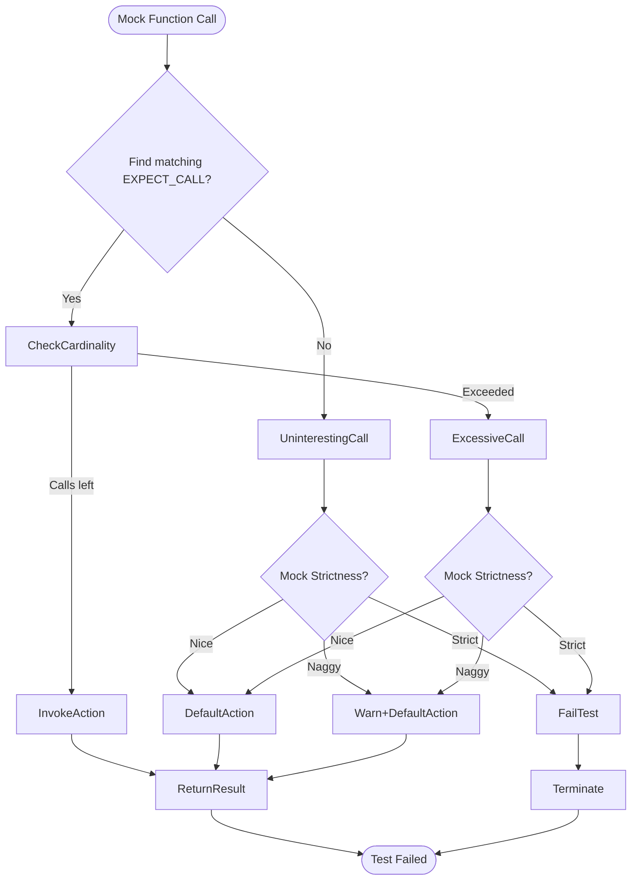

# Advanced Mocking Patterns & Troubleshooting

## Introduction
This guide provides practical insights and advanced patterns for managing complex mock hierarchies, configuring strict/nice/naggy mocks, and optimizing mock performance in GoogleMock. It also includes detailed troubleshooting strategies for common mocking pitfalls encountered during test development.

Whether you are building complex test scenarios involving numerous interdependent mocks or resolving unexpected test failures, this guide will help you gain mastery over GoogleMock's powerful but nuanced features.

---

## 1. Managing Complex Mock Hierarchies

### Understanding Mock Hierarchies
In large systems, mock objects often depend on or interact with other mocks, forming complex hierarchies. Properly structuring these hierarchies ensures test correctness and maintainability.

#### Best Practices
- **Explicit Ownership and Lifetime:** Clearly define ownership to prevent dangling pointers or premature destruction.
- **Use Smart Pointers:** Use `std::shared_ptr` or `std::unique_ptr` where applicable to manage mock lifetimes safely.
- **Delegate Behavior Appropriately:** Consider delegating default actions from high-level mocks to their lower-level collaborators to simulate real interactions more accurately.

### Deleting Mocks Specifically and Safely
GoogleMock supports deletion of mock objects inside their own actions, enabling advanced control of mock lifetimes:

```cpp
// Example: Deleting a mock from within an action
class MockA {
 public:
  MOCK_METHOD(void, DoA, (int), ());
};

ACTION_P(Delete, ptr) { delete ptr; }

TEST(MockLifetimeTest, CanDeleteSelf) {
  MockA* a = new MockA;
  EXPECT_CALL(*a, DoA(_)).WillOnce(Delete(a));
  a->DoA(42);  // Deletes 'a' during call
}
```

This technique should be used cautiously and only when necessary.

---

## 2. Configuring Mock Strictness: Strict, Nice, and Naggy Mocks

GoogleMock provides three distinct modes to control how uninteresting calls are handled. Choosing the correct strictness affects test behavior and debug output.

| Mock Type    | Behavior on Uninteresting Calls                          | Use Case                                      |
|--------------|-----------------------------------------------------------|-----------------------------------------------|
| `NiceMock`   | Silently ignores uninteresting calls                     | When tests shouldn't fail on unexpected calls |
| `NaggyMock`  | Logs warnings for uninteresting calls (default behavior) | During development to detect unplanned calls   |
| `StrictMock` | Treats uninteresting calls as test failures               | To enforce strict interaction contracts       |

### Using Strictness Modifiers
They are wrappers around your mock class:

```cpp
#include <gmock/gmock.h>
using ::testing::NiceMock;
using ::testing::NaggyMock;
using ::testing::StrictMock;

StrictMock<MockFoo> strict_mock;
NiceMock<MockFoo> nice_mock;
NaggyMock<MockFoo> naggy_mock;
```

### Important Notes
- The strictness wrappers only apply to mock methods defined with `MOCK_METHOD` directly in the class.
- Nesting strictness wrappers like `NiceMock<StrictMock<MockFoo>>` is not supported.

### When to Choose Which
- Use **`NiceMock`** to reduce noise when you expect many calls but only verify a few.
- Use **`NaggyMock`** to detect unexpected calls during the test debugging phase.
- Use **`StrictMock`** when you want to ensure no unexpected calls happen, increasing test brittleness but gaining rigor.

---

## 3. Performance Considerations in Mocking

Mocking can impact test compile-time and run-time. Follow these tips to optimize:

### Speeding Up Compilation
- **Move Mock Constructor/Destructor Definitions:** Define constructors and destructors of your mock classes in `.cc` files instead of inline to reduce recompilation overhead.
- **Reduce Number of Mock Methods per Class:** Splitting large mocks into focused smaller mocks can help.

### Optimizing Runtime
- Use **`WillRepeatedly`** instead of multiple `WillOnce` when behavior is repetitive.
- Prefer **`NiceMock`** during benchmarking tests to reduce logging overhead.
- Avoid overly complex matchers or actions in frequently called mock methods.

---

## 4. Troubleshooting Common Mocking Pitfalls

### Symptom: "Uninteresting mock function call" Warning
Occurs when a mock method is called without an `EXPECT_CALL` but has no matching `ON_CALL` default behavior.

#### Solution
- If the call is expected but you don't care about verifying it, use `NiceMock` to suppress warnings.
- Alternatively, add an `EXPECT_CALL(...).Times(AnyNumber())` or an `ON_CALL(...).WillByDefault(...)` for the method.

### Symptom: "Unexpected mock function call" Failure
Occurs when a mocked method is called with arguments not matching any `EXPECT_CALL`.

#### Solution
- Add specific `EXPECT_CALL` matching those arguments.
- Use wildcard matcher `_` or broader matchers for calls you want to allow but not strictly verify.

### Symptom: "Too many actions" or "Too few actions" Warning
Happens when the number of `WillOnce` actions does not match the declared or inferred cardinality.

#### Solution
- Align `WillOnce` clauses with the expected call count.
- Use `WillRepeatedly` for an action that can be used after `WillOnce`s are exhausted.
- Explicitly set `.Times()` to clarify expectations.

### Symptom: "Saturated and inactive" or 'retired expectations' causing failed matching
Means an expectation has reached its call limit or has been retired but a matching call was attempted.

#### Solution
- Use `.RetiresOnSaturation()` to retire expectations automatically when saturated.
- Rearrange call order or cardinalities to prevent early saturation.

### Symptom: Dangling mock pointers or crashes on deletion
Happens if mock objects are deleted too early or in actions improperly.

#### Solution
- Verify ownership and lifetime management.
- Use smart pointers where appropriate.
- Avoid deleting mocks inside actions unless necessary and done carefully with proper cleanup.

### Debugging Techniques
- Use the `--gmock_verbose=info` flag to get detailed mock call traces and expectation matches.
- Combine with `--gtest_stack_trace_depth=0` to suppress stack traces if too verbose.

Example:

```bash
test_binary --gmock_verbose=info --gtest_stack_trace_depth=0
```

---

## 5. Real-World Mocking Scenarios & Patterns

### Pattern: Multiple Expectations with Overlapping Matchers
Arrange expectations so more specific matchers are declared later, as GoogleMock matches in reverse order.

```cpp
EXPECT_CALL(mock, Foo(_)).Times(AnyNumber());  // Less specific
EXPECT_CALL(mock, Foo(42)).Times(1);           // More specific
```

### Pattern: Sequence Enforcement
Use `InSequence` to ensure calls happen in a defined order.

```cpp
using ::testing::InSequence;
{
  InSequence seq;
  EXPECT_CALL(mock, FirstCall());
  EXPECT_CALL(mock, SecondCall());
}
```

### Pattern: Partial Orders with `After`
Express partial ordering dependencies between calls using `After` clause.

```cpp
Expectation e1 = EXPECT_CALL(mock, Init1());
EXPECT_CALL(mock, Init2()).After(e1);
```

### Pattern: Delegating to a Fake or Real Implementation for Default Behavior
Implement default behavior by delegating calls from mocks to fakes or real objects using `ON_CALL`.

```cpp
class MockFoo : public Foo {
  MOCK_METHOD(int, Compute, (int), (override));
  Foo real_;
public:
  MockFoo() {
    ON_CALL(*this, Compute).WillByDefault([this](int x) {
      return real_.Compute(x);
    });
  }
};
```

### Pattern: Handling Move-Only Types in Mock Methods
Define mocks for methods using move-only types normally.

Return values using lambdas instead of `Return(std::move(...))` for multiple calls to avoid runtime errors.

---

## Summary
This guide advanced your understanding of GoogleMock by teaching you how to manage complex mock setups, choose and apply different strictness levels for mocks, optimize performance, and handle common and subtle issues in mock-based testing.

By leveraging these strategies and best practices, you can write more robust, maintainable, and performant tests for your C++ projects.

---

## Additional Resources
- [GoogleMock Reference - Mocking Basics](reference/mocking.md)
- [GoogleMock Cookbook](docs/gmock_cook_book.md)
- [GoogleMock Cheat Sheet](docs/gmock_cheat_sheet.md)
- [GoogleMock for Dummies](docs/gmock_for_dummies.md)
- [Managing Call Cardinalities and Strictness](reference/mocking.md#EXPECT_CALL.Times)
- [Debugging with --gmock_verbose](docs/gmock_cook_book.md#GainingSuperVisionIntoMockCalls)

---

## Mermaid Diagram: Mock Call Handling Overview

