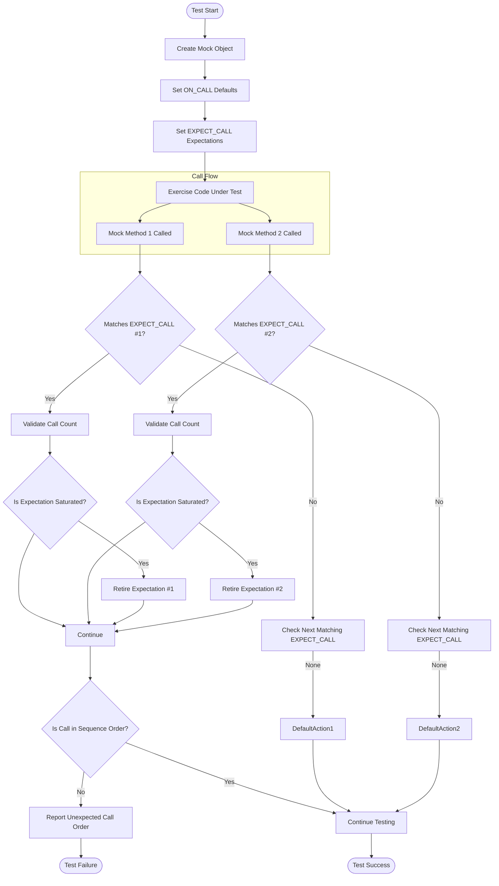

# Advanced Mocking Patterns and Tips

Master advanced GoogleMock patterns that empower you to precisely control your mock behaviors, validate interactions in complex call sequences, and handle tricky mocking scenarios effectively. This guide will take you through managing call count cardinalities, working with ordered and partially ordered sequences, choosing between nice, naggy, and strict mocks, and optimizing mock performance.

---

## 1. Understanding and Controlling Call Count Cardinalities

GoogleMock allows you to specify how many times a mock method is expected to be called, known as its *cardinality*. Getting cardinalities right is key to writing robust and maintainable tests.

### What Cardinalities Are and How to Use Them

Use the `Times()` clause in `EXPECT_CALL` to describe the expected number of calls:

- `Times(AnyNumber())` — any number of times, including zero
- `Times(AtLeast(n))` — at least *n* times
- `Times(AtMost(n))` — at most *n* times
- `Times(Between(m, n))` — between *m* and *n* times (inclusive)
- `Times(Exactly(n))` or `Times(n)` — exactly *n* times
- `Times(0)` — the method should never be called

```cpp
EXPECT_CALL(mock, Foo()).Times(3);  // Exactly 3 calls expected
EXPECT_CALL(mock, Bar(_)).Times(AtLeast(1));  // Called one or more times
EXPECT_CALL(mock, Baz).Times(AnyNumber());    // Called any number of times
```

### Implicit Cardinality Inference

If you omit `Times()`, GoogleMock infers cardinality based on how you specify actions:

- No `WillOnce` or `WillRepeatedly`: inferred as `Times(1)`
- *n* `WillOnce` clauses, no `WillRepeatedly`: inferred as `Times(n)`
- *n* `WillOnce` clauses and one `WillRepeatedly`: inferred as `Times(AtLeast(n))`

```cpp
EXPECT_CALL(mock, Foo()).WillOnce(Return(1));  // Times(1) inferred
EXPECT_CALL(mock, Foo()).WillOnce(Return(1)).WillRepeatedly(Return(2));  // Times(AtLeast(1))
```

### Sticky Expectations and Retiring on Saturation

By default, expectations stay active even after reaching their call limit. This *stickiness* can cause errors if you expect a method to be called exactly twice but it is called thrice.

To prevent this, use `.RetiresOnSaturation()`. This will deactivate the expectation once the expected number of calls is met.

```cpp
EXPECT_CALL(mock, Foo()).Times(2).RetiresOnSaturation();
```

### Best Practices

- Start with the loosest cardinalities you can, tighten if needed for better validation.
- Use `.RetiresOnSaturation()` when expecting multiple calls with different behaviors.
- Use sequences for ordered calls—see next section.

<Check>
Setting cardinalities explicitly prevents over-matching and improves test clarity.
</Check>

---

## 2. Ordering and Sequences in Mocks

Interactions often must happen in a certain order. GoogleMock lets you specify call order precisely.

### Sequential Ordering with `InSequence`

Wrap `EXPECT_CALL`s in an `InSequence` block so that expectations must be met in the order they appear:

```cpp
using ::testing::InSequence;
{
  InSequence seq;
  EXPECT_CALL(mock, FirstCall());
  EXPECT_CALL(mock, SecondCall());
  EXPECT_CALL(mock, ThirdCall());
}
```

Calls happening out of order will cause test failures.

### Partial Ordering with Sequences and the DAG Model

Sometimes you care about partial orders; e.g., `A` must happen before both `B` and `C`, but `B` and `C` may occur in any order.

Declare multiple `Sequence` objects and assign expectations to one or more sequences:

```cpp
using ::testing::Sequence;
Sequence s1, s2;
EXPECT_CALL(mock, A()).InSequence(s1, s2);
EXPECT_CALL(mock, B()).InSequence(s1);
EXPECT_CALL(mock, C()).InSequence(s2);
```

This means `A` precedes both `B` and `C`, but no order between `B` and `C` is enforced.

### Using the `.After()` Clause for Explicit Ordering

You can specify that a call happens after one or more other expectations or sets:

```cpp
using ::testing::Expectation;
Expectation e1 = EXPECT_CALL(mock, Initialize());
EXPECT_CALL(mock, Process()).After(e1);
```

Useful for complex dependencies between calls.

### Retirement Behavior in Sequences

Expectations in sequences retire automatically when a later expectation in the sequence has been satisfied, preventing over-matching issues.

---

## 3. Mock Behavior Modes: Nice, Naggy, and Strict

GoogleMock supports different levels of strictness for handling uninteresting calls — calls to mock methods without expectations.

### Naggy Mocks (Default)

*Warn* on uninteresting calls (default behavior). Use for debugging or when you want to be notified but not fail immediately.

### Nice Mocks

Suppress warnings on uninteresting calls. Useful for tests where the exact details of interactions aren’t important.

```cpp
using ::testing::NiceMock;
NiceMock<MockFoo> nice_mock;
```

### Strict Mocks

Turn *uninteresting calls into failures,* making the test fail if any unexpected mock calls occur.

```cpp
using ::testing::StrictMock;
StrictMock<MockFoo> strict_mock;
```

### Usage Considerations

- Use **nice mocks** for broad, forgiving tests.
- Use **naggy mocks** (default) to catch possible issues during development.
- Use **strict mocks** when you want to enforce precise interaction.
- Nesting nice and strict mocks is not supported.

<Warning>
Strict mocks may cause brittle tests. Prefer nice mocks when possible.
</Warning>

---

## 4. Handling Tricky Mocking Scenarios

### Mocking Overloaded Methods

Mock all overloaded versions explicitly to avoid hiding base class methods. Use `using` declarations to expose hidden overloads:

```cpp
class MockFoo : public Foo {
 public:
  using Foo::Add;  // Bring in other overloads.
  MOCK_METHOD(int, Add, (Element x), (override));
};
```

### Mocking Non-Virtual Methods

Use *high-performance dependency injection* by creating unrelated mock classes with the same method signatures.

Use templates to choose the implementation at compile-time:

```cpp
template <class Stream>
void Process(Stream* stream);

MockPacketStream mock;
EXPECT_CALL(mock, GetPacket(_));
Process(&mock);
```

### Delegating Calls to Fakes or Real Objects

You can have your mock delegate to a fake or a real object for default behavior, enabling comprehensive yet flexible testing.

```cpp
void DelegateToFake() {
  ON_CALL(*this, Method).WillByDefault([this](Args... args) {
    return fake_.Method(args...);
  });
}
```

### Simplifying Complex Interfaces in Mocks

If interface methods have long argument lists difficult to mock, use delegation or introduce simplified mock methods for ease of use.

### Mocking Free Functions

Mocking free functions requires introducing interfaces or using `MockFunction` to mock `std::function` wrappers.

---

## 5. Performance and Compilation Tips

### Moving Constructor and Destructor Out-of-Line

For mock classes with many mocked methods, moving constructors and destructors to `.cc` implementation files reduces compilation time dramatically.

### Avoid Over-Mocking Concrete Classes

Avoid making all concrete class methods virtual just for mocking; prefer coding to interfaces and mocking those interfaces.

---

## 6. Troubleshooting and Best Practices

- **Uninteresting Call Warnings**: Use `NiceMock` to suppress them if intentional or add catch-all `EXPECT_CALL(...).Times(AnyNumber())`.
- **Rigid Expectations**: Avoid over-specifying expectation matchers or cardinalities to reduce brittle tests.
- **Order Sensitivity**: Use sequences or partial ordering to express call order clearly instead of relying on implicit ordering.
- **Use ON_CALL for Defaults**: Use `ON_CALL` to set default mock behavior, reserving `EXPECT_CALL` for expectation verification.
- **Delegate or Use Fakes for Complex Behavior**: Delegate to real implementations or fakes when mocking complex logic to avoid duplication.

---

## 7. Quick Reference Examples

### Defining a Strict Mock

```cpp
using ::testing::StrictMock;
StrictMock<MockFoo> strict_mock;
EXPECT_CALL(strict_mock, DoThis());  // Fails if other methods are called without EXPECT_CALL
```

### Ordered Calls Using Sequences

```cpp
using ::testing::Sequence;
Sequence seq;
EXPECT_CALL(mock, Init()).InSequence(seq);
EXPECT_CALL(mock, Process()).InSequence(seq);
EXPECT_CALL(mock, Finish()).InSequence(seq);
```

### Delegating Calls to a Real Object

```cpp
class MockDatabase : public Database {
 public:
  MockDatabase() {
    ON_CALL(*this, GetUser(_))
       .WillByDefault([this](int id) {
         return real_db_.GetUser(id);
       });
  }
  MOCK_METHOD(User, GetUser, (int id), (override));
 private:
  RealDatabase real_db_;
};
```

### Handling Overloads

```cpp
class MockService : public Service {
 public:
  MOCK_METHOD(bool, Process, (int), (override));
  MOCK_METHOD(bool, Process, (const std::string&), (override));
};

MockService mock;
EXPECT_CALL(mock, Process(42));
EXPECT_CALL(mock, Process(::testing::StrEq("hello")));
```

---

Explore additional recipes and patterns in the [gMock Cookbook](https://google.github.io/googletest/gmock_cook_book.html) for deeper insights.

---

<AccordionGroup title="Additional Resources">
<Accordion title="gMock Cookbook - Advanced Recipes">
Detailed examples on mocking move-only types, delegating calls, and complex argument matching.
</Accordion>
<Accordion title="gMock Cheat Sheet">
Quick reference for mock class definitions, setting expectations, default actions, and managing uninteresting calls.
</Accordion>
<Accordion title="Mocking Reference">
Comprehensive API reference for EXPECT_CALL, ON_CALL, matchers, actions, sequences, and cardinalities.
</Accordion>
</AccordionGroup>

<Tip>
Use `EXPECT_CALL` to express exact behavioral expectations, and `ON_CALL` to establish default mock behaviors without strict expectations.
</Tip>
<Warning>
Be cautious with strict mocks as they may cause brittle tests that fail on innocuous code changes.
</Warning>
<Note>
Properly use `.RetiresOnSaturation()` when chaining multiple `WillOnce()` calls to avoid unexpected test failures.
</Note>
<Check>
Ordering constraints dramatically improve test robustness by clearly specifying permissible call sequences.
</Check>

---

### Mermaid.js Diagram: Mock Call Flow with Sequences and Retiring Expectations



Explore this flow to understand how mock calls are matched, validated, possibly retired, and how ordering constraints are enforced.

---

## 8. Next Steps & Learning Path

- **Creating and Using Mocks**: Start here if you haven’t defined mock classes before.
- **Custom Actions and Matchers**: Extend GoogleMock's capabilities.
- **gMock Cookbook**: For practical recipes and advanced use.
- **Mocking Reference**: Comprehensive API details to deepen understanding.

For practical onboarding, review the [gMock for Dummies](https://google.github.io/googletest/gmock_for_dummies.html) and [gMock Cheat Sheet](https://google.github.io/googletest/gmock_cheat_sheet.html).

---

Your mastery of these patterns will yield tests that are maintainable, precise, and expressive, giving you ultimate control over your test double interactions.
