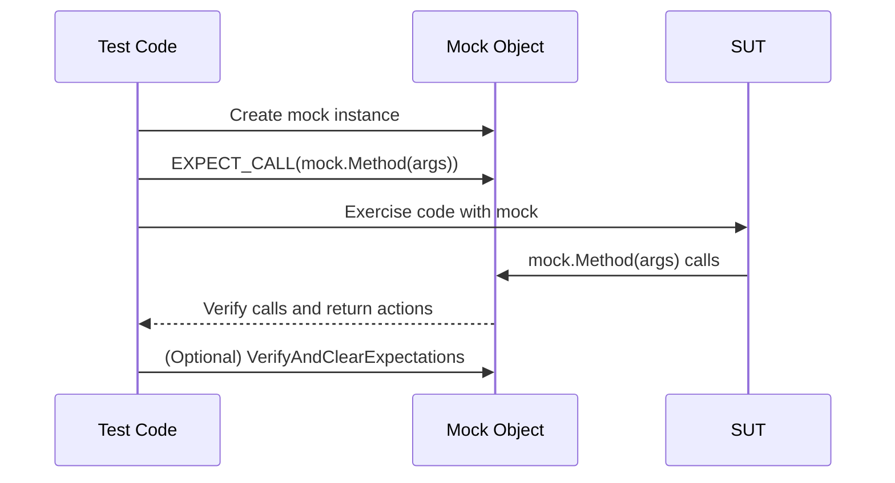

# Creating and Using Mocks

Learn how to define and use mock objects using GoogleMock, including setting expectations, specifying behaviors, and verifying interactions. Ideal for testing code that depends on external systems or abstractions.

---

## Introduction

Mock objects are essential for unit testing in C++. They allow you to simulate the behavior of complex or external systems and verify interactions without depending on the real objects. This guide focuses exclusively on the practical workflow of creating and using mocks with GoogleMock.

You will learn how to:

- Define mock classes and methods
- Set expectations on mock method calls
- Specify behaviors and return values
- Verify that your code interacts with mocks as expected

By mastering these techniques, you can effectively isolate your code under test, simulate edge cases, and write robust, maintainable tests.

---

## Prerequisites

Before proceeding, ensure you have:

- GoogleMock integrated into your project and `<gmock/gmock.h>` included.
- Familiarity with C++ virtual functions and interfaces.
- Basic knowledge of unit testing concepts.

For integration, setup, and initial configuration, see the [Initial Configuration Guide](../getting-started/setup-requirements-installation/initial-configuration).

---

## Defining Mock Classes

### Step 1: Create a Mock Class Derived from an Interface or Base Class

Your mock class must inherit from the interface or base class you want to mock. Each virtual method to be mocked is declared using the `MOCK_METHOD` macro inside the public section of your mock class.

**Important:**
- Always declare mock methods in the `public:` section regardless of the original method's access level.
- If mocking a `const`, `noexcept`, overloaded, or templated method, use the appropriate qualifiers in `MOCK_METHOD`.

### Syntax of MOCK_METHOD

```cpp
class MockClass : public RealClassOrInterface {
 public:
  MOCK_METHOD(ReturnType, MethodName, (Args...), (Qualifiers));
};
```

- `ReturnType`: the return type of the method.
- `MethodName`: the name of the method being mocked.
- `Args...`: the argument types in parentheses. Wrap types containing commas with an extra set of parentheses or use type aliases.
- `Qualifiers`: optional method qualifiers, e.g., `const`, `override`, `noexcept`.

### Examples:

```cpp
class MockTurtle : public Turtle {
 public:
  MOCK_METHOD(void, PenUp, (), (override));
  MOCK_METHOD(void, GoTo, (int x, int y), (override));
  MOCK_METHOD(int, GetX, (), (const, override));
  MOCK_METHOD(int, GetY, (), (const, override));
};
```

```cpp
// Handling return types or argument types with commas
using BoolIntPair = std::pair<bool, int>;
class MockFoo {
 public:
  MOCK_METHOD(BoolIntPair, GetPair, ());
  MOCK_METHOD(bool, CheckMap, ((std::map<int, double>), bool));
};
```

### Additional Notes

- To mock overloaded methods, define each overload with the proper signature using `MOCK_METHOD`.
- To mock non-virtual methods, use dependency injection and templates as per advanced techniques (see gMock Cookbook).

---

## Using Mock Objects in Tests

### Step 2: Create Mock Object Instances

Instantiate your mock class in your test code just like a regular object.

```cpp
MockTurtle mock_turtle;
```

### Step 3: Set Expectations Using `EXPECT_CALL`

`EXPECT_CALL` specifies that a mock method is expected to be called, optionally with argument matchers, call counts, sequences, and behaviors.

General syntax:

```cpp
EXPECT_CALL(mock_object, MethodName(matches...))
    .Times(cardinality?)
    .InSequence(sequences...)?
    .After(expectations...)?
    .WillOnce(action)...
    .WillRepeatedly(action)?
    .RetiresOnSaturation()?
    ;
```

- Use argument matchers like `_` (wildcard), `Eq(value)`, `Ge(value)`, etc., to specify expected argument values.
- Use `Times()` to specify how many times the call is allowed.
- Use `WillOnce()` and `WillRepeatedly()` to specify the return values or behaviors.

### Examples:

```cpp
using ::testing::AtLeast;
using ::testing::Return;

EXPECT_CALL(mock_turtle, PenDown()).Times(AtLeast(1));

EXPECT_CALL(mock_turtle, GetX())
    .WillOnce(Return(100))
    .WillOnce(Return(150))
    .WillRepeatedly(Return(200));

EXPECT_CALL(mock_turtle, GoTo(50, _));  // expects x=50, y=anything
```

### Ordering and Sequences

To enforce call order, use `InSequence`:

```cpp
using ::testing::InSequence;
{
  InSequence seq;
  EXPECT_CALL(mock, Start());
  EXPECT_CALL(mock, Execute());
  EXPECT_CALL(mock, Finish());
}
```

Alternatively, use named sequences:

```cpp
using ::testing::Sequence;
Sequence seq1, seq2;
EXPECT_CALL(mock, FirstCall()).InSequence(seq1);
EXPECT_CALL(mock, SecondCall()).InSequence(seq1, seq2);
EXPECT_CALL(mock, ThirdCall()).InSequence(seq2);
```

You can also specify that a call happens after one or more expectations with `After()`.

### Specifying Behavior

- Use `WillOnce(action)` to specify actions or return values for specific calls, in order.
- Use `WillRepeatedly(action)` to specify the behavior for calls after all `WillOnce`s are exhausted.
- Built-in actions include `Return(value)`, `ReturnRef(variable)`, `Invoke(function_or_lambda)`, `SetArgPointee<N>(value)`, and more.

---

## Setting Default Behavior with ON_CALL

`ON_CALL` specifies the behavior for a mock method but does *not* set an expectation that it will be called.

Syntax:

```cpp
ON_CALL(mock_obj, Method(matchers...))
    .WillByDefault(action);
```

Example:

```cpp
ON_CALL(mock_turtle, GetX()).WillByDefault(Return(10));
```

Use `ON_CALL` to set up common default behavior shared across multiple tests, and reserve `EXPECT_CALL` to specify what must happen in the test.

---

## Managing Uninteresting Calls

Calls to mock methods without an `EXPECT_CALL` are 'uninteresting calls'. By default, GoogleMock issues warnings for such calls.

Suppress warnings by:

- Using `NiceMock<MockClass>` to make mock objects "nice", which suppresses warnings on uninteresting calls.
- Adding a catch-all `EXPECT_CALL(mock, Method(_)).Times(AnyNumber())` when you expect calls but don't care about arguments.

Use `StrictMock<MockClass>` to treat uninteresting calls as errors.

---

## Tips and Best Practices

- **Declare Expectations Before Exercising the Mock:** `EXPECT_CALL` must be set before calling the method.
- **Use Argument Matchers Smartly:** Use `_` for arguments you don't care about to avoid brittle tests.
- **Prefer ON_CALL for Default Behavior:** Avoid excessive `EXPECT_CALL`s; use `ON_CALL` to specify common default behavior.
- **Sequence Expectations Carefully:** When order matters, use `InSequence` or `After` clauses explicitly.
- **Avoid Over-Specification:** Overly strict expectations can make tests fragile; focus on verifying essential interactions.
- **Use RetiresOnSaturation When Needed:** To allow expectations to become inactive once they are fulfilled.

---

## Troubleshooting

### Common Issues

- **Mock Methods Not Called or Called Unexpectedly:** Ensure `EXPECT_CALL` is set before the call and arguments match.
- **Warnings on Uninteresting Calls:** Use `NiceMock` or catch-all expectations.
- **Compilation Errors with `MOCK_METHOD` and Commas:** Wrap argument types containing commas in extra parentheses or use type aliases.
- **Mocking Non-Virtual Methods:** Use dependency injection or templating techniques as mocking non-virtual methods directly is not supported.

### Verifying Mock Expectations

Expectations are automatically checked when a mock object is destroyed. To verify earlier, use:

```cpp
using ::testing::Mock;

ASSERT_TRUE(Mock::VerifyAndClearExpectations(&mock_object));
```

---

## Example Walkthrough

```cpp
#include <gmock/gmock.h>
#include <gtest/gtest.h>

using ::testing::Return;
using ::testing::_;
using ::testing::InSequence;

class Turtle {
 public:
  virtual ~Turtle() = default;
  virtual void PenUp() = 0;
  virtual void PenDown() = 0;
  virtual void GoTo(int x, int y) = 0;
};

class MockTurtle : public Turtle {
 public:
  MOCK_METHOD(void, PenUp, (), (override));
  MOCK_METHOD(void, PenDown, (), (override));
  MOCK_METHOD(void, GoTo, (int x, int y), (override));
};

TEST(DrawingTest, DrawLine) {
  MockTurtle turtle;

  {
    InSequence s;
    EXPECT_CALL(turtle, PenDown());
    EXPECT_CALL(turtle, GoTo(100, 100));
    EXPECT_CALL(turtle, PenUp());
  }

  // Code under test goes here, which uses 'turtle'.
  turtle.PenDown();
  turtle.GoTo(100, 100);
  turtle.PenUp();
}
```

This test ensures that `PenDown()` is called before moving the turtle and lifting the pen, in order.

---

## Next Steps & Related Content

After mastering mock creation and usage, explore these topics:

- [Custom Actions and Matchers](../guides/mocking-and-advanced-techniques/actions-and-matchers) for extending mocks
- [Advanced Mocking Patterns and Tips](../guides/mocking-and-advanced-techniques/advanced-mocking-patterns) for patterns
- [Mocking Reference](../docs/reference/mocking) for full API details
- [gMock Cookbook](../docs/gmock_cook_book) for practical recipes

For overall testing workflows, see [Organizing Tests and Test Suites](../guides/core-testing-workflows/test-organization-best-practices).

---

## Summary Diagram



This flow shows the typical interaction between your test, mock objects, and the system under test.

---

<Tip>
Remember to always place `EXPECT_CALL` statements before exercising the mock methods to ensure correct behavior verification.
</Tip>

<Note>
Use `ON_CALL` to specify default mock method behaviors without setting call expectations.
</Note>

<Warning>
Be cautious with over-constraining expectations; it can make tests brittle and harder to maintain.
</Warning>

---

## Resources

- [Mocking Reference](https://google.github.io/googletest/reference/mocking)
- [gMock Cookbook](https://google.github.io/googletest/gmock_cook_book.html)
- [gMock Cheat Sheet](https://google.github.io/googletest/gmock_cheat_sheet.html)
- [Using Mocks in Tests](https://google.github.io/googletest/gmock_for_dummies.html#using-mocks-in-tests)

---

By following this guide, you can gain full confidence in defining and using mocks effectively in your C++ unit tests with GoogleMock.