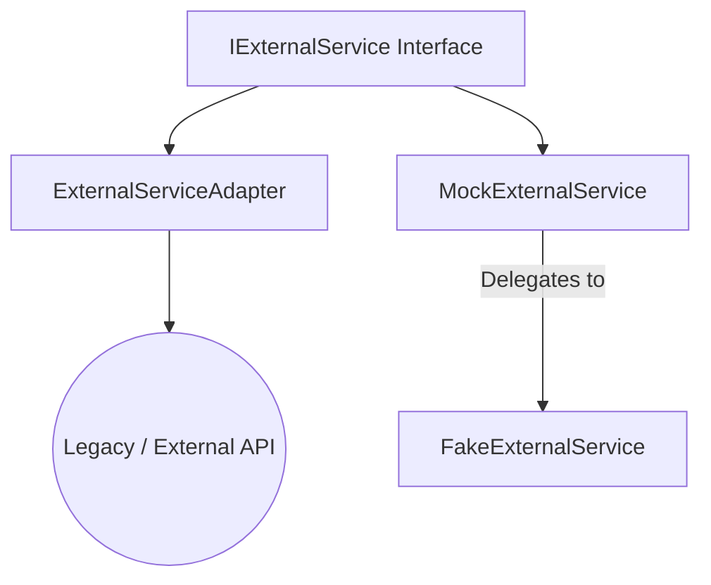

# Mocking Real-World APIs and Legacy Code

GoogleMock (gMock) excels at isolating dependencies in your C++ tests by creating mock implementations of interfaces. This page guides you through practical strategies for using GoogleMock to test code that interacts with complex external services or legacy codebases, where direct injection or interface control may be limited or unavailable.

---

## Overview

This guide helps you leverage GoogleMock to:
- Abstract legacy or third-party APIs via interfaces.
- Mock non-injectable or tightly coupled dependencies.
- Create effective, maintainable mocks around real-world external services.

You will learn how to structure your mocks, use delegation techniques, and handle challenging scenarios such as non-virtual methods and free functions.

---

## Prerequisites

- Familiarity with basic GoogleMock concepts such as `MOCK_METHOD`, `EXPECT_CALL`, and `ON_CALL`.
- An existing codebase or component where dependencies are complex, legacy, or external APIs.
- An environment where you can build and run GoogleTest and GoogleMock-based tests.

For foundational concepts, see [gMock for Dummies](https://google.github.io/googletest/gmock_for_dummies.html) and the [gMock Cookbook](https://google.github.io/googletest/gmock_cook_book.html).

---

## Expected Outcome

By applying this guide, you will be able to:
- Design abstraction layers over legacy or external code.
- Define mocks that handle difficult method signatures and non-virtual methods effectively.
- Use delegation to real or fake implementations to reduce test code duplication.
- Handle non-mockable elements such as free functions via interface extraction or alternative patterns.

---

## Time Estimate

Basic application: 30-60 minutes.
Complex refactoring with legacy code: several hours to days (depending on code size).

---

## Step-by-Step Guide

### 1. Create Abstractions over Legacy or External APIs

Legacy code and external services often do not come with interfaces amenable to mocking. To gain test control, define a clear, minimal interface tailored to your testing needs:

```cpp
class IExternalService {
public:
  virtual ~IExternalService() = default;
  virtual int FetchData(int id) = 0;
  virtual bool SendData(const std::string& payload) = 0;
};
```

- Prefer pure virtual functions in interfaces.
- Use domain-specific abstractions that fit your business logic.

---

### 2. Implement Adapter Layers

Wrap the legacy or third-party APIs with adapter classes implementing your new interface:

```cpp
class ExternalServiceAdapter : public IExternalService {
public:
  int FetchData(int id) override {
    return legacy_api_get_data(id); // Calls the legacy function
  }
  bool SendData(const std::string& payload) override {
    return legacy_api_send(payload.c_str());
  }
};
```

Adapters isolate your code from direct dependency on legacy or complex APIs, simplifying testing.

---

### 3. Define Mock Classes Using GoogleMock

Create mocks of your interfaces using `MOCK_METHOD` inside a mock class:

```cpp
#include <gmock/gmock.h>

class MockExternalService : public IExternalService {
public:
  MOCK_METHOD(int, FetchData, (int id), (override));
  MOCK_METHOD(bool, SendData, (const std::string& payload), (override));
};
```

**Best Practices:**
- Always place `MOCK_METHOD` declarations in the `public:` section.
- Use override specifier to catch signature mismatches.
- For methods with complex argument types containing commas (e.g., `std::pair`), use type aliases or wrap types in additional parentheses to avoid macro parsing issues.

---

### 4. Delegate Complex Behavior to Fakes or Real Objects

If you have a non-trivial fake or real implementation you'd like to reuse for default behavior, delegate to it inside your mock class:

```cpp
class FakeExternalService : public IExternalService {
public:
  int FetchData(int id) override {
    // Some deterministic fake logic
    return id * 10;
  }
  bool SendData(const std::string& payload) override {
    // Fake always succeeds
    return true;
  }
};

class MockExternalService : public IExternalService {
public:
  MOCK_METHOD(int, FetchData, (int id), (override));
  MOCK_METHOD(bool, SendData, (const std::string& payload), (override));

  void DelegateToFake() {
    ON_CALL(*this, FetchData).WillByDefault([this](int id) {
      return fake_.FetchData(id);
    });
    ON_CALL(*this, SendData).WillByDefault([this](const std::string& payload) {
      return fake_.SendData(payload);
    });
  }

private:
  FakeExternalService fake_;
};
```

Call `DelegateToFake()` in your test setup to combine interaction verification with real or fake behaviors.

---

### 5. Handling Non-Injectable Dependencies

If the code you want to test creates or accesses dependencies internally (non-injectable), consider:

- Refactoring to accept dependencies via constructor or setter injection.
- Using the Adapter pattern to isolate and mock external interactions.
- For global functions or free functions, introduce interfaces as wrappers, and mock those:

```cpp
class FileInterface {
public:
  virtual ~FileInterface() = default;
  virtual bool Open(const char* path, const char* mode) = 0;
};

class FileWrapper : public FileInterface {
public:
  bool Open(const char* path, const char* mode) override {
    return ::OpenFile(path, mode); // Calls the free function
  }
};

class MockFile : public FileInterface {
public:
  MOCK_METHOD(bool, Open, (const char* path, const char* mode), (override));
};
```

---

### 6. Mocking Non-Virtual or Overloaded Methods

- You cannot directly mock non-virtual methods. Use templated mock classes or dependency injection combined with class templates to mock non-virtual methods.
- For overloaded methods, mock each overload explicitly:

```cpp
MOCK_METHOD(int, Add, (int x), (override));
MOCK_METHOD(int, Add, (int times, int x), (override));
```

Remember to `using` base method names if mocking only some overloads.

---

### 7. Best Practices For Mock Maintenance

- Avoid mocking concrete classes directly unless you own them.
- Prefer coding to interfaces for cleaner test isolation.
- Use strict, nice, or naggy mocks judiciously:
  - `NiceMock` suppresses uninteresting call warnings.
  - `StrictMock` treats uninteresting calls as errors.

Use sequences or ordered expectations only if order is critical.

---

## Troubleshooting & Tips

### Common Pitfalls

- **Compile errors from commas in template types:** Use aliases or extra parentheses.
- **Mock method not called or expectations not satisfied:** Run tests with `--gmock_verbose=info` to trace calls.
- **Unexpected calls to mocked methods:** Confirm expectations are set **before** exercising code.
- **Destructors not mocked:** Mock destructor calls by adding a special `Die()` method called from destructor.

### Performance Tips

- Move mock class constructor and destructor definitions to `.cc` files to speed up compilation.
- Avoid overly complex or excessive expectations to reduce brittleness.

---

## Examples

### Mocking an External API Adapter

```cpp
class IWeatherAPI {
public:
  virtual ~IWeatherAPI() = default;
  virtual double GetTemperature(const std::string& city) = 0;
};

class WeatherAPIAdapter : public IWeatherAPI {
public:
  double GetTemperature(const std::string& city) override {
    return legacy_weather_api_get_temp(city.c_str());
  }
};

class MockWeatherAPI : public IWeatherAPI {
public:
  MOCK_METHOD(double, GetTemperature, (const std::string& city), (override));
};
```

Usage in test:

```cpp
TEST(WeatherServiceTest, FetchCurrentTemperature) {
  MockWeatherAPI mock_api;
  EXPECT_CALL(mock_api, GetTemperature("San Francisco"))
      .WillOnce(Return(65.0));

  WeatherService service(&mock_api);
  double temp = service.FetchCurrentTemperature("San Francisco");

  EXPECT_EQ(temp, 65.0);
}
```

### Delegating to a Fake Implementation

```cpp
class FakeWeatherAPI : public IWeatherAPI {
public:
  double GetTemperature(const std::string& city) override {
    if (city == "TestCity") return 42.0;
    return 70.0;
  }
};

class MockWeatherAPI : public IWeatherAPI {
public:
  MOCK_METHOD(double, GetTemperature, (const std::string& city), (override));

  void DelegateToFake() {
    ON_CALL(*this, GetTemperature).WillByDefault(
        [this](const std::string& city) {
          return fake_.GetTemperature(city);
        });
  }

private:
  FakeWeatherAPI fake_;
};
```

### Mocking a Non-Virtual Method via Template Mocking

```cpp
template <class Stream>
class PacketProcessor {
public:
  void Process(Stream& stream) {
    // non-virtual methods of Stream could be called here
    stream.AppendPacket(...);
  }
};

class MockPacketStream {
public:
  MOCK_METHOD(void, AppendPacket, (Packet* new_packet));
};

TEST(PacketProcessorTest, TestProcessing) {
  MockPacketStream mock_stream;
  EXPECT_CALL(mock_stream, AppendPacket(_));

  PacketProcessor<MockPacketStream> processor;
  processor.Process(mock_stream);
}
```

---

## Next Steps & Related Content

- Explore [Writing Your First Test](../guides/getting-started/writing-your-first-test) for foundational test creation.
- Review [Mocking Basics with GoogleMock](../guides/getting-started/mocking-basics) for core mocking techniques.
- Dive into [Advanced Mocking Patterns](../guides/mocking-and-advanced-techniques/advanced-mocking-patterns) to master complex cases mentioned here.
- Consult the [Mocking Reference](../api-reference/mocking-apis/mock-object-definition) for complete API details.

---

<Tip>
When designing mocks to isolate legacy or third-party code, prefer to create clear, minimal interfaces and adapter layers. This reduces coupling and enables simple, maintainable mocks.
</Tip>

<Note>
Delegating mock methods to real or fake implementations combines behavior reuse with interaction verification effectively.
</Note>

<Warning>
Mocking concrete classes or non-virtual functions directly is difficult and fragile; approach carefully and prefer interface design.
</Warning>

---

## References

- [gMock Cookbook](https://google.github.io/googletest/gmock_cook_book.html)
- [gMock for Dummies](https://google.github.io/googletest/gmock_for_dummies.html)
- [Mocking Reference](../api-reference/mocking-apis/mock-object-definition)
- [Writing Your First Test](../guides/getting-started/writing-your-first-test)
- [Advanced Mocking Patterns](../guides/mocking-and-advanced-techniques/advanced-mocking-patterns)
- [Troubleshooting Setup Issues](../getting-started/troubleshooting-faq/troubleshooting-setup-issues)

---

## Diagram: Mocking Legacy or External API Using Adapters and Delegates



This diagram shows how your new interface is connected to both the legacy implementation via an adapter, and to your tests via a mock that can optionally delegate to a fake version.

---

## Summary
This page empowers you to isolate real-world and legacy dependencies in your C++ tests by: designing interfaces, implementing adapters, defining mocks, and applying delegation techniques. It also covers strategies for dealing with non-injectable dependencies, non-virtual methods, and other common mocking challenges.

Use these practices to write maintainable, robust tests that clearly separate your test logic from volatile or complex external systems.

---