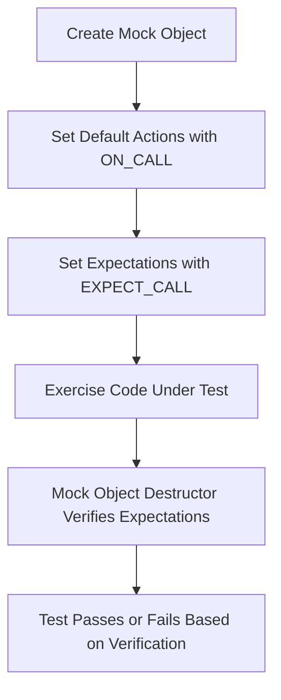

# Using Mocks: Patterns and Best Practices

This guide provides clear, step-by-step instructions on how to create and use mock objects effectively in your C++ tests with GoogleMock. It focuses on writing expectations, controlling call behavior, asserting interactions, and applying best practices in structuring mock classes to ensure your tests remain maintainable, reliable, and readable.

---

## 1. Understanding the Mock Workflow

### What You Will Achieve
By following this guide, you will master the art of:

- Defining mock classes that match your interfaces
- Setting clear expectations on mock method calls
- Managing call behaviors with default actions and sequences
- Verifying interactions with precise assertions
- Applying patterns to avoid brittle and hard-to-maintain tests

### Prerequisites
To use this guide effectively, ensure you:

- Have a working GoogleMock setup integrated into your C++ project
- Understand basic C++ unit testing and virtual interfaces
- Are familiar with writing simple test cases using GoogleTest

### Typical Use Case
Suppose you want to test a component depending on an interface `Foo`. Instead of using a real `Foo` implementation, you'll create a `MockFoo` class to control and verify interactions:

```cpp
class Foo {
 public:
  virtual ~Foo();
  virtual int GetSize() const = 0;
  virtual string Describe(const char* name) = 0;
  virtual bool Process(Bar elem, int count) = 0;
};

class MockFoo : public Foo {
 public:
  MOCK_METHOD(int, GetSize, (), (const, override));
  MOCK_METHOD(string, Describe, (const char* name), (override));
  MOCK_METHOD(bool, Process, (Bar elem, int count), (override));
};
```

This mock allows you to write expectations and control return values for `MockFoo`'s methods.

---

## 2. Creating and Using Mock Objects

### Step 1: Define Your Mock Class

- Derive from your interface class.
- Use `MOCK_METHOD` in the public section for each virtual method you want to mock.
- Include any necessary function qualifiers (e.g., `const`, `override`).
- Wrap complex argument types in parentheses or create type aliases to avoid macro parsing issues.

Example:

```cpp
#include <gmock/gmock.h>

class MockFoo : public Foo {
 public:
  MOCK_METHOD(int, GetSize, (), (const, override));
  MOCK_METHOD(string, Describe, (const char* name), (override));
  MOCK_METHOD(bool, Process, (Bar elem, int count), (override));
};
```

### Step 2: Instantiate the Mock and Set Expectations

```cpp
using ::testing::Return;

MockFoo foo;               // Create a mock object

ON_CALL(foo, GetSize())    // Set default behavior if you want
    .WillByDefault(Return(1));

EXPECT_CALL(foo, Describe(5))  // Set expectations
    .Times(3)                  // method must be called exactly 3 times
    .WillRepeatedly(Return("Category 5"));
```

### Step 3: Use Mock in Your Tests

Invoke production code that uses the mock to verify behavior:

```cpp
EXPECT_EQ(MyProductionFunction(&foo), "good");
```

### Step 4: Automatic Verification

When `foo` goes out of scope, GoogleMock automatically verifies that all expectations were met.

---

## 3. Controlling Call Behavior and Expectations

### ON_CALL vs EXPECT_CALL

- **ON_CALL**: Defines default behavior but does *not* enforce that the method must be called.
- **EXPECT_CALL**: Defines both expected call and behavior and enforces that calls matching expectation occur.

Best practice is to use `ON_CALL` in test setup or mock constructor for common behavior, and `EXPECT_CALL` in individual tests for specific verifications.

### Setting Call Cardinality

Use `.Times()` to specify how many times a method is expected to be called.

Examples:

- `.Times(0)` - the method should never be called.
- `.Times(AnyNumber())` - the method may be called any number of times.
- `.Times(AtLeast(n))` and `.Times(AtMost(n))` to specify bounds.

If omitted, GoogleMock infers cardinality from `.WillOnce()` and `.WillRepeatedly()` clauses.

### Ordering Calls

By default, calls can happen in any order. To enforce order:

- Use `InSequence` to declare a sequence where expectations must be met in order.

```cpp
{
  InSequence seq;  // All expects in this scope must happen in order.
  EXPECT_CALL(foo, Init());
  EXPECT_CALL(foo, Process());
  EXPECT_CALL(foo, Cleanup());
}
```

- Use `.After()` clause to require that a call happens after specified expectations.

### Handling Unexpected and Uninteresting Calls

- **Unexpected call**: A call that matches no expectation; causes test failure.
- **Uninteresting call**: Call to a method without any expectation; by default, yields a warning but no failure.

Use 3 modes of mocks to control behavior:

- `NiceMock<T>`: suppresses warnings on uninteresting calls.
- `NaggyMock<T>`: (default) warns on uninteresting calls.
- `StrictMock<T>`: treats uninteresting calls as errors.

Example:

```cpp
using ::testing::NiceMock;
NiceMock<MockFoo> nice_foo;
EXPECT_CALL(nice_foo, DoSomething());
// Other calls don't show warnings
```

---

## 4. Best Practices for Writing Mocks

### Structure Your Expectations Carefully

- Write minimal expectations to verify *only* what matters.
- Avoid over-specifying: fewer expectations reduce brittleness.
- Use `ON_CALL` for common behavior and `EXPECT_CALL` to verify specific calls.
- Use matchers (`_`, `Eq()`, other predicates) to relax argument constraints where possible.

### Use `.RetiresOnSaturation()` to Avoid Sticky Expectations

Expectations are "sticky" by default and remain active even after being saturated. To make an expectation retire (become inactive) when its calls are fully met:

```cpp
EXPECT_CALL(foo, Bar(_))
    .Times(3)
    .RetiresOnSaturation();
```

This prevents unexpected failures due to repeated calls beyond the expected count.

### Simplify Complex Interfaces

For methods with many parameters or overloads, consider:

- Using delegation in mock classes to simpler mock methods with trimmed parameter lists.
- Defining adapter interfaces to isolate mocking effort.

Example delegation:

```cpp
class MockLog : public LogSink {
public:
  void send(...) override {
    Log(...);
  }
  MOCK_METHOD(void, Log, (LogSeverity severity, const string& file_path, const string& message));
};
```

### Use Sequences and Partial Ordering for Complex Call Flows

- Use `Sequence`, `.InSequence()`, and `.After()` to specify partial or complete call order where necessary.
- Avoid overly strict ordering if the order is not important.

### Matchers: Be Expressive but Concise

- Use built-in matchers to specify argument expectations clearly.
- Use `_` to ignore arguments you don't care about.
- Combine matchers for complex conditions (e.g., `AllOf()`, `AnyOf()`).

### Delegating to Fakes or Real Objects

You can map default mock method behavior to existing *fake* or *real* implementations, enabling reuse and correctness guarantees:

```cpp
ON_CALL(mock, DoSomething())
    .WillByDefault([this](int x) { return fake_.DoSomething(x); });
```

### Use `Mock::AllowLeak` for Long-Lived Mocks

If your mock object lifetime is managed externally and it may not be deleted during test teardown, use:

```cpp
Mock::AllowLeak(&mock_object);
```

to prevent false failure due to undestroyed mocks.

---

## 5. Troubleshooting Common Mocking Issues

### Uninteresting Call Warnings

If you receive many warnings about "uninteresting mock function calls":

- Consider if you intended to set expectations on these methods.
- Use `NiceMock` to suppress warnings if the calls are allowed but uninteresting.
- Add catch-all `EXPECT_CALL`s with `.Times(AnyNumber())` if appropriate.

### Unexpected Calls Failures

Verify that all expected calls have matching `EXPECT_CALL`s with proper matchers.

### Mock Method Not Being Called

- Ensure the mock is correctly passed to the code under test.
- Verify argument matchers cover actual call arguments.

### Compiler Errors in Mock Definitions

- Wrap complex types with parentheses or use type aliases to avoid macro issues.

### Handling Move-Only Types

Use the native `MOCK_METHOD` support for move-only arguments and returns. Use lambdas for `WillOnce` or `WillRepeatedly` to create fresh move-only return objects each time.

---

## 6. Summary

This guide empowers you to create robust, readable, and maintainable tests by applying GoogleMock effectively. By defining mocks properly, setting clear and concise expectations, controlling call behaviors, and structuring your test code wisely, you reduce brittleness and increase confidence in your tests.


---

## 7. Additional Resources

- [gMock Cheat Sheet](https://google.github.io/googletest/gmock_cheat_sheet.html): Quick reference for mocking syntax and usage.
- [gMock Cookbook](https://google.github.io/googletest/gmock_cook_book.html): In-depth recipes on advanced mocking scenarios.
- [Mocking Reference](https://google.github.io/googletest/reference/mocking.html): Reference documentation for mock-related classes and macros.
- [Using Mocks in Tests](https://google.github.io/googletest/gmock_for_dummies.html#using-mocks-in-tests): Beginner-friendly introduction and workflow.


---

<Tip>
Use `NiceMock` by default to reduce noise from uninteresting calls; switch to `StrictMock` only when you want to strictly enforce no unexpected interactions.
</Tip>

<Note>
Always set expectations *before* the mock method is called to avoid undefined behavior and confusing test failures.
</Note>

<Warning>
Mock objects must have virtual destructors to avoid memory leaks and ensure correct cleanup.
</Warning>

---

# Diagram: Typical Mock Usage Workflow



---

# Example Test Using Mocks

```cpp
#include <gmock/gmock.h>
#include <gtest/gtest.h>

using ::testing::Return;
using ::testing::NiceMock;

class Foo {
 public:
  virtual ~Foo() {}
  virtual int GetSize() const = 0;
  virtual std::string Describe(int type) = 0;
};

class MockFoo : public Foo {
 public:
  MOCK_METHOD(int, GetSize, (), (const, override));
  MOCK_METHOD(std::string, Describe, (int type), (override));
};

TEST(FooTest, DescribeIsCalled) {
  NiceMock<MockFoo> mock_foo;

  ON_CALL(mock_foo, GetSize()).WillByDefault(Return(42));

  EXPECT_CALL(mock_foo, Describe(5)).Times(2).WillRepeatedly(Return("Category 5"));

  // Code under test uses mock_foo here
  EXPECT_EQ(mock_foo.GetSize(), 42);
  EXPECT_EQ(mock_foo.Describe(5), "Category 5");
  EXPECT_EQ(mock_foo.Describe(5), "Category 5");
}
```

This test checks that `Describe(5)` is called exactly twice with the expected result.

---

# Troubleshooting Quick Tips

| Issue                                   | Resolution                                          |
| -------------------------------------- | -------------------------------------------------- |
| Uninteresting call warnings             | Use `NiceMock` or define catch-all `EXPECT_CALL`   |
| Unexpected call failures                | Verify `EXPECT_CALL` matchers cover call arguments |
| Mock method not called as expected      | Check code under test receives the mock correctly   |
| Compilation error with complex types    | Wrap types with parentheses or use type aliases     |
| Memory leaks with mocks                  | Ensure mock class has virtual destructor             |

---

# Next Steps

- Explore [Matchers and Actions](../mocking-and-advanced-techniques/matchers-actions) to refine argument matching and action control.
- Learn about [Advanced Mocking Patterns](../mocking-and-advanced-techniques/advanced-mocking-patterns) for sophisticated test design.
- Dive into [Writing Your First Test](../../getting-started/writing-first-test) for foundational skills.

---

For more detailed examples and explanations, visit the official GoogleMock documentation: [GoogleMock gMock Cookbook](https://google.github.io/googletest/gmock_cook_book.html).
