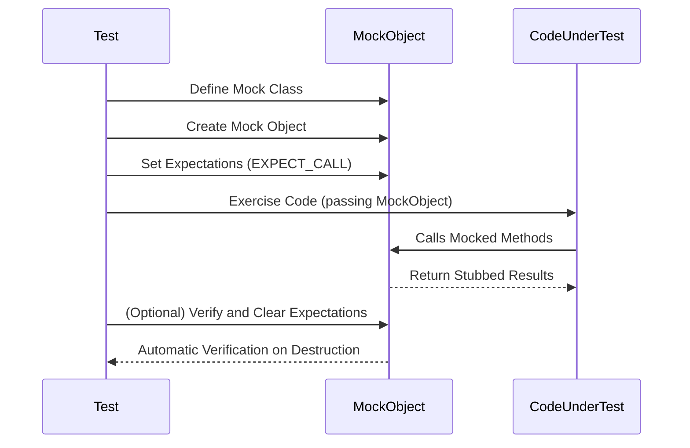

# Introduction to Mocking

## Why Use Mocks?

In modern C++ development, writing effective unit tests often requires isolating the code under test from its dependencies. However, real objects can be slow, unreliable, or difficult to set up in tests. Mocking provides a solution by enabling you to create *mock objects* — test doubles that mimic real objects' interfaces but allow you to specify and verify how they are used.

A **mock object** implements the same interface as a real object but lets you specify:

- Which methods will be called
- In which order and how many times
- With what arguments
- What the mock methods will return or do

Using mocks unlocks fast, isolated, and focused testing, helping you catch subtle bugs early and improving your code design through interaction-based validation.

<Info>
For a primer on basic testing patterns and the motivation behind mocking, see the [gMock for Dummies](https://google.github.io/googletest/gmock_for_dummies.html) guide.
</Info>

---

## Creating a Basic Mock Class with GoogleMock

GoogleMock simplifies the process of creating mocks with an intuitive macro-based syntax. Here’s how to create a mock for a simple interface:

### Example Interface

```cpp
class Turtle {
 public:
  virtual ~Turtle() {}
  virtual void PenUp() = 0;
  virtual void PenDown() = 0;
  virtual void Forward(int distance) = 0;
  virtual int GetX() const = 0;
};
```

**Important:** The base class destructor **must** be declared `virtual` to ensure proper cleanup when deleting derived mock objects.

### Step 1: Derive and Define Mock Methods

You define a mock class by deriving from the interface and using the `MOCK_METHOD()` macro to declare mocks of virtual methods.

```cpp
#include <gmock/gmock.h>  // Include GoogleMock headers

class MockTurtle : public Turtle {
 public:
  MOCK_METHOD(void, PenUp, (), (override));
  MOCK_METHOD(void, PenDown, (), (override));
  MOCK_METHOD(void, Forward, (int distance), (override));
  MOCK_METHOD(int, GetX, (), (const, override));
};
```

- The macro syntax is:
  ```cpp
  MOCK_METHOD(ReturnType, MethodName, (ArgumentTypes), (Qualifiers));
  ```
- Use `(override)` to mark overriding functions, and `(const, override)` for const methods.

### Step 2: Use the Mock in Your Test

After defining your mock class, you can create mock objects, set expectations on their behavior, and verify interactions.

```cpp
#include <gtest/gtest.h>

using ::testing::AtLeast;
using ::testing::Return;

TEST(DrawingTest, DrawsLine) {
  MockTurtle turtle;

  // Expect PenDown() to be called at least once
  EXPECT_CALL(turtle, PenDown()).Times(AtLeast(1));

  // Expect Forward(100) to be called once
  EXPECT_CALL(turtle, Forward(100)).Times(1);

  // Simulate code under test
  turtle.PenDown();
  turtle.Forward(100);

  // Test ends, and EXPECT_CALLs are verified automatically
}
```

This test verifies that the code correctly calls `PenDown()` and `Forward()` on the turtle mock.

---

## How Mocking Improves Testing

* **Isolation:** You test your component without bringing in slow or unstable dependencies.
* **Control:** Mocks let you precisely specify the return values and side effects for each method call.
* **Verification:** Mocks automatically verify that expected calls were made with expected arguments.
* **Focused Tests:** Interaction-based tests help catch integration errors early and increase design clarity.

<Note>
While mocks are powerful, use them judiciously: too many expectations or over-specification can lead to brittle tests that require frequent maintenance.
</Note>

---

## Types of Mocks for Different Testing Goals

- **NiceMock:** Suppresses warnings for uninteresting calls (methods called without expectation).
- **NaggyMock:** Prints warnings for uninteresting calls (the default behavior).
- **StrictMock:** Treats uninteresting calls as test failures.

Example usage:

```cpp
using ::testing::NiceMock;
using ::testing::NaggyMock;
using ::testing::StrictMock;

NiceMock<MockTurtle> nice_turtle;    // Ignores uninteresting calls
NaggyMock<MockTurtle> naggy_turtle;  // Warns on uninteresting calls
StrictMock<MockTurtle> strict_turtle; // Errors on uninteresting calls
```

Choose the mock type depending on the strictness and reporting you desire for your tests.

---

## Next Steps

- Explore setting up expectations on method calls with matchers, cardinalities, and custom actions. See the [Specifying Expectations and Actions](https://google.github.io/googletest/guides/mocking-and-behavior-verification/specifying-expectations-and-actions.html) guide.
- Learn to mock complex behaviors like overloaded functions, templates, and non-virtual methods via the [gMock Cookbook](https://google.github.io/googletest/gmock_cook_book.html).
- Understand finer control of mock lifecycles, verifying and resetting mocks, and strictness levels through the [Nice, Strict, and Naggy Mocks](https://google.github.io/googletest/api/reference/mocking-apis/nice-strict-mocks.html) reference.

<Tip>
Always define mock methods in the `public` section of your mock class, regardless of the base class method's access level. This allows gMock to correctly intercept calls and set expectations.
</Tip>

---

## Summary

Using GoogleMock, you can create mock classes effortlessly to enable focused testing of your code's interactions with dependencies. By defining mock methods with `MOCK_METHOD()`, setting expectations with `EXPECT_CALL()`, and choosing the appropriate mock strictness (Nice, Naggy, Strict), you gain precise control and insight into your tests, leading to better design and more reliable code.

---

### Additional Resources

- [gMock for Dummies](https://google.github.io/googletest/gmock_for_dummies.html)
- [gMock Cheat Sheet](https://google.github.io/googletest/gmock_cheat_sheet.html)
- [gMock Cookbook](https://google.github.io/googletest/gmock_cook_book.html)
- [Mocking Reference](https://google.github.io/googletest/reference/mocking.html)

<Source url="https://github.com/google/googletest" paths={[{"path": "docs/gmock_for_dummies.md"}, {"path": "docs/gmock_cheat_sheet.md"}]} />

---

### Mermaid Sequence Diagram: Typical Mocking Workflow


