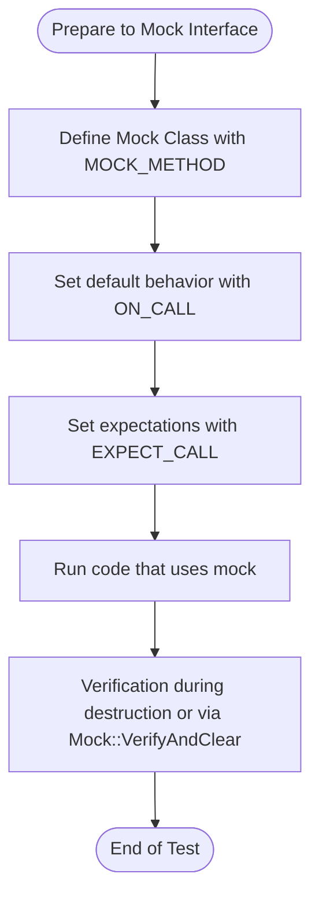

# Mocking Interfaces with GoogleMock

This guide provides step-by-step instructions for defining mock classes, setting up expectations, and controlling mock behavior using GoogleMock. It is tailored for users aiming to test components in isolation by simulating interfaces without relying on real implementations.

---

## 1. Introduction

Mocking allows you to replace real objects with controllable, simulated versions that can mimic the behavior of real dependencies. GoogleMock integrates seamlessly with GoogleTest to provide a powerful, expressive framework for mocking C++ interfaces.

This page focuses exclusively on how to create mock classes using `MOCK_METHOD`, specify call expectations with `EXPECT_CALL`, and customize the behavior of mocks with `ON_CALL`.

### Prerequisites
- You should be familiar with C++ virtual functions and interfaces.
- Basic understanding of GoogleTest and writing test cases.
- Include `<gmock/gmock.h>` in your test files.

### Expected Outcome
By following this guide, you will be able to:
- Define mock classes for your interfaces or classes.
- Set expectations on mocked methods about how often and with what arguments they should be called.
- Control the return values or side effects of mocked methods.
- Understand ordering constraints like sequences and call cardinalities.

---

## 2. Defining Mock Classes

Mock classes are C++ classes that emulate interfaces or abstract classes you want to isolate in your tests.

### 2.1 Basic Mock Method Declaration

Use the `MOCK_METHOD` macro inside your mock class to declare mocked methods:

```cpp
class MyMockClass {
 public:
  MOCK_METHOD(ReturnType, MethodName, (ArgTypes...), (Specifiers));
};
```

- `ReturnType` is the method's return type.
- `MethodName` is the name of the method to mock.
- Tuple `(ArgTypes...)` contains the method's arguments.
- Optional `Specifiers` may include qualifiers such as `(const, override)`.

#### Example

Mocking an interface:

```cpp
class Turtle {
 public:
  virtual ~Turtle() {}
  virtual void PenUp() = 0;
  virtual void PenDown() = 0;
  virtual void Forward(int distance) = 0;
  virtual int GetX() const = 0;
};

class MockTurtle : public Turtle {
 public:
  MOCK_METHOD(void, PenUp, (), (override));
  MOCK_METHOD(void, PenDown, (), (override));
  MOCK_METHOD(void, Forward, (int distance), (override));
  MOCK_METHOD(int, GetX, (), (const, override));
};
```

##### Important Notes
- Always put `MOCK_METHOD` declarations in the `public` section of the mock class, even for protected or private methods inherited.
- Use `(const, override)` for const virtual methods.
- For methods returning references, return values must be handled accordingly (e.g., `ReturnRef()` in actions).

### 2.2 Handling Return Types with Commas

If method signatures include types with commas (e.g., `std::pair<int, int>`), wrap them in an extra pair of parentheses:

```cpp
MOCK_METHOD((std::pair<int, int>), GetPair, ());
```

Alternatively, use type aliases:

```cpp
using IntPair = std::pair<int, int>;
MOCK_METHOD(IntPair, GetPair, ());
```

### 2.3 Mocking Overloaded Methods

You can mock overloaded methods by declaring all overloads in the mock class.

```cpp
MOCK_METHOD(int, Add, (int x), (override));
MOCK_METHOD(int, Add, (double x), (override));
```

If only some overloads are mocked, use `using BaseClass::MethodName;` to unhide the others to avoid compiler warnings.

### 2.4 Mocking Non-virtual Methods

GoogleMock can mock non-virtual methods by defining mock classes unrelated to the real classes but with matching method signatures.

---

## 3. Setting Up Expectations and Behavior

To control your mock object's behavior during test execution, use `EXPECT_CALL` for expectations, and `ON_CALL` for default behavior.

### 3.1 Using EXPECT_CALL

`EXPECT_CALL(mock_object, Method(matchers))` sets an expectation that a method will be called with specific argument matchers.

```cpp
using ::testing::_;          // Wildcard matcher
using ::testing::Return;

EXPECT_CALL(mock_turtle, Forward(100)).Times(1);
EXPECT_CALL(mock_turtle, GetX()).WillOnce(Return(42));
```

#### Key points about `EXPECT_CALL`:
- Must precede any code exercising the mock.
- Supports matchers for arguments (`_` for any argument).
- Supports cardinality with `.Times()`, e.g., `Times(Exactly(n))`, `Times(AnyNumber())`, `Times(AtLeast(n))`.
- Order expectations can be specified using `.InSequence()` or `.After()`.
- You can specify the method's behavior with `.WillOnce()` and `.WillRepeatedly()`.

### 3.2 Using ON_CALL

`ON_CALL(mock_object, Method(matchers))` sets the default action for a mock method invocation without requiring it to be called. It does **not** set expectations.

```cpp
ON_CALL(mock_turtle, GetX()).WillByDefault(Return(0));
```

Default actions from `ON_CALL` are overridden by matching `EXPECT_CALL`s.

### 3.3 Defining Behavior with Actions

- `Return(value)` to return a specific value.
- `ReturnRef(variable)` for returning a reference.
- `Invoke(function)`, `Invoke(lambda)` to call a user-provided function.
- `DoAll(action1, action2, ...)` to compose multiple side effects.
- `SetArgPointee<N>(value)` to set the value pointed to by the N-th argument.

Example:

```cpp
EXPECT_CALL(mock_foo, Compute(5))
    .WillOnce(Return(10));

ON_CALL(mock_foo, GetName())
    .WillByDefault(Return("default"));
```

### 3.4 Controlling Call Order

Use sequences to enforce order:

```cpp
using ::testing::Sequence;
Sequence seq;
EXPECT_CALL(mock, Step1()).InSequence(seq);
EXPECT_CALL(mock, Step2()).InSequence(seq);
```

Alternatively, use `.After(expectation)` to specify call dependencies explicitly.

### 3.5 Special Clauses

- `.RetiresOnSaturation()` indicates the expectation becomes inactive after the expected number of calls.
- `.With(multi_arg_matcher)` allows argument matching over the entire argument tuple.

---

## 4. Best Practices & Tips

- Use `ON_CALL` for default behaviors shared by many tests.
- Use `EXPECT_CALL` only when you want to verify a call's occurrence.
- Avoid over-specifying matchers to keep tests maintainable.
- For uninteresting calls without expectations, GoogleMock will warn by default; use `NiceMock<T>` to suppress warnings or `StrictMock<T>` to treat them as errors.
- Set explicit cardinalities for expectations to avoid accidental mismatches.
- Use sequences for tests where the order of calls matters.
- Always define a virtual destructor in interfaces to avoid leaks and other issues.

---

## 5. Common Pitfalls and Troubleshooting

<AccordionGroup title="Common Mocking Issues and Solutions">
<Accordion title="Uninteresting Call Warnings">
Uninteresting calls happen when a mock method without an `EXPECT_CALL` is invoked. By default, this triggers a warning but not a test failure. To suppress these warnings, use `NiceMock` or add a catch-all `EXPECT_CALL(...).Times(AnyNumber())`.
</Accordion>
<Accordion title="Mock Class Not Mocking Real Method">
Ensure the methods to be mocked are virtual. GoogleMock cannot mock non-virtual methods unless using the high-perf dependency injection technique.
</Accordion>
<Accordion title="Overlapping Expectations Shadowing">
Expectations are matched starting from the newest to oldest. Place more general expectations before more specific ones to avoid unexpected shadowing.
</Accordion>
<Accordion title="Too Many or Too Few Actions Warnings">
Make sure the number of `WillOnce` and `WillRepeatedly` actions align with the expected call cardinalities. Otherwise, GoogleMock will warn about too many or too few actions.
</Accordion>
<Accordion title="Compilation Errors with Commas in Types">
Wrap argument or return types containing commas in extra parentheses inside `MOCK_METHOD` to avoid parsing errors.
</Accordion>
</AccordionGroup>

---

## 6. Example

```cpp
#include <gmock/gmock.h>

class Interface {
 public:
  virtual ~Interface() = default;
  virtual int GetValue(int key) const = 0;
  virtual void SetValue(int key, int value) = 0;
};

class MockInterface : public Interface {
 public:
  MOCK_METHOD(int, GetValue, (int key), (const, override));
  MOCK_METHOD(void, SetValue, (int key, int value), (override));
};

// Usage in a test
using ::testing::Return;
using ::testing::_;
using ::testing::InSequence;

TEST(ExampleTest, SampleUsage) {
  MockInterface mock;

  // Setup default behavior
  ON_CALL(mock, GetValue(_)).WillByDefault(Return(0));

  // Set expectations
  {
    InSequence seq;
    EXPECT_CALL(mock, SetValue(5, 100));
    EXPECT_CALL(mock, GetValue(5)).WillOnce(Return(100));
  }

  // Exercise code
  mock.SetValue(5, 100);
  int value = mock.GetValue(5);

  EXPECT_EQ(value, 100);
}
```

---

## 7. Next Steps

- Explore [Writing Your First Test Case](../getting-started/first-test/writing-basic-test) to see how mocks fit into test cases.
- Read the [gMock Cookbook](docs/gmock_cook_book.md) for advanced recipes.
- Learn about [Matchers and Actions](docs/reference/mocking.md) for customizing expectations.
- Understand [NiceMock, StrictMock, and NaggyMock](googlemock/include/gmock/gmock-nice-strict.h) to control uninteresting call behavior.

---

## References

- [GoogleMock Cookbook](docs/gmock_cook_book.md)
- [gMock for Dummies](docs/gmock_for_dummies.md)
- [Mocking Reference](docs/reference/mocking.md)
- [gMock Cheat Sheet](docs/gmock_cheat_sheet.md)
- [Understanding EXPECT_CALL](docs/reference/mocking.md#EXPECT_CALL)

---

<Tip>
Use `EXPECT_CALL` for interactions you want to verify explicitly, and `ON_CALL` to define default behavior without setting expectations.
</Tip>

<Note>
Mock definitions require virtual destructors in base classes to ensure correctness. Always place mocked methods in the public section, even if overridden methods are protected or private.
</Note>

<Warning>
Avoid ambiguous `EXPECT_CALL` statements on overloaded methods without resolving the overload using `Const()` or type-specific matchers.
</Warning>

## Diagram: Mocking Workflow Overview



---

This documentation equips you with a clear, practical path to mocking interfaces with GoogleMock, empowering you to write precise, robust, and maintainable tests that isolate dependencies effectively.
