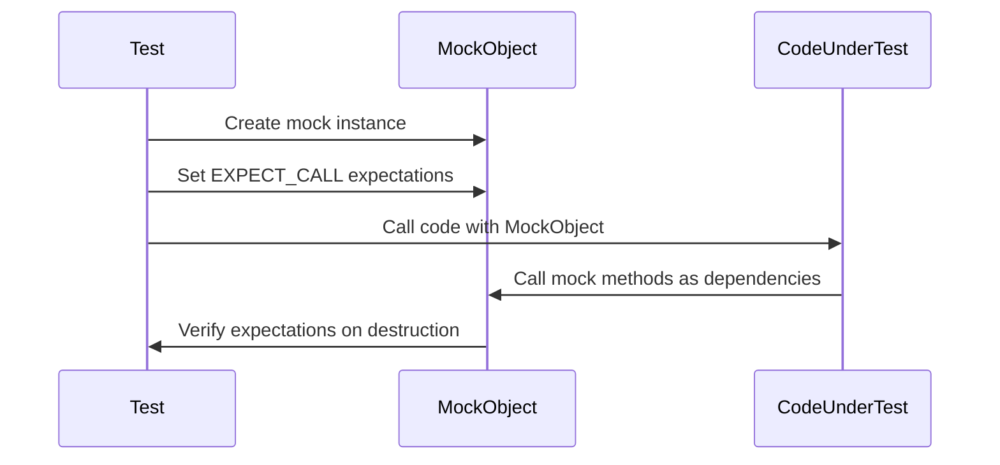

# Creating and Using Basic Mocks

This guide provides a practical introduction to integrating mocks into your C++ testing using GoogleMock (gMock). It covers the essentials of creating mock classes, defining mocked methods, and verifying interactions between components. By following this guide, you will isolate the code under test, enabling precise detection of integration issues and improving test reliability.

---

## 1. Overview

### What This Guide Covers

- Defining mock classes from existing interfaces
- Using the `MOCK_METHOD` macro to mock virtual methods
- Creating mock objects for testing
- Setting expectations on mock methods with `EXPECT_CALL`
- Verifying that expected calls occur with correct arguments and order

### Prerequisites

- Familiarity with C++ interface (abstract class) design
- Basic knowledge of virtual functions and inheritance
- GoogleTest and GoogleMock installed and configured in your development environment

### Expected Outcome

By the end of this guide, you will have:

- Created a mock class that simulates your interface
- Written tests that set expectations on the mock
- Verified that your code interacts correctly with its dependencies via mocks

### Time Estimate

Approximately 15-30 minutes depending on familiarity with C++ and mocking concepts.

### Difficulty Level

Beginner to Intermediate

---

## 2. Step-by-Step Instructions

### Step 1: Define the Interface to Be Mocked

Ensure your interface's methods intended for mocking are virtual and your destructor is virtual as well.

```cpp
class Turtle {
 public:
  virtual ~Turtle() {}
  virtual void PenUp() = 0;
  virtual void PenDown() = 0;
  virtual void Forward(int distance) = 0;
  virtual void Turn(int degrees) = 0;
  virtual void GoTo(int x, int y) = 0;
  virtual int GetX() const = 0;
  virtual int GetY() const = 0;
};
```

> **Check:** Every method you want to mock must be marked virtual. Forgetting to make the destructor virtual leads to undefined behavior when a mock is deleted.

---

### Step 2: Declare Your Mock Class

Derive a new class from the interface. Use the `MOCK_METHOD` macro in the `public:` section to mock each virtual method.

```cpp
#include <gmock/gmock.h>

class MockTurtle : public Turtle {
 public:
  MOCK_METHOD(void, PenUp, (), (override));
  MOCK_METHOD(void, PenDown, (), (override));
  MOCK_METHOD(void, Forward, (int distance), (override));
  MOCK_METHOD(void, Turn, (int degrees), (override));
  MOCK_METHOD(void, GoTo, (int x, int y), (override));
  MOCK_METHOD(int, GetX, (), (const, override));
  MOCK_METHOD(int, GetY, (), (const, override));
};
```

**Tips:**
- Use `(const, override)` qualifiers when mocking const methods.
- Wrapping types containing commas in parentheses or using type aliases resolves parsing issues.
- Always place mock methods in the `public:` section regardless of base method access level.

---

### Step 3: Create Mock Objects in Your Tests

In your test, instantiate the mock class:

```cpp
MockTurtle turtle;
```

You can also create nice, naggy, or strict mocks to control how unexpected/uninteresting calls are handled:

```cpp
using ::testing::NiceMock;
NiceMock<MockTurtle> nice_turtle;  // suppress warnings on uninteresting calls

using ::testing::StrictMock;
StrictMock<MockTurtle> strict_turtle;  // treat uninteresting calls as test failures
```

---

### Step 4: Set Expectations on Mock Methods

Use `EXPECT_CALL` to specify which methods the mock object is expected to receive, with what arguments, and how often.

```cpp
#include <gmock/gmock.h>
using ::testing::_;            // wildcard matcher to match any argument
using ::testing::AtLeast;

EXPECT_CALL(turtle, PenDown())
    .Times(AtLeast(1));
EXPECT_CALL(turtle, Forward(100));
EXPECT_CALL(turtle, GoTo(50, _));  // second argument can be anything
```

---

### Step 5: Exercise Your Code Under Test

Pass the mock object (or a pointer/reference to it) into the code that uses the interface.

```cpp
Painter painter(&turtle);
painter.DrawCircle(0, 0, 10);
```

This allows you to verify that the code calls the mock's methods as expected.

---

### Step 6: Run the Test and Validate Behavior

GoogleMock automatically verifies all expectations when the mock object is destructed.

If a mock method is called more times than expected, or with unexpected arguments, GoogleMock reports a failure immediately.

Example failure message:

```text
path/to/my_test.cc:119: Failure
Actual function call count doesn't match this expectation:
  Actually: never called;
  Expected: called at least once.
Stack trace:
...
```

---

### Additional Notes

- Set expectations **before** exercising the code to avoid undefined behavior.
- Wildcard matcher `_` matches any value and is useful to avoid over-specification.
- Use `.WillOnce()`, `.WillRepeatedly()` to define behavior or return values of mock methods.

```cpp
EXPECT_CALL(turtle, GetX())
    .WillOnce(Return(100))
    .WillOnce(Return(150))
    .WillRepeatedly(Return(200));
```

- Use sequences or `InSequence` to enforce call order when needed.

---

## 3. Real-World Example

```cpp
#include <gmock/gmock.h>
#include <gtest/gtest.h>

using ::testing::_;
using ::testing::Return;
using ::testing::InSequence;

class Turtle {
 public:
  virtual ~Turtle() {}
  virtual void PenDown() = 0;
  virtual void Forward(int distance) = 0;
  virtual int GetX() const = 0;
};

class MockTurtle : public Turtle {
 public:
  MOCK_METHOD(void, PenDown, (), (override));
  MOCK_METHOD(void, Forward, (int distance), (override));
  MOCK_METHOD(int, GetX, (), (const, override));
};

class Painter {
 public:
  explicit Painter(Turtle* turtle) : turtle_(turtle) {}

  bool DrawLine() {
    turtle_->PenDown();
    turtle_->Forward(100);
    return turtle_->GetX() == 100;
  }

 private:
  Turtle* turtle_;
};

TEST(PainterTest, DrawsLineCorrectly) {
  MockTurtle mock_turtle;
  InSequence seq;  // enforce order of calls

  EXPECT_CALL(mock_turtle, PenDown());
  EXPECT_CALL(mock_turtle, Forward(100));
  EXPECT_CALL(mock_turtle, GetX())
      .WillOnce(Return(100));

  Painter painter(&mock_turtle);
  EXPECT_TRUE(painter.DrawLine());
}
```

This test confirms that `Painter::DrawLine()` calls the mocked `Turtle` methods in order and returns true if `GetX()` returns 100.

---

## 4. Troubleshooting & Tips

### Common Issues

- **Mock methods not called as expected:** Check that all `EXPECT_CALL` calls are set before exercising the code.
- **Compilation errors with commas in types:** Wrap return or argument types containing commas in additional parentheses or use type aliases.
- **Uninteresting call warnings:** Use `NiceMock<T>` to suppress warnings for mock methods without explicit expectations.
- **Confusing Overload:** Use `Const()` wrapper or explicit matcher casts to disambiguate overloaded const and non-const methods.

### Best Practices

- Keep mock expectations minimal — only specify what you truly want to verify.
- Use wildcard matcher `_` to avoid brittle tests.
- Use `.RetiresOnSaturation()` or sequences when expecting calls in a strict order.
- Avoid mocking non-virtual methods directly; prefer interface-based design.
- Prefer `ON_CALL` to define default actions and reserve `EXPECT_CALL` for behavioral assertions.

### Performance Considerations

- Declare mock class constructors and destructors separately to speed up compilation if mocking many methods.

### Alternative Approaches

- Delegate mock calls to fake or real implementations if the default mock behavior is insufficient.

---

## 5. Next Steps & Related Content

- **Advanced Mocking:** Learn about gMock Actions, Matchers, and complex expectation patterns in the [Advanced Mocking Guide](/guides/mocking-and-test-doubles/advanced-mocking).
- **Matchers Reference:** Explore built-in and custom matchers available in gMock.
- **Cardinalities and Call Ordering:** Control how many times methods should be called and their relative ordering.
- **Nice, Naggy, and Strict Mocks:** Understand different mock behaviors to handle uninteresting calls.
- **GoogleTest Primer:** Understand the foundations of writing tests and assertions.

---

## References

- [GoogleMock Basics](https://google.github.io/googletest/gmock_for_dummies.html)
- [GoogleMock Cookbook](https://google.github.io/googletest/gmock_cook_book.html)
- [Mocking Reference](https://google.github.io/googletest/reference/mocking.html)
- [GoogleTest Primer](https://google.github.io/googletest/primer.html)

---

## Summary Diagram



---

<Tip>
Always define `MOCK_METHOD` macros in public sections of your mock class regardless of the base class method's access level.
</Tip>

<Note>
Never set expectations after the code under test has run and used the mock, as this leads to undefined behavior.
</Note>

<Warning>
Make sure your interface classes have virtual destructors to avoid memory leaks or undefined behavior when using mocks.
</Warning>

---