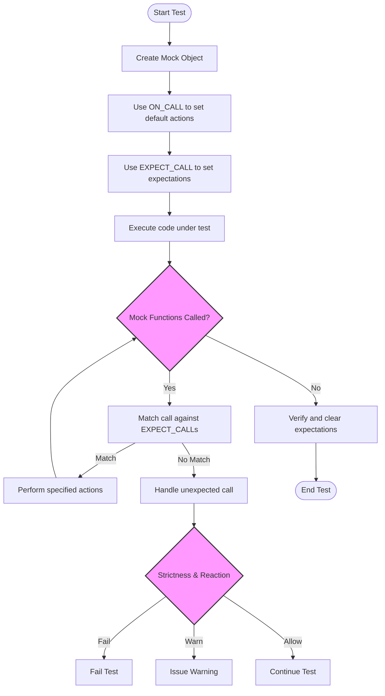

# Advanced Mocking Scenarios and Custom Actions

GoogleMock offers a powerful and flexible system to simulate complex behavior in your tests. This guide unlocks advanced features such as sequences, detailed parameter matching, custom actions, cardinality constraints, and troubleshooting tips — enabling you to create expressive and fine-grained mocks tailored to complex scenarios.

---

## 1. Expressive Expectation Control

### 1.1 Specifying Call Sequences

When the order of mock method calls matters, GoogleMock provides two ways to enforce it:

- **Using `InSequence` blocks:** This places all expectations declared within its scope into one anonymous sequence, requiring calls to occur in order.

  ```cpp
  using ::testing::InSequence;

  {
    InSequence s;

    EXPECT_CALL(mock, Initialize());
    EXPECT_CALL(mock, Process());
    EXPECT_CALL(mock, Cleanup());
  }
  ```

- **Using explicit `Sequence` objects and `.InSequence()` clauses:** This allows multiple sequences, enabling partial ordering and more complex ordering graphs.

  ```cpp
  using ::testing::Sequence;

  Sequence s1, s2;
  EXPECT_CALL(mock, Start()).InSequence(s1, s2);
  EXPECT_CALL(mock, Step1()).InSequence(s1);
  EXPECT_CALL(mock, Step2()).InSequence(s2);
  EXPECT_CALL(mock, Finish()).InSequence(s2);
  ```

### 1.2 Partial Ordering with `.After()`

The `.After()` clause lets you specify that an expectation occurs after one or more other expectations, imposing directed acyclic graph (DAG) style call ordering.

```cpp
using ::testing::Expectation;

Expectation init = EXPECT_CALL(mock, Initialize());
EXPECT_CALL(mock, Process()).After(init);
EXPECT_CALL(mock, Finish()).After(init);
```

This declares that `Process()` and `Finish()` must be called after `Initialize()`, but their relative order is not constrained.

---

## 2. Fine-Grained Argument Matching

### 2.1 Using Matchers for Arguments

GoogleMock supports matchers to specify how to match arguments in expectations. The wildcard matcher `_` matches anything.

```cpp
EXPECT_CALL(mock, Foo(42, _));
```

matches calls to `Foo` where the first argument equals 42 and the second argument can be anything.

### 2.2 Using `.With()` Clause for Multi-Argument Conditions

If you want to match call arguments as a whole tuple (e.g., ensure argument 0 is less than argument 1), use `.With()` with a matcher of the tuple type.

```cpp
EXPECT_CALL(mock, SetRange(_, _)).With(Lt());  // argument 0 < argument 1
```

### 2.3 Saving Arguments for Later Verification

When argument matching is complex or deferred, you can capture arguments using `SaveArg<N>(&variable)` in actions.

```cpp
int captured_value;
EXPECT_CALL(mock, Foo(_))
    .WillOnce(SaveArg<0>(&captured_value));
...
EXPECT_EQ(captured_value, expected);
```

---

## 3. Custom Actions for Complex Behavior

### 3.1 Using Built-in Actions

GoogleMock ships with many useful predefined actions such as:

- `Return(value)` - returns a fixed value.
- `ReturnRef(variable)` - returns a reference.
- `ReturnPointee(pointer)` - returns the value pointed to.
- `SetArgPointee<N>(value)` - sets the N-th pointer argument's pointee.
- `DoAll()` - combines multiple actions, performing them in order.
- `Invoke()` - invokes a function, functor, or lambda.
- `InvokeWithoutArgs()` - invokes a callable ignoring mock arguments.
- `InvokeArgument<N>(args...)` - invokes the N-th argument as a callable.
- `DeleteArg<N>()` - deletes the pointer passed as the N-th argument.
- `IgnoreResult()` - ignores the return value of an action.

### 3.2 Defining Custom Actions Using Lambdas or Functors

If the built-in actions don’t meet your needs, write lambdas or function objects.

```cpp
EXPECT_CALL(mock, Compute(_))
    .WillOnce([](int x) { return x * x; });
```

The call operator must be compatible with the mock method signature.

### 3.3 Legacy Macro-based Actions

Prior to C++11 lambdas, actions were defined with `ACTION`, `ACTION_P`, etc.

```cpp
ACTION(IncrementArg1) { return ++(*arg1); }
EXPECT_CALL(mock, Foo(_)).WillOnce(IncrementArg1());
```

Where `argN` refers to the N-th argument.

### 3.4 Polymorphic Actions

To support multiple types of mock functions with the same action, implement a polymorphic action via `MakePolymorphicAction()`.

---

## 4. Cardinality Control: Counting Calls

Expectations can specify how many times a function should be called with the `.Times()` clause. Cardinalities include:

- `Exactly(n)` - called exactly n times.
- `AtLeast(n)` - at least n times.
- `AtMost(n)` - at most n times.
- `Between(m, n)` - between m and n inclusive.
- `AnyNumber()` - any number of calls.

If `.Times()` is omitted, GoogleMock infers the cardinality from `WillOnce` and `WillRepeatedly` clauses:

- No `WillOnce`/`WillRepeatedly` → exactly one call expected.
- N `WillOnce` clauses and no `WillRepeatedly` → exactly N calls expected.
- N `WillOnce` clauses and `WillRepeatedly` → at least N calls expected.

---

## 5. Handling Special Cases

### 5.1 Mocking Methods with Move-Only Types

GoogleMock fully supports mocking methods that accept or return move-only types like `std::unique_ptr`. Use lambdas or callable objects for actions to create new move-only objects when called.

```cpp
EXPECT_CALL(mock, MakeBuzz(_))
    .WillRepeatedly([](StringPiece sp) {
      return std::make_unique<Buzz>();
    });
```

Avoid using `Return(std::move(...))` with `WillRepeatedly()`, as it tries to move from a consumed rvalue.

### 5.2 Mocking Overloaded Methods

To disambiguate overloaded methods, specify argument types in `MOCK_METHOD` and use `Const()` helper for const overloads when setting expectations.

```cpp
EXPECT_CALL(mock, GetBar());          // non-const
EXPECT_CALL(Const(mock), GetBar());   // const
```

### 5.3 Mocking Private and Protected Methods

Mock methods should always be declared in the `public:` section of your mock class regardless of their visibility in the base class, to allow external access for setting expectations.

---

## 6. Managing Strictness

### 6.1 Nice, Naggy, and Strict Mock Wrappers

GoogleMock provides wrappers to control how uninteresting calls (calls to mock methods without expectations) are handled.

- **NiceMock<T>** suppresses warnings on uninteresting calls.
- **NaggyMock<T>** (default) prints warnings on uninteresting calls.
- **StrictMock<T>** treats uninteresting calls as failures.

They inherit all constructors of `T` and must be used with mock classes that define mock methods with `MOCK_METHOD` macros directly.

```cpp
NiceMock<MockFoo> nice_mock;
NaggyMock<MockFoo> naggy_mock;
StrictMock<MockFoo> strict_mock;
```

---

## 7. Verifying and Resetting Mocks

You can explicitly verify that all expectations were met and optionally clear them before destruction:

- `Mock::VerifyAndClearExpectations(&mock_obj)` – verifies and clears expectations.
- `Mock::VerifyAndClear(&mock_obj)` – verifies and clears expectations and default actions.
- `Mock::AllowLeak(&mock_obj)` – suppresses leaked mock object warnings.

Do not set new expectations after verification or clearing as it leads to undefined behavior.

---

## 8. Troubleshooting Common Issues

### 8.1 Uninteresting Call Warnings

If using default mocks (`NaggyMock`), you may see warnings for calls to methods without expectations. To suppress them:

- Switch to `NiceMock`.
- Add `EXPECT_CALL(mock, Method(_)).Times(AnyNumber());` for the method.

### 8.2 Unexpected Calls

Calls that match no expectations but where expectations exist generate errors. Ensure expectations cover all intended calls or disallow calls by setting `.Times(0)`.

### 8.3 Ordering Violations

When using `InSequence` or `.After()`, calls running out of order generate errors. Check the sequence definitions and use partial ordering as needed.

### 8.4 Missing Actions for Return Types

If a mock method returns a non-void type and has no default action, it may cause runtime errors. Set a default action via `ON_CALL()` or provide `WillOnce()`/`WillRepeatedly()` actions.

---

## 9. Practical Tips and Best Practices

- Prefer `ON_CALL()` to define default behavior, and reserve `EXPECT_CALL()` for specifying intentional verified calls.
- Use wildcard and flexible matchers to avoid over-constraining tests.
- Order expectations such that more specific ones come after more general ones to leverage overriding.
- Use sequences and `.After()` judiciously to model only the needed ordering constraints.
- Avoid setting expectations after exercising code under test.
- Remember that expectations are sticky unless `.RetiresOnSaturation()` is used or they participate in sequences.

---

## 10. Example: Combining Features

```cpp
using ::testing::_; 
using ::testing::Return; 
using ::testing::Sequence;

class MockFoo {
 public:
  MOCK_METHOD(int, GetValue, (int x), ());
};

TEST(FooTest, ComplexScenario) {
  MockFoo mock;

  Sequence s;

  EXPECT_CALL(mock, GetValue(1)).InSequence(s)
      .WillOnce(Return(10));
  EXPECT_CALL(mock, GetValue(_))
      .Times(AnyNumber())
      .WillRepeatedly(Return(-1));

  EXPECT_EQ(10, mock.GetValue(1));  // must happen first
  EXPECT_EQ(-1, mock.GetValue(42)); // allowed any number of times
}
```

This example verifies that `GetValue(1)` returns `10` and happens before other calls, which always return `-1`.

---

## References

- [gMock Cookbook](https://google.github.io/googletest/gmock_cook_book.html)
- [Mocking Reference](https://google.github.io/googletest/reference/mocking.html)
- [gMock for Dummies](https://google.github.io/googletest/gmock_for_dummies.html)
- [Understanding Nice, Naggy, and Strict Mocks](https://google.github.io/googletest/gmock_cook_book.html#NiceStrictNaggy)


---

## Diagram of Mocking Expectation Workflow



---

<Tip>
Use sequences and `.After()` to precisely model call ordering, avoiding brittle tests by only constraining what matters.
</Tip>

<Note>
Remember to verify expectations before mock destruction or explicitly to catch failures early.
</Note>