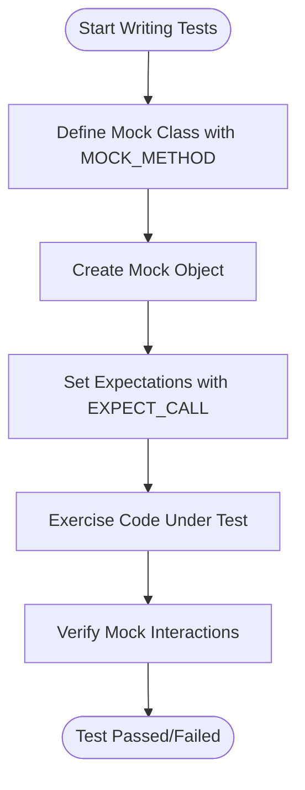

# Creating and Using Mocks with GoogleMock

This guide offers a practical and actionable walkthrough on how to declare mock classes and methods in GoogleMock. It focuses on using the `MOCK_METHOD` macro for defining mock methods, setting up call expectations with `EXPECT_CALL`, and utilizing argument matchers to create expressive and robust tests.

---

## Table of Contents

- [Introduction](#introduction)
- [Prerequisites](#prerequisites)
- [Expected Outcome](#expected-outcome)
- [Defining Mock Classes with `MOCK_METHOD`](#defining-mock-classes-with-mock_method)
- [Setting Expectations with `EXPECT_CALL`](#setting-expectations-with-expect_call)
- [Using Argument Matchers](#using-argument-matchers)
- [Managing Mock Strictness](#managing-mock-strictness)
- [Best Practices and Tips](#best-practices-and-tips)
- [Troubleshooting Common Issues](#troubleshooting-common-issues)
- [Next Steps & References](#next-steps--references)

---

## Introduction

When testing C++ code, it's often essential to simulate dependencies with mock objects to verify the interactions and control behaviors precisely. GoogleMock simplifies this process by generating mock classes and methods with easy-to-use macros and a rich expectation framework. 

This guide will help you get started with creating mocks and setting expectations, enabling you to write powerful and maintainable tests.

---

## Prerequisites

Before you begin, ensure you have:

- A C++ project with GoogleTest and GoogleMock correctly installed and configured.
- Familiarity with C++ virtual functions and basic mock testing concepts.
- Included `<gmock/gmock.h>` in your test files.

For detailed setup instructions, see the [Prerequisites & System Requirements](https://google.github.io/googletest/getting-started/setup-installation/prerequisites-requirements).

---

## Expected Outcome

By following this guide, you will be able to:

- Define mock classes with mocked methods using the `MOCK_METHOD` macro.
- Write expectations on mock methods with `EXPECT_CALL`.
- Use argument matchers to specify what arguments are expected.
- Control and configure mock object behavior, including managing strictness.
- Avoid common pitfalls and troubleshoot issues.

---

## Defining Mock Classes with `MOCK_METHOD`

### What is `MOCK_METHOD`?

`MOCK_METHOD` is the core macro used to declare mocked methods within a mock class. It replaces the implementation of virtual methods by allowing you to specify how they behave during tests.

### Basic Syntax

```cpp
class MockClass {
 public:
   MOCK_METHOD(ReturnType, MethodName, (Args...), (Specs...));
};
```

- **ReturnType**: The method’s return type.
- **MethodName**: The method’s name.
- **Args...**: Parenthesized list of argument types.
- **Specs...** (optional): Method qualifiers like `const`, `override`, `noexcept`, calling convention (`Calltype(...)`), or reference qualifiers (`ref(&)`).

### Examples

```cpp
class MockTurtle : public Turtle {
 public:
   MOCK_METHOD(void, PenUp, (), (override));
   MOCK_METHOD(void, Forward, (int distance), (override));
   MOCK_METHOD(int, GetX, (), (const, override));
};
```

### Handling Commas in Types

Types containing commas (e.g., `std::pair<bool, int>`) must be wrapped in parentheses or aliased:

```cpp
// Wrap return type in parentheses
MOCK_METHOD((std::pair<bool, int>), GetPair, ());

// Or use using declarations:
using BoolInt = std::pair<bool, int>;
MOCK_METHOD(BoolInt, GetPair, ());
```

### Mocking Non-Public Methods

Mock methods must always be declared in the `public:` section of your mock class, even if overriding `protected` or `private` methods:

```cpp
class MockFoo : public Foo {
 public:
   MOCK_METHOD(void, Resume, (), (override));  // originally protected
   MOCK_METHOD(int, GetTimeOut, (), (override));  // originally private
};
```

### Mocking Overloaded Methods

Simply declare all overloaded versions you want to mock. Use `using` to bring unmocked overloads into scope, avoiding compiler warnings:

```cpp
class MockFoo : public Foo {
 public:
   using Foo::Add;
   MOCK_METHOD(int, Add, (Element x), (override));
   MOCK_METHOD(int, Add, (int times, Element x), (override));
};
```

### Mocking Class Templates

Mock class templates like normal classes:

```cpp
template <typename T>
class MockStack : public StackInterface<T> {
 public:
   MOCK_METHOD(int, GetSize, (), (const, override));
   MOCK_METHOD(void, Push, (const T& x), (override));
};
```

---

## Setting Expectations with `EXPECT_CALL`

### Purpose

`EXPECT_CALL` sets an expectation that a specific method will be invoked with certain arguments, a specified number of times, and optionally in a defined order.

### Basic Syntax

```cpp
EXPECT_CALL(mock_object, MethodName(arg_matchers...))
    .Times(cardinality)        // Optional
    .WillOnce(action)          // Optional
    .WillRepeatedly(action)    // Optional
    .InSequence(sequence_objects...)   // Optional
    .After(expectations...)             // Optional
    .RetiresOnSaturation();             // Optional
```

### Key Points

- The first argument is the mock object.
- The second argument specifies the method and its expected arguments, which can use matchers.
- You can chain clauses to specify behavior, occurrence count, ordering, and actions.
- Calls without `EXPECT_CALL` are "uninteresting" by default, possibly triggering warnings.

### Examples

```cpp
using ::testing::Return;
using ::testing::_;
...
EXPECT_CALL(turtle, Forward(100)).Times(1);
EXPECT_CALL(turtle, GoTo(50, _)).Times(AnyNumber()).WillRepeatedly(Return());
EXPECT_CALL(turtle, GetX())
    .WillOnce(Return(100))
    .WillRepeatedly(Return(200));
```

### Inference of Times()

If you omit `Times()`, GoogleMock infers it based on how many `WillOnce()` and `WillRepeatedly()` clauses are specified:

- No `WillOnce()` or `WillRepeatedly()` ⇒ `Times(1)`
- `n` `WillOnce()` and no `WillRepeatedly()` ⇒ `Times(n)`
- `n` `WillOnce()` and one `WillRepeatedly()` ⇒ `Times(AtLeast(n))`

---

## Using Argument Matchers

### Matchers Overview

Matchers describe expected values or properties of arguments. They make expectations expressive and flexible.

Examples include:

- `_` — matches any value
- `Eq(value)` — matches arguments equal to `value`
- `Ge(value)`, `Lt(value)` — comparative matchers
- `NotNull()`, `IsNull()` — pointer matchers

### Using Matchers in `EXPECT_CALL`

```cpp
EXPECT_CALL(foo, Bar(Ge(5), NotNull()));
EXPECT_CALL(foo, Bar(_));  // Matches any arguments
```

### Combining Matchers

Use logical combinators:

```cpp
using ::testing::AllOf;
using ::testing::Not;
EXPECT_CALL(foo, DoSomething(AllOf(Ge(10), Not(Eq(15)))));
```

### Matching Multiple Arguments as a Whole

Sometimes arguments must be checked together; use `.With()` clause and multi-argument matchers:

```cpp
EXPECT_CALL(mock, SetPosition(_, _)).With(Lt());  // first arg less than second
```

---

## Managing Mock Strictness

Mocks can be created with different strictness levels controlling how uninteresting calls are treated:

- **NiceMock<T>**: Suppresses warnings for uninteresting calls.
- **NaggyMock<T>** (default): Warns on uninteresting calls.
- **StrictMock<T>**: Treats uninteresting calls as errors.

Usage example:

```cpp
NiceMock<MockFoo> nice_mock;
NaggyMock<MockFoo> naggy_mock;
StrictMock<MockFoo> strict_mock;
```

Use strict mocks sparingly to avoid brittle tests.

---

## Best Practices and Tips

- Always declare mock methods in the `public:` section.
- Use `ON_CALL` to specify default behaviors without setting expectations.
- Only use `EXPECT_CALL` when verifying that a call is expected.
- For overloaded methods, always specify arguments in `EXPECT_CALL` to avoid ambiguity.
- Use sequences (`InSequence`) or `.After()` to order expectations as needed.
- To handle complex argument checks, combine matchers or write custom matchers.
- Use `.RetiresOnSaturation()` to retire expectations once they have been fulfilled, to avoid sticky expectation errors.
- Avoid over-specifying tests — verify only what is necessary to prevent brittle tests.
- If you get warnings about uninteresting calls but they are expected, consider using `NiceMock`.

---

## Troubleshooting Common Issues

### Mock Method Not Called or Called Unexpectedly

- Ensure all expectations are set **before** code exercising the mock runs.
- Run with flag `--gmock_verbose=info` to see detailed call matching logs.

### `MOCK_METHOD` Fails to Compile with Comma Types

- Wrap the compound type in parentheses: `MOCK_METHOD((std::pair<int, int>), Name, ());`
- Or create a type alias and use it.

### Unexpected Calls Despite `ON_CALL`

- `ON_CALL` only defines default actions, it does not set expectations; calls not matching `EXPECT_CALL` are unexpected.

### Uninteresting Call Warnings

- Use `NiceMock` to suppress these if they are expected.
- Otherwise, define catch-all expectations with `EXPECT_CALL(mock, Method(_)).Times(AnyNumber());`

### Over-Saturation Errors

- Add `.RetiresOnSaturation()` to the related expectations or use sequences to order calls.

---

## Next Steps & References

To deepen your understanding and skills, explore these topics and documentation:

- Mocking work flows and best practices in [Mocking Best Practices](https://google.github.io/googletest/guides/mocking-best-practices/creating-mocks.html)
- Writing expectations and actions: [Writing Expectations and Actions](https://google.github.io/googletest/guides/mocking-best-practices/writing-expectations-actions.html)
- Argument Matchers Reference: [Matchers API](https://google.github.io/googletest/reference/matchers-actions-cardinalities/argument-matchers.html)
- Handling mock strictness: [Mock Strictness](https://google.github.io/googletest/guides/mocking-best-practices/mock-strictness.html)
- Practical examples and anti-patterns: [Real-World Mocking Patterns](https://google.github.io/googletest/guides/mocking-best-practices/real-world-mocking-patterns.html)
- Using `DefaultValue<T>` for customizing return values: [DefaultValue](https://google.github.io/googletest/reference/mocking.html#DefaultValue)

---

**Note:** Always define mock classes in your test code or a shared test support module, especially when the interfaces belong to external libraries, to maintain test maintainability and reduce code duplication.

---

_Remember, the key to mastering mocks is practice and balancing expressiveness with test resilience._

---

## Code Example: Defining and Using a Mock

```cpp
#include <gmock/gmock.h>
#include <gtest/gtest.h>

// Interface to be mocked
class Turtle {
 public:
   virtual ~Turtle() {}
   virtual void PenUp() = 0;
   virtual void PenDown() = 0;
   virtual void Forward(int distance) = 0;
   virtual int GetX() const = 0;
};

// Mock class
class MockTurtle : public Turtle {
 public:
   MOCK_METHOD(void, PenUp, (), (override));
   MOCK_METHOD(void, PenDown, (), (override));
   MOCK_METHOD(void, Forward, (int distance), (override));
   MOCK_METHOD(int, GetX, (), (const, override));
};

// Test
TEST(PainterTest, CallsPenDown) {
  MockTurtle turtle;

  // Expect PenDown called exactly once
  EXPECT_CALL(turtle, PenDown()).Times(1);

  // The code under test
  turtle.PenDown();
}
```

---

## FAQ Snippet

- **Can I mock non-virtual methods?**

  Not directly, but you can mock classes unrelated to the real ones with matching signatures for dependency injection (see [Mocking Non-virtual Methods](https://google.github.io/googletest/gmock_cook_book.html#MockingNonVirtualMethods)).

- **Can I mock free functions?**

  No, but you can wrap them into interfaces and mock those instead.

- **How do I test call order?**

  Use `InSequence` or `.After()` clauses to specify call ordering.

- **How to avoid warnings on uninteresting calls?**

  Use `NiceMock` or catch-all `EXPECT_CALL`s with `Times(AnyNumber())`.

---

<Info>
For detailed reference on `MOCK_METHOD` and `EXPECT_CALL`, please visit the official [MockClasses and MOCK_METHOD API reference](https://google.github.io/googletest/api/gmock_cook_book.html#CreatingMockClasses) and the [Mocking Reference](https://google.github.io/googletest/reference/mocking.html).
</Info>

---

## Mermaid Diagram: Mock Usage Workflow


