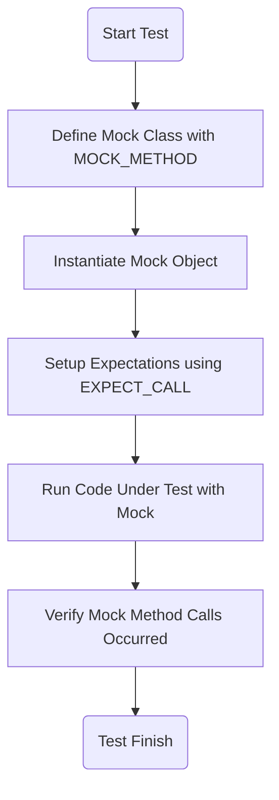

# Creating and Using Mock Objects

## Workflow Overview

### Task Description
This guide walks you through defining, implementing, and effectively using mock objects in your GoogleTest test suite. You will learn how to declare mock classes with `MOCK_METHOD` macros and utilize key utilities to simulate and verify interactions in your C++ tests.

### Prerequisites
- A working GoogleTest and GoogleMock installation.
- Basic knowledge of C++ testing with GoogleTest.
- Familiarity with writing simple test cases.

### Expected Outcome
After completing this guide, you'll be able to:
- Define mock classes with the appropriate methods using `MOCK_METHOD` macros.
- Implement mocks for interfaces, including overloaded and templated methods.
- Use mocks to set expectations and simulate behavior in unit tests.

### Time Estimate
Approximately 20–30 minutes to read and practice.

### Difficulty Level
Intermediate — assumes familiarity with GoogleTest fundamentals and some C++ expertise.

---

## Step-by-Step Instructions

### 1. Define a Mock Interface Class

Start by defining your mock class that inherits from the interface or base class you want to mock. Use `MOCK_METHOD` macros inside this class to declare mock methods matching the signatures of those in the interface.

- Use the newer `MOCK_METHOD` macro for newer GoogleMock versions:

  ```cpp
  class MockFoo : public FooInterface {
   public:
    MOCK_METHOD(int, SomeMethod, (int arg), (override));
    MOCK_METHOD(void, VoidMethod, ());
  };
  ```

- For legacy code, `MOCK_METHODn` macros exist (where `n` is the number of arguments), but `MOCK_METHOD` is preferred for new code.

- Handle complex function signatures including references, pointers, templates, overloaded methods, constness, and calltypes properly:

  ```cpp
  MOCK_METHOD(std::string, TakesConstReference, (const int&));
  MOCK_METHOD(bool, TakesNonConstReference, (int&));
  MOCK_METHOD(int, OverloadedOnArgumentNumber, (int));
  MOCK_METHOD(int, OverloadedOnArgumentNumber, ());
  MOCK_METHOD(char, OverloadedOnArgumentType, (char));
  MOCK_METHOD(int, OverloadedOnArgumentType, (int));
  MOCK_METHOD(int, RefQualifiedConstRef, (), (const, ref(&)));
  ```

- On Windows, for COM calltypes, add `Calltype(STDMETHODCALLTYPE)` as an attribute:

  ```cpp
  MOCK_METHOD(int, CTNullary, (), (Calltype(STDMETHODCALLTYPE)));
  ```

### 2. Use the Mock Methods in Tests

- Instantiate your mock class.
- Use `EXPECT_CALL` to set up expectations on mock method calls.
- Define return values or actions with `.WillOnce()`, `.WillRepeatedly()`, or other action macros.

```cpp
MockFoo mock;
EXPECT_CALL(mock, SomeMethod(42))
    .WillOnce(Return(100));

int result = mock.SomeMethod(42);
EXPECT_EQ(result, 100);
```

- For void-returning methods:

```cpp
EXPECT_CALL(mock, VoidMethod());
mock.VoidMethod();
```

- Supports call count expectations (`Times`), argument matchers (`_`, `Eq`, `Lt`, etc.), and sequencing.

### 3. Support for Templates and Overloads

- When mocking template interfaces, declare mocks with templated classes.

```cpp
template <typename T>
class MockStack : public StackInterface<T> {
 public:
  MOCK_METHOD(void, Push, (const T& elem), ());
  MOCK_METHOD(void, Pop, (), ());
  MOCK_METHOD(int, GetSize, (), (const));
};
```

- Use `TYPED_TEST_SUITE` to run parameterized tests over multiple mock types if needed.

- Overloaded methods must be mocked explicitly for each signature.

### 4. Working with Non-Standard Return Types

- For functions returning types containing commas or complicated templates, place return type in parentheses.

```cpp
MOCK_METHOD((std::map<int, std::string>), ReturnTypeWithComma, (), ());
```

### 5. Advanced Utility: MockFunction

- For lightweight mocking of individual functions without defining a mock class, use `MockFunction`:

```cpp
MockFunction<int(int)> mock_func;
EXPECT_CALL(mock_func, Call(5)).WillOnce(Return(10));
int res = mock_func.Call(5);
EXPECT_EQ(res, 10);
```

- This simplifies mocking callbacks or function pointers.

---

## Examples & Code Samples

### Basic Mock Class

```cpp
class FooInterface {
 public:
  virtual ~FooInterface() = default;
  virtual int DoSomething(int x) = 0;
  virtual void Notify() = 0;
};

class MockFoo : public FooInterface {
 public:
  MOCK_METHOD(int, DoSomething, (int x), (override));
  MOCK_METHOD(void, Notify, (), (override));
};

TEST(FooTest, BasicUsage) {
  MockFoo mock;

  EXPECT_CALL(mock, DoSomething(5)).WillOnce(Return(42));
  EXPECT_CALL(mock, Notify()).Times(1);

  int val = mock.DoSomething(5);
  mock.Notify();

  EXPECT_EQ(val, 42);
}
```

### Mocking a Template Interface

```cpp
template <typename T>
class StackInterface {
 public:
  virtual ~StackInterface() = default;
  virtual void Push(const T& value) = 0;
  virtual void Pop() = 0;
  virtual int GetSize() const = 0;
};

// Mock
template <typename T>
class MockStack : public StackInterface<T> {
 public:
  MOCK_METHOD(void, Push, (const T& elem), ());
  MOCK_METHOD(void, Pop, (), ());
  MOCK_METHOD(int, GetSize, (), (const));
};

TEST(MockStackTest, PushPopTest) {
  MockStack<int> mock_stack;
  EXPECT_CALL(mock_stack, Push(5)).Times(1);
  EXPECT_CALL(mock_stack, Pop()).Times(1);
  EXPECT_CALL(mock_stack, GetSize()).WillOnce(Return(1));

  mock_stack.Push(5);
  mock_stack.Pop();
  EXPECT_EQ(mock_stack.GetSize(), 1);
}
```

### Expecting Multiple Calls with Different Results

```cpp
EXPECT_CALL(mock, SomeMethod(_))
    .WillOnce(Return(1))
    .WillOnce(Return(2))
    .WillRepeatedly(Return(0));

EXPECT_EQ(mock.SomeMethod(10), 1);
EXPECT_EQ(mock.SomeMethod(20), 2);
EXPECT_EQ(mock.SomeMethod(30), 0);
```

### Mocking Functions with Overloads

```cpp
class MockOverloaded {
 public:
  MOCK_METHOD(int, Func, (), ());
  MOCK_METHOD(int, Func, (int), ());
};

MockOverloaded mock;
EXPECT_CALL(mock, Func()).WillOnce(Return(1));
EXPECT_CALL(mock, Func(10)).WillOnce(Return(2));

EXPECT_EQ(mock.Func(), 1);
EXPECT_EQ(mock.Func(10), 2);
```

---

## Troubleshooting & Tips

### Common Issues

- **Mock method signature mismatch:** Ensure your `MOCK_METHOD` declarations exactly match the base class method signature, including constness and ref qualifiers.
- **Overload ambiguity:** When mocking overloaded methods, declare `MOCK_METHOD` for each overload explicitly to avoid compiler errors.
- **Linker errors:** Confirm your test target links against the gMock and gTest libraries.
- **Uninteresting calls:** By default, unexpected mock calls may be ignored or raise warnings. Use `.Times(0)` to disallow calls explicitly.
- **Calltype usage:** On Windows COM or special calling conventions, include `Calltype(STDMETHODCALLTYPE)` to match calling conventions.

### Best Practices

- Use the modern `MOCK_METHOD` macro syntax where possible.
- When mocking template interfaces, leverage typed tests to reuse mock implementations.
- Use matchers (e.g., `_`, `Eq`, `Gt`) to flexibly specify expectations.
- Chain `.WillOnce()`, `.WillRepeatedly()` to customize mock behavior over multiple calls.
- Use `MockFunction` for simple function mocking without a dedicated class.

### Performance Considerations

- Keep mock classes lightweight by limiting the number of mock methods to what is necessary.
- For frequently called methods, use `.WillRepeatedly()` to avoid overhead from repeated setup.

### Alternative Approaches

- For complex actions or side effects, consider implementing custom actions and matchers (covered in other guides).
- Use strict vs nice mocks to control strictness of mock behavior (see mock strictness guides).

---

## Next Steps & Related Content

- Proceed to **Defining and Verifying Expectations** to master how to set detailed expectations and verify interaction correctness.
- Explore **Custom Actions, Matchers, and Return Values** to create powerful custom mock behaviors.
- For troubleshooting complex issues, consult **Troubleshooting Common Issues** guide.
- Review **Mocking Cookbook** for advanced mocking scenarios and recipes.

---

## Additional Resources

- [Mocking for Dummies](https://github.com/google/googletest/blob/main/docs/gmock_for_dummies.md) — Beginner-friendly tutorial for mocks.
- [Mocking Cheat Sheet](https://github.com/google/googletest/blob/main/docs/gmock_cheat_sheet.md) — Quick reference of matchers, actions, and macros.
- GoogleTest GitHub Repository: [https://github.com/google/googletest](https://github.com/google/googletest)

---

## Summary Diagram for Mock Usage Flow



---

*This comprehensive guide ensures you confidently create and leverage mock objects to isolate and verify components in your C++ testing with GoogleTest and GoogleMock.*