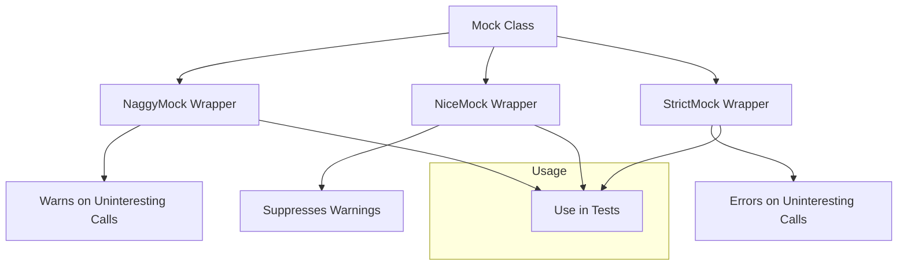

# Controlling Mock Strictness: Nice, Naggy, and Strict Mocks

GoogleMock offers flexible control over how strictly mocks enforce call expectations through three wrapper templates: **NiceMock**, **NaggyMock**, and **StrictMock**. These wrappers help you decide whether uninteresting calls (mock method calls for which there are no explicit expectations) should be silently ignored, warned about, or treated as test failures.

---

## Workflow Overview

### What This Guide Helps You Achieve
This guide explains when and how to use NiceMock, NaggyMock, and StrictMock wrappers around your mock classes, enabling you to control the strictness level of your mocks in tests. This helps you enforce or relax call expectations appropriately for your scenarios, preventing noisy test output or unexpected test failures.

### Prerequisites
- You should already have defined mock classes using `MOCK_METHOD` macros.
- Basic understanding of GoogleMock expectations (`EXPECT_CALL`), default behaviors (`ON_CALL`), and mock object lifecycle.

### Expected Outcome
By following this guide, you will:
- Understand the behavior differences between NiceMock, NaggyMock, and StrictMock.
- Know how to instantiate and use these wrappers in your tests.
- Learn best practices on when to use each wrapper type.

### Time Estimate
Approximately 10-15 minutes to grasp concepts and apply in code.

### Difficulty Level
Beginner to Intermediate.

---

## Understanding the Strictness Wrappers

GoogleMock’s default mock behavior is currently 'naggy'—that is, uninteresting calls issue warnings but do not cause test failures.

### 1. NaggyMock: The Default (Warns About Uninteresting Calls)
- `NaggyMock<MockClass>` inherits from `MockClass`.
- It prints warning messages whenever an uninteresting mock method is called.
- This is the default behavior of mocks created as just `MockClass`.

```cpp
using ::testing::NaggyMock;
...
NaggyMock<MockFoo> mock;  // Same behavior as MockFoo by default.
EXPECT_CALL(mock, DoThis());
// Calling other mock methods without expectations triggers warnings.
```

### 2. NiceMock: Quiet and Lenient (Suppresses Warnings)
- `NiceMock<MockClass>` inherits from `MockClass` but suppresses warnings on uninteresting calls.
- Useful for tests where you don't want noise from unexpected method calls that you don't care about.
- Usage is identical to `MockClass`.

```cpp
using ::testing::NiceMock;
...
NiceMock<MockFoo> mock;
EXPECT_CALL(mock, DoThis());
// Uninteresting calls will not produce warnings.
```

**Tip:** This is recommended for most tests to avoid spurious warnings that do not indicate a real failure.

### 3. StrictMock: Fail Fast on Any Uninteresting Call
- `StrictMock<MockClass>` inherits from `MockClass` and treats any uninteresting call as a test failure.
- Use when you want to ensure your code calls only what you explicitly specified.

```cpp
using ::testing::StrictMock;
...
StrictMock<MockFoo> mock;
EXPECT_CALL(mock, DoThis());
// Any uninteresting call causes a test failure.
```

**Warning:** Strict mocks may lead to brittle tests if your production code legitimately calls methods you do not expect or verify.

---

## Step-by-Step Instructions

### Step 1: Define Your Mock Class
Ensure your mock class uses `MOCK_METHOD` macros directly in the class definition.

```cpp
class MockFoo {
 public:
  MOCK_METHOD(void, DoThis, (), ());
  MOCK_METHOD(int, DoThat, (bool flag), ());
};
```

### Step 2: Wrap Your Mock Class as Nice, Naggy, or Strict
Choose the wrapper based on your strictness needs.

- For quiet tests that ignore uninteresting calls:

```cpp
NiceMock<MockFoo> mock;
```

- To keep default warning behavior:

```cpp
NaggyMock<MockFoo> mock;
```

- For strict enforcement:

```cpp
StrictMock<MockFoo> mock;
```

### Step 3: Use the Mock Wrapper as a Drop-in Replacement
These wrappers inherit the constructors of your mock, so you can pass constructor arguments transparently.

```cpp
NiceMock<MockFoo> mock(5, "arg");  // If MockFoo has such a constructor.
```

Use your wrapped mock as usual with `EXPECT_CALL` and `ON_CALL`.

### Step 4: Set Expectations and Run Your Test

```cpp
EXPECT_CALL(mock, DoThis()).Times(1);
// Exercise code that calls mock.DoThis().
```

### Verification
Mocks automatically verify expectations at destruction.

You can manually verify and clear expectations using:

```cpp
::testing::Mock::VerifyAndClearExpectations(&mock);
```

---

## Practical Examples

### Example: Suppress warnings on uninteresting calls with NiceMock

```cpp
#include <gmock/gmock.h>
using ::testing::NiceMock;

class MockDatabase {
 public:
  MOCK_METHOD(void, Connect, (), ());
  MOCK_METHOD(int, Query, (const std::string& query), ());
};

TEST(DatabaseTest, UsesNiceMock) {
  NiceMock<MockDatabase> db;
  EXPECT_CALL(db, Connect()).Times(1);

  // No expectation on Query, but calling it won't emit warnings.
  db.Connect();
  db.Query("SELECT * FROM users");  // No warning here.
}
```

### Example: Enforce strict mock behavior

```cpp
#include <gmock/gmock.h>
using ::testing::StrictMock;

class MockLogger {
 public:
  MOCK_METHOD(void, Log, (const std::string& message), ());
};

TEST(LoggerTest, StrictMockExample) {
  StrictMock<MockLogger> logger;

  EXPECT_CALL(logger, Log("Start"));

  logger.Log("Start");  // OK
  logger.Log("Unexpected");  // Test failure!
}
```

---

## Best Practices and Common Pitfalls

- **Do not mix nested strictness wrappers.** e.g., `NiceMock<StrictMock<MockFoo>>` is unsupported.
- **Only mock methods defined directly in the mock class are affected** by these wrappers, methods from a base mock class may exhibit default mock behavior.
- **Ensure your mock class destructor is virtual** for proper behavior.
- **Prefer NiceMock** for most tests to reduce noise, use StrictMock only when you need precise call verification.
- **NaggyMock is default now, but soon NiceMock may become the default.** Adjust your test accordingly.

---

## Troubleshooting

### Warning messages still appear with NiceMock
- Verify your mock method is defined using `MOCK_METHOD` directly in the wrapped class.
- Ensure the destructor is virtual.

### Unexpected test failures with StrictMock
- Check if your code is calling mock methods without `EXPECT_CALL` expectations.
- Add explicit expectations or use `NiceMock` if those calls are acceptable.

### Wrapping a mock with constructor arguments fails to compile
- Confirm your base mock class supports the constructor signature.
- Use the template argument forwarding constructor of wrappers properly.

---

## Next Steps & Related Content

- **Creating and Using Mock Objects**: Learn how to write mock classes with `MOCK_METHOD` macros.
- **Defining and Verifying Expectations**: Master setting up `EXPECT_CALL` and `ON_CALL` properly.
- **Troubleshooting Common Issues**: See how to debug matching failures in mocks.
- **Understanding Uninteresting vs. Unexpected Calls**: Deepen your knowledge on test failures and warnings.

---

## Reference Links

- [GoogleMock Cookbook - The Nice, the Strict, and the Naggy](https://google.github.io/googletest/gmock_cook_book.html#NiceStrictNaggy)
- [GoogleMock Mocking Reference - EXPECT_CALL](https://google.github.io/googletest/reference/mocking.html#EXPECT_CALL)
- [gMock for Dummies](https://google.github.io/googletest/gmock_for_dummies.html)

---

## Summary Diagram



---

<Tip>
Choosing the right strictness mode is crucial. Use `NiceMock` for most tests to minimize noise, `NaggyMock` for development debugging, and `StrictMock` only to enforce strict interaction verification.
</Tip>

<Warning>
Nesting strictness wrappers is unsupported and can cause confusing behaviors.
</Warning>

<Check>
Verify that your mock class has a virtual destructor to ensure correct behavior of strictness wrappers.
</Check>