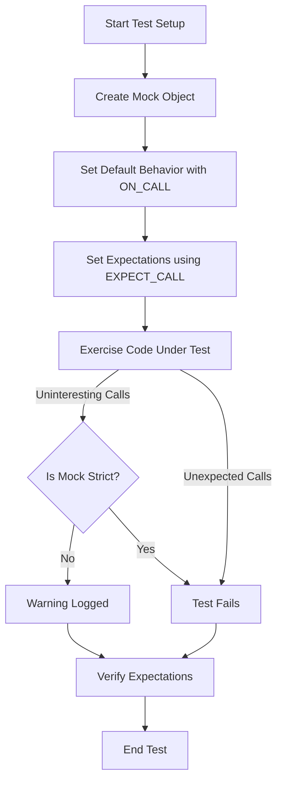

# Mocking Workflow with GoogleMock

## Workflow Overview

### Task Description

This guide walks you through modeling dependencies using mocks in GoogleMock, setting up expectations with `EXPECT_CALL`, defining default behaviors with `ON_CALL`, controlling mock object behavior, and validating interactions. It covers the entire lifecycle of mock creation, configuration, and verification, empowering you to write robust, maintainable tests that focus on interaction correctness.

### Prerequisites

- Familiarity with C++ basics
- Understanding of virtual methods and interfaces
- Basic knowledge of GoogleTest framework
- GoogleMock included and configured in your project

### Expected Outcome

By following this guide you will be able to:

- Create and configure mock classes
- Use `ON_CALL` to specify default mock behavior
- Use `EXPECT_CALL` to set expectations on mock method calls
- Control behavior of mocks between "nice," "naggy," and "strict" modes
- Validate that your code interacts correctly with mock dependencies
- Handle common pitfalls related to mock configurations

### Time Estimate

Approximately 20-30 minutes to read, understand, and apply the workflow in your tests.

### Difficulty Level

Intermediate – assumes you understand basics of GoogleTest and C++.

---

## Step-by-Step Instructions

### 1. Creating and Using Mock Classes

- **Define a Mock Class**
  - Derive from the interface or base class you want to mock.
  - Use the `MOCK_METHOD` macro inside `public:` section to mock virtual methods.

```cpp
#include <gmock/gmock.h>

class MockFoo : public Foo {
 public:
  MOCK_METHOD(void, DoThis, (), (override));
  MOCK_METHOD(int, DoThat, (bool flag), (override));
};
```

- **Using Strictness Modifiers:**
  - Wrap your mock class in `NiceMock`, `NaggyMock`, or `StrictMock` to control how uninteresting calls are handled.
    - `NiceMock<T>` suppresses warnings for uninteresting calls.
    - `NaggyMock<T>` (default) warns on uninteresting calls.
    - `StrictMock<T>` treats uninteresting calls as errors.
  - Construct wrapped mocks simply, passing constructor args if needed:

```cpp
NiceMock<MockFoo> nice_mock;
StrictMock<MockFoo> strict_mock(some_constructor_arg);
```

### 2. Setting Default Behavior with `ON_CALL`

- Use `ON_CALL` to specify default behavior for mock methods when you
  don't necessarily want to verify calls but want them to behave predictably.

```cpp
ON_CALL(mock_foo, DoThat(_))  // Match arguments with _ (wildcard)
    .WillByDefault(Return(42));  // Return 42 by default
```

- Notes:
  - `ON_CALL` does not expect or verify that the method is called.
  - Default behavior can be overridden by `EXPECT_CALL` actions.
  - Use to set up common behaviors shared across your tests.

### 3. Setting Expectations with `EXPECT_CALL`

- Use `EXPECT_CALL` to set how many times and with what arguments you expect
  a mock method to be called.

```cpp
EXPECT_CALL(mock_foo, DoThis())  // Expect DoThis to be called once
    .Times(1);

EXPECT_CALL(mock_foo, DoThat(true))  // Expect DoThat(true) any number of times
    .Times(::testing::AnyNumber())
    .WillRepeatedly(Return(7));
```

- You can combine clauses:
  - `.WillOnce(action)`: action for the first call
  - `.WillRepeatedly(action)`: action for subsequent calls
  - `.InSequence(sequences)`: enforce call order
  - `.RetiresOnSaturation()`: expectation becomes inactive after being satisfied

- Use matchers such as `_`, `Eq()`, `Gt()`, `HasSubstr()`, etc., to specify argument conditions.

### 4. Controlling Mock Call Behavior Modes

- Uninteresting calls happen when a mock method is called with no
  explicitly set expectation (`EXPECT_CALL`).
- The strictness of handling uninteresting calls depends on the wrapper:
  - `NiceMock`: silently ignores warnings
  - `NaggyMock`: warns on uninteresting calls
  - `StrictMock`: marks uninteresting calls as test failures

Choose the mode that fits your test maintenance strategy:

- Use `NiceMock` for most tests to reduce noise.
- Use `NaggyMock` during debugging or development for awareness.
- Use `StrictMock` to have strict verification only when necessary.

### 5. Verifying and Cleaning Up

- When mock objects go out of scope, GoogleMock verifies all expectations automatically.
- If mocks persist longer or are owned externally, use:

```cpp
::testing::Mock::VerifyAndClearExpectations(&mock_obj);
```

- To prevent memory leak detection warnings when deliberately leaking mocks, call:

```cpp
::testing::Mock::AllowLeak(&mock_obj);
```

### 6. Handling Complex Use Cases

- Mock methods with move-only types (e.g., `std::unique_ptr`) can be mocked normally.
- Use lambdas or custom actions in `WillOnce` or `WillRepeatedly` to generate/consume such types.
- Use sequences (`InSequence`) for ordering expectations.
- Use `.RetiresOnSaturation()` to avoid sticky expectations causing over-call failures.

---

## Examples & Code Samples

### Basic Mock Setup and Use

```cpp
#include <gmock/gmock.h>
class Foo {
 public:
  virtual ~Foo() {}
  virtual void DoThis() = 0;
  virtual int DoThat(bool flag) = 0;
};

class MockFoo : public Foo {
 public:
  MOCK_METHOD(void, DoThis, (), (override));
  MOCK_METHOD(int, DoThat, (bool flag), (override));
};

// In your test file or fixture
using ::testing::NiceMock;

TEST(FooTest, BasicExample) {
  NiceMock<MockFoo> mock_foo;

  ON_CALL(mock_foo, DoThat(_)).WillByDefault(::testing::Return(50));

  EXPECT_CALL(mock_foo, DoThis()).Times(1);

  // Exercise code
  mock_foo.DoThis();
  int result = mock_foo.DoThat(true);
  EXPECT_EQ(result, 50);
}
```

### Using StrictMock to Enforce No Uninteresting Calls

```cpp
using ::testing::StrictMock;

StrictMock<MockFoo> strict_mock_foo;

EXPECT_CALL(strict_mock_foo, DoThis()).Times(1);

strict_mock_foo.DoThis(); // OK
strict_mock_foo.DoThat(false); // Test fails: uninteresting call
```

### Sequencing Calls

```cpp
using ::testing::InSequence;

InSequence s;
EXPECT_CALL(mock_foo, DoThis());
EXPECT_CALL(mock_foo, DoThat(true));

mock_foo.DoThis();
mock_foo.DoThat(true); // Must be called after DoThis()
```

### Using WillOnce and WillRepeatedly

```cpp
EXPECT_CALL(mock_foo, DoThat(_))
    .WillOnce(::testing::Return(1))
    .WillRepeatedly(::testing::Return(2));

EXPECT_EQ(mock_foo.DoThat(true), 1);  // First call
EXPECT_EQ(mock_foo.DoThat(false), 2); // Subsequent calls
EXPECT_EQ(mock_foo.DoThat(true), 2);
```

---

## Troubleshooting & Tips

### Common Issues

- **Uninteresting call warnings:** If you receive warnings about uninteresting calls, decide if these calls should be ignored (`NiceMock`) or made strict (`StrictMock`). Alternatively, add lax expectations with `.Times(AnyNumber())` to suppress warnings.
- **Over-calling methods (Excessive call failures):** Check if your expectations are sticky (default behavior). Use `.RetiresOnSaturation()` to retire expectations after saturation.
- **Mismatched arguments:** Verify that your matchers correctly cover the argument conditions your code triggers. Use `--gmock_verbose=info` to get detailed call traces.
- **Mock destructor problems:** Ensure destructors of interfaces are virtual when mocking.
- **Default values not set:** If your mock method returns a type without a default constructor, specify a default action with `ON_CALL` or handle return explicitly.

### Best Practices

- Use `ON_CALL` for setting default mock behaviors shared across tests.
- Use `EXPECT_CALL` sparingly only to verify actual interaction requirements.
- Prefer `NiceMock` for routine tests to reduce noise.
- Use `StrictMock` judiciously to enforce strict contracts.
- Define sequences if call order is important.
- Retire expectations when appropriate.
- Always verify mocks are properly destructed or explicitly verified.

### Performance Considerations

- Avoid overusing `EXPECT_CALL` with strict argument matchers everywhere; it can cause brittle tests.
- Move mock class constructor and destructor definitions to `.cc` files to speed up compilation.

### Alternative Approaches

- Delegate calls to fakes or real objects for complex behaviors.
- Use `MockFunction` for mocking `std::function` callbacks.

---

## Next Steps & Related Content

- [Defining and Using Mock Methods](https://google.github.io/googletest/reference/mocking.md#MOCK_METHOD)
- [gMock Cookbook](https://google.github.io/googletest/gmock_cook_book.html) for deeper recipes
- [Actions Reference](https://google.github.io/googletest/reference/actions.md) to extend mock behavior
- [Matchers Reference](https://google.github.io/googletest/reference/matchers.md) to fine-tune argument verification
- [Mock Objects Lifecycle and Behaviors](https://google.github.io/googletest/concepts/core-architecture/mock-object-lifecycle.html)
- Explore [Nice, Naggy, and Strict Mocks](https://google.github.io/googletest/gmock_cook_book.html#NiceStrictNaggy) details
- Integrate mock usage with your test harness following GoogleTest integration guides

---

## Callout Highlights

<Tip>
Use `NiceMock<T>` when you want to suppress warnings on uninteresting calls for cleaner test output.
</Tip>

<Warning>
Using `StrictMock<T>` treats uninteresting calls as test errors. Use it only when you want strict interaction verification.
</Warning>

<Note>
`ON_CALL` defines default behavior without setting an expectation. Use it to avoid over-constraining tests.
</Note>

<Check>
If your mock methods return non-default-constructible types, always specify a default action or explicit return in `EXPECT_CALL`.
</Check>

---

## Summary Diagram



---