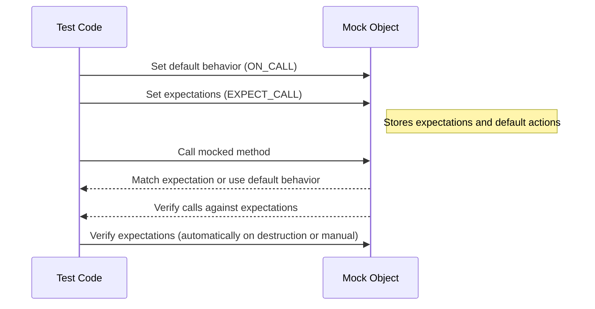

# Setting Expectations and Verifying Interactions

GoogleMock's core strength lies in its ability to set precise expectations on mock methods and verify that your code interacts with dependencies exactly as intended. This guide teaches you how to use the `ON_CALL` and `EXPECT_CALL` macros to define default behaviors and verification points, how to specify call sequences and cardinalities, and how to interpret verification results.

---

## 1. Understanding the Role of `ON_CALL` and `EXPECT_CALL`

- **`ON_CALL`**: Defines default behavior for mock methods when calls are unverified or unspecified. It does _not_ imply any expectation of how many times or in what order the method will be called.
- **`EXPECT_CALL`**: Sets actual expectations about method calls, including the arguments expected, the call count (cardinality), call order, and the action to perform on invocation.

Use `ON_CALL` to configure sane defaults allowing your tests to run smoothly without strict call verification. Use `EXPECT_CALL` when you want to assert the interaction details.

---

## 2. Setting Up Default Actions with `ON_CALL`

```cpp
ON_CALL(mock_object, Method(matchers...))
    .With(multi_argument_matcher)  // Optional
    .WillByDefault(action);        // Required
```

- The `.With()` clause restricts the behavior to calls whose arguments (as a whole) satisfy a multi-argument matcher.
- `.WillByDefault()` defines what the method returns or does.

### Example: Default returning behavior

```cpp
using ::testing::Return;
ON_CALL(my_mock, GetSize())
    .WillByDefault(Return(5));
```

This means calls to `my_mock.GetSize()` will return 5 by default unless overridden by an `EXPECT_CALL`.

---

## 3. Defining Expectations with `EXPECT_CALL`

Syntax:

```cpp
EXPECT_CALL(mock_object, Method(matchers...))
    .With(multi_argument_matcher)    // Optional, must be first clause
    .Times(cardinality)              // Optional, call count expectations
    .InSequence(sequences...)        // Optional, specify call order
    .After(expectations...)          // Optional, DAG ordering of expectations
    .WillOnce(action)                // 0 or more times
    .WillRepeatedly(action)          // Optional, specifies behavior after WillOnce
    .RetiresOnSaturation();          // Optional, retires expectation when saturated
```

### Key Points:

- Without `.Times()`, cardinality is inferred:
  - No `.WillOnce` or `.WillRepeatedly`: expect exactly 1 call.
  - N `.WillOnce` clauses + no `.WillRepeatedly`: expect exactly N calls.
  - N `.WillOnce` clauses + `.WillRepeatedly`: expect at least N calls.

- `.Times(0)` disallows the call completely.
- `.RetiresOnSaturation()` makes expectations inactive after they have been called the max number of times.

### Example: Expect exactly two calls with different return values

```cpp
EXPECT_CALL(foo, GetValue())
    .Times(2)
    .WillOnce(Return(10))
    .WillOnce(Return(20));
```

---

## 4. Orderings: Controlling Call Sequences

### 4.1 Strict Ordering with `InSequence`
Wrap multiple `EXPECT_CALL`s within `InSequence` to require calls happen in declared order:

```cpp
using ::testing::InSequence;
{
  InSequence seq;
  EXPECT_CALL(mock, FirstCall());
  EXPECT_CALL(mock, SecondCall());
}
```

Here, calls to `FirstCall()` must happen before `SecondCall()`.

### 4.2 Partial Ordering with `After` Clause

Define a Directed Acyclic Graph (DAG) of calls expressing dependencies:

```cpp
using ::testing::Expectation;
Expectation e1 = EXPECT_CALL(mock, CallA());
EXPECT_CALL(mock, CallB()).After(e1);
```

`CallB()` may only happen after `CallA()`.

You can also combine multiple expectations:

```cpp
using ::testing::ExpectationSet;
ExpectationSet all_pre;
all_pre += EXPECT_CALL(mock, Init1());
all_pre += EXPECT_CALL(mock, Init2());
EXPECT_CALL(mock, Ready()).After(all_pre);
```

### 4.3 Multiple Sequences

An expectation can belong to multiple sequences:

```cpp
Sequence s1, s2;
EXPECT_CALL(mock, Call()).InSequence(s1, s2);
```

The expectation must observe ordering constraints of all sequences it belongs to.

---

## 5. Calling Conventions and Matchers

- You can specify argument matchers in calls to restrict when an expectation matches.
- `_` matches any argument.
- Use `.With()` for complex multi-argument conditions (must appear before `.Times()`).

---

## 6. What Happens When Expectations Are Not Met?

- When a mock object is destroyed, GoogleMock verifies if all expectations have been satisfied.
- A failure triggers a googletest non-fatal failure reporting which expectation was violated.
- You can manually force verification using:

```cpp
using ::testing::Mock;
Mock::VerifyAndClearExpectations(&mock_object);
```

Useful if your mock object’s lifetime is managed externally.

---

## 7. Special Features and Tips

### 7.1 Sticky Expectations
Expectations remain active and fail if exceeded, unless `.RetiresOnSaturation()` is used.

### 7.2 Multiple Expectations on the Same Function

More recently declared expectations have priority:

```cpp
EXPECT_CALL(mock, Func(_));          // #1
EXPECT_CALL(mock, Func(42)).Times(2);  // #2
```

`Func(42)` matches #2 first; other calls match #1.

### 7.3 Uninteresting vs Unexpected Calls

- **Uninteresting calls**: No expectation set; default action will be taken; triggers **warning** unless using `NiceMock`.
- **Unexpected calls**: Arguments do not match any expectation; leads to **test failure**.

### 7.4 Suppressing Warnings
Use `NiceMock<T>` to suppress uninteresting call warnings.

### 7.5 Expectation Evaluation Order
Expected calls are searched in reverse order of declaration, allowing more specific expectations set later to override earlier more general ones.

---

## 8. Practical Examples

### Example 1: Basic `EXPECT_CALL`

```cpp
using ::testing::Return;
class MockFoo {
 public:
  MOCK_METHOD(int, GetNumber, (), ());
};

MockFoo mock;
EXPECT_CALL(mock, GetNumber()).WillOnce(Return(10));
int val = mock.GetNumber();  // val == 10
```

### Example 2: Sequential Calls with Different Returns

```cpp
EXPECT_CALL(mock, GetNumber())
    .WillOnce(Return(1))
    .WillOnce(Return(2))
    .WillRepeatedly(Return(3));

EXPECT_EQ(mock.GetNumber(), 1);
EXPECT_EQ(mock.GetNumber(), 2);
EXPECT_EQ(mock.GetNumber(), 3);
EXPECT_EQ(mock.GetNumber(), 3);
```

### Example 3: Specifying Call Order

```cpp
{
  InSequence s;
  EXPECT_CALL(mock, Start());
  EXPECT_CALL(mock, Stop());
}

mock.Start();  // Ok
mock.Stop();   // Ok
mock.Start();  // Fails: out of order
```

### Example 4: Using `After` for Partial Order

```cpp
Expectation e1 = EXPECT_CALL(mock, Initialize());
EXPECT_CALL(mock, Run()).After(e1);

mock.Initialize();  // Ok
mock.Run();         // Ok
mock.Run();         // Fails: unexpected second call
```

---

## 9. Troubleshooting

### Problem: Warning about uninteresting calls

Resolutions:
- Use `ON_CALL()` to set sensible default behavior.
- Use `NiceMock<T>` to suppress these warnings when the calls are expected but not important.
- Add an `EXPECT_CALL(...).Times(AnyNumber())` if you intend to allow calls without verification.

### Problem: Tests fail because of unexpected calls

Verify your `EXPECT_CALL` clauses match the actual arguments passed in.
Use `--gmock_verbose=info` to get detailed trace information about mock calls.

### Problem: Calls occur out-of-order

Use `InSequence` or `After()` clauses to express the intended ordering.

### Problem: Mock verifies fail prematurely

Make sure no calls are made to the mock before calling `EXPECT_CALL`.
Ensure your test does not delete mocks before all interactions are complete.

---

## 10. Next Steps

- Explore [`Matchers`](../api-reference/mocking-api/matchers-actions.md#Matchers) to write precise argument conditions.
- Learn about [`Actions`](../api-reference/mocking-api/matchers-actions.md#Actions) for advanced mock behaviors.
- See the [gMock Cookbook](gmock_cook_book.md) for recipes.
- Review [gMock for Dummies](gmock_for_dummies.md) for beginner-friendly content.

---

<Callout>
Note: Always write your expectations **before** exercising the code under test to maintain predictability and avoid undefined behavior.
</Callout>

---

## 11. Diagram: Interaction and Expectation Workflow

