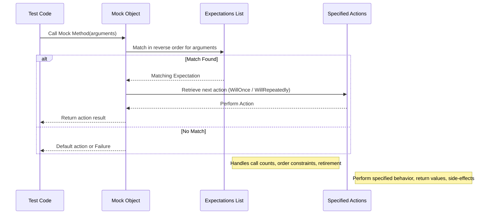

# Expectations, Actions, and Call Sequences

GoogleMock provides precise control over mock method expectations, allowing you to specify not only how a mock method should behave, but also exactly how many times, in what order, and under which conditions it should be called. This guide explains how to use `EXPECT_CALL` combined with modifiers such as call counts, sequences, and actions, enabling robust and maintainable tests for both simple and complex interactions.

---

## What This Page Covers

This page focuses strictly on the syntax and semantics of setting expectations and actions on mock methods using the `EXPECT_CALL` API, including:

- Defining expectations with `EXPECT_CALL`
- Specifying how often a mock method should be called (`Times`)
- Controlling call order using sequences (`InSequence`, `After`)
- Associating return values and behaviors with calls (`WillOnce`, `WillRepeatedly`)
- Controlling expectation lifetime with `.RetiresOnSaturation`

For related concepts such as creating mocks, matchers, or techniques to simplify expectations, see the [Mocking Reference](../reference/mocking.md) and the [gMock Cookbook](../docs/gmock_cook_book.md).

---

## 1. Overview of Mocking Expectations

When you write tests using GoogleMock, you specify expectations about how your code will interact with mock objects. The primary tool for this is the `EXPECT_CALL` macro, which declares what method calls are expected, with which arguments, how many times, and what actions to take when those calls occur.

### Key Concepts

- **Expectation:** Declaration that a mock method should be called with specified arguments.
- **Action:** Specifies what the mock method does when called (return a value, invoke a callback, etc).
- **Cardinality:** How many times the method should be called (`Times`).
- **Sequence:** Enforces call order between expectations.

### Default Behaviors

- If `EXPECT_CALL` is not used on a method, calls are considered *uninteresting* and invoke default actions if set by `ON_CALL`, or built-in defaults.
- `EXPECT_CALL` sets the expectation that the mock method *must* be called matching the specified arguments, or the test fails.

---

## 2. Setting Expectations with `EXPECT_CALL`

The general syntax for setting expectations is:

```cpp
EXPECT_CALL(mock_object, MethodName(argument_matchers...))
    .With(multi_argument_matcher)  // optional
    .Times(cardinality)            // optional
    .InSequence(sequence_objects...) // optional, multiple allowed
    .After(expectation_or_expectation_set...) // optional, multiple allowed
    .WillOnce(action)              // optional, multiple allowed
    .WillRepeatedly(action)        // optional
    .RetiresOnSaturation();        // optional
```

All clauses except `WillOnce()` are optional. Clauses must follow the order above.

### Important Usage Notes

- The argument matchers in `EXPECT_CALL` specify which calls match the expectation. Use `_` to match any argument.
- The `.With()` clause, if used, must appear first, and can be used only once per expectation.
- `.Times()` sets how many calls are expected—default is inferred.
- `.InSequence()` associates expectations to sequences, enforcing order.
- `.After()` defines prerequisites that must be satisfied before this expectation matches.
- `.WillOnce()` specifies the behavior for individual matching calls.
- `.WillRepeatedly()` specifies behavior for all additional calls after `WillOnce()`s are exhausted.
- `.RetiresOnSaturation()` disables the expectation automatically when its call count matches the cardinality.

---

## 3. Specifying Call Counts with `Times()`

The `Times()` clause tells GoogleMock how many times the method should be called matching the specified arguments.

### Accepted Cardinalities

- `AnyNumber()` — no limits on call count
- `AtLeast(n)` — at least *n* times
- `AtMost(n)` — at most *n* times
- `Between(m, n)` — between *m* and *n* times inclusive
- `Exactly(n)` or just `n` — exactly *n* times (including `0`)

### Inferred Behavior

If `Times()` is omitted, GoogleMock infers the count based on presence of actions:

- No `WillOnce` or `WillRepeatedly`: inferred `Times(1)`
- With `n` `WillOnce` calls and no `WillRepeatedly`: inferred `Times(n)`
- With `n` `WillOnce` calls and one `WillRepeatedly`: inferred `Times(AtLeast(n))`

### Usage Example

```cpp
EXPECT_CALL(foo, Bar(5))      // expects one call by default
    .Times(3);                // override to expect exactly 3 calls

EXPECT_CALL(foo, Baz(_))      
    .Times(AtLeast(1));       // expect Baz to be called at least once

EXPECT_CALL(foo, Quux())
    .Times(AnyNumber());      // expect any number of calls
```

---

## 4. Ordering Calls with Sequences

Sometimes the order of calls matters. You can enforce this using sequences.

### Using `InSequence`

Wrap related `EXPECT_CALL` statements with an `InSequence` object to declare that they must be called in the written order.

```cpp
{
  InSequence s;

  EXPECT_CALL(foo, Setup());
  EXPECT_CALL(bar, Initialize());
  EXPECT_CALL(foo, Run());
}
```

Here, `Setup` must occur before `Initialize`, which must occur before `Run`.

You can also assign expectations to explicit `Sequence` objects:

```cpp
Sequence s1, s2;

EXPECT_CALL(foo, Prepare())
    .InSequence(s1, s2);
EXPECT_CALL(bar, Start())
    .InSequence(s1);
EXPECT_CALL(baz, Finish())
    .InSequence(s2);
```

This builds a Directed Acyclic Graph (DAG) of call ordering constraints.

### Using `After` Clause

Instead of using sequences, you can specify explicit partial orders:

```cpp
Expectation e1 = EXPECT_CALL(foo, Init());
Expectation e2 = EXPECT_CALL(bar, Reset()).After(e1);
```

This enforces `Init()` before `Reset()`.

`After()` can take up to five individual `Expectation` or `ExpectationSet` parameters.

---

## 5. Specifying Actions

Actions define what happens when a mock method is called and matches an expectation.

### `WillOnce(action)`

- Specifies behavior for a **single** matching call.
- Can be chained multiple times; the *n*-th call executes the *n*-th `WillOnce` action.
- Supports move-only actions and lambdas.

### `WillRepeatedly(action)`

- Specifies behavior for **all subsequent calls** after all `WillOnce`s are used.
- Can only be specified once per expectation.

### Common Actions

- `Return(value)` — returns a copy of `value`.
- `ReturnRef(variable)` — returns a reference to `variable`.
- `Invoke(callable)` — invokes a function or lambda.
- `SetArgPointee<index>(value)` — sets value pointed to by argument `index`.
- `DoAll(action1, action2, ...)` — performs multiple actions in sequence.

### Example

```cpp
EXPECT_CALL(mock, GetValue())
    .WillOnce(Return(10))
    .WillOnce(Return(20))
    .WillRepeatedly(Return(30));

EXPECT_CALL(mock, Process(_))
    .WillOnce(Invoke([](int x) { DoSomethingWith(x); }));
```

---

## 6. Retiring Expectations with `RetiresOnSaturation()`

By default, expectations remain active even after they meet their call count.
This means that additional matching calls can cause violations.

Use `.RetiresOnSaturation()` to make the expectation inactive after its cardinality is satisfied:

```cpp
EXPECT_CALL(mock, SetValue(7))
    .Times(2)
    .RetiresOnSaturation();
```

After two calls to `SetValue(7)`, this expectation will retire, allowing other expectations to match further calls.

---

## 7. Practical Example

Consider testing a mock class `MockFoo` with a method `Bar(int x)`:

```cpp
class MockFoo {
 public:
  MOCK_METHOD(bool, Bar, (int x));
};

TEST(FooTest, CallsBarExpectedTimesInOrder) {
  MockFoo mock;

  Sequence s;

  EXPECT_CALL(mock, Bar(1))
      .InSequence(s)
      .WillOnce(Return(true))
      .RetiresOnSaturation();

  EXPECT_CALL(mock, Bar(2))
      .InSequence(s)
      .Times(2)
      .WillRepeatedly(Return(false));

  // Correct order and count
  EXPECT_TRUE(mock.Bar(1));
  EXPECT_FALSE(mock.Bar(2));
  EXPECT_FALSE(mock.Bar(2));

  // Calling Bar(1) again would fail, as expectation is retired
  // Calling Bar(2) more than twice would fail (excess call)
}
```

### Explanation

- The calls to `Bar(1)` and `Bar(2)` must occur in order.
- `Bar(1)` is called once, and then retires.
- `Bar(2)` is expected exactly twice and returns `false` each time.
- Errors will be reported if calls occur out-of-order, too few, or too many times.

---

## 8. Common Pitfalls and Tips

- **Set expectations before using mocks:** `EXPECT_CALL` must appear before the method is invoked.
- **Avoid overly strict matchers:** Use general matchers or `_` unless very specific checks are needed.
- **Beware of sticky expectations:** By default, expectations remain active after saturation unless retired explicitly.
- **Chose ordering strategies carefully:** Use sequences or `After` to avoid brittle tests.
- **Suppress uninteresting call warnings properly:** Use `NiceMock` or catch-all `EXPECT_CALL`s rather than suppress messages by adding unnecessary expectations.

<Tip>
Use sequences (`InSequence`) to enforce call order cleanly instead of relying on implicit ordering.
</Tip>

<Tip>
Use `.RetiresOnSaturation()` to allow expectations to retire, avoiding saturation errors for repeated calls.
</Tip>

---

## 9. Troubleshooting

### Unexpected Call Failures

If a mock method is called with unexpected arguments or outside the expected count or order, GoogleMock will provide detailed error messages showing:

- Which expectations were tried and why they failed
- The expected argument values and actual values
- Saturation and retirement states

Run your tests with `--gmock_verbose=info` to get detailed traces of expectations and calls to help debug mismatches.

### Uninteresting Calls

Warnings about uninteresting calls occur when a mock method is invoked without any matching expectations. Consider whether you need to add an `EXPECT_CALL` with `Times(AnyNumber())`, or wrap the mock object in `NiceMock` to suppress warnings.

### Actions Run Out

Warnings or errors occur if the number of `WillOnce()` actions is fewer than expected calls and no `WillRepeatedly()` is provided. Either provide enough actions or add a `WillRepeatedly()` clause.

### Memory Leaks Related to Mocks

Leaked mock objects cause verification failures. Use `Mock::AllowLeak(mock_object)` to suppress if intentional.

---

## 10. Next Steps & Related Content

- **Mocking Reference:** Deep dive into mocking macros and classes ([link](../reference/mocking.md))
- **gMock Cookbook:** Practical recipes and advanced usage ([link](../docs/gmock_cook_book.md))
- **Matchers Guide:** Learn how to craft argument conditions ([link](../reference/matchers.md))
- **Writing and Organizing Test Suites:** For managing complex test code ([link](/guides/core-workflows/writing-and-organizing-tests))

---

## Summary Diagram: Call Matching and Action Execution Flow


