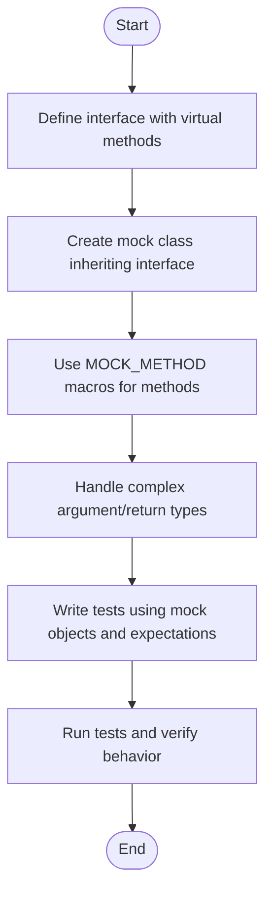

# Creating and Using Basic Mocks

A hands-on guide to defining mock classes, using the `MOCK_METHOD` macros, and substituting real dependencies in your tests. This guide covers setup and teardown patterns, practical tips, and best practices for making your tests reliable and maintainable.

---

## Workflow Overview

### Task Description
This guide teaches you how to create basic mock classes using GoogleMock's `MOCK_METHOD` macros, enabling you to substitute real dependencies with mocks in your C++ tests effectively. You'll learn how to mock virtual and non-virtual methods, handle special cases like const and overloaded methods, and structure your mocks for maintainability.

### Prerequisites
- Familiarity with C++ virtual functions and interfaces.
- A C++ project set up with GoogleTest and GoogleMock (see [Setting Up and Running Your First Test](../getting-started/setup-quickstart.md)).
- Basic knowledge of test writing in GoogleTest.

### Expected Outcome
By following this guide, you will be able to:
- Define mock classes using `MOCK_METHOD` macros.
- Mock methods with various signatures including const, noexcept, and overloaded.
- Handle arguments with special types like those containing commas.
- Use mocks in tests to verify interactions and set expectations.
- Suppress unwanted warnings using `NiceMock`, or enforce stricter behaviors with `StrictMock`.

### Time Estimate
Approximately 20-40 minutes depending on familiarity with GoogleMock.

### Difficulty Level
Intermediate — you should understand C++ mocks and virtual functions.

---

## Step-by-Step Instructions

### 1. Define a Mock Class

Mocks are normal C++ classes inheriting from the interface you want to mock. Use the `MOCK_METHOD` macro inside the `public:` section to mock each virtual method.

```cpp
#include <gmock/gmock.h>

class Foo {
public:
  virtual ~Foo() {}
  virtual int GetSize() const = 0;
  virtual void Process(int x) = 0;
};

class MockFoo : public Foo {
public:
  MOCK_METHOD(int, GetSize, (), (const, override));
  MOCK_METHOD(void, Process, (int x), (override));
};
```

#### Key Points
- The first parameter of `MOCK_METHOD` is the return type.
- The second parameter is the method name.
- The third parameter is the parenthesized argument types.
- The optional fourth parameter specifies function qualifiers like `const` or `override`.
- Always place `MOCK_METHOD`s in the `public:` section, regardless of original method visibility.

### 2. Handle Argument Types with Commas

If your method’s return type or parameters include commas (e.g., templates like `std::pair` or `std::map`), wrap the type in extra parentheses or define an alias:

```cpp
class MockFoo {
 public:
  // Using extra parentheses:
  MOCK_METHOD((std::pair<bool, int>), GetPair, ());
  MOCK_METHOD(bool, CheckMap, ((std::map<int, double>), bool));

  // Using type aliases:
  using BoolAndInt = std::pair<bool, int>;
  MOCK_METHOD(BoolAndInt, GetPair, ());
  using MapIntDouble = std::map<int, double>;
  MOCK_METHOD(bool, CheckMap, (MapIntDouble, bool));
};
```

### 3. Mocking Const, Noexcept, and Reference-Qualified Methods

Add the proper qualifiers in the fourth `MOCK_METHOD` argument:

```cpp
MOCK_METHOD(int, Foo, (), (const, override));
MOCK_METHOD(void, Bar, (), (noexcept, override));
MOCK_METHOD(void, Baz, (), (ref(&), override));
```

### 4. Mock Overloaded Methods

Mock each overload explicitly. To avoid hiding methods from the base class, use `using` declarations:

```cpp
class Foo {
 public:
  virtual int Add(int x) = 0;
  virtual int Add(int x, int y) = 0;
  virtual ~Foo() {}
};

class MockFoo : public Foo {
 public:
  using Foo::Add;  // Bring other overloads into scope

  MOCK_METHOD(int, Add, (int x), (override));
  MOCK_METHOD(int, Add, (int x, int y), (override));
};
```

### 5. Mock Non-Virtual Methods

You can create a mock class unrelated to the real class but with matching method signatures:

```cpp
class Concrete {
public:
  void DoWork();
  int GetValue() const;
};

class MockConcrete {
public:
  MOCK_METHOD(void, DoWork, ());
  MOCK_METHOD(int, GetValue, (), (const));
};
```

Use template parameters or dependency injection to select between real and mock versions.

### 6. Use NiceMock, NaggyMock, and StrictMock to Control Warning Behavior

By default, calls to mock methods without expectations generate warnings. You can change this with:

```cpp
using ::testing::NiceMock;
using ::testing::NaggyMock;
using ::testing::StrictMock;

NiceMock<MockFoo> nice_mock;     // Suppresses warnings for uninteresting calls.
NaggyMock<MockFoo> naggy_mock;   // Prints warnings (default behavior).
StrictMock<MockFoo> strict_mock; // Fails on uninteresting calls.
```

Only use these wrappers around your mock class. They accept constructor arguments for the underlying mock.

### 7. Set Default Behavior and Expectations in Tests

You can specify what a mock method should do and what calls to expect:

```cpp
using ::testing::Return;

TEST(MyTest, WorksWithMock) {
  MockFoo mock;

  ON_CALL(mock, GetSize()).WillByDefault(Return(10));  // Default behavior
  EXPECT_CALL(mock, Process(5)).Times(1);              // Expect Process(5) once

  // ... test code that calls mock.Process(5) ...
}
```

---

## Examples & Code Samples

### Basic Mock Class Example

```cpp
#include <gmock/gmock.h>

class Turtle {
 public:
  virtual ~Turtle() {}
  virtual void PenUp() = 0;
  virtual void PenDown() = 0;
  virtual void Forward(int distance) = 0;
  virtual int GetX() const = 0;
};

class MockTurtle : public Turtle {
 public:
  MOCK_METHOD(void, PenUp, (), (override));
  MOCK_METHOD(void, PenDown, (), (override));
  MOCK_METHOD(void, Forward, (int distance), (override));
  MOCK_METHOD(int, GetX, (), (const, override));
};

// Usage in a test
using ::testing::AtLeast;
using ::testing::Return;

TEST(PainterTest, DrawsCircle) {
  MockTurtle mock_turtle;

  EXPECT_CALL(mock_turtle, PenDown())
      .Times(AtLeast(1));
  ON_CALL(mock_turtle, GetX()).WillByDefault(Return(0));

  // Exercise code that uses mock_turtle
  // ...
}
```

### Mocking Overloaded Methods

```cpp
class Foo {
 public:
  virtual int Add(int a) = 0;
  virtual int Add(int a, int b) = 0;
  virtual ~Foo() {}
};

class MockFoo : public Foo {
 public:
  using Foo::Add;
  MOCK_METHOD(int, Add, (int a), (override));
  MOCK_METHOD(int, Add, (int a, int b), (override));
};
```

### Mocking Methods that Return Containers or Complex Types

Wrap complex return types with parentheses or use type aliases:

```cpp
using PairIntBool = std::pair<int, bool>;

class MockFoo {
 public:
  MOCK_METHOD((PairIntBool), GetPair, ());
};
```

### Using NiceMock to Suppress Uninteresting Call Warnings

```cpp
using ::testing::NiceMock;

NiceMock<MockFoo> nice_mock;
EXPECT_CALL(nice_mock, Process(5));
// Calls to other methods than Process(5) will NOT produce warnings
```

---

## Troubleshooting & Tips

### Common Issues
- **MOCK_METHOD Macro Won't Compile Because of Commas:** Wrap return or argument types with parentheses or use typedefs.
- **Warnings About Uninteresting Calls:** Use `NiceMock` to suppress, or add explicit `EXPECT_CALL` with `Times(AnyNumber())` to indicate allowed calls.
- **Overloaded Methods Shadowed:** Use `using BaseClass::Method;` to expose hidden overloads.
- **Unexpected Calls Fail Tests:** Review `EXPECT_CALL` matchers to ensure they cover all intended cases or add catch-all with `_` matcher.

### Best Practices
- Use `ON_CALL` to set default behaviors, minimizing `EXPECT_CALL`s to only those you want to verify strictly.
- Prefer mocking interfaces rather than concrete classes for better test maintainability.
- Use `RetiresOnSaturation()` on expectations when you want them to expire after being invoked maximum times, to avoid conflicts.
- Declare destructors as virtual in your interfaces to avoid undefined behavior.

### Performance Considerations
- Move mock class constructor and destructor definitions into .cc files to speed up compilation.

### Alternative Approaches
- For mocking free functions, refactor code to depend on interfaces and mock those.
- For mocking non-virtual methods, consider templates or separate mock classes unrelated by inheritance.

---

## Next Steps & Related Content

- Explore [Using Matchers for Flexible Expectations](../mocking-scenarios/using-matchers.md) to write flexible argument matchers.
- Learn about [Mock Strictness: Nice, Naggy, and Strict](../mocking-scenarios/mock-strictness-best-practices.md) for controlling warnings and failures on uninteresting calls.
- Advance to [Parametrized and Type-Parameterized Testing](../mocking-scenarios/parametrized-and-type-tests.md) for more complex test designs.
- Refer to the official [gMock Cookbook](https://google.github.io/googletest/gmock_cook_book.html) for extensive recipes.

---

## Additional Resources
- [GoogleMock Primer](https://google.github.io/googletest/gmock_for_dummies.html)
- [GoogleMock Cheat Sheet](https://google.github.io/googletest/gmock_cheat_sheet.html)
- [Mocking Reference](../reference/mocking.md) for detailed API specs

---

## Summary Diagram: Creating and Using a Basic Mock



---

<Tip>
Remember to always put mock method declarations in the public section, even if the original method is protected or private. This ensures GoogleMock can properly set expectations and intercept calls.
</Tip>

<Note>
For overloaded methods, mock each version and consider `using Base::Method;` to avoid hiding overloads.
</Note>

<Warning>
Do not mock non-virtual methods by making them virtual in production code unless there is a clear design need; instead, consider interfaces or templates for mocking.
</Warning>

<Info>
`NiceMock`, `NaggyMock`, and `StrictMock` help manage how GoogleMock treats calls to mock methods without explicit expectations.
</Info>

---

## Code Group: Mock Class Definitions

<CodeGroup>
```cpp
// Basic mock class
class MockFoo : public Foo {
 public:
  MOCK_METHOD(int, GetValue, (), (const, override));
  MOCK_METHOD(void, Process, (int x), (override));
};
```
```cpp
// Handling complex return types
class MockFoo {
 public:
  MOCK_METHOD((std::pair<bool, int>), GetPair, ());
  MOCK_METHOD(bool, CheckMap, ((std::map<int, double>), bool));
};
```
```cpp
// Mocking overloaded methods
class MockFoo : public Foo {
 public:
  using Foo::Add;
  MOCK_METHOD(int, Add, (int x), (override));
  MOCK_METHOD(int, Add, (int x, int y), (override));
};
```
</CodeGroup>

---

## Troubleshooting

<AccordionGroup title="Common Issues and Solutions">
<Accordion title="Compilation Fails Due to Commas in Types">
Wrap complex types containing commas with additional parentheses or define clear type aliases and use those in `MOCK_METHOD` declarations.
</Accordion>
<Accordion title="Uninteresting Call Warnings">
Suppress by wrapping mock objects with `NiceMock<>`, or explicitly define `EXPECT_CALL(mock, Method(_)).Times(AnyNumber())` for methods you expect but don't verify.
</Accordion>
<Accordion title="Overloaded Method Shadowing">
Use `using Base::Method;` to bring base class overloads into scope.
</Accordion>
<Accordion title="Unexpected Call Failures">
Check for missing or incorrect `EXPECT_CALL` statements. Add catch-all expectations to handle unverified but legitimate calls.
</Accordion>
</AccordionGroup>

---

## Best Practices & Tips

- Prefer mocking interfaces over concrete classes for better maintainability.
- Use `ON_CALL` to set default mock behavior without strict call expectations.
- Structure your `EXPECT_CALL` statements with cardinalities (`Times()`) and order (`InSequence`) for clear test intent.
- Consider using test fixtures for common mock setup and teardown.
- Use `RetiresOnSaturation()` for expectations you want to disable after reaching their call limit.

---

## Summary

Creating and Using Basic Mocks involves defining mock classes with `MOCK_METHOD` macros, covering all relevant virtual methods, handling special cases such as const and overloaded methods, and setting up expectations and default behaviors in tests. Effective use of `NiceMock`, `NaggyMock`, and `StrictMock` modifies warning and failure behaviors to suit your testing style. These practices help ensure your tests can reliably verify interactions while maintaining flexibility and clarity.

---

This guide sets the foundation for more advanced mocking techniques covered in subsequent guides on matchers, actions, and strictness modes.

---

## References

- [GoogleMock Cookbook](https://google.github.io/googletest/gmock_cook_book.html)
- [gMock For Dummies](https://google.github.io/googletest/gmock_for_dummies.html)
- [Mocking Reference](../reference/mocking.md)
- [Setting Up and Running Your First Test](../getting-started/setup-quickstart.md)
- [Using Matchers for Flexible Expectations](../mocking-scenarios/using-matchers.md)
- [Mock Strictness Best Practices](../mocking-scenarios/mock-strictness-best-practices.md)
