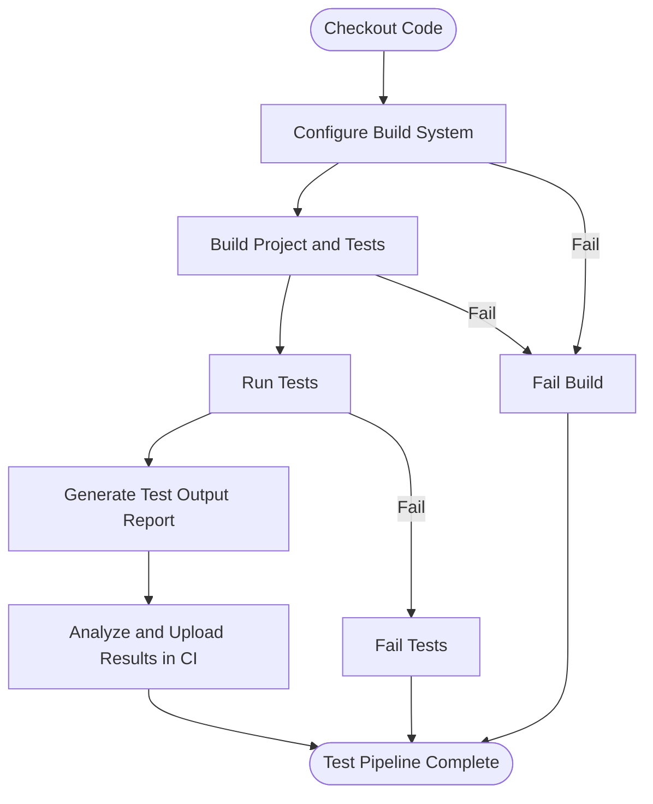

# Integration Examples with Build Systems and CI

## Overview

Integrating GoogleTest and GoogleMock into real-world projects involves configuring your build system for seamless test discovery, building, and execution within continuous integration (CI) environments. This guide walks you through practical examples using popular build systems like CMake and Bazel, and outlines best practices for establishing reliable, automated testing pipelines.

## 1. Setting Up GoogleTest and GoogleMock with CMake

CMake is widely used for C++ projects and supports GoogleTest and GoogleMock integration straightforwardly.

### 1.1 Adding GoogleTest to Your Project

The recommended approach is to add GoogleTest as a git submodule or external project:

```cmake
# Include GoogleTest using FetchContent
include(FetchContent)
FetchContent_Declare(
  googletest
  URL https://github.com/google/googletest/archive/refs/tags/release-1.12.1.zip
)
FetchContent_MakeAvailable(googletest)

# Alternatively, include the source directory directly if added as a submodule
# add_subdirectory(external/googletest)
```

### 1.2 Configuring Your Test Executable

Create a test target linking against gtest and gmock libraries:

```cmake
add_executable(MyTests
  test/foo_test.cc
  test/bar_test.cc
)

target_link_libraries(MyTests
  gtest_main
  gmock_main
  # Additional libraries your code depends on
)

target_compile_features(MyTests PUBLIC cxx_std_17)

# Enable test discovery with CTest
include(GoogleTest)
gtest_discover_tests(MyTests)
```

### 1.3 Running the Tests from CMake

This integration layers GoogleTest's test discovery into CTest. Run:

```shell
cmake --build . --target test
# or
ctest --output-on-failure
```

This runs all tests and reports failures in a format compatible with common CI consoles.

## 2. Integrating GoogleTest with Bazel

Bazel provides first-class support for GoogleTest and GoogleMock.

### 2.1 Defining Your Test Targets

A simple test rule might look like this in your `BUILD` file:

```starlark
cc_test(
    name = "my_tests",
    srcs = ["foo_test.cc", "bar_test.cc"],
    deps = [
        "@com_github_google_googletest//:gtest",
        "@com_github_google_googletest//:gmock",
        "//my_project:lib"  # Your production code libraries
    ],
)
```

### 2.2 Running Tests via Bazel

Run your tests with:

```shell
bazel test //my_project:my_tests
```

Bazel ensures isolated and hermetic testing environments, consistent with GoogleTest’s philosophies.

## 3. Continuous Integration Pipelines

Integrating GoogleTest into CI systems systematically enhances code quality.

### 3.1 Test Reporting

GoogleTest supports generating detailed reports in XML and JSON formats for CI consumption. You can enable this by passing the `--gtest_output` flag:

```shell
./MyTests --gtest_output=xml:report.xml
# or
./MyTests --gtest_output=json:report.json
```

Your CI tool can then parse these reports to display test status, coverage, and failures.

### 3.2 Typical CI Workflow

1. Checkout code
2. Configure/build your project (via CMake or Bazel)
3. Run tests, generating reports
4. Collect and analyze test reports
5. Fail the build if tests fail

Example GitHub Actions snippet for CMake:

```yaml
jobs:
  build-and-test:
    runs-on: ubuntu-latest
    steps:
    - uses: actions/checkout@v3
    - name: Configure
      run: cmake -S . -B build
    - name: Build
      run: cmake --build build
    - name: Run Tests
      run: ctest --test-dir build --output-on-failure
    - name: Archive Test Reports
      if: always()
      uses: actions/upload-artifact@v3
      with:
        name: test-reports
        path: build/test_results/*.xml
```
```

## 4. Using GoogleTest Flags in Integration

GoogleTest supports flexible run-time configuration via flags.

### 4.1 Common Useful Flags

- `--gtest_filter` to select specific tests to run.
- `--gtest_repeat` to run tests multiple times.
- `--gtest_shuffle` to run tests in random order.
- `--gtest_output` to generate XML/JSON reports.

Example running tests with specific filter and reporting:

```shell
./MyTests --gtest_filter=MyTestSuite.* --gtest_output=xml:results.xml
```

### 4.2 Automate with CI

Configure your build scripts or CI job commands to supply these flags as needed.

## 5. Real-World Examples

### 5.1 CMake Integration with GoogleMock

Suppose you have a project mixing GoogleTest and GoogleMock:

```cmake
cmake_minimum_required(VERSION 3.10)
project(MyProject LANGUAGES CXX)

include(FetchContent)
FetchContent_Declare(
  googletest
  URL https://github.com/google/googletest/archive/refs/tags/release-1.12.1.zip
)
FetchContent_MakeAvailable(googletest)

add_library(my_lib src/my_lib.cc)

add_executable(my_test test/my_lib_test.cc test/my_mock.cc)

target_link_libraries(my_test PRIVATE my_lib gtest_main gmock_main)

target_compile_features(my_test PRIVATE cxx_std_17)

include(GoogleTest)
gtest_discover_tests(my_test)
```

### 5.2 Bazel Test with Mock

In your Bazel `BUILD` file:

```starlark
cc_library(
    name = "my_lib",
    srcs = ["my_lib.cc"],
    hdrs = ["my_lib.h"],
    visibility = ["//visibility:public"],
)

cc_test(
    name = "my_lib_test",
    srcs = ["my_lib_test.cc", "my_lib_mock.cc"],
    deps = [
        "@com_github_google_googletest//:gtest",
        "@com_github_google_googletest//:gmock",
        ":my_lib",
    ],
)
```

Run tests:

```shell
bazel test //:my_lib_test
```

## 6. Best Practices for Integration

- Use `gtest_discover_tests` for automatic test collection and reporting in CMake.
- Always return the value of `RUN_ALL_TESTS()` in your test executable's main.
- Generate XML or JSON reports to enable CI test insights.
- Use environment variables or scripts in CI to configure test repetitions, filters, and verbosity.
- Ensure to build GoogleMock-linked tests with `gmock_main` for default main() setup.
- Use `StrictMock` or `NiceMock` for controlling mock strictness in integration tests.

## 7. Troubleshooting

### 7.1 Test Discovery Problems

- Ensure test executables link with GoogleTest's `gtest_main` or define `main` invoking `RUN_ALL_TESTS()`.
- Check CTest configurations and test discovery commands.

### 7.2 Reporting Issues

- Verify output paths for XML/JSON reports.
- Make sure proper permissions are granted on CI to write report files.

### 7.3 Mock Behavior Problems

- Use `--gmock_verbose=info` for detailed mock call logging.
- Use `NiceMock` to suppress uninteresting call warnings if appropriate.
- Confirm matching `EXPECT_CALL`s precede calls to mocks.

## 8. Additional Resources

Explore these references for deeper understanding and examples:

- [GoogleTest Primer](primer.md)
- [Mocking Reference](reference/mocking.md)
- [gMock for Dummies](gmock_for_dummies.md)
- [gMock Cookbook](gmock_cook_book.md)
- [CMake Documentation - GoogleTest Integration](https://cmake.org/cmake/help/latest/module/GoogleTest.html)
- [Bazel Testing Documentation](https://docs.bazel.build/versions/main/test-encyclopedia.html)


---

### Diagram: Typical Test Execution Workflow in CI


