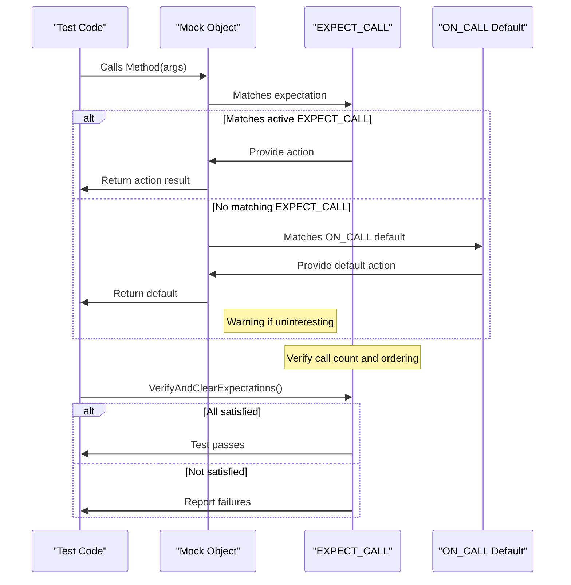

# Setting Expectations and Actions

## Overview

This guide focuses on how to express and verify behavioral expectations on mock objects using GoogleMock's `EXPECT_CALL`, `ON_CALL`, and custom actions. It helps you control how mock methods behave, specify how often they are called, enforce calling sequences, and configure default behaviors for cases not explicitly expected.

## Prerequisites

- Familiarity with GoogleMock basics, such as creating mock classes using `MOCK_METHOD`.
- Understanding of matchers to specify argument expectations.
- Basic knowledge of C++ and unit testing workflows.

## Expected Outcome

By following this guide, you will be able to:
- Define expectations with `EXPECT_CALL` to assert method call counts, arguments, and order.
- Specify default behaviors with `ON_CALL` for unverified or uninteresting calls.
- Control how many times methods are expected to be called using cardinalities.
- Define method behavior using built-in and custom actions.
- Manage call ordering and dependencies via sequences and prerequisite expectations.

## Time Estimate

About 20-30 minutes to understand and apply the basic concepts; additional time for mastering sequences and custom actions.

## Difficulty Level

Intermediate — Requires some familiarity with testing and mocking principles.

---

## 1. Understanding `EXPECT_CALL` and Behavioral Expectations

`EXPECT_CALL` is the primary macro to specify:
- Which method of a mock object is expected to be called
- With what arguments
- How many times
- In which order
- What the method should do when called

It involves chaining a set of clauses to refine the expectation:

```cpp
EXPECT_CALL(mock_object, MethodName(matchers...))
    .With(multi_argument_matcher)    // Optional, restricts based on all arguments
    .Times(cardinality)              // Optional, specifies how many calls expected
    .InSequence(sequences...)        // Optional, enforces call order
    .After(expectations...)          // Optional, enforces call order based on other expectations
    .WillOnce(action)                // Optional, defines behavior for one call
    .WillRepeatedly(action)          // Optional, defines behavior for all subsequent calls
    .RetiresOnSaturation();          // Optional, retires expectation once saturated
```

### Key Points
- **Match arguments**: Use matchers (like `_`, `Eq()`, `Ge()`) to specify argument constraints.
- **Chainable clauses**: Order matters; `With()` must be first if used, `Times()` can appear once, sequences and `After` must be before actions.
- **Cardinalities**: `Times()` accepts a number or special specifiers like `AtLeast(n)`, `AnyNumber()`.

### Example
```cpp
using ::testing::_;
using ::testing::Return;
using ::testing::Exactly;

EXPECT_CALL(my_mock, GetCount(42))
    .Times(Exactly(3))
    .WillRepeatedly(Return(100));

// This expects GetCount called exactly 3 times with argument 42,
// returning 100 each time.
```

## 2. Setting Default Behavior with `ON_CALL`

`ON_CALL` specifies the default **behavior** of a mock method for calls that match specified arguments but are **not expected** (i.e., no `EXPECT_CALL` matches them). It is used to avoid specifying behavior repeatedly for common cases.

```cpp
ON_CALL(mock_object, MethodName(matchers...))
    .With(multi_argument_matcher)  // Optional
    .WillByDefault(action);        // Mandatory
```

- Does **not** set an expectation: calls matching `ON_CALL` are not verified for occurrence.
- Used to specify fallback or usual behavior.
- You must specify exactly one `.WillByDefault()`.

### Example
```cpp
using ::testing::Return;
using ::testing::_;

ON_CALL(my_mock, Calculate(_))
    .WillByDefault(Return(42));

// All Calculate calls that do not match an EXPECT_CALL will return 42.
```

## 3. Cardinalities: Controlling Call Counts with `Times()`

The `.Times()` clause in `EXPECT_CALL` indicates how many times a method is expected to be called. The cardinality can be exact or fuzzy:

| Cardinality         | Description                                   |
|---------------------|-----------------------------------------------|
| `Exactly(n)` or `n` | Must be called exactly n times.                |
| `AtLeast(n)`        | Must be called at least n times.               |
| `AtMost(n)`         | Must be called at most n times.                |
| `Between(m, n)`     | Must be called between m and n times inclusive. |
| `AnyNumber()`       | May be called any number of times (including zero). |

If `Times()` is omitted, gMock infers it based on the usage of `WillOnce` and `WillRepeatedly`:
- No `WillOnce` or `WillRepeatedly`: assumes `Times(1)`.
- `n` `WillOnce` and no `WillRepeatedly`: assumes `Times(n)`.
- `n` `WillOnce` and one `WillRepeatedly`: assumes `Times(AtLeast(n))`.

### Preventing unexpected calls

- Use `.Times(0)` on a method call to disallow it.
- If a call is made more times than expected, GoogleMock generates an error.

### Example
```cpp
EXPECT_CALL(mock, Foo(_))
    .Times(AtLeast(1));

EXPECT_CALL(mock, Bar(5))
    .Times(0);  // Bar(5) should never be called.
```

## 4. Actions: Specifying Method Behavior

Actions define what the mock method does when called. They can return values, modify arguments, invoke callbacks, or perform custom logic.

### Common actions

| Action                      | Description                                           |
|----------------------------|-------------------------------------------------------|
| `Return(value)`            | Return the specified value.                            |
| `ReturnRef(variable)`      | Return a reference to a variable.                      |
| `ReturnPointee(ptr)`       | Return the value pointed by a pointer.                 |
| `Invoke(func)`             | Call a function, method, or functor.                   |
| `InvokeWithoutArgs(func)`  | Call a function or functor without passing arguments. |
| `Throw(exception)`         | Throw an exception.                                    |
| `DoAll(actions...)`        | Perform multiple actions sequentially, returning the value of the last. |
| `SetArgPointee<N>(value)` | Set the value of the Nth pointer argument's pointee.  |
| `SaveArg<N>(pointer)`      | Save the value of the Nth argument to a pointer.      |

Actions are specified on `EXPECT_CALL` via `.WillOnce()` and `.WillRepeatedly()`, or on `ON_CALL` via `.WillByDefault()`.

- `.WillOnce()` clauses specify behavior for single calls.
- `.WillRepeatedly()` applies after `.WillOnce()` clauses are exhausted.
- `DoDefault()` means to perform the default action specified via `ON_CALL` or the built-in default.

### Example
```cpp
using ::testing::Return;
EXPECT_CALL(mock, GetValue())
    .WillOnce(Return(10))
    .WillOnce(Return(20))
    .WillRepeatedly(Return(30));

// First call returns 10, second 20, others 30.
```

## 5. Call Ordering and Sequences

gMock allows you to specify partial or complete orderings among expectations.

### `InSequence` class

Wrap `EXPECT_CALL`s inside an `InSequence` scope to enforce strict sequential ordering:

```cpp
{
  InSequence s;
  EXPECT_CALL(mock, FirstCall());
  EXPECT_CALL(mock, SecondCall());
}
```

Calls must occur in the declared order.

### Using `Sequence` objects and `.InSequence()` clause

More flexible: declare `Sequence` objects and attach expectations to them.

```cpp
Sequence seq1, seq2;
EXPECT_CALL(mock, A()).InSequence(seq1, seq2);
EXPECT_CALL(mock, B()).InSequence(seq1);
EXPECT_CALL(mock, C()).InSequence(seq2);
```

This declares that:
- `A()` must be called before `B()` and `C()`
- `B()` and `C()` can occur in any order relative to each other

### `.After()` clause

Specify that one expectation depends on other expectations being satisfied:

```cpp
Expectation e1 = EXPECT_CALL(mock, Init());
EXPECT_CALL(mock, Run()).After(e1);
```

Call to `Run()` must occur after `Init()`.

### Retiring Expectations

By default, expectations remain "active" (sticky) even after their call count is reached. Use `.RetiresOnSaturation()` to retire an expectation immediately when it saturates, making the next matching expectation applicable.

Example:
```cpp
EXPECT_CALL(mock, SetValue(7))
    .Times(2)
    .RetiresOnSaturation();
EXPECT_CALL(mock, SetValue(_))
    .Times(AnyNumber());

// The first two calls with 7 match the first expectation, which retires after the second call.
// Subsequent calls (including to 7) will match the second expectation.
```

## 6. Common Pitfalls and Best Practices

### Do not over-specify expectations

Use `ON_CALL` to specify default behavior for calls you don't want to verify strictly; use `EXPECT_CALL` only when verifying actual method calls.

### Order matters in multiple expectations

The last matching `EXPECT_CALL` takes precedence. Place more specific expectations after general ones.

### Always specify `WillByDefault()` for `ON_CALL`

Omitting `.WillByDefault()` leads to runtime errors.

### `With()` clause can be used only once and must be first

### Avoid setting expectations after the mock is used

All expectations must be set **before** exercising code that calls mock methods.

### Use `RetiresOnSaturation()` to avoid sticky expectations

When you want sequential `WillOnce()` behavior without errors due to saturation.

### Use sequences or `.After()` clauses for ordering

Choose based on your ordering requirements.

### Be mindful of default actions in absence of expectations

Uninteresting calls perform default actions but may emit warnings.

## 7. Troubleshooting

- **Unexpected call errors:** Verify you have an appropriate `EXPECT_CALL` covering the call.
- **Too many/few actions warnings:** Check `.WillOnce()` and `.WillRepeatedly()` match the `Times()` specification.
- **Sticky expectation failures:** Use `.RetiresOnSaturation()` for sequential exclusive expectations.
- **Uninteresting call warnings:** Either add an `EXPECT_CALL` with `.Times(AnyNumber())` or use `NiceMock` to suppress.
- **Ordering violations:** Use `InSequence` or `After` clauses correctly.

## 8. Examples

### Basic Expectation With Return Value
```cpp
using ::testing::Return;

class MockFoo {
 public:
  MOCK_METHOD(int, GetValue, (int id), ());
};

MockFoo mock;
EXPECT_CALL(mock, GetValue(5))
    .Times(2)
    .WillRepeatedly(Return(10));

mock.GetValue(5); // returns 10
mock.GetValue(5); // returns 10
```

### Setting Default Behavior With `ON_CALL`
```cpp
ON_CALL(mock, GetValue(_))
    .WillByDefault(Return(0));

// Calls to GetValue() with any argument not matching an EXPECT_CALL return 0.
```

### Using a Sequence
```cpp
using ::testing::InSequence;

{
  InSequence seq;
  EXPECT_CALL(mock, Foo(1));
  EXPECT_CALL(mock, Foo(2));
}

mock.Foo(1); // OK
mock.Foo(2); // OK
mock.Foo(1); // Fails - out of order
```

### Using `.After()`
```cpp
auto e1 = EXPECT_CALL(mock, Initialize());
EXPECT_CALL(mock, Run()).After(e1);

mock.Initialize(); // OK
mock.Run();        // OK
mock.Run();        // Fails if called before Initialize()
```

### Retiring on Saturation
```cpp
EXPECT_CALL(mock, Process(3))
    .Times(1)
    .RetiresOnSaturation();
EXPECT_CALL(mock, Process(_))
    .Times(AnyNumber());

mock.Process(3); // matches first expectation
mock.Process(3); // matches second expectation
```

---

## References

- [EXPECT_CALL - Mocking Reference](../reference/mocking.md#EXPECT_CALL)
- [ON_CALL - Mocking Reference](../reference/mocking.md#ON_CALL)
- [Actions Reference](../reference/actions.md)
- [gMock Cookbook - Setting Expectations and Actions](../gmock_cook_book.md#SettingExpectations)
- [Understanding Uninteresting vs Unexpected Calls](../gmock_cook_book.md#uninteresting-vs-unexpected)

---

### Mermaid Diagram: Expectation Workflow


