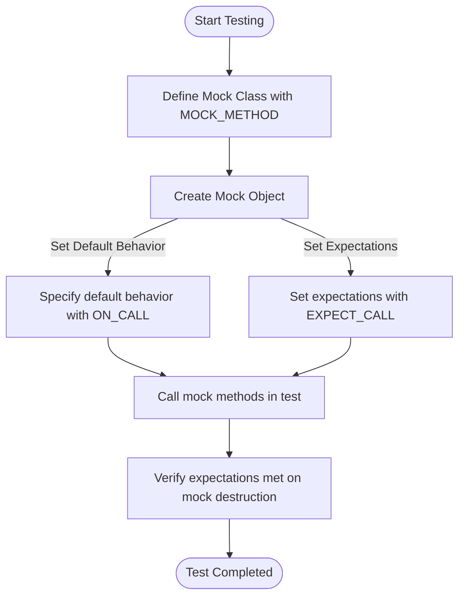

# Creating Mock Classes and Setting Expectations

A practical introduction to defining mock classes and interfaces, applying the core mocking macros (`MOCK_METHOD`), and establishing expectations with `ON_CALL` and `EXPECT_CALL`. Learn how to simulate different behaviors and capture interaction patterns effectively.

---

## Overview

Mocking is a cornerstone of behavior-driven testing in C++. This guide focuses on the GoogleMock framework's approach to:

- Defining **mock classes** and methods
- Setting **default behaviors** with `ON_CALL`
- Setting **expectations** with `EXPECT_CALL`
- Applying mocking macros such as `MOCK_METHOD`

By following this guide, you'll gain a hands-on understanding of how to effectively mimic class behavior to validate interactions and outcomes in your tests.

---

## Prerequisites

- Basic familiarity with C++ and unit testing.
- Understanding of virtual methods and interfaces in C++.
- GoogleMock is installed and integrated into your test project (see [Installing GoogleTest and GoogleMock](https://github.com/google/googletest)).
- Include `<gmock/gmock.h>` in your test files to access mocking functionalities.

---

## What You Will Achieve

- Mock classes with virtual methods, including handling overloads and templates.
- Define mock method behaviors and expectations.
- Understand how to customize default responses and verify call patterns.
- Learn best practices and common scenarios for setting up mocks.

---

## Time Estimate

Approximately 20-30 minutes for a basic mock class and simple expectations.

---

## Difficulty Level

Intermediate developer comfortable with C++ and unit tests.

---

# Step-by-Step Guide

### 1. Defining a Mock Class

At the heart of mocking is a mock class—a class that inherits from the original interface or class, overriding its virtual methods with mock implementations.

Use the `MOCK_METHOD` macro to declare mock methods in the `public:` section of your mock class.

Example: Mocking a Normal Class

```cpp
#include <gmock/gmock.h>

class Foo {
 public:
  virtual ~Foo();
  virtual int GetSize() const = 0;
  virtual std::string Describe(const char* name) = 0;
  virtual std::string Describe(int type) = 0;
  virtual bool Process(Bar elem, int count) = 0;
};

class MockFoo : public Foo {
 public:
  MOCK_METHOD(int, GetSize, (), (const, override));
  MOCK_METHOD(std::string, Describe, (const char* name), (override));
  MOCK_METHOD(std::string, Describe, (int type), (override));
  MOCK_METHOD(bool, Process, (Bar elem, int count), (override));
};
```

#### Key Points:

- The destructor in the base class should be virtual.
- Use `(override)` qualifier when mocking virtual methods.
- For `const` virtual methods, add `(const, override)`.
- Mock methods must be declared in the `public:` section.

---

### 2. Handling Special Cases in Mock Definitions

#### Mocking Class Templates

Mock class templates similarly to classes:

```cpp
template <typename Elem>
class StackInterface {
 public:
  virtual ~StackInterface();
  virtual int GetSize() const = 0;
  virtual void Push(const Elem& x) = 0;
};

template <typename Elem>
class MockStack : public StackInterface<Elem> {
 public:
  MOCK_METHOD(int, GetSize, (), (const, override));
  MOCK_METHOD(void, Push, (const Elem& x), (override));
};
```

#### Dealing with Commas in Types

Unprotected commas break `MOCK_METHOD` parsing. Solutions:

- Wrap complex types in parentheses:

```cpp
MOCK_METHOD((std::pair<bool, int>), GetPair, ());
MOCK_METHOD(bool, CheckMap, ((std::map<int, double>), bool));
```

- Use type aliases:

```cpp
using BoolAndInt = std::pair<bool, int>;
MOCK_METHOD(BoolAndInt, GetPair, ());
```

---

### 3. Creating Mock Objects with Different Strictness Levels

GoogleMock allows creating mock objects with different strictness to control how uninteresting calls are treated:

```cpp
using ::testing::NiceMock;
using ::testing::NaggyMock;
using ::testing::StrictMock;

NiceMock<MockFoo> nice_foo;      // Suppresses warnings on uninteresting calls.
NaggyMock<MockFoo> naggy_foo;    // Default; warns on uninteresting calls.
StrictMock<MockFoo> strict_foo;  // Fails on uninteresting calls.
```

Choose the strictness based on your test's tolerance for unexpected calls.

---

### 4. Setting Default Behaviors with `ON_CALL`

`ON_CALL` is used to specify what should happen when mock methods are called, without setting expectations on call counts.

Example:

```cpp
ON_CALL(mock_foo, GetSize())
    .WillByDefault(Return(1));
```

Key points:

- Only sets behavior, not call expectations.
- Use `.With(multi_arg_matcher)` optionally for complex argument matching.
- `.WillByDefault(action)` is mandatory and must appear once.

---

### 5. Setting Expectations with `EXPECT_CALL`

`EXPECT_CALL` sets the expectation that a mock method will be called with arguments matching specified matchers and defines the behavior.

Basic syntax:

```cpp
EXPECT_CALL(mock_foo, Method(matchers))
    .Times(cardinality)
    .WillOnce(action)
    .WillRepeatedly(action);
```

Example:

```cpp
EXPECT_CALL(mock_foo, Describe(5))
    .Times(3)
    .WillRepeatedly(Return("Category 5"));
```

Important modifiers include:

- `.With(matcher)` to match arguments as a tuple.
- `.Times()` to specify call counts or ranges.
- `.InSequence()` and `.After()` to specify call order.
- `.WillOnce()` and `.WillRepeatedly()` to specify actions.
- `.RetiresOnSaturation()` to retire expectation after its count is met.

---

### 6. Typical Workflow Example

```cpp
using ::testing::Return;

TEST(BarTest, DoesThis) {
  MockFoo foo;

  // Set default action
  ON_CALL(foo, GetSize())
      .WillByDefault(Return(1));

  // Set expectation with specific behavior and call count
  EXPECT_CALL(foo, Describe(5))
      .Times(3)
      .WillRepeatedly(Return("Category 5"));

  EXPECT_EQ(MyProductionFunction(&foo), "good");
}
```

This test example:

- Defines default return for `GetSize()`.
- Expects `Describe(5)` exactly 3 times, returning a specified string.
- Calls production code using the mock.

---

### 7. Inferring Cardinalities

If `.Times()` is omitted, GoogleMock infers the call count expectation based on the presence of `.WillOnce()` or `.WillRepeatedly()`:

- No `.WillOnce()` and `.WillRepeatedly()`: defaults to `Times(1)`.
- *n* `.WillOnce()` clauses, no `.WillRepeatedly()`: equals `Times(n)`.
- *n* `.WillOnce()` clauses and one `.WillRepeatedly()`: equals `Times(AtLeast(n))`.

---

### 8. Using Matchers

Matchers specify argument constraints. Common usage:

- Use `_` to accept any argument.
- Use value like `5` to expect exact match.
- Use built-in matchers like `Gt(5)`, `NotNull()`, etc.

Example:

```cpp
EXPECT_CALL(mock_foo, Process(Gt(10), _))
    .WillOnce(Return(true));
```

---

### 9. Mock Method Overloads and Constness

To mock overloaded or const methods, use `MOCK_METHOD` with the proper qualifiers:

```cpp
MOCK_METHOD(ReturnType, MethodName, (Args...), (const, override));
```

Disambiguate overloads with helpers like `Const(mock_obj)` when setting expectations.

---

### 10. Verification and Clearing Mocks

GoogleMock automatically verifies that all expectations have been met upon mock destruction.

To verify and clear expectations manually:

```cpp
Mock::VerifyAndClearExpectations(&mock_obj);
Mock::VerifyAndClear(&mock_obj);
```

Call these before mock destruction if you want explicit verification in test code.

Avoid setting new expectations after verifying and clearing.

---

## Troubleshooting & Tips

### Common Issues

- **Uninteresting call warnings**: Use `NiceMock` to silence, or add broad `EXPECT_CALL(mock, Method(_)).Times(AnyNumber())`.
- **Order failures**: Use `InSequence` or `After` to specify call ordering.
- **Ambiguous overloads**: Provide full argument lists in expectations.
- **Missing `virtual` destructors**: Ensure interfaces have virtual destructors to avoid leaks or undefined behavior.
- **Move-only types**: Use lambdas or functors for actions instead of `Return`.

### Best Practices

- Use `ON_CALL` to specify common default behaviors, keeping expectations focused.
- Write expectations as concisely as possible.
- Use `NiceMock` during test development to reduce noise, `StrictMock` for final enforceable tests.
- Always specify `Times()` where precise call counts matter.
- Organize sequences and partial orders with `Sequence` and `After` for complex test scenarios.

### Performance Considerations

- Move complex mock class constructors/destructors to `.cc` files to speed up compilation.

---

## Next Steps & Related Content

- Explore `Responding with Actions and Advanced Matchers` to expand mocking abilities.
- Learn about strictness levels in [Mock Strictness: Nice, Naggy, and Strict Mocks](https://github.com/google/googletest/tree/main/docs/gmock_cook_book.md#NiceStrictNaggy).
- Dive deeper into mock expectations with the [Mocking Reference](https://github.com/google/googletest/blob/main/docs/reference/mocking.md#EXPECT_CALL).
- Understand matchers and actions in [Matchers Reference](https://github.com/google/googletest/blob/main/docs/reference/matchers.md) and [Actions](https://github.com/google/googletest/blob/main/docs/reference/actions.md).
- See real-world examples in the [gMock Cookbook](https://github.com/google/googletest/blob/main/docs/gmock_cook_book.md).

---

## Practical Tips Summary

- Always mock virtual methods in the `public:` section.
- Use the latest `MOCK_METHOD` macro syntax.
- Set default behaviors with `ON_CALL` and test-specific expectations with `EXPECT_CALL`.
- Use matchers to specify argument constraints clearly.
- Remember expectations override default actions.
- Use `NiceMock`, `NaggyMock`, or `StrictMock` to control uninteresting call behavior.
- Verify mock expectations before or at destruction.

---

## Glossary

- **Mock Class**: A test double class that mimics an interface for testing purposes.
- **MOCK_METHOD**: A macro that declares a mocked method inside mock classes.
- **ON_CALL**: Defines default behavior for mock methods without expectation.
- **EXPECT_CALL**: Sets both expectation on calls and their behaviors.
- **Matcher**: A construct that checks the validity of arguments.
- **Action**: The behavior a mock method executes when called.
- **Cardinality**: The number or range of expected calls.
- **Sequence / InSequence**: Tooling to impose order on call expectations.

---

For full API details, see the [Mocking Reference](https://github.com/google/googletest/blob/main/docs/reference/mocking.md) and related guides.

---

# Example: Mocking and Setting Expectations

```cpp
#include <gmock/gmock.h>
#include <gtest/gtest.h>

class Foo {
 public:
  virtual ~Foo() {}
  virtual int GetSize() const = 0;
  virtual std::string Describe(int type) = 0;
};

class MockFoo : public Foo {
 public:
  MOCK_METHOD(int, GetSize, (), (const, override));
  MOCK_METHOD(std::string, Describe, (int type), (override));
};

TEST(FooTest, Example) {
  MockFoo foo;

  ON_CALL(foo, GetSize())
      .WillByDefault(::testing::Return(10));

  EXPECT_CALL(foo, Describe(5))
      .Times(2)
      .WillRepeatedly(::testing::Return("Type 5"));

  EXPECT_EQ(foo.GetSize(), 10);
  EXPECT_EQ(foo.Describe(5), "Type 5");
  EXPECT_EQ(foo.Describe(5), "Type 5");
}
```

This test defines a mock class `MockFoo` that overrides two virtual methods, setting a default return value for `GetSize()` and expecting `Describe(5)` to be called twice with a predefined return.

---

# Troubleshooting Common Mocking Issues

<AccordionGroup title="Common Problems and Solutions">
<Accordion title="Uninteresting Mock Function Call Warning">
When you see warnings about uninteresting calls:

- Use `NiceMock` to suppress where appropriate.
- Add a catch-all expectation with `EXPECT_CALL(mock, Method(_)).Times(AnyNumber())`.
- Avoid suppressing warnings by unnecessary `EXPECT_CALL`s, which complicate tests.

</Accordion>
<Accordion title="Ambiguous Overloaded Methods">
Always specify full argument lists in `EXPECT_CALL` or `ON_CALL` to disambiguate overloaded methods.

Use `Const(mock_object)` when mocking const overloads.

</Accordion>
<Accordion title="Call Order Failures">
Use `InSequence` blocks or `.InSequence(sequence_object)` to enforce call order.

Use `.After()` clauses to specify partial order dependencies between expectations.

</Accordion>
<Accordion title="Mocking Move-Only Types">
Use lambdas or custom functors for actions when mocking methods with move-only arguments or return types.

Avoid `Return(std::move(...))` repeatedly because values can only be moved once.

</Accordion>
</AccordionGroup>

---

# Additional Resources

- [GoogleMock Cook Book](https://google.github.io/googletest/gmock_cook_book.html)
- [Matchers Reference](https://google.github.io/googletest/reference/matchers.html)
- [Actions Reference](https://google.github.io/googletest/reference/actions.html)
- [GoogleMock FAQ](https://google.github.io/googletest/gmock_faq.html)

These resources provide detailed examples and advanced usage patterns beyond the scope of this introductory guide.

---

# Diagram: Mocking and Expectation Workflow



---
