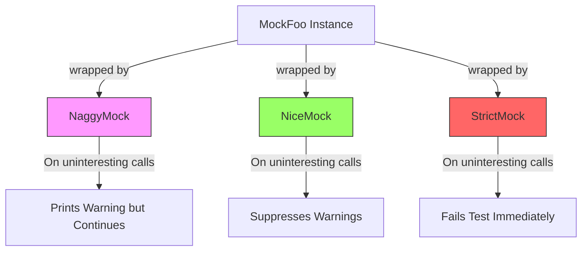

# Nice, Naggy, and Strict Mocks

GoogleMock provides three distinct mock-object strictness levels, allowing you to tailor uninteresting call handling based on your testing needs. This page explains each: `NiceMock`, `NaggyMock`, and `StrictMock`, highlighting their behaviors, use cases, and how to apply them effectively in your tests to balance coverage, readability, and test maintenance.

---

## Understanding Uninteresting Calls and Mock Strictness

An **uninteresting call** is a call made to a mock method for which there is *no* `EXPECT_CALL` set — in short, calls to methods the test does not explicitly specify expectations for. By default, GoogleMock treats such calls as follows:

- The call invokes the method's default action (which may be returning a default or factory-supplied value).
- A warning is issued to inform you about the uninteresting call (but the test does *not* fail).

GoogleMock offers three mock wrappers that modify this default behavior:

| Mock Type     | Behavior on Uninteresting Calls                       | Use Case                                   |
|---------------|------------------------------------------------------|--------------------------------------------|
| `NiceMock<T>` | Suppresses warnings about uninteresting calls. Calls proceed silently. | When uninteresting calls are expected and benign, keeping test output clean. |
| `NaggyMock<T>` (default) | Prints warnings on uninteresting calls but does *not* fail the test. | When you want to be notified about possibly unintended calls during test development or debugging. |
| `StrictMock<T>` | Treats uninteresting calls as test failures. Stops the test with a failure on such calls. | When you want to enforce tight control, requiring explicit expectations on *all* mock method calls. |


<Tip>
By default, mock objects behave like `NaggyMock`, printing warnings on uninteresting calls. However, it is recommended to use `NiceMock` in most cases to reduce noisy output and increase test maintainability.
</Tip>

---

## How to Use NiceMock, NaggyMock, and StrictMock

Say you have a mock class `MockFoo`:

```cpp
class MockFoo {
 public:
  MOCK_METHOD(void, DoThis, (), ());
  MOCK_METHOD(int, DoThat, (bool flag), ());
};
```

Here is how each strictness wrapper would be applied:

```cpp
using ::testing::NiceMock;
using ::testing::NaggyMock;
using ::testing::StrictMock;

// Nice mock: suppresses warnings for uninteresting calls
NiceMock<MockFoo> nice_foo;

// Naggy mock: prints warnings (default behavior)
NaggyMock<MockFoo> naggy_foo;

// Strict mock: fails test on uninteresting calls
StrictMock<MockFoo> strict_foo;
```

All three act as subclasses of `MockFoo`, so you can use them wherever `MockFoo` is expected. They also forward constructors, so you can pass constructor arguments as usual.

---

## Step-by-Step Workflow: Choosing and Applying Mock Strictness

<Steps>
<Step title="Define your mock class">
Create your mock class using `MOCK_METHOD` macros as usual.
</Step>
<Step title="Decide mock strictness level">
Choose the right strictness wrapper based on your test scenario:

- Use `NiceMock` when uninteresting calls should be silently ignored.
- Use `NaggyMock` if you want warnings about uninteresting calls but don't want failures.
- Use `StrictMock` to catch unexpected uninteresting calls as test failures.
</Step>
<Step title="Instantiate the strictness wrapper">
Wrap your mock class when declaring mock objects:

```cpp
NiceMock<MockFoo> my_mock(ctor_args...);
```

This preserves the base class interface but modifies uninteresting call behavior.
</Step>
<Step title="Write EXPECT_CALL and ON_CALL as usual">
Define your explicit expectations with `EXPECT_CALL` and default behaviors with `ON_CALL`.
</Step>
<Step title="Run tests and interpret results">
- With `NaggyMock`: warnings appear for uninteresting calls.
- With `NiceMock`: no warnings for uninteresting calls.
- With `StrictMock`: uninteresting calls cause errors and test to fail.
</Step>
</Steps>

<Check>
Ensure your mock class has a virtual destructor for proper working with strictness modifiers.
</Check>

---

## Detailed Behavior Illustrations and Use Cases

### 1. NiceMock

- **Behavior:** Completely suppresses warnings for any uninteresting calls.
- **Typical Usage:** When you expect many calls to mocks without explicit expectations (e.g., irrelevant or low-priority interactions).

```cpp
NiceMock<MockFoo> nice_foo;
EXPECT_CALL(nice_foo, DoThis());
nice_foo.DoThis();  // Allowed
nice_foo.DoThat(true);  // No warning
```


### 2. NaggyMock

- **Behavior:** Prints warnings for uninteresting calls but allows test to continue.
- **Typical Usage:** When you want visibility on unexpected but tolerated calls during development or debugging.

```cpp
NaggyMock<MockFoo> naggy_foo;
EXPECT_CALL(naggy_foo, DoThis());
naggy_foo.DoThis();  // Allowed
naggy_foo.DoThat(true);  // Warning about uninteresting call
```


### 3. StrictMock

- **Behavior:** Fails the test on any uninteresting call, enforcing exhaustive testing.

```cpp
StrictMock<MockFoo> strict_foo;
EXPECT_CALL(strict_foo, DoThis());
nonfatal_failure({ strict_foo.DoThat(true); }, "Uninteresting mock function call");
```


<Tip>
Use `StrictMock` to catch unintended interactions early, but beware that this can make tests brittle and require updating expectations frequently.
</Tip>

---

## Important Considerations

- The strictness wrappers only affect **uninteresting calls**, i.e., calls to mock functions without any `EXPECT_CALL`. They do **not** change how unexpected calls (calls that don't match any expectation) are handled—they *always* generate errors.

- Wrapping mock classes with multiple strictness modifiers is **not supported** (e.g., you cannot nest `NiceMock<StrictMock<MockFoo>>`).

- The mock class should define its mock methods using `MOCK_METHOD` macros directly to be correctly influenced by these wrappers.

- If your mock class lacks a virtual destructor, behavior may be undefined.

- Default mock behavior is currently naggy but may change to nice in future releases.

---

## Practical Examples

```cpp
#include <gmock/gmock.h>
using ::testing::NiceMock;
using ::testing::NaggyMock;
using ::testing::StrictMock;

class MockFoo {
 public:
  MOCK_METHOD(void, DoThis, (), ());
  MOCK_METHOD(int, DoThat, (bool flag), ());
};

TEST(FooTest, UsingNiceMock) {
  NiceMock<MockFoo> mock;
  EXPECT_CALL(mock, DoThis());

  mock.DoThis();      // Passes
  mock.DoThat(true);  // No warning or failure
}

TEST(FooTest, UsingNaggyMock) {
  NaggyMock<MockFoo> mock;
  EXPECT_CALL(mock, DoThis());

  mock.DoThis();      // Passes
  mock.DoThat(true);  // Warning printed
}

TEST(FooTest, UsingStrictMock) {
  StrictMock<MockFoo> mock;
  EXPECT_CALL(mock, DoThis());

  mock.DoThis();      // Passes

  // The following uninteresting call fails the test:
  EXPECT_NONFATAL_FAILURE(mock.DoThat(true), "Uninteresting mock function call");
}
```

---

## Troubleshooting Common Issues

<AccordionGroup title="Troubleshooting">
<Accordion title="My NiceMock or StrictMock does not suppress or fail on uninteresting calls as expected.">
Ensure the mock methods are declared via `MOCK_METHOD` directly in the mock class (not inherited). Also verify your mock class has a virtual destructor.
</Accordion>
<Accordion title="Can I combine NiceMock and StrictMock modifiers?">
Nesting `NiceMock`, `NaggyMock`, and `StrictMock` wrappers is not supported and may cause undefined behavior. Use only one strictness wrapper per mock instance.
</Accordion>
<Accordion title="Why am I still getting warnings on uninteresting calls with NiceMock?">
If some mock methods are inherited or your mock class lacks a virtual destructor, these warnings may still occur. Refactor your mock to define methods directly and add a virtual destructor.
</Accordion>
</AccordionGroup>

---

## Best Practices & Recommendations

- Prefer `NiceMock` in most tests to avoid noise and reduce brittle warnings.
- Use `NaggyMock` during test development or debugging to get notified about accidental uninteresting calls.
- Apply `StrictMock` sparingly, only when you want to enforce rigid contract verification.
- Always pair expectations (`EXPECT_CALL`) with relevant mock method calls to avoid unintentional uninteresting calls.
- For methods you don't want to ignore silently, add explicit expectations with `.Times(AnyNumber())`.

---

## Next Steps & Related Content

- Learn how to **Create and Use Mock Objects** in the [Creating Mocks](guides/mocking-techniques/creating-mocks.mdx) guide.
- Master setting detailed behavioral expectations in the [Expectations and Actions](guides/mocking-techniques/expectations-and-actions.mdx) guide.
- Deepen your understanding of argument matching at [Argument Matching](guides/mocking-techniques/argument-matching.mdx).
- Understand core concepts around uninteresting vs unexpected calls in [Core Concepts and Terminology](overview/architecture-concepts/core-concepts-terminology.mdx).

---

## References

- [GoogleMock API Reference: Mock Strictness](https://google.github.io/googletest/reference/structtesting_1_1StrictMock.html)
- [Nice, Strict and Naggy in the gMock Cookbook](docs/gmock_cook_book.md#NiceStrictNaggy)
- [gMock API: `NiceMock`, `NaggyMock`, `StrictMock`](docs/reference/mocking.md#NiceMock)

---

## Summary Diagram


