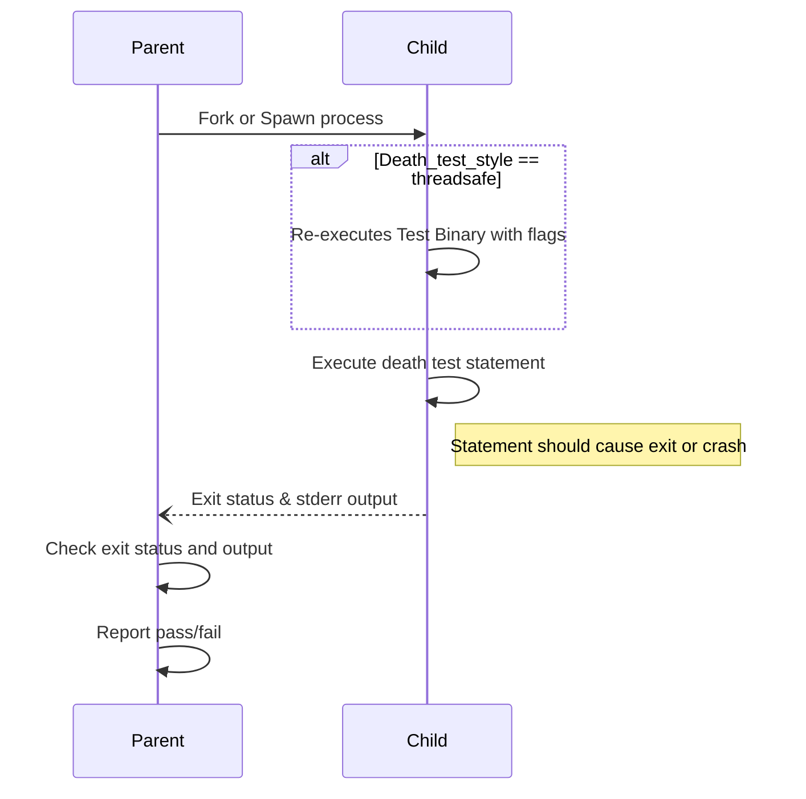

# Death Tests: Validating Crash and Exit Conditions

## Overview

Death tests are specialized unit tests that verify whether specific code paths lead to program termination as expected. They are crucial for ensuring that error handling, assertion failures, or fatal conditions within your code cause the process to exit or crash in a controlled and predictable way. GoogleTest provides a robust death test framework to automate these checks, enabling you to confidently assert that your program fails safely and cleanly when error conditions arise.

This guide focuses on how to write and use death tests effectively with GoogleTest, complete with practical scenarios, common pitfalls, and configuration options.

---

## 1. Understanding Death Tests

### What Is a Death Test?

A death test verifies that executing a particular statement or block of code causes the process to terminate. This termination can be due to calls like `exit()`, `_Exit()`, aborts, signals (e.g., segmentation faults), or intentional fatal errors.

Death tests are essential for:
- Verifying assertions and consistency checks that cause program termination on failure.
- Validating that error handling code correctly aborts under fatal conditions.
- Testing external behaviors like exit codes and error message outputs.

### Death Tests vs Exceptions

Death tests differ from exception assertions. While exceptions can be caught and handled, death tests confirm that nothing can recover from the failure—i.e., the process actually terminates.

### Why Use Death Tests?

When code needs to guard critical invariants or fail fast on invalid inputs, death tests ensure these fail-safes work properly. Without death tests, such paths may silently fail, leaving the program in an inconsistent state.

---

## 2. Prerequisites and Setup

Before writing death tests:
- Confirm that your environment supports death tests; GoogleTest will print warnings if they are unsupported.
- Set up GoogleTest according to standard procedures, including `#include <gtest/gtest.h>`.
- Understand that death tests run statements in child processes, isolated from your main test flow.

---

## 3. Writing Death Tests

GoogleTest provides macros to declare death tests. The primary macros are:

- `ASSERT_DEATH(statement, matcher)` - A fatal assertion that the `statement` causes death and produces output matching `matcher`.
- `EXPECT_DEATH(statement, matcher)` - A non-fatal variant of ASSERT_DEATH.
- `ASSERT_EXIT(statement, predicate, matcher)` - Checks that the `statement` exits with a status satisfying `predicate` and matches `matcher`.
- `EXPECT_EXIT(statement, predicate, matcher)` - Non-fatal variant of ASSERT_EXIT.
- `EXPECT_DEBUG_DEATH` and `ASSERT_DEBUG_DEATH` - Verify death only in debug builds.
- Conditional variants `EXPECT_DEATH_IF_SUPPORTED` and `ASSERT_DEATH_IF_SUPPORTED` that generate warnings if death tests are unsupported.

### Syntax and Parameters

- `statement`: Any valid C++ statement, including function calls, complex expressions, or compound statements (enclosed in braces `{}`).
- `matcher`: A string treated as a regular expression (POSIX Extended on *nix, a limited syntax on Windows/Mac), or a GoogleTest matcher for the expected stderr output.
- `predicate`: A callable checking exit status; commonly `ExitedWithCode(int)` or `KilledBySignal(int)`.

### Examples:

```cpp
// Simple death test checking abort due to invalid input.
TEST(DeathTestExample, FailsOnInvalidInput) {
  ASSERT_DEATH(
      RunFunction(-1),  // Statement expected to cause death
      "Invalid input error");  // Regex to match stderr output
}

// Death test with EXIT status predicate.
TEST(DeathTestExample, ExitWithZero) {
  EXPECT_EXIT(
      ExitNow(),  // Statement expected to exit normally
      testing::ExitedWithCode(0),  // Predicate verifying exit code
      "Success");  // Regex for stderr output
}

// Death test inside a loop, useful for parameterized conditions.
TEST(DeathTestExample, LoopDeathChecks) {
  for (int i = 0; i < 5; ++i) {
    EXPECT_DEATH(ProcessRequest(i), "Request \d+ failed")
        << "Iteration " << i;
  }
}

// Compound statement in death test
TEST(DeathTestExample, CompoundStatement) {
  ASSERT_DEATH({
    int x = 0;
    CheckFailure(x);
  }, "failure detected");
}
```

### Important Notes:
- The death test statement runs in a separate child process. Side effects made in the death test are not observable in the parent test process.
- Avoid placing multiple death test assertions on the same line.
- The process exit code and stderr output are verified against matchers to confirm correct failure semantics.
- Use `EXPECT_DEATH_IF_SUPPORTED` if your test consumer platform might not support death tests.

---

## 4. Death Test Styles

GoogleTest supports two main styles for death tests, configurable via the `--gtest_death_test_style` flag or programmatically:

1. **Fast Style (Default)**
   - The child process is `fork()`ed, and immediately runs the death test statement.
   - Pros: Faster execution.
   - Cons: Less safe in multithreaded contexts.

2. **Threadsafe Style**
   - The child process `fork()`s and then re-executes the entire test binary, filtering to the specific death test.
   - Pros: Safer with multi-threaded code, mitigating issues with `fork()` and threads.
   - Cons: Potentially slower execution.

Example of setting death test style programmatically:

```cpp
int main(int argc, char** argv) {
  testing::InitGoogleTest(&argc, argv);
  GTEST_FLAG_SET(death_test_style, "threadsafe");
  return RUN_ALL_TESTS();
}

TEST(MyDeathTest, ThreadsafeStyle) {
  GTEST_FLAG_SET(death_test_style, "fast");  // Override style for individual test
  ASSERT_DEATH(FailingFunction(), "Expected failure");
}
```

### Platform Specific Details

- On Windows, death tests always behave in threadsafe style due to process creation APIs.
- On Linux, `clone()` may be used instead of `fork()` for improved thread safety.
- Some platforms support special mechanisms (e.g., Fuchsia).

---

## 5. Best Practices and Common Pitfalls

### Naming Conventions

- Name your **test suites** containing death tests with the suffix `DeathTest`. This ensures GoogleTest runs these tests before others for thread safety.

Example:

```cpp
class FooDeathTest : public ::testing::Test { ... };

TEST_F(FooDeathTest, CheckFailure) {
  ASSERT_DEATH(Foo(), "Error message");
}
```

- If a fixture is shared between regular and death tests, alias the death test suite:

```cpp
using FooDeathTest = FooTest;
```

### Handling Side Effects

- Side effects (like variable modifications or memory allocations) inside death test statements occur only in the child process and are not reflected in the parent. Avoid relying on shared state changes within death test statements.

### Usage in Non-Void Functions

- Avoid `ASSERT_DEATH` in non-void functions since `ASSERT_*` macros abort the current function, which must be void-returning.

### Avoiding Multiple Threads in Parent

- Death tests involve forking or cloning; multiple threads in the parent process can cause intermittent hangs or failures.
- Prefer the threadsafe style if your application is multi-threaded and cannot avoid starting threads before main.

### Avoiding Return or Exceptions in Death Tests

- If the death test statement returns or throws an exception, the death test fails. Use explicit crashing or exit calls.

### Mocks and Leak Detection

- Mock objects used inside death tests may be leaked because death tests terminate the child process abruptly. Use `Mock::AllowLeak()` if necessary.

---

## 6. Advanced Examples

### Using Exit Status Predicates

GoogleTest provides two example predicates for exit status verification:

- `testing::ExitedWithCode(int)` — checks if process exited normally with the given code.
- `testing::KilledBySignal(int)` — checks if process was terminated by the specified signal (POSIX only).

```cpp
EXPECT_EXIT(NormalExit(), testing::ExitedWithCode(0), "Success");
EXPECT_EXIT(RaiseSIGKILL(), testing::KilledBySignal(SIGKILL), "Kill signal");
```

### Debug Death Tests

Use `EXPECT_DEBUG_DEATH` and `ASSERT_DEBUG_DEATH` to test code paths that only crash in debug builds, often due to `LOG(DFATAL)`. In release builds, the statement executes normally but does not assert.

```cpp
int DieInDebugOr12(int* sideeffect) {
  if (sideeffect) *sideeffect = 12;
  LOG(DFATAL) << "crash in debug mode";
  return 12;
}

TEST(MyDebugTest, CrashOnlyInDebug) {
  int side_effect = 0;
  EXPECT_DEBUG_DEATH(DieInDebugOr12(&side_effect), "crash");

#ifdef NDEBUG
  EXPECT_EQ(12, side_effect);
#else
  EXPECT_EQ(0, side_effect);
#endif
}
```

---

## 7. Troubleshooting

### Death Test Hangs or Segfaults

- Check for multiple threads in the parent process; use threadsafe death test style.
- Move as much code in the death test statement to inside the macro to isolate.
- Avoid side effects observed from the parent.

### Failure to Match Error Messages

- Verify your regex pattern matches the stderr output exactly (multi-line, etc.).
- Remember that string arguments are interpreted as regexes; escaping is necessary.

### Compiler Errors with Death Tests

- Ensure the death test statement is a valid statement; it can be a compound statement.
- Avoid assertions inside death tests that return values.

### Death Tests Not Supported

- Use `EXPECT_DEATH_IF_SUPPORTED` and `ASSERT_DEATH_IF_SUPPORTED` to cross-platform guard.

---

## 8. Summary

Death tests provide a powerful mechanism to validate your critical failure paths by asserting that specific code crashes or exits as expected. Using GoogleTest's rich macro suite and configurable death test styles, you can write reliable and readable death tests that enhance your code robustness and quality.

For more details on syntax, failure modes, and examples, refer to the following sections of the documentation.

---

## 9. References and Further Reading

- [GoogleTest Assertions Reference](../api-reference/googletest-core-apis/assertions-reference.md#death)
- [GoogleTest Advanced Topics: Death Tests](../docs/advanced.md#death-tests)
- [Matchers and Value Comparisons](../api-reference/googletest-core-apis/matchers-and-comparisons.md)
- [GoogleTest FAQ: Death Tests](../faq/advanced-usage/death-tests-and-mocking.md)

<Tip>
Remember to name your death test suites with the `DeathTest` suffix and use death test macros within valid contexts to ensure your tests run smoothly and reliably.
</Tip>

---

## 10. Appendix: Typical Death Test Workflow

<Steps>
<Step title="Write the death test macro">
Write an `ASSERT_DEATH` or `EXPECT_DEATH` macro within your test case, passing the fatal statement and the expected stderr regex.
</Step>
<Step title="Compile and run the test">
Build your test executable and run it normally. GoogleTest will fork and isolate the death test statement.
</Step>
<Step title="Interpret test results">
Confirm GoogleTest reports success only if the child process dies, the error output matches, and the exit code (if checked) is as expected.
</Step>
<Step title="Troubleshoot as needed">
Adjust the statement, regex patterns, or death test style if tests hang or produce unexpected failures.
</Step>
</Steps>

---

## Diagram: Death Test Execution Flow


