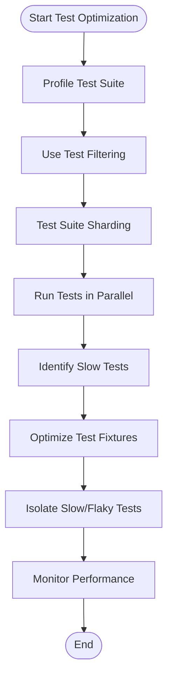

# Test Suite Performance and Scalability

Optimize your test suite’s performance and scalability with practical strategies designed for large codebases. This guide walks you through leveraging GoogleTest’s built-in capabilities for fast discovery, parallel execution, selective running, and smart sharding, ensuring your feedback loops stay tight even as your project grows.

---

## 1. Quickly Understand Your Test Suite Scale

Before optimization, know your test suite's characteristics:

- **Number of Tests**: Total tests and test suites.
- **Test Execution Time**: Average and max durations.
- **Dependencies and Resource Usage**: Shared fixtures or expensive external services.

Use initial profiling tools or test run summaries to gather these metrics.

---

## 2. Leverage Efficient Test Discovery and Selective Execution

### Why It Matters
Large projects can have thousands of tests. Running the entire suite every time is expensive.

### How-to Guide
1. Use GoogleTest’s built-in test discovery:

   ```bash
   ./my_test_binary --gtest_list_tests
   ```

   This lists all available test suites and tests.

2. Run subsets by specifying tests or test suites:

   ```bash
   ./my_test_binary --gtest_filter=MySuite.MyTest
   ./my_test_binary --gtest_filter=MySuite.*
   ./my_test_binary --gtest_filter=-FlakySuite.*  # exclude FlakySuite
   ```

3. Combine multiple patterns separated by `:` for complex filtering.

### Outcome
You only run relevant tests, saving time and compute.

---

## 3. Employ Test Sharding for Parallel Execution

### Overview
Sharding splits your test suite into independent chunks that can be run in parallel across machines or processors.

### Prerequisites
- Your tests must be independent (no hidden dependencies).
- The test binary must be sharding-enabled (most GoogleTest binaries are).

### Step-by-Step
1. Choose the total number of shards (e.g., 4).
2. Run your tests in shard-specific mode:

   ```bash
   ./my_test_binary --gtest_total_shards=4 --gtest_shard_index=0
   ./my_test_binary --gtest_total_shards=4 --gtest_shard_index=1
   ./my_test_binary --gtest_total_shards=4 --gtest_shard_index=2
   ./my_test_binary --gtest_total_shards=4 --gtest_shard_index=3
   ```

3. Each shard runs a disjoint subset of your tests.
4. Aggregate results from all shards after completion.

### Tips
- Use a test runner or CI tool that supports parallel jobs.
- Balance shard sizes by profiling test durations.

---

## 4. Optimize Test Execution with Parallelism

GoogleTest supports parallel test execution within a single binary.

### How to Enable

```bash
./my_test_binary --gtest_parallel=<num_threads>
```

where `<num_threads>` can be the number of CPU cores.

### Best Practices
- Ensure tests don’t share mutable state.
- Use fixtures correctly to isolate state.
- Beware of shared external resources (databases, files).

### Observations
You can expect linear speedup up to available cores.

---

## 5. Reduce Test Flakiness and Overhead

### Use Fixtures Wisely
- Share expensive setup/teardown with test suites, not individual tests.
- Avoid dependencies between tests.

### Suppress Unnecessary Logs
- Use `--gtest_brief=1` and control GoogleMock verbosity with `--gmock_verbose`.

### Isolate Slow Tests
- Mark tests that are known to be slow or flaky.
- Run them separately or less frequently.

---

## 6. Profile and Monitor Performance

Use the GoogleTest `--gtest_print_time` flag to see timing information for tests:

```bash
./my_test_binary --gtest_print_time
```

Analyze the output to identify slow-running tests and target them for optimization.

---

## 7. Keep Builds Fast with Test-Specific Compilation

Where possible, use your build system features to:
- Compile only code that’s necessary for the tests being run.
- Use incremental builds after code changes.

---

## 8. Troubleshooting

<AccordionGroup title="Common Performance Issues and Solutions">
<Accordion title="Test Discovery Is Slow">
If listing tests takes unexpectedly long:

- Check for very large test binaries.
- Use `--gtest_list_tests` with output redirected to a file.
</Accordion>
<Accordion title="Sharding Does Not Split Tests Evenly">

- Profile tests to find imbalanced shards.
- Manually assign tests to groups to balance runtime.
- Consider custom sharding logic in your test runner.

</Accordion>
<Accordion title="Tests Fail When Running in Parallel">

- Review dependencies in setup/teardown.
- Confirm tests are thread-safe.
- Isolate tests using fixtures properly.

</Accordion>
<Accordion title="Unexpected Flakiness Due to Test Interactions">

- Avoid shared static/global mutable state.
- Use `--gtest_repeat` to isolate flaky tests by repeating.

</Accordion>
</AccordionGroup>

---

## 9. Summary Best Practices

- Use filtering and sharding to reduce the number of tests run per shard.
- Enable parallel test execution across cores and machines.
- Profile and optimize slow tests and fixtures.
- Mark slow and flaky tests explicitly.
- Use GoogleTest flags to control verbosity and logging during large test runs.

---

## 10. Next Steps & Further Reading

- [Getting Started: Writing and Running Your First Test](/guides/core-workflows/getting-started)
- [Structuring Test Cases and Test Suites](/guides/core-workflows/structuring-tests)
- [Advanced Mocking Scenarios and Custom Actions](/guides/mocking-best-practices/advanced-mocking)
- [Integrating with Build Systems (CMake, Bazel)](/guides/patterns-integration/build-integration)
- [Continuous Integration and Test Automation](/guides/patterns-integration/ci-cd-practices)
- [GoogleTest Primer](https://github.com/google/googletest/blob/main/docs/primer.md)

<Tip>
Keep your test suite fast and scalable by integrating these patterns into your development workflows early. Optimized testing not only saves time but increases developer productivity and confidence.
</Tip>

---

## Appendix: Example - Running a Sharded Test Suite in CI

```bash
#!/bin/bash

TOTAL_SHARDS=4

for SHARD_INDEX in $(seq 0 $((TOTAL_SHARDS - 1))); do
  echo "Running shard $SHARD_INDEX/$((TOTAL_SHARDS - 1))"
  ./my_test_binary \
    --gtest_total_shards=${TOTAL_SHARDS} \
    --gtest_shard_index=${SHARD_INDEX} \
    --gtest_output=xml:result_shard_${SHARD_INDEX}.xml &
done

wait

# Combine reports...
```

This script runs 4 shards in parallel background jobs, producing separate XML reports.


---

## Appendix: Flag Summary for Performance Tuning

| Flag | Purpose |
|-------|---------|
| `--gtest_filter` | Run specific tests relevant to the change.
| `--gtest_total_shards`, `--gtest_shard_index` | Enable/distribute shards for parallel runs.
| `--gtest_parallel` | Enable multithreaded test execution.
| `--gtest_repeat` | Repeat tests to spot flaky failures.
| `--gtest_print_time` | Display test execution times.
| `--gmock_verbose` | Adjust mock logging verbosity (info, warning, error).

Use these strategically to optimize test runs.


---

## Diagram: Test Suite Scaling Workflow



This flow shows how performance optimization moves from baseline profiling through filtering, sharding, parallelism, and test quality improvements.
