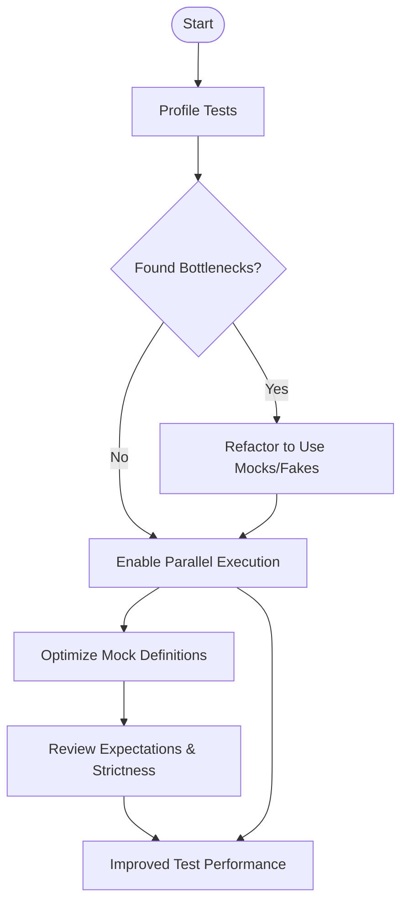

# Performance Tuning and Optimization

## Overview

This guide helps you optimize your use of GoogleTest and GoogleMock to reduce test flakiness, accelerate test execution, and efficiently use resources. It covers actionable strategies such as profiling your tests, employing parallelization techniques, and avoiding the common pitfalls that can hinder test performance.

### Prerequisites

- A working GoogleTest and GoogleMock environment.
- Basic familiarity with writing and running tests using GoogleTest and creating mocks with GoogleMock.
- Understanding of the typical flow of test execution and test structure.

### Expected Outcome

By following this guide, you will be able to:
- Identify and profile performance bottlenecks in your tests.
- Apply parallel execution techniques to speed up test runs.
- Implement best practices that avoid slowing down tests or causing flakiness.
- Use resource management effectively to get consistent and fast test results.

### Time Estimate

Approximately 1-2 hours to read, implement profiling, and adjust your test suites based on recommendations.

### Difficulty Level

Intermediate: assumes prior experience with GoogleTest frameworks and test writing.

---

## Step-by-Step Optimization Instructions

<Steps>
<Step title="Profile Your Tests to Identify Bottlenecks">
Start by measuring where your test suite spends the most time. Use built-in or external profiling tools to:
- Measure individual test durations.
- Identify slow test setups or teardown processes.
- Detect tests involving external resources that slow them down.

**Expected result:** A clear list of slow tests or slow operations within tests.

**Tips:**
- Use GoogleTest's `--gtest_brief` or similar flags to get timing info if available.
- Consider manual timing using `std::chrono` around test sections if needed.
</Step>
<Step title="Reduce Test Dependencies and Expensive Resources">
Based on profiling, refactor tests that use slow or flaky dependencies by:
- Replacing real resource usage (e.g., databases, networks) with mocks or fakes using GoogleMock.
- Isolating external dependencies behind interfaces to allow mocking.
- Sharing expensive setup across tests using test fixtures efficiently.

**Expected result:** Tests run faster and more reliably with isolated and mockable dependencies.
</Step>
<Step title="Use Parallel Test Execution">
Speed up test running by parallelizing independent tests.

- Configure your build and test runner to run tests in parallel threads or processes.
- Ensure your tests are independent and do not share mutable state that causes race conditions.
- Use GoogleTest's `--gtest_parallel` flag or integration with parallel test runners.

**Expected result:** Test suite execution time is significantly reduced without interference.

**Best Practices:**
- Avoid static or global mutable state that is not thread-safe.
- Use thread-safe mock classes if you mock across threads.
</Step>
<Step title="Minimize Mock Object Construction Overhead">
Large or complex mock classes can slow down compilation and execution.

- Move mock class constructor and destructor definitions out of header files to `.cc`/.cpp files. This reduces compilation overhead.
- Avoid mocking too many methods unnecessarily; only mock what you observe or need to control.

**Expected result:** Faster compilation times and cleaner test binaries.

**Example:**
```cpp
// In mock_foo.h
class MockFoo : public Foo {
 public:
  MockFoo();
  ~MockFoo() override;

  MOCK_METHOD(int, DoThis, (), (override));
  // ... other mock methods ...
};

// In mock_foo.cc
#include "mock_foo.h"

MockFoo::MockFoo() {}
MockFoo::~MockFoo() {}
```
</Step>
<Step title="Avoid Excessive Expectations and Unnecessary Strictness">
Overly strict expectations or excessive use of `StrictMock` can cause brittle tests and slow downs.

- Use `ON_CALL()` to set default behaviors rather than `EXPECT_CALL()` when you do not need to verify call counts or order.
- Prefer `NiceMock` to suppress uninteresting call warnings when appropriate.
- Use `StrictMock` selectively when you want guaranteed call verification.

**Expected result:** Tests are more resilient to refactoring and run without noisy output.
</Step>
<Step title="Leverage Default Actions and WillByDefault">
Simplify your mock setups and improve performance by utilizing `ON_CALL` with `WillByDefault()`:

- Establish common default mock behaviors in the constructor or test fixture setup.
- Override with `EXPECT_CALL` in specific tests only when you need strict verification.

**Expected result:** Cleaner tests and reduced mock setup repetitions.
</Step>
<Step title="Use Efficient Matchers and Avoid Over-Specification">
Match arguments thoughtfully to avoid slow matcher evaluations.

- Use simple matchers like `_` when argument values are not essential.
- Avoid deep or complex matcher hierarchies unless necessary.

**Expected result:** Faster matching logic during mock calls and clearer test intent.
</Step>
</Steps>

---

## Practical Examples

### Example: Moving Mock Constructor to Reduce Compilation Time

```cpp
// mock_widget.h
#include <gmock/gmock.h>

class Widget {
 public:
   virtual ~Widget() {}
   virtual int Size() const = 0;
   virtual void Update(int value) = 0;
};

class MockWidget : public Widget {
 public:
   MockWidget();
   ~MockWidget() override;

   MOCK_METHOD(int, Size, (), (const, override));
   MOCK_METHOD(void, Update, (int value), (override));
};

// mock_widget.cc
#include "mock_widget.h"

MockWidget::MockWidget() {}
MockWidget::~MockWidget() {}
```

This change reduces recompilation as constructor and destructor are only compiled once.

### Example: Setting Default Behavior with ON_CALL

```cpp
using ::testing::Return;

class MockCache {
 public:
  MOCK_METHOD(bool, Add, (const std::string& key, int value), (override));
  MOCK_METHOD(absl::optional<int>, Get, (const std::string& key), (const, override));
};

void SetupMockCache(MockCache& mock_cache) {
  ON_CALL(mock_cache, Add).WillByDefault(Return(true));
  ON_CALL(mock_cache, Get).WillByDefault(Return(absl::nullopt));
}

TEST(CacheTest, SimpleAddGet) {
  MockCache mock_cache;
  SetupMockCache(mock_cache);

  EXPECT_CALL(mock_cache, Add("item1", 42));  // We verify this call

  // Calls without explicit expectations will use ON_CALL defaults.
  EXPECT_TRUE(mock_cache.Add("item1", 42));
  EXPECT_EQ(mock_cache.Get("item1"), absl::nullopt);
}
```

This pattern reduces the number of expectations and unnecessary warnings.

### Example: Parallel Execution with GoogleTest

```bash
# Run tests using 4 parallel workers
./my_test_binary --gtest_parallel=4
```

Make sure your tests are thread-safe and independent before enabling parallel runs.

---

## Troubleshooting & Tips

<AccordionGroup title="Troubleshooting Common Issues">
<Accordion title="Tests Running Slower Than Expected">
- Profile tests to identify slow external resource dependencies or heavy setup.
- Replace slow resources with mocks using GoogleMock.
- Ensure no excessive logging or debug output slows the tests.
</Accordion>
<Accordion title="Test Failures Due to Mock Strictness">
- Switch from `StrictMock` to `NiceMock` for initial debugging.
- Confirm that `EXPECT_CALL` expectations are set before exercising the mock.
- Use `.Times(AnyNumber())` to allow calls when verification is not required.
</Accordion>
<Accordion title="Compilation Taking Too Long Due to Mocks">
- Move mock constructor and destructor implementations to `.cc` files.
- Avoid mocking unnecessary methods to reduce code generation.
- Use type aliases to keep `MOCK_METHOD` macros simple and reduce template complexity.
</Accordion>
<Accordion title="Flaky Tests in Parallel Execution">
- Check for shared mutable global state and remove or protect access via synchronization.
- Verify that mocks and test code are thread-safe.
- Use GoogleTest's thread sanitizers or sanitizers for race detection.
</Accordion>
</AccordionGroup>

<Tip>
To optimize your tests further, consider using memory and CPU profilers alongside GoogleTest's verbose logging (`--gmock_verbose=info`) for deep insight into mock invocations and behavior.
</Tip>

---

## Next Steps & Related Content

- Explore the [gMock Cookbook](https://google.github.io/googletest/gmock_cook_book.html) for practical mocking recipes.
- Learn about [Advanced Mocking with GoogleMock](https://github.com/google/googletest/tree/main/googlemock) for complex scenarios.
- Consult [Managing Large and Legacy Test Suites](../../guides/practical-integrations/managing-large-test-suites) to scale optimized test suites.
- Use [Build System Integration](../../guides/practical-integrations/build-system-integration) for performance-focused project setups.
- Review [Troubleshooting Common Issues](../../getting_started/first_steps_usage/common_issues) for help resolving persistent problems.

---

## Related Documentation

- [Writing Your First Test](../../guides/getting-started/writing-your-first-test)
- [Mocking with GoogleMock](../../guides/advanced-testing/mocking-with-googlemock)
- [GoogleTest Primer](../../docs/primer.md)
- [GoogleMock Cookbook](../../docs/gmock_cook_book.md)

---

## References

- GoogleMock Quick Reference: [gMock Cheat Sheet](../../docs/gmock_cheat_sheet.md)
- GoogleMock Mocking Reference: [Mocking Reference](../../docs/reference/mocking.md)
- GoogleTest Command Line Flags: use `--gtest_help` or `--help` for testing options.

---

## Summary Diagram of an Optimized Test Flow



This workflow guides you through profiling, refactoring for mocks, parallel runs, and expectation tuning to achieve performance gains.


<Source url="https://github.com/google/googletest" branch="main" paths={[{"path": "docs/gmock_cook_book.md", "range": "1-10"},{"path": "docs/gmock_for_dummies.md", "range": "1-50"},{"path": "docs/gmock_cheat_sheet.md", "range": "1-100"},{"path": "docs/reference/mocking.md", "range": "1-150"}]} />