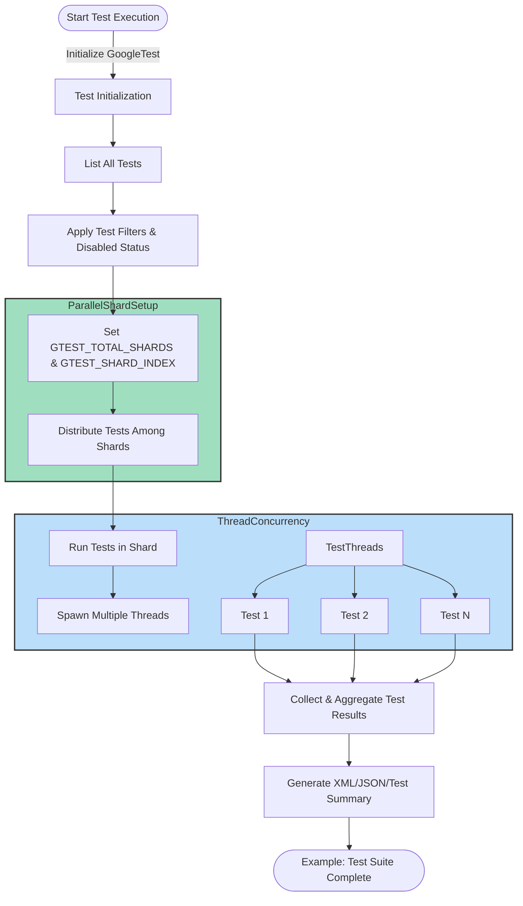

# Performance and Scaling Test Suites

## Overview

This guide provides practical techniques to optimize the execution time of your GoogleTest test suites, enabling them to scale efficiently to large codebases. It focuses on identifying slow tests, integrating parallel test runners, and leveraging features in GoogleTest that facilitate faster and more manageable testing processes. Additionally, it covers strategies for smooth and efficient continuous integration (CI) of large test suites.

## Prerequisites

- You should have a working GoogleTest environment with tests written using TEST, TEST_F, TEST_P, or typed tests.
- Familiarity with running tests via `RUN_ALL_TESTS()` and basic test suite structuring.
- Basic understanding of parallelism in build and test clusters (helpful but not mandatory).

## Expected Outcome

- Faster test execution time through test suite optimization.
- Ability to run tests in parallel safely.
- Clear awareness of bottleneck tests.
- Guidelines on integrating GoogleTest within CI environments with parallel and sharded test execution.

## Time Estimate

Approximately 30 minutes to an hour, depending on the size of your test codebase and CI setup complexity.

## Difficulty Level

Intermediate to Advanced.

---

## Step-by-Step Guide

### 1. Identify Slow or Bottleneck Tests

The first step is to find tests that are slowing down your test suite.

- Run your complete test suite with the XML output enabled:

  ```bash
  ./your_test_binary --gtest_output=xml:report.xml
  ```

- Analyze the generated XML report (found by default as `test_detail.xml` or your specified file).

  - Each `<testcase>` element has a `time` attribute indicating execution duration.
  - Sort or filter these to find which tests take the longest.

- You can write scripts or use existing XML parsers to extract and summarize this data.

**Tip:** Consider selectively disabling or isolating extremely slow tests with `DISABLED_` prefix to reduce your main test run time while investigating optimizations.

---

### 2. Leverage Test Fixtures for Sharing Expensive Setup

Repeated expensive setup/teardown is a common cause of slow tests.

- Use **per-test-suite `SetUpTestSuite()` and `TearDownTestSuite()`** static methods in your test fixtures to allocate resources once per test suite instead of per test.

- These methods automatically run before the first and after the last test in the fixture, allowing shared resources like large data structures or database connections to be reused.

Example:

```cpp
class MyExpensiveTest : public testing::Test {
 public:
  static void SetUpTestSuite() {
    shared_resource_ = new ExpensiveResource();
  }

  static void TearDownTestSuite() {
    delete shared_resource_;
    shared_resource_ = nullptr;
  }

 protected:
  static ExpensiveResource* shared_resource_;
};

ExpensiveResource* MyExpensiveTest::shared_resource_ = nullptr;
```

---

### 3. Enable Parallel Test Execution

GoogleTest allows you to run tests in parallel by sharding, splitting tests across multiple nodes or processes.

- Use environment variables to shard tests:

  - `GTEST_TOTAL_SHARDS`: total number of shards.
  - `GTEST_SHARD_INDEX`: zero-based index of the current shard.

- Example: To divide tests between 4 shards,

  run on each machine or process:

  ```bash
  GTEST_TOTAL_SHARDS=4 GTEST_SHARD_INDEX=0 ./your_test_binary
  GTEST_TOTAL_SHARDS=4 GTEST_SHARD_INDEX=1 ./your_test_binary
  GTEST_TOTAL_SHARDS=4 GTEST_SHARD_INDEX=2 ./your_test_binary
  GTEST_TOTAL_SHARDS=4 GTEST_SHARD_INDEX=3 ./your_test_binary
  ```

  Each invocation runs a mutually exclusive subset of tests.

- GoogleTest guarantees each test runs exactly once across all shards.

**Note:** Sharding considers _test functions_ (individual TEST or TEST_F invocations) when partitioning.

---

### 4. Take Advantage of Thread-Safe Test Constructs

GoogleTest is designed to be thread-safe on supported platforms (Linux, macOS, Windows with thread-safe build).

- Tests using `SCOPED_TRACE()` and GoogleTest assertions can safely run concurrently in multiple threads without data races or incorrect failure counting.

- The `StressTest` examples for both GoogleTest and GoogleMock validate concurrent behavior.

- For maximum concurrency, consider using thread pools or parallel test runners that execute multiple tests simultaneously within the same host process.

---

### 5. Use Test Filtering and Repetition for Efficient Debugging

- Use `--gtest_filter` to run only tests relevant to your code changes, greatly reducing iteration time.

  Example:

  ```bash
  ./your_test_binary --gtest_filter=MyClassTest.*
  ```

- Combine filtering with repetition `--gtest_repeat=N` to identify flaky or non-deterministic tests:

  ```bash
  ./your_test_binary --gtest_filter=MyFlakyTest --gtest_repeat=100
  ```

---

### 6. Avoid Premature Test Fixture Destruction and Use Proper Resource Management

- Tests with heavy setup that prematurely destruct shared resources can slow tests due to repeated allocation/deallocation.

- Prefer allocating resources once per test suite or via global test environment (`Environment` subclasses) with `SetUp()` and `TearDown()`.

- This also improves cache locality and reduces test overhead.

---

### 7. Optimize CI Integration for Large Test Suites

- Break your monolithic test suite into smaller, parallelizable units leveraging the sharding environment variables described above.

- Integrate test runs with CI systems that support parallel build/test agents (e.g., Jenkins, GitLab CI, Bazel remote execution).

- Use GoogleTest XML output for integration with test reporting dashboards and flaky test detection.

- Enable test shuffling with `--gtest_shuffle` to detect hidden dependencies between tests.

- Enable fail-fast mode `--gtest_fail_fast` to stop CI pipelines early on failure during iterative debugging.

---

## Troubleshooting & Tips

### Common Issues

- **Non-thread-safe code causing test flakes in parallel execution:** Ensure your tests and tested code are thread-safe before running tests concurrently.

- **Shared mutable state causing unpredictable results:** Use test fixtures and proper resource isolation to avoid state leaks between tests.

- **Tests running in unexpected shards:** Verify `GTEST_TOTAL_SHARDS` and `GTEST_SHARD_INDEX` are correctly set and consistent.

- **Slow test suites not benefiting from parallelization:** Profile with XML reports to find bottlenecks and use per-test-suite setup.

### Best Practices

- Use `DISABLED_` prefix to temporarily exclude slow or flaky tests during main test runs.

- Write short-lived, independent tests wherever possible to maximize scalability.

- Profile tests and maintain XML reports as part of your CI system to continuously monitor test performance.

- Use `SCOPED_TRACE()` to add context to assertion failures in concurrent tests, ensuring clearer debugging.

### Performance Considerations

- Group related slow tests into fixtures with shared expensive resources set up only once.

- Avoid global state modifications in tests, except when properly synchronized.

- When using mocks in multi-threaded tests, follow patterns demonstrated in GoogleMock stress tests for concurrency safety.

### Alternative Approaches

- Consider using external parallel test runners or build systems (e.g., Bazel, CTest parallel jobs) that can run multiple test binaries simultaneously.

- For distributed CI, shard tests intelligently based on workload balance.


## Next Steps & Related Content

- Explore the [Test Discovery and Execution Patterns guide](../getting_started/test_discovery_execution) for insights on test lifecycle and filtering.
- Learn the details of [Integrating GoogleTest in CI workflows](../concepts/extensibility-and-scalability/integration-and-automation).
- Understand thread-safe assertions and tracing in [Advanced GoogleTest Topics](docs/advanced.md#adding-traces-to-assertions).
- Dive deeper into mocking with concurrent test examples in [GoogleMock Stress Tests](googlemock/test/gmock_stress_test.cc).
- For test suite structuring and maintenance, see [Test Maintenance Best Practices](guides/practical_tips_and_patterns/test_maintenance_best_practices).

---

## Example: Running Tests in 4 Parallel Shards

```bash
# Shard 0
GTEST_TOTAL_SHARDS=4 GTEST_SHARD_INDEX=0 ./my_test_suite

# Shard 1
GTEST_TOTAL_SHARDS=4 GTEST_SHARD_INDEX=1 ./my_test_suite

# Shard 2
GTEST_TOTAL_SHARDS=4 GTEST_SHARD_INDEX=2 ./my_test_suite

# Shard 3
GTEST_TOTAL_SHARDS=4 GTEST_SHARD_INDEX=3 ./my_test_suite
```

Each shard will receive a distinct subset of test cases. Combine the results after all shards complete.

## Example: Using Per-Test-Suite Shared Resource

```cpp
class DatabaseTest : public testing::Test {
 protected:
  static DatabaseConnection* db_conn_;

  static void SetUpTestSuite() {
    db_conn_ = DatabaseConnection::Create("mydb");
  }

  static void TearDownTestSuite() {
    delete db_conn_;
    db_conn_ = nullptr;
  }

  void SetUp() override {
    db_conn_->BeginTransaction();
  }

  void TearDown() override {
    db_conn_->RollbackTransaction();
  }
};

DatabaseConnection* DatabaseTest::db_conn_ = nullptr;

TEST_F(DatabaseTest, TestInsert) {
  EXPECT_TRUE(db_conn_->InsertRecord("data"));
}

TEST_F(DatabaseTest, TestDelete) {
  EXPECT_TRUE(db_conn_->DeleteRecord("data"));
}
```

Here, the expensive database connection is initialized once per test suite and reused, speeding up tests.

---

## Diagram: Test Execution & Parallel Sharding Flow



---

## References & Resources

- GoogleTest XML Output and Analysis
- GoogleTest Parallel Test Execution (sharding) flags
- GoogleTest Event Listeners and Properties (for monitoring test runs)
- GoogleMock Stress Tests for concurrency examples

---