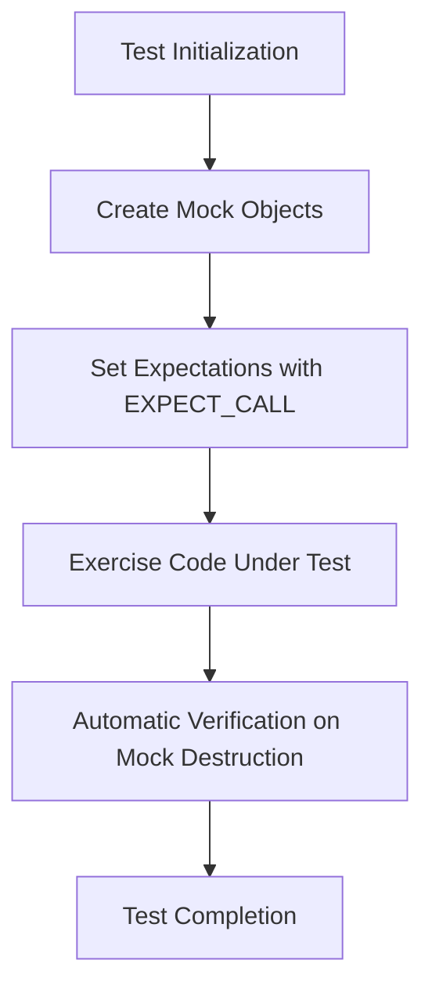

# Example Test and Mock Scenarios

Explore practical scenarios where GoogleTest and GoogleMock showcase their strengths in testing C++ code. This guide walks you through realistic examples demonstrating dependency injection, interface testing, mock class creation, expectation setting, and interaction verification. Gain hands-on insight into effective test strategies that ensure code correctness and maintainability.

---

## 1. Scenario: Testing with Dependency Injection

### Overview
Dependency injection lets your code depend on abstract interfaces rather than concrete implementations. This allows you to substitute test doubles—like mocks—in your tests to verify interactions without relying on complex or slow real dependencies.

### Setup
Suppose we have an interface `Turtle` representing a drawing mechanism:

```cpp
class Turtle {
 public:
  virtual ~Turtle() {}
  virtual void PenUp() = 0;
  virtual void PenDown() = 0;
  virtual void Forward(int distance) = 0;
  virtual void Turn(int degrees) = 0;
  virtual void GoTo(int x, int y) = 0;
  virtual int GetX() const = 0;
  virtual int GetY() const = 0;
};
```

Your project code uses a real turtle implementation, but tests use a mock to verify calls:

```cpp
#include <gmock/gmock.h>

class MockTurtle : public Turtle {
 public:
  MOCK_METHOD(void, PenUp, (), (override));
  MOCK_METHOD(void, PenDown, (), (override));
  MOCK_METHOD(void, Forward, (int distance), (override));
  MOCK_METHOD(void, Turn, (int degrees), (override));
  MOCK_METHOD(void, GoTo, (int x, int y), (override));
  MOCK_METHOD(int, GetX, (), (const, override));
  MOCK_METHOD(int, GetY, (), (const, override));
};
```

### Why Mock Here?

- Allows verifying that drawing commands are issued correctly and in order.
- Eliminates costly graphics rendering in test runs.
- Detects unintended calls or missing calls precisely.

### Sample Test

```cpp
#include <gtest/gtest.h>

TEST(PainterTest, DrawsCircle) {
  MockTurtle turtle;
  EXPECT_CALL(turtle, PenDown()).Times(1);
  EXPECT_CALL(turtle, Forward(::testing::_)).Times(5);

  Painter painter(&turtle);
  EXPECT_TRUE(painter.DrawCircle(0, 0, 10));
}
```

### Verification

- If `PenDown()` is not called exactly once, the test fails immediately.
- If `Forward()` is called fewer or more than 5 times, the test fails with detailed diagnostics.

---

## 2. Scenario: Mocking Complex Classes with Multiple Methods

### Context

For classes with many methods, or classes with overloads or const qualifiers, mocking requires care. `MOCK_METHOD` supports full signatures, including qualifiers.

### Example

```cpp
class Foo {
 public:
  virtual ~Foo() {}
  virtual bool Transform(Gadget* g) = 0;

 protected:
  virtual void Resume();

 private:
  virtual int GetTimeOut();
};

class MockFoo : public Foo {
 public:
  MOCK_METHOD(bool, Transform, (Gadget* g), (override));

  // Public mocks for methods protected or private in Foo:
  MOCK_METHOD(void, Resume, (), (override));
  MOCK_METHOD(int, GetTimeOut, (), (override));
};
```

### Key Points

- Always declare mock methods in `public:` section, even if base methods are protected or private.
- Add the necessary method qualifiers `override` to make expectations type-safe.

### Using Mocks

```cpp
MockFoo mock;
EXPECT_CALL(mock, Transform(::testing::_))
    .WillOnce(::testing::Return(true));
EXPECT_CALL(mock, Resume());
EXPECT_CALL(mock, GetTimeOut())
    .WillRepeatedly(::testing::Return(1000));

// Use mock in test subject.
```

### Benefits

- Allows focused testing on interaction without needing actual implementations.
- Verifies correct usage of class protocols, including calls to private or protected methods.

---

## 3. Scenario: Using Matchers in Expectations

### Why Use Matchers?

Matchers allow flexible and readable specifications of argument expectations.

### Example

```cpp
using ::testing::_;  // Wildcard matcher
using ::testing::Ge; // Matcher for greater or equal

EXPECT_CALL(mockFoo, DoThis(Ge(5)))
    .WillOnce(::testing::Return('a'));
EXPECT_CALL(mockFoo, DoThat(_, ::testing::NotNull()));
```

### Explanation

- The first expectation matches calls to `DoThis` with an argument greater than or equal to 5.
- The second expects the second argument of `DoThat` to be not-null while the first argument can be anything.

### Use Cases

- Simplifies tests when exact argument values are unknown or unimportant.
- Allows complex argument validation using custom or combined matchers.

---

## 4. Scenario: Ordered Function Calls

### Default Behavior

Expectations can match calls in any order.

### Enforcing Call Order

Use `InSequence` to require calls in specific order:

```cpp
using ::testing::InSequence;

{
  InSequence seq;
  EXPECT_CALL(mockTurtle, PenDown());
  EXPECT_CALL(mockTurtle, Forward(100));
  EXPECT_CALL(mockTurtle, PenUp());
}
```

### Outcome

Test will fail if calls occur out of the specified sequence.

---

## 5. Scenario: Handling Uninteresting Calls

### Concept

Calls to mocked methods without explicit expectations are "uninteresting" by default.

### Default Behavior

- Generates a warning but not an error.

### Controlling Warning Verbosity

- Use `NiceMock<MockClass>` to suppress uninteresting call warnings.
- Use `StrictMock<MockClass>` to treat uninteresting calls as errors.

### Sample

```cpp
using ::testing::NiceMock;
NiceMock<MockTurtle> nice_turtle;
EXPECT_CALL(nice_turtle, PenDown());
// Calls to other methods don't produce warnings.
```

---

## 6. Scenario: Combining Multiple Expectations

### Rules

- Newer expectations override older ones if they match.
- More specific matchers should be declared after general ones.

### Example

```cpp
EXPECT_CALL(mockTurtle, Forward(_));  // General
EXPECT_CALL(mockTurtle, Forward(10)).Times(2);  // Specific
```

- Calls to `Forward(10)` first match the specific expectation, limited to 2 calls.
- Calls to `Forward(20)` match the general expectation.

---

## 7. Scenario: Using Default Actions

### ON_CALL vs EXPECT_CALL

- `ON_CALL` defines default actions without setting expectations.
- `EXPECT_CALL` sets expectations and can define actions.

### Example

```cpp
ON_CALL(mockFoo, ComputeValue(::testing::_))
    .WillByDefault(::testing::Return(42));
```

- Calls to `ComputeValue` return 42 unless overridden by an `EXPECT_CALL`.

---

## 8. Scenario: Delegating Calls to a Fake or Real Object

### Delegating to Fake

Allows default behavior to be implemented by a fake, while verifying calls with a mock.

### Delegating to Real Object

Uses the real object to perform calls, with mock verifying invocation.

### Example - Delegate to Fake

```cpp
class FakeFoo : public Foo { ... };

class MockFoo : public Foo {
 public:
  MOCK_METHOD(char, DoThis, (int n), (override));
  void DelegateToFake() {
    ON_CALL(*this, DoThis).WillByDefault([this](int n) { return fake_.DoThis(n); });
  }
 private:
  FakeFoo fake_;
};
```

---

## 9. Scenario: Writing Parameterized Tests

### Purpose

Run the same test logic over multiple input values or types.

### Value-Parameterized Example

```cpp
class FooTest : public testing::TestWithParam<int> {};

TEST_P(FooTest, IsEven) {
  EXPECT_EQ(GetParam() % 2, 0);
}

INSTANTIATE_TEST_SUITE_P(
  EvenValues, FooTest, testing::Values(0, 2, 4, 6, 8));
```

### Result

Runs `IsEven` test with each value from the set 0, 2, 4, 6, 8.

### Typed Tests

Test over multiple types in a single suite:

```cpp
template <typename T>
class MyTypedTest : public testing::Test {};

using MyTypes = ::testing::Types<int, double, char>;
TYPED_TEST_SUITE(MyTypedTest, MyTypes);

TYPED_TEST(MyTypedTest, IsDefaultConstructible) {
  TypeParam value{};
  EXPECT_EQ(value, TypeParam{});
}
```

---

## Troubleshooting Tips

- Always set expectations *before* exercising the mock.
- Use `NiceMock` or appropriate verbosity flags to manage undesired warnings.
- Utilize `RetiresOnSaturation()` to avoid expectation stickiness when needed.
- Check order of expectations carefully in case of ambiguous matching.
- Use scoped traces with `SCOPED_TRACE()` to understand failure context.

---

## Next Steps & Resources

- Continue with [Mocking Cookbook](/guides/core-testing-workflows/advanced-mocking-patterns) for deeper mocking strategies.
- Explore [GoogleTest Primer](/docs/primer.md) for fundamentals on test writing.
- See [Assertions Reference](/docs/reference/assertions.md) for details on validation macros.
- Review [gMock for Dummies](/docs/gmock_for_dummies.md) to master mock creation.
- Use [Matchers Reference](/docs/reference/matchers.md) to learn about rich argument validation.

---

## Summary Diagram: Typical Mocking Workflow



---

These tested scenarios and strategies serve as your toolkit for applying GoogleTest and GoogleMock effectively in real-world C++ projects.
