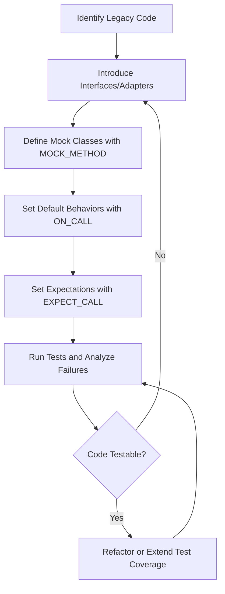

# Testing Legacy and Complex Codebases

GoogleTest offers robust mechanisms and practical strategies specifically designed to help you introduce testing to challenging legacy systems and complex codebases. This guide walks you through approaches to make hard-to-test code testable, practical refactoring techniques, and real-world examples using mocks and parameterized tests.

---

## Why Focus on Legacy and Complex Codebases?

Legacy systems often come with tightly coupled components, non-virtual methods, or code that is not designed for easy mocking or testing. Without effective strategies, adding tests can feel overwhelming or infeasible, slowing down development and increasing risk.

GoogleTest, combined with GoogleMock, helps you incrementally improve test coverage and maintain quality even in difficult scenarios.

---

## Prerequisites

- Familiarity with GoogleTest and GoogleMock basics, including writing simple mocks and setting expectations.
- Installed and configured GoogleTest and GoogleMock in your C++ environment.
- Your codebase’s classes should have virtual destructors and virtual methods for effective mocking.

If these are not yet set up, please consult the [Setup and Installation guide](../getting-started/setup-installation/installation-multiplatform) and the [Writing Your First Test guide](../guides/getting-started/writing-your-first-test).

---

## Key Challenges in Testing Legacy and Complex Codebases

1. **Non-virtual Functions:** Mocking requires virtual functions. Legacy code often has non-virtual interfaces.
2. **Tight Coupling:** Components are directly dependent, making isolated testing difficult.
3. **Large Method Signatures:** Methods with many parameters or complex types are hard to mock and expect.
4. **Overloaded Methods:** Overloads complicate expectation declarations.

---

## Strategies for Introducing Testing

### 1. Identify and Isolate Testable Units

Start by isolating small, meaningful parts of the legacy system. This might require:
- Introducing interfaces or abstract base classes where none exist.
- Wrapping legacy code in new interfaces to enable mocking.

### 2. Mocking Virtual Interfaces

Ensure the classes you want to mock have virtual destructors and virtual methods. If this is not possible immediately, consider using the technique of mocking non-virtual methods via dependency injection (see below).

### 3. Refactor with Delegation to Enable Tests

Instead of forcing legacy code to be directly mockable, create adapter or delegate classes:

```cpp
class LegacySystem {
 public:
  int Compute(int x);  // Non-virtual, hard to mock
};

class LegacySystemAdapter {
 public:
  virtual ~LegacySystemAdapter() {}
  virtual int Compute(int x) {
    return legacy_system_.Compute(x);
  }

 private:
  LegacySystem legacy_system_;
};

// In production, use LegacySystemAdapter directly.
// In tests, mock LegacySystemAdapter.
```

This approach lets you mock the adapter which has virtual methods, while keeping the legacy system untouched.

### 4. Handling Non-Virtual Methods with gMock Injection Patterns

If refactoring to add virtual methods is not feasible, gMock supports *mocking non-virtual methods* via templated dependency injection:

```cpp
class ConcretePacketStream {
 public:
  void AppendPacket(Packet* new_packet);
  const Packet* GetPacket(size_t packet_number) const;
  size_t NumberOfPackets() const;
};

class MockPacketStream {
 public:
  MOCK_METHOD(const Packet*, GetPacket, (size_t packet_number), (const));
  MOCK_METHOD(size_t, NumberOfPackets, (), (const));
};

// Template class can accept either ConcretePacketStream or MockPacketStream.
```

This lets you test with mocks without modifying the original classes.

### 5. Using NiceMock, NaggyMock, and StrictMock to Manage Interaction Noise

Legacy systems often have calls that are not of interest to certain tests:
- Use `NiceMock` to suppress warnings on uninteresting calls.
- Use `NaggyMock` (the default) to warn on unexpected calls.
- Use `StrictMock` to make unexpected calls failures, helping to tighten tests.

```cpp
using ::testing::NiceMock;
NiceMock<MockLegacySystem> mock_legacy;  // Suppresses uninteresting call noise.
```

### 6. Simplify Complex Interfaces with Helper or Adapter Mocks

For functions with numerous parameters or complex types, consider redispatching:

```cpp
class MockLogger : public Logger {
 public:
  void Log(int severity, const char* full_file, const char* base_file,
           int line, const tm* time, const char* message, size_t len) override {
    Log(severity, std::string(full_file), std::string(message, len));
  }

  MOCK_METHOD(void, Log, (int severity, const std::string&, const std::string&));
};
```

This reduces boilerplate for tests and makes expectations clearer.

### 7. Use Parameterized Tests for Complex Scenarios

GoogleTest supports parameterized tests, enabling you to run the same test logic with varying inputs, ideal for legacy code functionalities that operate over many edge cases.

Use [`TEST_P`](https://github.com/google/googletest/blob/main/docs/primer.md#value-parameterized-tests).

---

## Practical Workflow for Testing Legacy Code

<Steps>
<Step title="Add or Identify Interfaces">
Add interfaces or abstract base classes where practical to enable mocking.
</Step>
<Step title="Define Mock Classes with MOCK_METHOD">
Implement mocks for these interfaces using `MOCK_METHOD`. Make sure methods are virtual.
</Step>
<Step title="Set Default Behaviors Using ON_CALL">
Use `ON_CALL` to set default behaviors that apply across tests, minimizing noise and setup.
</Step>
<Step title="Use EXPECT_CALL to Set Expectations">
Define expectations you intend to verify in each test, avoiding over-specification.
</Step>
<Step title="Delegate Legacy Calls if Needed">
If mocking legacy classes directly is not feasible, create adapter layers and mock these.
</Step>
<Step title="Run Tests Incrementally">
Gradually cover more areas of the legacy codebase with tests to reduce risk.
</Step>
</Steps>

---

## Code Examples

### Defining a Mock for a Legacy Interface:

```cpp
class LegacyInterface {
 public:
  virtual ~LegacyInterface() {}
  virtual int Compute(int input) = 0;
};

class MockLegacy : public LegacyInterface {
 public:
  MOCK_METHOD(int, Compute, (int input), (override));
};
```

### Using NiceMock to Suppress Noise:

```cpp
using ::testing::NiceMock;
NiceMock<MockLegacy> mock;

ON_CALL(mock, Compute).WillByDefault(Return(42));
EXPECT_CALL(mock, Compute(5)).Times(1);

int result = mock.Compute(5);  // Expected call
int default_result = mock.Compute(10);  // Uninteresting call, no warning
```

### Delegating Calls to a Fake in Mocks

```cpp
class FakeLegacy : public LegacyInterface {
 public:
  int Compute(int input) override {
    return input * 2;  // Simple fake implementation
  }
};

class MockLegacy : public LegacyInterface {
 public:
  MockLegacy() {
    ON_CALL(*this, Compute).WillByDefault(
        [this](int input) { return fake_.Compute(input); });
  }

  MOCK_METHOD(int, Compute, (int input), (override));

 private:
  FakeLegacy fake_;
};
```

This pattern allows your mock to behave like the real object by default but lets tests override behavior.

### Parameterized Tests Example

```cpp
class LegacyTest : public ::testing::TestWithParam<int> {};

TEST_P(LegacyTest, ComputesCorrectly) {
  MockLegacy mock;
  ON_CALL(mock, Compute).WillByDefault(ReturnArg<0>());

  int input = GetParam();
  EXPECT_EQ(mock.Compute(input), input);
}

INSTANTIATE_TEST_SUITE_P(
    ValidInputs, LegacyTest, ::testing::Values(1, 2, 5, 10));
```

---

## Common Pitfalls and Troubleshooting

### Virtual Functions Requirement

Ensure that all methods you want to mock are declared `virtual`. Otherwise, GoogleMock calls the real method instead of the mock method.

<Accordion title="How to fix non-virtual method mocking issues">
Make the base class method `virtual`, or use the high-performance dependency injection technique to mock non-virtual methods as described in the [gMock Cookbook](docs/gmock_cook_book.md#MockingNonVirtualMethods).
</Accordion>

### Over-Specified Expectations

Too strict expectations can cause brittle tests that fail despite correct behavior changes.

<Tip>
Use `ON_CALL` for setting default behaviors and `EXPECT_CALL` only for behaviors you specifically want to verify.
</Tip>

### Uninteresting vs Unexpected Calls

- *Uninteresting calls* occur when a method with no expectation is invoked. These generate warnings but not failures.
- *Unexpected calls* occur when a method call does not match any existing expectation. These are failures.

Use `NiceMock` to suppress uninteresting call warnings, and `StrictMock` to treat them as errors.

### Memory Leaks of Mock Objects

GoogleMock reports errors if your mocks are leaked because their destructors verify expectations.

<Warning>
Avoid leaking mock objects. If intentional, use `Mock::AllowLeak(&mock_obj)` to suppress the error.
</Warning>

### Using EXPECT_CALL Order Properly

GoogleMock expects expectations to be set before the method calls occur. Setting expectations after calls leads to undefined behavior.

---

## Best Practices

- **Code to Interfaces:** Introduce abstract interfaces to decouple dependencies.
- **Avoid Over-Mocking:** Mock only what you need to verify.
- **Use Delegation:** Wrap legacy code with adapter objects for easier mocking.
- **Retire Expectations Wisely:** Use `RetiresOnSaturation()` to prevent conflicts when repeated calls overlap expectations.
- **Sequence and Ordering:** Use `Sequence` and `.InSequence()` to test call order, especially when refactoring complex flow.
- **Parameterize Tests:** Simplify repetitive tests with GoogleTest’s parameterized test features.

---

## Next Steps & Related Reading

- [Introduction to Mocking](../guides/mocking-techniques/introduction-to-mocking) – Learn basics of creating and using mocks.
- [Delegating to Real or Fake Objects](docs/gmock_cook_book.md#DelegatingToFake) – Explore delegation patterns.
- [Mocking Patterns & Best Practices](../guides/mocking-techniques/mocking-patterns-and-best-practices) – Tips for robust mocks.
- [Using Assertions Effectively](../guides/core-workflows/using-assertions-effectively) – Improve test expressiveness.
- [Parameterized and Type-Parameterized Tests](../guides/core-workflows/parameterized-and-type-parameterized-tests) for systematic test coverage.
- [Troubleshooting Setup](../getting-started/first-steps-validation/troubleshooting-setup) for environment issues.

---

For further inspiration, check the [Legacy gMock FAQ](https://google.github.io/googletest/gmock_faq.html) that addresses common legacy-related challenges and advanced tips.

---

## Summary Diagram: Legacy Testing Workflow



This cycle guides refactoring and test coverage improvement for legacy and complex systems.
