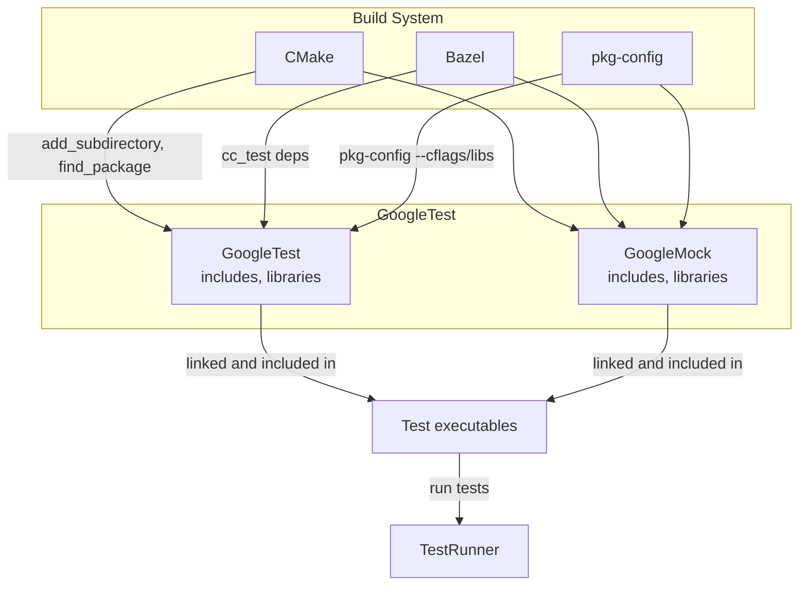

# Integrating with Build Systems

This guide provides step-by-step integration examples for using GoogleTest and GoogleMock with popular build systems including CMake, Bazel, and pkg-config. It covers how to manage dependencies, organize output files, and configure your project to build tests efficiently and correctly.

---

## Workflow Overview

### Purpose
Learn how to seamlessly integrate GoogleTest and GoogleMock into your existing build environment using CMake, Bazel, and pkg-config. This will enable you to write, build, and run tests smoothly within your project's build setup.

### Prerequisites
- A C++17 compiler compatible with GoogleTest.
- Installed GoogleTest/GoogleMock source or package.
- Familiarity with your chosen build system: CMake or Bazel.

### Expected Outcome
By following this guide, you will have a configured build system that:
- Correctly compiles and links GoogleTest and GoogleMock with your code.
- Organizes output binaries and test files clearly.
- Supports flexible test dependency management.

### Time Estimate
Approximately 30-60 minutes depending on build system familiarity and project setup.

### Difficulty Level
Intermediate – requires understanding of build tools and project configuration.

---

## Integration via CMake

CMake is the most common build system and integrates well with GoogleTest and GoogleMock. Here's how to configure your CMakeLists.txt for test builds.

### 1. Adding GoogleTest as a Dependency

You can add GoogleTest as a subdirectory (if you have the source), or find a system-installed package.

#### Using GoogleTest Source as Subdirectory

```cmake
# Add GoogleTest source
add_subdirectory(path/to/googletest)

# Link your test executable with gtest and gmock
add_executable(my_test test.cpp)
target_link_libraries(my_test gtest gmock gtest_main)
```

#### Using pkg-config to Find Installed GoogleTest

GoogleTest can be found via `pkg-config`. If it is installed system-wide:

```cmake
find_package(PkgConfig REQUIRED)
pkg_check_modules(GTEST REQUIRED gtest_main)

add_executable(my_test test.cpp)
target_include_directories(my_test PRIVATE ${GTEST_INCLUDE_DIRS})
target_link_libraries(my_test ${GTEST_LIBRARIES})
```

### 2. Organizing Output Binaries

Keep your test binaries distinct from your main application.

```cmake
set(TEST_OUTPUT_DIR ${CMAKE_BINARY_DIR}/test_bins)
set_target_properties(my_test PROPERTIES
  RUNTIME_OUTPUT_DIRECTORY ${TEST_OUTPUT_DIR})
```

### 3. Managing Dependencies and Includes

Make sure your test target links to all needed libraries, including Abseil if your project uses it, and GoogleTest.

```cmake
# Link additional dependencies as needed (e.g., absl)
target_link_libraries(my_test absl::base)
```

### 4. Running Tests with CTest

Enable CTest in your CMake setup to easily run tests:

```cmake
enable_testing()
add_test(NAME MyTest COMMAND my_test)
```

On the command line:

```bash
ctest -V
```

### Practical Tips
- Use `gtest_main` for convenience, which defines a main() for running tests.
- If you maintain GoogleTest as a submodule, ensure it is kept up-to-date.
- Use `set(CMAKE_CXX_STANDARD 17)` to ensure proper compiler support.

---

## Integration via Bazel

Bazel offers native support for GoogleTest and GoogleMock.

### 1. Declaring Dependencies

In your `BUILD` file:

```python
cc_test(
    name = "my_test",
    srcs = ["my_test.cc"],
    deps = ["//third_party:googletest"],
)
```

Use the `cc_test` rule which automatically builds and runs test binaries.

### 2. Organizing Source

Keep your test files separate under a `tests/` directory or similar.

### 3. Managing Outputs

Bazel handles output directories internally but you can specify custom outputs if desired.

### 4. Running Tests

Run your tests with:

```bash
bazel test //path/to:my_test
```

### Practical Tips
- Use `@com_google_googletest` external repository if you want the latest GoogleTest.
- Keep your test dependencies minimal to reduce build time.

---

## Integration via pkg-config

Use pkg-config primarily for locating installed GoogleTest and GoogleMock libraries and includes.

### 1. Finding GoogleTest

Check that `gtest` and `gmock` pkg-config files are installed:

```bash
pkg-config --exists gtest && echo Installed
pkg-config --exists gmock && echo Installed
```

### 2. Compiling with pkg-config

Use in your Makefile or build script:

```bash
CXXFLAGS += $(pkg-config --cflags gtest)
LDFLAGS += $(pkg-config --libs gtest)

$(CXX) my_test.cc -o my_test $(CXXFLAGS) $(LDFLAGS)
```

### 3. Managing Output

Direct your build artifacts to a separate test directory.

### Practical Tips
- Ensure pkg-config paths are set correctly for your environment.
- Use pkg-config in combination with existing build tools to simplify dependency management.

---

## Troubleshooting & Tips

- **Missing includes or link errors:** Verify that your build system finds the correct GoogleTest and GoogleMock includes and libraries.
- **C++ Standard mismatch:** Make sure your compiler uses C++17 or higher.
- **Link order:** Libraries should generally be linked after your test object files.
- **Conflicting versions:** Avoid mixing GoogleTest binaries from different sources or versions.
- **Submodule issues:** If you use git to embed GoogleTest, update submodules properly.
- **Verbose test output:** Use `ctest -V` or Bazel's verbose flag to diagnose test runtime issues.

---

## Summary

Integrating GoogleTest and GoogleMock into your build systems involves managing dependencies, build targets, and output organization. Be mindful of the build system specifics:
- CMake: use `add_subdirectory`, `target_link_libraries`, and `enable_testing`.
- Bazel: define `cc_test` with proper deps.
- pkg-config: use it to find installed libs and includes.

Following best practices for separation of test artifacts and ensuring correct compiler flags will optimize build and test execution.

---

## References

- [GoogleTest Primer](/docs/primer.md)
- [Using GoogleMock](/docs/gmock_for_dummies.md)
- [Mocking Reference](/docs/reference/mocking.md)
- [gMock Cookbook](/docs/gmock_cook_book.md)
- [Building and Running Tests Guide](/getting-started/first-test-run/run-test.md)
- [CMake Official Documentation](https://cmake.org/documentation/)
- [Bazel Documentation](https://docs.bazel.build/)

---

## Example CMakeLists.txt snippet for GoogleTest and GoogleMock

```cmake
cmake_minimum_required(VERSION 3.14)
project(MyProject CXX)

set(CMAKE_CXX_STANDARD 17)

# Add GoogleTest as a subdirectory
add_subdirectory(external/googletest)

enable_testing()

# Add your test source files
add_executable(my_test test/foo_test.cpp)

# Link against gtest, gmock, and pthread
target_link_libraries(my_test gtest gmock_main pthread)

enable_testing()
add_test(NAME MyTest COMMAND my_test)
```

---

## Example simple Bazel BUILD file snippet for a test

```python
# BUILD
cc_test(
    name = "foo_test",
    srcs = ["foo_test.cc"],
    deps = ["@com_google_googletest//:gmock_main"],
)
```

---

## Summary Diagram of Integration Concepts



---

<Tip>
Use `gtest_main` or `gmock_main` where possible to avoid manually writing main functions for test executables.
</Tip>

<Note>
When using GoogleMock in CMake or Bazel, ensure your compiler flags include C++17 standard support and any necessary threading support.
</Note>

<Warning>
Avoid mixing different versions of GoogleTest and GoogleMock sourced differently within the same project to prevent linker conflicts.
</Warning>

---

For further guidance, consult the related [GoogleTest Primer](../primer.md) and [Using GoogleMock cookbook](../guides/advanced-testing-patterns/using-googlemock.md).


