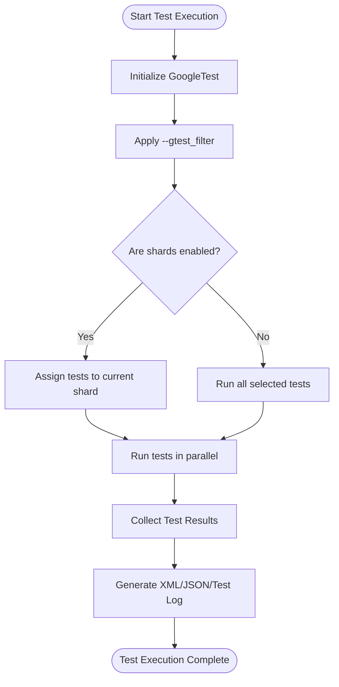

# Scaling Test Suites and Performance Optimization

## Overview

Large test suites are critical for ensuring software quality but can introduce challenges related to test execution time and feedback latency. This guide presents strategies and best practices to optimize the performance of extensive test suites when using GoogleTest, helping you keep tests fast and maintain a productive development workflow.

## Goals of Test Suite Scaling

- **Reduce overall execution time:** Enable tests to complete quickly to provide timely feedback.
- **Maintain test correctness and reliability:** Optimizations should not compromise test independence or thoroughness.
- **Improve resource utilization:** Efficiently leverage hardware and CI environments.
- **Simplify maintenance and debugging:** Avoid overly complex setups that obstruct test clarity.

## Key Techniques for Performance Optimization

### 1. Test Parallelization

**What it is:** Running tests concurrently to utilize multiple CPU cores or machines.

**How to apply:**

- **Local parallel execution:** Use test runners or build systems that support parallel test execution such as `--gtest_parallel` wrappers or invoking multiple test binaries in parallel.
- **Test Sharding:** Split tests into mutually exclusive subsets (shards) and execute each shard on a different machine or process.
  - Set environment variables `GTEST_TOTAL_SHARDS` and `GTEST_SHARD_INDEX` as documented in the [Advanced Guide](docs/advanced.md#running-test-shards).

**Best practices:**
- Ensure tests are independent and do not rely on shared mutable state.
- Disable or adjust death tests which may have challenges running correctly in parallel.
- Use environment isolated test setups to avoid flaky tests.

### 2. Test Filtering and Selection

**What it is:** Running only a relevant subset of tests to optimize cycle times.

**Approaches:**

- **Test name filtering:** Use the `--gtest_filter` flag to include or exclude particular test suites or tests by name patterns.
  ```
  ./my_test_binary --gtest_filter=MyTestSuite.*  # Run only tests in MyTestSuite
  ./my_test_binary --gtest_filter=-*Flaky*       # Run all except tests with "Flaky" in name
  ```
- **Disabled tests:** Temporarily prefix troublesome tests with `DISABLED_` to skip during routine runs, re-enable when fixes are available.
- **Incremental runs:** Use custom scripts or CI logic to run subsets of tests affected by recent code changes.

**Tips:**
- Combine filtering with parallelization to achieve rapid feedback on critical paths.
- Use naming conventions consistently for easier filter expressions.

### 3. Test Fixture and Resource Optimization

**Context:** Expensive setup and teardown for test fixtures can slow tests significantly.

**Strategies:**

- Use `SetUpTestSuite()` and `TearDownTestSuite()` instead of `SetUp()` and `TearDown()` to share expensive resources among tests in the same test suite.
  ```c++
  class MyTest : public ::testing::Test {
  protected:
    static void SetUpTestSuite() {
      resource_ = new ExpensiveResource();
    }
    static void TearDownTestSuite() {
      delete resource_;
      resource_ = nullptr;
    }

    static ExpensiveResource* resource_;
  };

  ExpensiveResource* MyTest::resource_ = nullptr;
  ```
- Cache and reuse connections, files, or data needed across multiple tests, but ensure tests maintain isolation.

### 4. Avoiding Global Test Contention and Side Effects

- Avoid unwarranted shared global state that can cause serialization or flakiness in parallel or repeated runs.
- Prefer test fixtures over global variables for better isolation.

### 5. Skipping or Disabling Flaky or Slow Tests

- Mark flaky tests `DISABLED_` to keep them from affecting speed until they are fixed.
- Use the `GTEST_SKIP()` macro to conditionally skip tests at runtime when preconditions are unmet.

### 6. Efficient Test Execution Order

- Use the `--gtest_shuffle` flag to randomize test order and discover unexpected dependencies.
- Repeat runs with `--gtest_repeat` to detect flaky tests.
- Consider grouping related tests into suites to improve cache/locality and execution efficiency.

### 7. Generating and Using Test Reports

- Enable XML or JSON output with `--gtest_output=xml:filename.xml` or `--gtest_output=json:filename.json` to integrate with CI dashboards and measure test duration.

## Sample Workflow: Parallel, Filtered Test Execution

1. Divide tests into shards based on changes or logical grouping by setting `GTEST_TOTAL_SHARDS` and `GTEST_SHARD_INDEX`.
2. Use `--gtest_filter` on each shard to run only relevant tests.
3. Run shards in parallel across machines or containers.
4. Merge results using XML reports for a complete status.

## Best Practices Summary

- Use **independent tests** for reliable parallel execution.
- Prefer **test fixtures** with shared setup/teardown for expensive resources.
- Use **filtering and disabling** to focus runs on critical or stable tests.
- Employ **sharding** in CI systems for scalability.
- Enable **reporting** to monitor test durations and failures.
- Regularly **shuffle and repeat** tests to detect non-determinism.

## Troubleshooting Common Performance Pitfalls

| Issue                                   | Solution                                   |
|-----------------------------------------|--------------------------------------------|
| Tests run serially despite resources    | Verify test independence, avoid globals, use sharding or parallel runners. |
| Death tests hanging or failing in parallel | Run death tests separately or in "threadsafe" mode (`GTEST_FLAG_SET(death_test_style, "threadsafe")`). |
| Test fixtures with expensive setup per test | Use `SetUpTestSuite` / `TearDownTestSuite` for shared fixtures. |
| Flaky or timing-dependent tests          | Disable or isolate flaky tests; add explicit synchronization or mocks. |

## Additional Resources

- [GoogleTest Primer](primer.md) – Getting started with simple tests.
- [Advanced Guide](advanced.md) – Deep dive into fixtures, death tests, and flags.
- [Running Tests](getting-started/first-test-run/run-tests.md) – How to run and filter tests.
- [Death Tests Guide](guides/core-workflows/death-tests.mdx) – Special considerations for death tests.
- [Integration with Build Systems](overview/use-cases-integration/integration-with-build-systems.mdx) – Setting up with CMake or Bazel.

## Practical Tips

- Use **`GTEST_FLAG_SET(death_test_style, "threadsafe")`** in main() for safer death tests in concurrent environments.
- Run tests with `--gtest_repeat=N` along with sharding and filtering to isolate flaky tests.
- Use continuous integration to run full test suites regularly while relying on filtered and parallel runs for developer feedback.

---

# Diagram: Basic Test Execution Flow with Sharding and Parallelism



This flow shows how GoogleTest processes filtered tests, optionally shards them for parallel execution, collects results and generates reports.

---

## Summary

Optimizing large GoogleTest suites involves parallel execution, selective test filtering, smart fixture design, and test sharding. Employ these practices to reduce feedback cycle times and maintain healthy test coverage.
