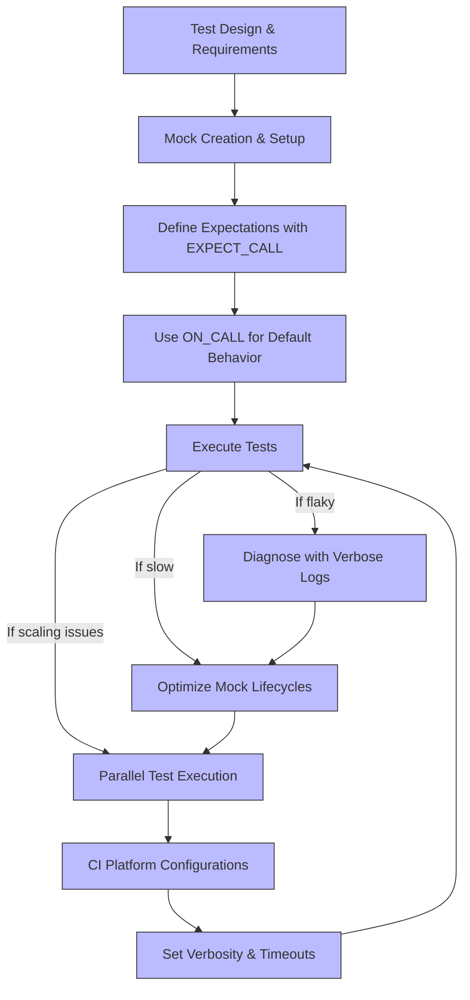

# Test Performance and Scaling Best Practices

## Overview

This guide provides actionable strategies for writing fast, reliable tests that scale effectively as your test suite grows. It emphasizes minimizing test flakiness, optimizing the lifecycle of mock objects, executing tests in parallel, and managing platform-specific nuances in Continuous Integration (CI) environments.

By applying these best practices, you will achieve more performant tests and reduce maintenance overhead, ensuring your testing pipeline remains robust and efficient.

---

## 1. Minimize Test Flakiness

Flaky tests are tests that sometimes pass and sometimes fail without changes to the code under test. They severely undermine trust in your testing process.

### Action Steps

- **Use Mocks for External Dependencies:** Replace real, unreliable resources (network, databases) with mocks using GoogleMock (`gMock`). This isolates your tests from external factors.
- **Set Expectations Early:** Use `EXPECT_CALL()` to define expectations on mock calls before exercising the code under test, preventing undefined behaviors.
- **Avoid Over-Specification:** Specify only essential argument matchers in `EXPECT_CALL`. Use wildcards (`_`) when argument values are irrelevant.
- **Employ Sequences Judiciously:** Use `InSequence` or `Sequence` objects to enforce call ordering **only when the order matters**, avoiding brittle over-constraining.
- **Retire Expectations on Saturation:** Use `.RetiresOnSaturation()` to disable expectations once fulfilled, preventing unexpected call failures.
- **Use `NiceMock` for Non-Critical Methods:** Wrap mock classes in `NiceMock` to suppress warnings on uninteresting calls, reducing noise in test output.

### Verification

Run your tests multiple times in isolation and watch for intermittent failures. Failures often indicate flakiness issues.

---

## 2. Optimize Mock Object Lifecycles

Efficient mocking not only makes tests predictable but also speeds up execution.

### Action Steps

- **Define Mocks Closely to Tested Code:** Place mock classes near the interfaces they mock to avoid breaking changes and reduce recompilation.
- **Avoid Unnecessary Mocking:** Mock only dependencies you own or that are expensive/unreliable to use in tests.
- **Use `ON_CALL()` for Default Behavior:** Define common mock behaviors with `ON_CALL()` to reduce repeated boilerplate in individual tests.
- **Set Default Actions Smartly:** Use `DefaultValue<T>::Set()` for return types to prevent unexpected defaults causing slowdowns or failures.
- **Reuse Mocks When Possible:** In fixtures, create mock objects once per test to avoid repeated construction/destruction.
- **Suppress Unnecessary Verification:** In long-running tests, explicitly verify mock expectations early (via `Mock::VerifyAndClearExpectations()`) if they won't be destroyed soon.

### Verification

Measure test binary startup and teardown times. Excessive mock construction/destruction usually shows here.

---

## 3. Parallel Test Execution

Parallelization dramatically reduces overall test suite runtime but requires careful management.

### Action Steps

- **Isolate Tests:** Ensure tests do not share mutable static or global state.
- **Avoid Shared Resources:** No test should depend on the presence or absence of files, environment variables, or network resources altered by other tests.
- **Use Thread-Safe Mocks:** GoogleMock supports thread-safe mock usage when expectations are set before use and objects are not concurrently modified.
- **Group Tests by Resource Usage:** Organize tests to avoid parallel runs of tests that compete for the same resource.
- **Configure CI Pipelines to Run Tests in Parallel:** Use your build system or CI tool's native parallel test execution features.
- **Watch for Flaky Failures:** Parallelism can expose subtle concurrency bugs; use `--gmock_verbose=info` to diagnose.

### Verification

Run `stress-test` style tests targeting concurrency and mock usage, ensure no failures under high parallel load.

---

## 4. Handle Platform-Specific Behaviors in CI Pipelines

CI environments may introduce unique constraints causing test failures or excessive runtimes.

### Action Steps

- **Use Default `main()` from gMock:** Leverage the default `main()` provided by gMock (`gmock_main.cc`) for proper initialization across platforms.
- **Parse GoogleMock Flags in CI:** Use `testing::InitGoogleMock(&argc, argv)` early to prepare the framework.
- **Set Verbosity Levels Intelligently:** For CI logs, use `--gmock_verbose=error` to reduce noise; for debugging flaky tests locally, use `info`.
- **Adjust Timeouts:** Increase test timeouts in slower CI environments to reduce false flakes.
- **Isolate Environment Variables:** Do not rely on environment variables that vary unpredictably; set all required variables explicitly in CI config.
- **Capture and Analyze Logs:** Collect gMock's detailed mock call traces using `--gmock_verbose=info` for flaky diagnostics.

### Verification

Run tests in your CI environment frequently and monitor flake rates and test durations.

---

## Practical Tips and Common Pitfalls

- **Avoid Expectation Side Effects Misuse:** Avoid using expressions with side effects in `.WillOnce()` or `.WillRepeatedly()`, e.g., `Return(n++)`; such expressions evaluate once leading to unintuitive results.
- **Do Not Mock Non-Virtual Methods Without Care:** Prefer mocking virtual methods or using template-based mocking as documented.
- **Beware of Sticky Expectations:** Expectations remain active until saturation unless retired; use `.RetiresOnSaturation()` to avoid unexpected call failures.
- **Use `EXPECT_CALL()` Sparingly:** Overusing `EXPECT_CALL` with strict times or order constraints can make tests brittle.

---

## Summary Diagram

---

## Additional Resources

- [gMock for Dummies](https://google.github.io/googletest/gmock_for_dummies.html) - Beginner-friendly guide on creating and using mocks.
- [Mocking Reference](https://google.github.io/googletest/reference/mocking.html) - Detailed API and usage.
- [gMock Cookbook](https://google.github.io/googletest/gmock_cook_book.html) - Recipes and patterns for advanced mocking.
- [gMock Cheat Sheet](https://google.github.io/googletest/gmock_cheat_sheet.html) - Quick reference for macros and best practices.
- [Running Tests in CI](https://google.github.io/googletest/guides/real-world-integration/using-google-test-in-your-build-system.html) - Guide for integrating tests into various CI systems.

---

## Troubleshooting Common Issues

<AccordionGroup title="Troubleshooting">
<Accordion title="Test Flakiness">
If tests fail intermittently:
- Confirm mock expectations are set before use.
- Check for race conditions or shared test state.
- Use `--gmock_verbose=info` to trace calls.
- Inspect test dependencies on external resources.
</Accordion>
<Accordion title="Slow Tests">
- Profile tests to identify costly mocks or setups.
- Replace real objects with lightweight mocks/fakes.
- Move mock constructor/destructor definitions to `.cc` files to reduce compile time overhead.
- Reuse mock instances in fixtures instead of recreating per test.
</Accordion>
<Accordion title="Parallel Test Failures">
- Verify tests do not share mutable global state.
- Use synchronization or split tests into isolated suites.
- Disable parallel runs temporarily to isolate flaky behavior.
</Accordion>
<Accordion title="CI-Specific Failures">
- Adjust verbosity for clearer failure logs.
- Set appropriate timeouts considering CI resource constraints.
- Check environment variable differences from local runs.
- Ensure proper test initialization with `testing::InitGoogleMock()`.
</Accordion>
</AccordionGroup>