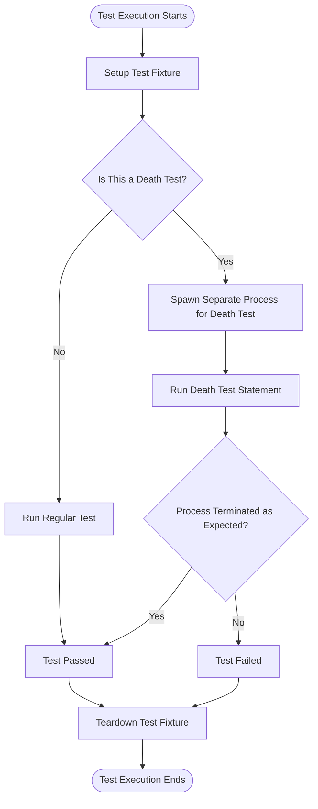

# Testing Edge Cases and Advanced Techniques

Explore robust techniques for testing complex conditions including error-handling, death tests, multi-threading, and integration with other frameworks. This guide empowers you to cover difficult scenarios and significantly enhance your test coverage.

---

## 1. Overview

### What You Will Accomplish
This guide helps you master advanced GoogleTest workflows for:

- Writing reliable **death tests** that validate program termination behaviors.
- Testing **error handling** paths thoroughly to cover edge cases.
- Managing **multi-threaded tests**, ensuring thread-safe and deterministic outcomes.
- Integrating GoogleTest with other frameworks for improved interoperability.

### Prerequisites
- Familiarity with basic GoogleTest usage, including writing `TEST` and `TEST_F` cases.
- Understanding of test fixtures and the test lifecycle (`SetUp`, `TearDown`).
- Basic C++ knowledge, including classes and templates.

### Expected Outcome
By following this guide, you will be able to confidently write tests handling tough cases:

- Validate code that crashes or exits.
- Test multi-threaded components without flakiness.
- Leverage typed and parameterized tests for cleaner code reuse.
- Use GoogleTest's event listener API to customize test reporting.

### Time Commitment
Approximately 30-60 minutes to read and begin applying techniques, longer for comprehensive implementation.

### Difficulty Level
Intermediate to Advanced

---

## 2. Advanced Testing Techniques

### 2.1 Writing Death Tests

Death tests assert that a piece of code terminates the process in a controlled manner.

#### When to Use Death Tests
- To verify assertion failures that terminate the process.
- To check that invalid program states cause termination.

#### How To Write Death Tests
Use `ASSERT_DEATH()` or `EXPECT_DEATH()` macros.

```cpp
TEST(MyDeathTest, CrashesOnNullPointer) {
  ASSERT_DEATH(
    doSomething(nullptr),
    "Null pointer error"
  );
}
```

- The first argument is a statement or block expected to cause termination.
- The second is a regular expression or matcher matching the stderr output.

#### Important Guidelines
- Name your death-test suites or fixtures with the suffix `DeathTest` to ensure they run before other suites (avoiding threading issues).
- Death tests run in sub-processes, so any side-effect in the death test is isolated.
- Use the `death_test_style` flag to choose between "fast" and "threadsafe" modes:

```cpp
GTEST_FLAG_SET(death_test_style, "threadsafe");
```

- Avoid multiple death assertions on the same line.

#### Caveats
- Because death tests fork or spawn a new process, resource leaks or mock expectations inside a death test may not be visible to the parent.
- Logging output appears only when death tests fail.

### 2.2 Testing Error Handling Paths

Many bugs hide in rare or unexpected error paths. Verify these paths with explicit tests.

#### Using Exception Assertions
- Use `EXPECT_THROW`, `ASSERT_THROW`, `EXPECT_NO_THROW`, and `ASSERT_NO_THROW` to check exception behavior.

```cpp
TEST(ExceptionTest, ThrowsOnBadInput) {
  EXPECT_THROW(ProcessInput(bad_input), std::invalid_argument);
}
```

- For verifying any exception, use `EXPECT_ANY_THROW`.

#### Using AssertionFailure and Custom Assertions
Create predicate functions that return `AssertionResult` for more expressive failure messages.

```cpp
testing::AssertionResult IsValid(const MyType& x) {
  if (x.IsValid()) return testing::AssertionSuccess();
  return testing::AssertionFailure() << "Invalid object: " << x.details();
}

TEST(ValidationTest, ObjectsAreValid) {
  EXPECT_TRUE(IsValid(my_object));
}
```

#### Adding Context with Traces
Use `SCOPED_TRACE()` to add contextual information on failures inside helper functions:

```cpp
SCOPED_TRACE("Checking input set 3");
EXPECT_EQ(foo(x), expected_value);
```

This will print the trace info with the failure message.

### 2.3 Testing Multi-threaded Code

Multi-threaded code brings non-determinism, which can cause flaky tests.

#### Best Practices
- Ensure no racing between threads and the main test thread.
- Use synchronization primitives (e.g., mutexes, condition variables).
- Use GoogleTest's `EXPECT_NO_FATAL_FAILURE()` to catch failures in spawned threads.

```cpp
ASSERT_NO_FATAL_FAILURE({
  std::thread t([]() {
    EXPECT_TRUE(IsReady());
  });
  t.join();
});
```

- Avoid shared mutable state or restore it after tests.

#### Threadsanitizer Integration
GoogleTest can integrate with sanitizers for detecting race conditions; override sanitizer hooks to fail tests:

```cpp
extern "C" {
void __tsan_on_report() {
  FAIL() << "Thread sanitizer detected race condition";
}
}
```

### 2.4 Typed and Type-Parameterized Tests

Use GoogleTest typed tests to run identical test logic across different types.

#### Typed Tests
Define a fixture template and specify a fixed list of types.

```cpp
template <typename T>
class MyTypedTest : public ::testing::Test {
 public:
  T value_;
};

using MyTypes = ::testing::Types<int, double, char>;
TYPED_TEST_SUITE(MyTypedTest, MyTypes);

TYPED_TEST(MyTypedTest, WorksForAllTypes) {
  TypeParam val = this->value_;
  EXPECT_TRUE(val == val);
}
```

#### Type-Parameterized Tests
Define abstract tests and instantiate them later with the desired types.

```cpp
TYPED_TEST_SUITE_P(MyTestPattern);

TYPED_TEST_P(MyTestPattern, DoesSomething) {
  TypeParam n = 0;
  ...
}

REGISTER_TYPED_TEST_SUITE_P(MyTestPattern, DoesSomething);

using Implementations = ::testing::Types<int, float>;
INSTANTIATE_TYPED_TEST_SUITE_P(MyImpls, MyTestPattern, Implementations);
```

### 2.5 Value-Parameterized Tests

Allow running multiple instances of a test with varying input values.

```cpp
class MyParamTest : public ::testing::TestWithParam<int> {};

TEST_P(MyParamTest, HandlesValues) {
  EXPECT_LT(GetParam(), 100);
}

INSTANTIATE_TEST_SUITE_P(RangeTest, MyParamTest, ::testing::Range(0, 5));
```

Use generators like `Values()`, `Range()`, `Combine()`, and `Bool()` to produce test parameters.

### 2.6 Integrating with Other Frameworks

GoogleTest provides an event listener API for reacting to test execution events.

#### Defining an Event Listener

Subclass `::testing::TestEventListener` or `::testing::EmptyTestEventListener` and override methods for test lifecycle events.

```cpp
class MyListener : public ::testing::EmptyTestEventListener {
  void OnTestStart(const ::testing::TestInfo& info) override {
    printf("Starting test %s.%s\n", info.test_suite_name(), info.name());
  }
};
```

#### Using Your Listener

Add your listener to GoogleTest in `main()` before running tests:

```cpp
int main(int argc, char** argv) {
  ::testing::InitGoogleTest(&argc, argv);
  auto& listeners = ::testing::UnitTest::GetInstance()->listeners();
  delete listeners.Release(listeners.default_result_printer());  // Disable default console output
  listeners.Append(new MyListener);
  return RUN_ALL_TESTS();
}
```

This allows deep customization of reporting and integration with external systems.

---

## 3. Step-by-Step: Writing a Death Test

Follow this workflow to implement a robust death test.

<Steps>
<Step title="Define Your Death Test Fixture (Optional)">
If your death test shares common setup, create a fixture class derived from `::testing::Test` or reuse an existing fixture.
</Step>
<Step title="Write Death Test Using ASSERT_DEATH or EXPECT_DEATH">
Write a test case that calls the code expected to terminate. Supply a regex matching expected error output.

```cpp
TEST(FooDeathTest, TerminatesOnInvalidInput) {
  ASSERT_DEATH({ Foo f; f.Process(nullptr); }, "Null pointer");
}
```
</Step>
<Step title="Choose Death Test Style">
Set the death test style to control trade-off between speed and thread safety.

```cpp
GTEST_FLAG_SET(death_test_style, "threadsafe");  // safer, slower
```
</Step>
<Step title="Run and Verify">
Run your test binary and verify the death test passes.

Use filters and logging if needed to isolate failures.
</Step>
</Steps>

---

## 4. Best Practices & Troubleshooting

### Common Pitfalls
- **Multiple threads before death tests:** If you see hangs or crashes, ensure tests do not spawn background threads before death test execution or use "threadsafe" style.
- **Resource leaks in death tests:** Objects allocated in death test statements may leak because tests run in subprocesses; manage resources accordingly.
- **Multiple death assertions on one line:** Avoid as this causes compilation errors.

### Tips for Reliable Tests
- Use `SCOPED_TRACE()` to add context to complex assertions.
- Prefer non-fatal assertions (`EXPECT_*`) to continue tests after failure unless immediate abort is necessary.
- Use `ASSERT_NO_FATAL_FAILURE()` to wrap helper code that may invoke fatal assertions.
- Use typed and parameterized tests to reduce code duplication.

### Performance Considerations
- Death tests cause process spawning, slowing tests. Use sparingly and group related death tests.
- Use sharding (`GTEST_TOTAL_SHARDS`, `GTEST_SHARD_INDEX`) to parallelize test execution.

### Advanced: Catching Failures in Subroutines
If a subroutine uses fatal assertions, the test continues unless you handle failure explicitly:

- Use `::testing::Test::HasFatalFailure()` after the subroutine call to abort early.
- Use a test event listener that throws exceptions on fatal failures for stricter control.

### Troubleshooting
- Missing death test output? Check if the death test failed unexpectedly or output was captured.
- Unexpected test hangs? Run with `--gtest_death_test_style=threadsafe` to mitigate threading issues.
- Tests silently passing when they should fail? Ensure you return `RUN_ALL_TESTS()` from your `main()`.

---

## 5. Next Steps & Related Materials

- Explore [GoogleTest Primer](primer.md) to grasp fundamental concepts.
- Visit [Assertions Reference](reference/assertions.md) to master test validations.
- Review [GoogleTest Advanced](advanced.md) topics for deeper mastery.
- Explore [GoogleTest Samples](samples.md) for real-world code examples.
- Delve into [Value and Type-Parameterized Tests](reference/testing.md#types) for reusable test design.
- Check [Event Listener API](reference/testing.md#TestEventListener) to customize test reporting.

---

## Additional References

- [Death Tests](advanced.md#death-tests)
- [Parameterized Tests](advanced.md#value-parameterized-tests)
- [Typed Tests](advanced.md#typed-tests)
- [Adding Traces to Assertions](advanced.md#adding-traces-to-assertions)
- [Running a Subset of the Tests](advanced.md#running-a-subset-of-the-tests)

---

## Visualizing Death Test Workflow



This diagram shows the unique path death tests follow, highlighting process spawning and verification of termination.

---

# Summary

This guide detailed advanced GoogleTest techniques for handling edge cases: death tests, multi-threaded scenarios, error handling, and framework integration. Key workflows and best practices were presented with real-world usage examples and troubleshooting advice.

---

## Sample Code

Example of writing a death test:

```cpp
// Define a death test suite
class FooDeathTest : public ::testing::Test {};

TEST_F(FooDeathTest, TerminatesOnInvalidInput) {
  // Expect the function to die with specific error message
  ASSERT_DEATH({ Foo().Process(nullptr); }, "Null pointer error");
}
```

---

Test event listener example:

```cpp
class MinimalistListener : public ::testing::EmptyTestEventListener {
 public:
  void OnTestStart(const ::testing::TestInfo& test_info) override {
    std::cout << "Test started: " << test_info.test_suite_name()
              << "." << test_info.name() << std::endl;
  }

  void OnTestEnd(const ::testing::TestInfo& test_info) override {
    std::cout << "Test ended: " << test_info.test_suite_name()
              << "." << test_info.name() << std::endl;
  }
};

int main(int argc, char** argv) {
  ::testing::InitGoogleTest(&argc, argv);
  auto& listeners = ::testing::UnitTest::GetInstance()->listeners();
  delete listeners.Release(listeners.default_result_printer());
  listeners.Append(new MinimalistListener);
  return RUN_ALL_TESTS();
}
```


