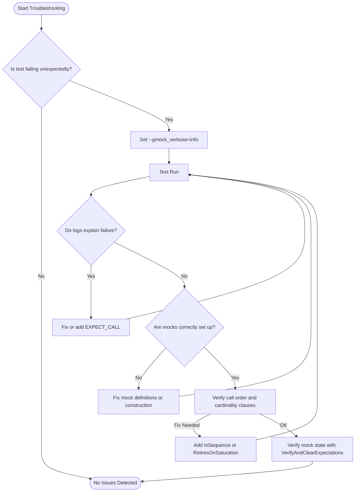

# Troubleshooting and FAQ

Common issues encountered when using GoogleTest and GoogleMock, along with clear, actionable solutions and references to the most relevant FAQs and community support resources.

---

## 1. Overview

This page equips you with practical guidance to diagnose and resolve frequent challenges when working with GoogleTest and GoogleMock. Whether you encounter compilation errors, unexpected mock behaviors, or test failures due to unmet expectations, this guide helps you navigate solutions efficiently.

It complements the other getting started and reference docs by focusing specifically on troubleshooting user pain points, thus helping you maintain smooth and reliable test suites.

---

## 2. Common Issues and Solutions

### 2.1 Unexpected Calls and Failing Expectations

**Symptom:** Your test fails because a mock method was called unexpectedly or more times than expected.

**Cause:** Usually, this means your expectations in `EXPECT_CALL` do not match the calls made by the code under test, or you may have missing or incorrect `EXPECT_CALL`s.

**How to Fix:**
- Use `--gmock_verbose=info` when running your tests to get detailed tracing of all mock calls and which expectations they match. This will help you pinpoint which calls failed your expectations.
- Ensure you set `EXPECT_CALL` *before* exercising your code.
- If you want to allow calls with any arguments, use a catch-all expectation like `EXPECT_CALL(mock, Method(_)).Times(AnyNumber());` placed before more specific expectations.
- For strict ordering, use `InSequence` or `After` clauses appropriately.

### 2.2 Uninteresting Calls Warning

**Symptom:** Warnings appear such as "Uninteresting mock function call" when a mock method is called without an expectation.

**Cause:** By default, calls to mock methods without any `EXPECT_CALL` produce warnings, as gMock flags them as "uninteresting calls".

**How to Fix:**
- If these calls are expected and you want to silence the warning, wrap your mock type with `NiceMock<YourMock>` to suppress uninteresting call warnings.
- Alternatively, explicitly add an expectation with `.Times(AnyNumber())` for methods that may be called without restrictions.
- Avoid indiscriminately adding `EXPECT_CALL`s without intent, as over-specification leads to brittle tests.

### 2.3 Mock Methods Not Being Called

**Symptom:** You expect a mock method call, but the test reports "expected call never happened".

**Cause:** Possible that the expectation is set incorrectly, or the tested code doesn't invoke the mock method.

**How to Fix:**
- Verify the arguments in your `EXPECT_CALL` match those used in the actual call.
- Check for argument matchers like `_` or `Eq()` to ensure flexibility if exact matches aren’t required.
- Use `--gmock_verbose=info` to trace calls and confirm whether the mock function is invoked.
- Ensure the mock object remains alive and in scope for the duration of the test.

### 2.4 Compilation Errors with Mock Methods

**Symptom:** Errors related to defining mock methods, especially involving commas in template arguments or const parameters.

**Cause:** C++ macro parsing can fail if types have commas or certain qualifiers.

**How to Fix:**
- Wrap complex types containing commas with extra parentheses in `MOCK_METHOD`. For example, use `MOCK_METHOD((std::pair<bool, int>), GetPair, ());`
- Alternatively, use type aliases to simplify argument or return types.
- Remove redundant top-level `const` qualifiers in method parameters to prevent MSVC warnings (see FAQ section for details).

### 2.5 Unintended Test Failures From Overly Strict Expectations

**Symptom:** A test break after refactoring, despite no external behavior changes.

**Cause:** `Expectations` in gMock are "sticky" and remain active even after being saturated.

**How to Fix:**
- Use `.RetiresOnSaturation()` to retire expectations as soon as they are satisfied.
- Use sequences (`InSequence`) when call order matters, so expectations retire automatically after subsequent expectations fire.
- For multiple calls with different behaviors, use chained `.WillOnce()` followed by `.WillRepeatedly()`.

### 2.6 Issues with Mocking Move-Only Types

**Symptom:** Compilation errors or runtime problems when mocking methods with arguments or return types that are move-only (e.g. `std::unique_ptr`).

**Cause:** Older gMock versions or some actions may lack support for move-only types.

**How to Fix:**
- Use `MOCK_METHOD` macro normally; it supports move-only types if your gMock version is current.
- For return values, specify lambdas or functors inside `.WillOnce()` or `.WillRepeatedly()` that create and return new instances on each call.
- For arguments, ensure you handle move semantics correctly in your mock setup.
- If issues persist, consider defining helper methods forwarding calls, as a workaround.

---

## 3. Best Practices for Troubleshooting

- **Enable Verbose Logging:** Running tests with `--gmock_verbose=info` is your first diagnostic tool. It shows the matching between calls and expectations and stack traces.

- **Use `NiceMock` or `StrictMock` Appropriately:** Use `NiceMock` to suppress noisy warnings for uninteresting calls, `StrictMock` to fail fast on unexpected calls.

- **Explicit Expectations:** Use `EXPECT_CALL` to specify expectations rather than relying only on `ON_CALL` which sets behaviors but not expectations.

- **Check Ordering and Call Counts:** Use `InSequence`, `After`, and `Times()` to specify call order and repetition explicitly.

- **Verify and Clear Expectations:** When you suspect lingering state issues in mocks, use `Mock::VerifyAndClearExpectations(&mock)` to check and reset expectations manually.

- **Heap Check for Leak Detection:** Be mindful that mocks allocated on the heap must be properly destroyed to verify expectations.

- **Watch for Overlapping Expectations:** Remember newer `EXPECT_CALL`s take precedence and may shadow earlier ones, so order matters.

- **Mock Method Qualifiers:** Ensure your mocks declare const, override, and other qualifiers correctly to avoid mismatches.

- **Use Type Aliases to Simplify Macros:** Complex types in `MOCK_METHOD` declarations should be simplified with using statements to avoid macro parsing errors.

---

## 4. Troubleshooting Checklist

### Diagnosing Failing Mock Expectations
- Are all `EXPECT_CALL`s specified before the mock is used?
- Did you specify argument matchers correctly to align with how the code calls the mock?
- Run with `--gmock_verbose=info` and inspect output to see which expectations match (or fail to match).

### Addressing Unexpected or Uninteresting Calls
- If irrelevant calls cause warning noise, consider using `NiceMock`.
- For genuine unexpected calls, add expectations or fix the call sites.
- Use `StrictMock` to enforce stricter checking for test correctness.

### Resolving Compilation Issues
- Wrap types with commas in `MOCK_METHOD` using parentheses or type aliases.
- Remove top-level `const` in parameters for MSVC compiler compatibility.

### Debugging Test Failures Due to Call Ordering
- Use `InSequence` to ensure strict call order.
- Use `.RetiresOnSaturation()` to avoid sticky expectations causing overflow errors.

### Verifying Mock State Explicitly
- Use `Mock::VerifyAndClearExpectations(mock)` to check if all expectations are met before test completion, especially for heap-allocated mocks.

### Handling Move-Only or Complex Types
- Return new instances from `.WillRepeatedly()` via lambdas.
- Define forwarding helpers if mocking does not compile directly.

---

## 5. Additional FAQ Highlights

### Q: Can I mock non-virtual or static functions?
A: No, gMock requires virtual methods for mocking. To mock static or free functions, wrap them in an interface and mock the interface.

### Q: How do I mock overloaded methods?
A: Define separate mocks for each overload using `MOCK_METHOD` with complete signatures. Use `Const()` wrapper for const overload visibility.

### Q: When should I use `ON_CALL` vs `EXPECT_CALL`?
A: Use `ON_CALL` to specify default behaviors without expectation of call frequency. Use `EXPECT_CALL` when you care about the call count or order.

### Q: Why do I get too many warnings about uninteresting calls?
A: By default, uninteresting calls generate warnings. Use `NiceMock` to suppress these warnings during normal test runs.

### Q: How to delete mock objects safely in actions?
A: Use predefined actions like `Delete` or call deletion inside custom actions carefully to avoid dangling pointers or deadlocks.

---

## 6. Useful References

- [Mocking Reference](https://google.github.io/googletest/reference/mocking.html) — detailed API and behavior for mocking
- [gMock for Dummies](https://google.github.io/googletest/gmock_for_dummies.html) — fundamental concepts and example-driven onboarding
- [gMock Cookbook](https://google.github.io/googletest/gmock_cook_book.html) — advanced patterns and recipes
- [Legacy gMock FAQ](https://google.github.io/googletest/gmock_faq.html) — common questions and solutions
- [GoogleTest Primer](https://google.github.io/googletest/primer.html) — introductory testing concepts

---

## 7. Troubleshooting Workflow Diagram

---

## 8. Troubleshooting Tips

<Tip>
Always write your `EXPECT_CALL` statements before executing the tested code to ensure proper setup of expectations.
</Tip>

<Tip>
Use `NiceMock<T>` for reducing noisy warnings from irrelevant mock calls in large test suites.
</Tip>

<Tip>
Apply `.RetiresOnSaturation()` when setting multiple expectations on the same method for sequential calls.
</Tip>

<Warning>
Don't mock private or non-virtual methods; mocks require virtual functions to intercept calls.
</Warning>

<Check>
After modifying expectations, run tests with `--gmock_verbose=info` and inspect the output for detailed clues.
</Check>

---

## 9. Troubleshooting Common Issues Quick Reference

| Problem                              | Solution                                           |
|------------------------------------|--------------------------------------------------|
| Unexpected call reported           | Check order and arguments of `EXPECT_CALL`       |
| "Uninteresting call" warnings    | Use `NiceMock` or add catch-all `EXPECT_CALL`    |
| Mock methods not triggered         | Verify arguments and lifetime of mocks            |
| Compiler errors in MOCK_METHOD     | Wrap types with commas in parentheses or alias    |
| Overly strict expectations         | Use `.RetiresOnSaturation()` or order properly    |
| Move-only type mock failures       | Use lambdas/functors returning new values         |

---

## 10. Getting Further Help

For persistent or unusual issues:

- Search and ask on the [GoogleTest GitHub issues](https://github.com/google/googletest/issues) page.
- Consult community support forums.
- Review related documentation under FAQ and Guides sections.

---