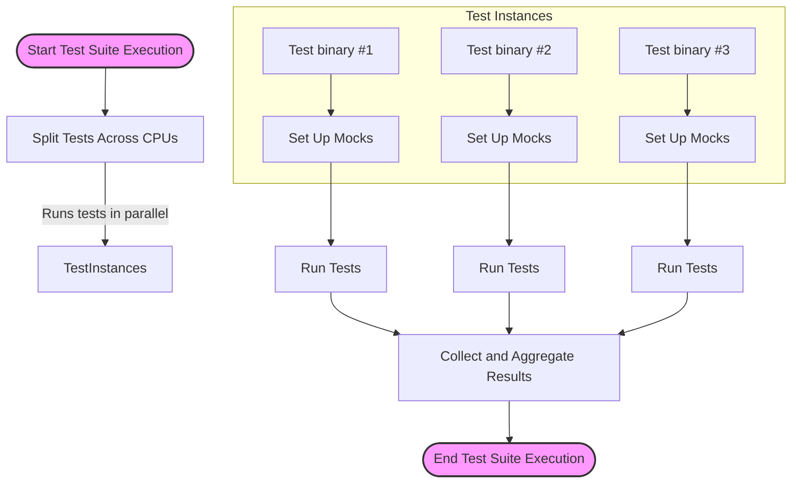

# Optimizing Test Performance and Scalability

Proven strategies for speeding up test cycles and making your suite scale—from parallel execution to mock optimization. Ideal for projects where test infrastructure is a key success factor.

---

## Workflow Overview

### Task Description
This guide helps C++ developers accelerate their testing workflows by optimizing test performance and scalability in GoogleTest and GoogleMock suites. It focuses specifically on reducing test execution time and managing test infrastructure efficiently, crucial for maintaining productivity in large-scale projects.

### Prerequisites
- Familiarity with writing and running GoogleTest unit tests.
- Understanding of GoogleMock basics for creating and using mocks (see [Using and Creating Mock Objects](../guides/mocking-and-advanced-testing/mock-objects)).
- Project set up with GoogleTest and GoogleMock integrated.

### Expected Outcome
After following this guide, you will be able to:
- Efficiently execute tests in parallel to utilize hardware resources.
- Optimize mock usage to avoid test bottlenecks.
- Write tests that scale with codebase growth without compromising reliability.

### Time Estimate
15–30 minutes to read and apply strategies, depending on test suite size and complexity.

### Difficulty Level
Intermediate; assumes working knowledge of GoogleTest and GoogleMock.

---

## 1. Parallelizing Test Execution

### Why Parallel Execution?
Parallel test execution exploits multiple CPU cores to reduce the wall-clock time of running tests. This is vital for large test suites where serial execution becomes prohibitive.

### How to Enable Parallel Test Runs
Most build systems and test runners offer ways to parallelize test execution.

1. **Use the GoogleTest `--jobs` or `--gtest_parallel` Options (if supported)**
   - Launch tests with flags specifying the number of parallel jobs.
   - Example for test_foo binary:

   ```bash
   ./test_foo --jobs=8
   # or
   ./test_foo --gtest_parallel=8
   ```

2. **Leverage Build System Parallelism**
   - Use CMake with `ctest` and its parallel execution:

   ```bash
   ctest -j8
   ```

   - For Bazel, use `bazel test --jobs=8`.

3. **Ensure Tests Are Independent**
   - Verify that tests do not share mutable global state or resources that cause interference.
   - Use test fixtures to isolate state.

<Tip>
Verify your tests can run in parallel by intentionally running multiple tests simultaneously to detect flakiness due to shared state or race conditions.
</Tip>

## 2. Optimizing Mock Usage for Performance

Mocks are powerful but can become execution bottlenecks if misused.

### Best Practices for Mock Optimization

- **Use ON_CALL for Default Behavior**
  - Assign default actions using `ON_CALL` instead of excessive `EXPECT_CALL`s to avoid overhead from unnecessary verification.

- **Prefer NiceMock over NaggyMock**
  - `NiceMock` suppresses warnings on uninteresting calls, suitable for reducing noise and test overhead.

- **Limit StrictMock Usage**
  - Restrict to places where rigorous call verification is necessary; strict mocks can slow down tests due to detailed call tracking.

- **Delegate Calls When Possible**
  - Delegate mock methods to lightweight fakes or real implementations to reduce manual action specifications and decrease overhead.

```cpp
class MockFoo : public Foo {
 public:
  MOCK_METHOD(int, Compute, (int x), (override));

  void DelegateToFake() {
    ON_CALL(*this, Compute).WillByDefault(
      [this](int x) { return fake_.Compute(x); });
  }
 private:
  FakeFoo fake_;
};
```

- **Avoid Over-Mocking**
  - Don't mock concrete classes unnecessarily. Instead, mock interfaces to limit coupling and improve test performance.

## 3. Managing Test Dependencies to Scale

Large suites often suffer from dependencies that increase test run times.

### Strategies

- **Isolate External Dependencies**
  - Mock external systems (databases, network) and avoid slow operations in tests.

- **Split Slow Tests**
  - Group slow or resource-intensive tests separately; mark them to run less frequently or in nightly builds.

- **Parameterize Tests for Coverage Without Explosion**
  - Use typed and value-parameterized tests to reduce duplicate test code, while managing the number of generated tests.

- **Disable or Freeze Flaky Tests Until Fixed**
  - Use the `DISABLED_` prefix on tests that cause flaky failures to prevent them from slowing down the pipeline.

## 4. Leveraging GoogleMock Features for Reliable and Fast Testing

### Use `EXPECT_CALL` Efficiently

- Make expectations **as precise as necessary, but no more** to avoid test brittleness and slowdowns.
- Use `.Times(AnyNumber())` with `WillRepeatedly()` where calls are allowed but not of interest.

### Use `InSequence` and `Sequence` to Control Call Ordering Only When Needed

- Overordering adds test fragility and complexity.

### Combine Actions for Side Effects Carefully

- Use `DoAll()` to combine multiple actions (e.g., setting an output parameter and returning a value) to avoid overhead.

### Use `MockFunction` for Callback Interfaces

- Simplify mocking of `std::function` callbacks with `MockFunction` to keep your tests focused and fast.

## Troubleshooting & Tips

### Common Issues

- **Tests Fail When Run in Parallel**
  - Check shared static/global state.
  - Use locks or refactor tests for thread safety.

- **Mock Expectations Not Met or Too Restrictive**
  - Review expectations to ensure they are neither too general (allowing bugs) nor too strict (causing brittle tests).

- **Performance Bottleneck in Mock Setup**
  - Move mock method constructor/destructor out-of-line into `.cc` files to reduce compile-time.

- **Uninteresting Call Warnings**
  - Use `NiceMock` or explicitly specify expectations with `.Times(AnyNumber())` to reduce noise.

### Best Practices

- Always initialize default mock behaviors with `ON_CALL`.
- Use `NiceMock` during development; switch to more strict modes as tests mature.
- Avoid excessive use of `StrictMock` that can cause brittle tests.
- Structure tests so they don't rely on shared state or extensive setup/teardown.
- Run tests with `--gmock_verbose=info` for verbose logging when diagnosing unexpected mock behavior.

## Next Steps & Related Content

- Explore [Using and Creating Mock Objects](../guides/mocking-and-advanced-testing/mock-objects) for detailed mock creation and usage.
- Learn about [Customizing Mock Behavior with Matchers and Actions](../guides/mocking-and-advanced-testing/using-matchers-and-actions) to further control mock responses.
- Study [Test Doubles Best Practices](../guides/mocking-and-advanced-testing/test-doubles-best-practices) to refine test reliability.
- Integrate parallel execution techniques with your build system; see [Integrating with CMake, Bazel, and Custom Build Systems](../guides/real-world-integrations/integrating-with-build-systems).

---

## Example: Parallel Test Execution with Mock Optimization

```bash
# Run tests in parallel using ctest with 4 jobs
ctest -j4
```

```cpp
#include <gmock/gmock.h>
using ::testing::NiceMock;
using ::testing::Return;

class MockDatabase {
 public:
  MOCK_METHOD(bool, Connect, (), ());
  MOCK_METHOD(int, Query, (int id), ());
};

TEST(FooTest, QueriesDatabase) {
  NiceMock<MockDatabase> mock_db;
  ON_CALL(mock_db, Connect()).WillByDefault(Return(true));  // Default:
  EXPECT_CALL(mock_db, Query(testing::_))
      .WillRepeatedly(Return(42));  // For all queries

  // Test code exercising mock_db
  // ...
}
```

<Tip>
Moving constructors and destructors of large mock classes to source files (.cc) can greatly speed up compilation times.
</Tip>

---

## Diagram: Parallel Testing Workflow



---

## References

- [gMock Cookbook](https://github.com/google/googletest/blob/main/docs/gmock_cook_book.md)
- [GoogleTest Primer](../docs/primer.md)
- [Using and Creating Mock Objects](../guides/mocking-and-advanced-testing/mock-objects)
- [GoogleMock Cheat Sheet](../docs/gmock_cheat_sheet.md)
- [Integration with Build Systems](../guides/real-world-integrations/integrating-with-build-systems)

---

**Note:** This guide pertains strictly to optimizing test performance and scalability, focusing on user benefits in the GoogleTest and GoogleMock ecosystem. For comprehensive mock API details, see the API reference section.