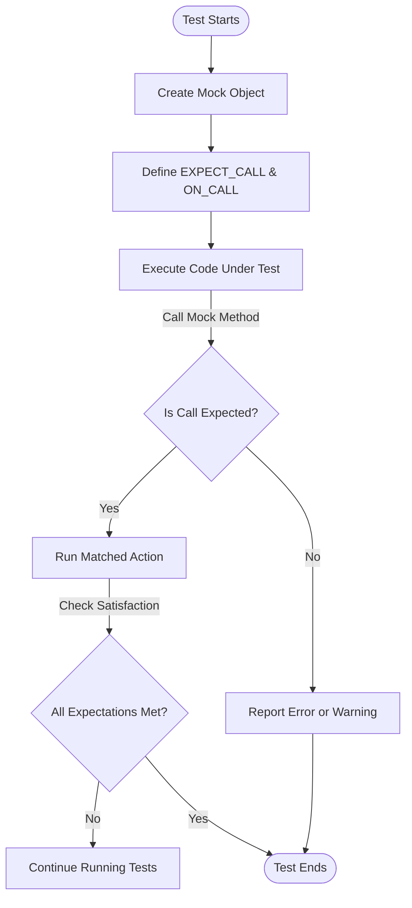

# Best Practices for Scalable Test Suites

## Overview

This guide provides a set of proven best practices to help you design, organize, and maintain large and scalable C++ test suites using GoogleTest and GoogleMock. As your project’s tests grow, following these recommendations will ensure your tests remain reliable, discoverable, efficient, and maintainable.

By following this guide, you'll avoid common pitfalls of large-scale testing and gain actionable strategies for managing test complexity.

---

## 1. Test Naming and Organization

### 1.1 Meaningful, Consistent Test Names

Use descriptive names for test suites and individual tests that clearly convey intent. Name tests so future readers exactly understand what condition or behavior is being verified.

- Prefer behavior-driven names such as `HandlesInvalidInput` or `ReturnsExpectedValueWhenConditionX`.
- Organize related tests within test suites named after the class or component under test.
- Avoid abbreviations or unclear acronyms.

**Example:**

```cpp
TEST_F(UserManagerTest, ReturnsUserWhenValidIdProvided) {
  ...
}

TEST_F(UserManagerTest, ReturnsNullWhenUserNotFound) {
  ...
}
```

### 1.2 File Placement and Structure

Keep test source files next to or close to their corresponding implementation files.

- Use clear filename conventions: e.g., `foo_test.cc` or `foo_unittest.cc` for testing `foo.cc`.
- Group related tests into logical directories reflecting the project structure.
- Split large test files into smaller ones by feature or behavior when necessary.

**Tip:** This aids test discoverability and reduces cognitive overhead.

---

## 2. Test Fixtures & Reusability

### 2.1 Use Test Fixtures to Share Setup

Leverage `TEST_F` and fixture classes derived from `testing::Test` when multiple test cases share setup and teardown logic.

- Place common objects, mock initializations, and helper methods in fixtures.
- Ensure each test gets a fresh fixture instance to avoid shared mutable state.

```cpp
class DatabaseTest : public testing::Test {
 protected:
  void SetUp() override {
    db.Connect();
  }

  Database db;
};

TEST_F(DatabaseTest, ReturnsCorrectRecord) {
  ...
}

TEST_F(DatabaseTest, SavesNewRecord) {
  ...
}
```

### 2.2 Avoid Excessive Coupling in Fixtures

Keep fixtures minimal to the purpose of the tests grouped under them.
Large, monolithic fixtures make tests harder to understand and maintain.

---

## 3. Test Discoverability & Maintenance

### 3.1 Prefer Lightweight, Fast Unit Tests

Portions of your test suite that run quickly encourage frequent execution and timely feedback.
Avoid hard dependencies or external infrastructure wherever possible.

### 3.2 Use Mocking to Isolate Dependencies

Use GoogleMock to replace complex or slow dependencies with mocks.
This improves test speed and reliability and focuses tests on behavior verification.

### 3.3 Organize Tests for Selective Runs

Leverage test suite and test name patterns supported by GoogleTest to run subsets of tests.
Name suites and tests in a way that facilitates selective execution.

```shell
--gtest_filter=DatabaseTest.*
```

### 3.4 Document Test Purpose and Usage

Maintain inline comments or overview documents summarizing the test suite's coverage and intent.
This assists future maintainers and new team members.

---

## 4. Structuring Expectations and Mocks

### 4.1 Write Clear and Minimal Expectations

- Use `ON_CALL` to define default mock behaviors without constraining call counts.
- Use `EXPECT_CALL` only when you want to verify that a method is called with specific arguments.
- Avoid over-specifying arguments unless necessary; use matchers like `_` for flexibility.

### 4.2 Control Mock Strictness

- Use `NiceMock<T>` to suppress warnings on uninteresting calls, helping to reduce noise.
- Use `StrictMock<T>` to catch unexpected calls as errors, when strict verification is needed.
- Understand the implications of each mock strictness level and apply them judiciously.

### 4.3 Use Sequences and Ordering When Needed

- Use `InSequence` or `Sequence` to impose call order obligations for interactions where order matters.
- Avoid unnecessary ordering constraints to keep tests resilient to refactorings.

### 4.4 Retiring Expectations

- Use `.RetiresOnSaturation()` to deactivate expectations once they are fulfilled, avoiding upper-bound violations.

---

## 5. Test Code Quality and Maintainability

### 5.1 Keep Tests Small and Focused

- Each test should verify one specific behavior or scenario.
- Use descriptive names to make test intent explicit.

### 5.2 Avoid Test Complexity

Complex test logic makes understanding failures harder. Prefer simplicity and clarity over cleverness.

### 5.3 Use Helper Functions and Test Utilities

Extract common patterns and repetitive setup into shared helpers to reduce duplication.

---

## 6. Reliable and Efficient Test Runs

### 6.1 Avoid Flaky Tests

- Don’t depend on timing or external state.
- Mock external dependencies to control environment and outcomes.

### 6.2 Parallelize Test Execution

- Structure tests so they can run in parallel with minimal shared state.
- Avoid mutations of global or static data.

### 6.3 Monitor and Optimize Test Performance

- Profile long-running tests periodically.
- Split slow tests into smaller, more focused units if possible.

---

## 7. Troubleshooting and Debug Tips

### 7.1 Verbose gMock Output

Run your tests with `--gmock_verbose=info` to get detailed reports of mock calls and match attempts.
Use this information to diagnose why expectations are not met.

### 7.2 Use `EXPECT_CALL` and `ON_CALL` Correctly

Remember:
- `ON_CALL` defines default mock method behavior without enforcing call counts.
- `EXPECT_CALL` sets expectations and behavior for calls you want to verify.

### 7.3 Avoid Invocation Order Violations

If you require calls to happen in a particular order, use `InSequence` or `Sequence` correctly to express ordering.

### 7.4 Use `RetiresOnSaturation` to Prevent Upper-Bound Violations

If testing multiple calls with different actions, retire expectations after use to avoid call count errors.

### 7.5 Check for Leaked Mocks

Ensure mocks are destructed or mark them with `Mock::AllowLeak()` to avoid tests never verifying expectations.

---

## Next Steps

- Explore the [gMock Cookbook](https://google.github.io/googletest/gmock_cook_book.html) for detailed recipes.
- Read about [Managing Mock Strictness](https://google.github.io/googletest/guides/mocking-advanced-testing/strictness-niceness.html).
- Learn about [Matchers and Actions](https://google.github.io/googletest/guides/mocking-advanced-testing/working-with-matchers.html).
- Review the [Mocking Reference](https://google.github.io/googletest/reference/mocking.html) for full API details.


---

## Appendix: Sample Test Suite Structure

```plaintext
project_root/
  src/
    module/
      foo.cc
      foo.h
  tests/
    module/
      foo_test.cc      # Unit tests for foo.cc
      foo_helpers.h    # Test helpers for foo
      bar_test.cc      # Unit tests for bar.cc
```

## Appendix: Example of Using NiceMock and StrictMock

```cpp
#include <gmock/gmock.h>

class MockDatabase {
 public:
  MOCK_METHOD(bool, Connect, (), ());
  MOCK_METHOD(std::string, Query, (const std::string&), ());
};

TEST(DatabaseTest, UsesStrictMock) {
  using ::testing::StrictMock;
  StrictMock<MockDatabase> db;
  EXPECT_CALL(db, Connect());

  // ... code under test interacts with db ...
}

TEST(DatabaseTest, UsesNiceMock) {
  using ::testing::NiceMock;
  NiceMock<MockDatabase> db;
  // No warnings about unexpected calls
}
```

---

## Visual Diagram: Test Expectation Flow



---

# Tips Summary

- Define mocks and expectations clearly, use `ON_CALL` for defaults.
- Prefer `NiceMock` for flexibility, use `StrictMock` to enforce correctness.
- Organize large test suites with consistent naming and directory layout.
- Use fixtures to share setup but avoid bloated ones.
- Keep tests fast, isolated, and focused.
- Control call order only when necessary.
- Use `RetiresOnSaturation()` to avoid expectation pollution.
- Enable verbose gMock flags (`--gmock_verbose=info`) when debugging.
- Always verify that mocks are destructed or explicitly allowed to leak.

---

## Further Reading & Links

- [gMock Cookbook](https://google.github.io/googletest/gmock_cook_book.html)
- [Mocking Reference](https://google.github.io/googletest/reference/mocking.html)
- [Mock Strictness Control](https://google.github.io/googletest/guides/mocking-advanced-testing/strictness-niceness.html)
- [Understanding Matchers](https://google.github.io/googletest/guides/mocking-advanced-testing/working-with-matchers.html)
- [GoogleTest Primer](https://google.github.io/googletest/primer.html)
- [Managing Expectations and Actions](https://google.github.io/googletest/guides/mocking-advanced-testing/configuring-expectations-actions.html)
- [Troubleshooting & FAQ](https://google.github.io/googletest/getting-started/first-steps/troubleshooting.html)

---

<Check>
Following these best practices guarantees your test suite's scalability, early failure detection, and ease of maintenance, while leveraging GoogleTest and GoogleMock's full potential.
</Check>
