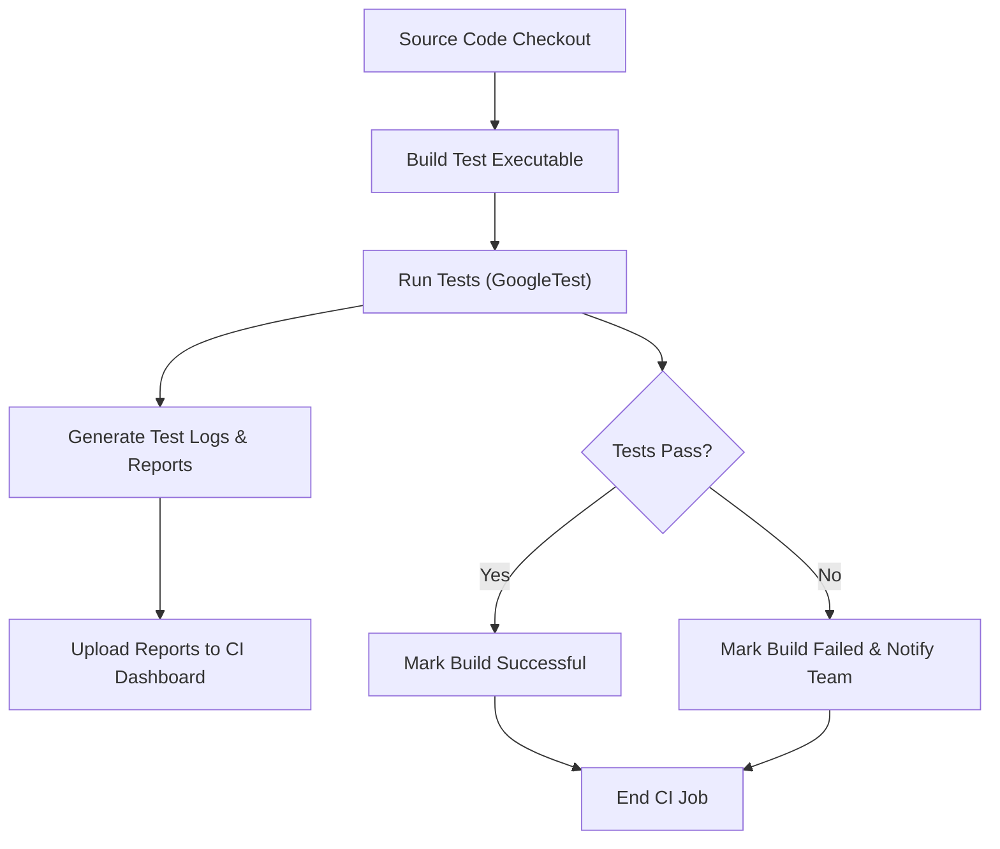

# Integrating with Continuous Integration Workflows

## Overview

This guide empowers you to smoothly integrate GoogleTest and GoogleMock into your Continuous Integration (CI) pipelines. You will learn how to set up automated test runs, configure environment requirements, and write basic scripts that enable fast and reliable feedback during your build process. By following this guide, you will ensure that your C++ tests run consistently and provide actionable results within your CI setup.

---

## 1. Understanding the Integration Workflow

### Task Description

This guide helps you integrate GoogleTest and GoogleMock into CI workflows, enabling automated compilation and execution of your test suites as part of build pipelines.

### Prerequisites

- GoogleTest and GoogleMock must be installed and buildable on your system.
- Your project uses a supported build system (e.g., CMake, Make, Bazel).
- You have access to a CI environment capable of running shell scripts or build commands.

### Expected Outcome

- Automated execution of your GoogleTest/GoogleMock tests within CI.
- Clear, structured test output that can be used by CI dashboards.
- Early detection of test failures and integration issues.

### Time Estimate

Setting up basic integration typically takes 30 minutes to 1 hour.

### Difficulty Level

Intermediate—requires familiarity with CI concepts and build tools.

---

## 2. Step-by-Step Instructions

### Step 1: Prepare Your Test Executable

1. Ensure your test binary links with `gtest_main` or `gmock_main` so it has a `main()` entry point.
2. Build your tests locally using your chosen build system.
3. Verify the test binary runs and returns zero on success.

*Expected Result:* Running the test binary manually shows all tests passing.

### Step 2: Integrate Test Build into CI

Depending on your build system, add appropriate build commands to your CI script.

#### Example with CMake:

```bash
mkdir -p build
cd build
cmake ..
make
```

Ensure the test executable is built during this phase.

### Step 3: Run Tests in CI Environment

Invoke your test executable from the CI configuration.

```bash
./build/your_test_binary
```

By default, GoogleTest outputs a human-readable report to stdout.

### Step 4: Generate Machine-Readable Test Reports (Optional but Recommended)

To get structured test results (JUnit XML) that CI systems can display:

```bash
./build/your_test_binary --gtest_output=xml:report.xml
```

Upload `report.xml` as an artifact or configure your CI to parse it.

### Step 5: Configure Environment Variables and Flags

If needed, set flags to customize test runs:

- `--gtest_filter=` to run specific tests or suites
- `--gtest_repeat=` to repeat tests
- `--gtest_catch_exceptions=0` for debugging crashes

Set these flags in your CI script as command-line arguments.

### Step 6: Handle Test Failures in CI

Configure your CI to:

- Mark builds as failed if tests fail (test executable returns non-zero).
- Collect and display logs and reports.
- Notify development teams on failure.

---

## 3. Basic CI Script Example

Here is a straightforward shell script snippet demonstrating building and running GoogleTest-based tests:

```bash
#!/bin/bash
set -e  # Exit immediately if a command exits with a non-zero status

# Build tests
mkdir -p build
cd build
cmake ..
make

# Run tests with XML output for CI dashboard consumption
./your_test_binary --gtest_output=xml:test_results.xml

# Return result code from test run
```

*Tip:* Adapt paths and commands to your project structure.

---

## 4. Environment Requirements

- **C++17 or later:** GoogleTest requires C++17 support.
- **Threading support:** Ensure pthread or equivalent is available if using multi-threaded tests.
- **Sufficient permissions:** The CI runner must have execution permission for test binaries.

Refer to [Supported Platforms and Dependencies](https://github.com/google/googletest/blob/main/docs/overview/integration-adoption/supported-platforms.md) for complete compatibility details.

---

## 5. Optimizing Feedback Loops

- Use `--gtest_filter=` to run only changed or targeted tests, reducing run time.
- Run tests in parallel if your CI allows it to speed up test executions.
- Cache build artifacts to avoid unnecessary recompilation between runs.

---

## 6. Troubleshooting Common Issues

<AccordionGroup title="Troubleshooting Test Integration Issues">
<Accordion title="Test Binary Does Not Run in CI">
Verify binary executable permissions in the CI environment.
Check for linked dependencies missing in the CI environment (e.g., shared libs).
</Accordion>
<Accordion title="No Tests Discovered When Running">
Ensure tests are correctly registered via `TEST()` or `TEST_F()`. 
Confirm the test executable supports GoogleTest’s test discovery.
</Accordion>
<Accordion title="Test Failures Without Clear Messages">
Add verbose flags like `--gtest_verbose=info` or use `--gtest_break_on_failure` for deeper debugging.
Make sure your test output is not being suppressed or redirected incorrectly.
</Accordion>
<Accordion title="CI Flags Not Recognized">
Ensure you are using `testing::InitGoogleTest()` in your `main()` function to parse flags properly.
Do not manually implement flag parsing that might conflict.
</Accordion>
</AccordionGroup>

---

## 7. Best Practices

- Link with `gtest_main` or `gmock_main` to avoid custom `main()` unless necessary.
- Use XML output to integrate test results into CI dashboards and tooling.
- Keep tests fast and independent to provide quick feedback.
- Regularly update test dependencies and GoogleTest versions for improved features and fixes.

---

## 8. Next Steps & Related Content

- Explore [Writing and Running Your First Test](https://github.com/google/googletest/blob/main/docs/guides/getting-started/first-test.md) to create your initial tests.
- Learn advanced mocking techniques with [Introducing Mocking with GoogleMock](https://github.com/google/googletest/blob/main/docs/guides/getting-started/mocking-intro.md).
- See [Supported Platforms and Dependencies](https://github.com/google/googletest/blob/main/docs/overview/integration-adoption/supported-platforms.md) to ensure your CI environment is compatible.
- For troubleshooting, consult [Troubleshooting Setup & Installation](https://github.com/google/googletest/blob/main/docs/getting-started/environment-setup/troubleshooting-setup.md).


---

**By automating GoogleTest and GoogleMock runs in your CI pipeline, you can catch bugs early, maintain high code quality, and streamline your development workflow.**


---

## Appendix: Sample CMakeLists.txt Snippet for Testing

```cmake
enable_testing()
add_executable(my_tests test_main.cpp my_class_test.cpp)
target_link_libraries(my_tests gtest_main gmock)
add_test(NAME MyTests COMMAND my_tests --gtest_output=xml:my_tests_report.xml)
```

This setup enables `ctest` to discover and run the tests, facilitating integration in CMake-based CI pipelines.

---

## Diagram: CI Integration Flow




---

## References

- [GoogleTest Primer](primer.md)
- [GoogleMock for Dummies](gmock_for_dummies.md)
- [GoogleTest Feature Overview](../overview/core-concepts-architecture/features-at-a-glance.md)
- [CI Integration Best Practices (Community)](guides/real-world-practices/ci-integration.md)


---

_Last updated: June 2024_

---