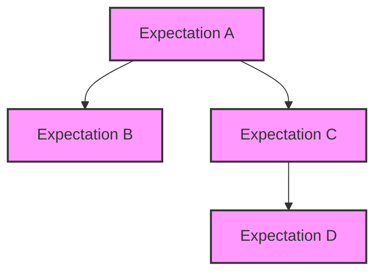

# Community Examples and Advanced Use Cases

Explore creative and advanced usage patterns contributed by the GoogleTest community. This guide surfaces practical scenarios where GoogleMock integrates with other tools, adapts to uncommon platform setups, and scales to large project workflows. Gain inspiration and deepen your mastery by learning how real projects harness GoogleMock's power beyond typical unit tests.

---

## 1. Unlocking the Power of GoogleMock: Real Project Inspirations

GoogleMock is not just for basic mocking — it thrives as a powerful testing and design tool across varied real-world contexts. This page demonstrates how advanced users push the framework creatively to meet unique demands.

### Why Study Community Examples?
- Discover workflows beyond "hello world" mocks.
- Draw lessons from complex dependency injection cases.
- Learn how mock expectations and behaviors integrate into CI pipelines and tooling.


## 2. Integrating GoogleMock with External Tools and Frameworks

### 2.1 Combining GoogleMock with Continuous Integration (CI) Systems

Leverage GoogleMock expectations to produce machine-readable results for automated test verification.

- Use GoogleTest’s XML output formats alongside GoogleMock to drive CI alerts.
- Integrate mock-based verification in build systems to ensure stable dependency interactions automatically.

### 2.2 Working with Build Systems and IDEs

GoogleMock's macros and generated mock classes are fully compatible with popular build tools:

- **CMake**: Integrate mock-generated source files transparently.
- **Bazel**: Use testonly libraries containing mocks for centralized maintenance.
- **IDE Support**: Expected failures and stack traces from mock expectations fully support navigable source links.

<Tip>
Always organize your mock classes in dedicated files and let your build tool regenerate them automatically for better maintainability.
</Tip>


## 3. Tackling Large-Scale Projects With GoogleMock

Mocking at scale demands discipline and thoughtful design. Community-proven practices include:

### 3.1 Defining Clear Interfaces
Create small, focused interfaces to mock. This minimizes brittle expectations and simplifies mock implementations.

### 3.2 Using Sequences and Partial Orders for Complex Interactions
GoogleMock permits sophisticated call order constraints:

```cpp
Sequence s1, s2;
EXPECT_CALL(mock, Init()).InSequence(s1);
EXPECT_CALL(mock, Start()).InSequence(s2);
EXPECT_CALL(mock, Run()).InSequence(s1, s2);
```

Use sequences to express DAGs of expected calls, representing complex workflows reliably.

### 3.3 Delegating Behavior to Fakes or Parental Implementations
For intricate dependencies:

- Delegate actions to fake implementations for default behaviors with `ON_CALL`.
- Forward specific calls to real base class implementations.

These patterns reduce duplication in mocks and align tests closer to real runtime behavior.


## 4. Advanced Mocking Techniques and Patterns

### 4.1 Managing Move-Only Types
GoogleMock fully supports mocking methods that accept or return move-only types (e.g., `std::unique_ptr`). Define mock methods with `MOCK_METHOD` as usual:

```cpp
MOCK_METHOD(std::unique_ptr<Buzz>, MakeBuzz, (StringPiece text), (override));
```

When setting expectations involving move-only return values, use lambdas to dynamically create returned objects:

```cpp
EXPECT_CALL(mock_buzzer_, MakeBuzz(_))
    .WillRepeatedly([](StringPiece text) {
      return std::make_unique<Buzz>(AccessLevel::kInternal);
    });
```

### 4.2 Simplifying Interfaces for Complex Methods
For mock methods with unwieldy argument lists, define a trimmed mock method for easier use. Forward the original method call to the trimmed method.

Example:

```cpp
void send(long severity, const char* file, const char* base_file, int line, const tm* time, const char* msg, size_t len) override {
  Log(severity, file, std::string(msg, len));
}
MOCK_METHOD(void, Log, (long severity, const std::string& file, const std::string& message));
```

This improves test readability and maintainability.

### 4.3 Combining Actions in Expectations
Use `DoAll()` to compose sequences of operations for a single call:

```cpp
EXPECT_CALL(mock, Mutate(5))
    .WillOnce(DoAll(SetArgPointee<1>(10), Return(true)));
```

This sets an output argument and returns a value in one expectation.


## 5. Handling Mock Object Behavior Modes

GoogleMock offers three behavior modes controlling how it treats calls without explicit expectations:

- **NaggyMock** (default): Warns on uninteresting calls.
- **NiceMock**: Suppresses warnings for uninteresting calls.
- **StrictMock**: Treats uninteresting calls as failures.

Choose the correct mode to balance test strictness and maintainability:

```cpp
NiceMock<MockFoo> nice_mock;
StrictMock<MockFoo> strict_mock;
```


## 6. Best Practices and Pitfalls

### 6.1 Set Expectations Before Calls
Always declare `EXPECT_CALL` before performing operations that call the mock methods. Late expectation setting leads to undefined behavior.

### 6.2 Use `ON_CALL` for Default Actions
Reserve `ON_CALL` for setting behaviors without asserting call expectations. This prevents brittle tests that over-specify interactions.

### 6.3 Use Sequences for Ordered Calls
Constrain call order with sequences or `.After()` clauses only when order matters. Avoid over-constraining to keep tests resilient to refactoring.

### 6.4 Retire Expectations to Avoid Upper Bound Errors
Use `.RetiresOnSaturation()` on expectations with upper bounds to retire them after they saturate:

```cpp
EXPECT_CALL(mock, Foo()).Times(2).RetiresOnSaturation();
```


## 7. Troubleshooting Common Issues

### 7.1 "Uninteresting Call" Warnings
- Occur when a mock method is called without an `EXPECT_CALL`.
- Solve by setting an appropriate expectation or using a `NiceMock` to suppress.

### 7.2 Unexpected Call Failures
- Happen when a call does not match any `EXPECT_CALL`.
- Verify argument matchers and sequence orders.
- Use `--gmock_verbose=info` to trace call resolution.

### 7.3 Actions Running Out
- If the number of calls exceeds the number of `.WillOnce()` actions without `.WillRepeatedly()`, default actions run and warnings are emitted.
- Define `.WillRepeatedly()` or increase `.Times()` accordingly.

### 7.4 Mock Object Leaks
- Ensure mock objects are properly deleted to trigger expectation verification.
- Use `testing::Mock::AllowLeak()` for intentional leaks.


## 8. References and Next Steps

- See the [gMock Cookbook](gmock_cook_book.md) for detailed recipes and advanced topics.
- Review the [Mocking Reference](reference/mocking.md) for macro and class API details.
- Explore [Mocking Introduction](guides/getting-started/mocking-intro.md) for foundational knowledge.
- Consult [Best Practices for Reliable and Maintainable Tests](guides/real-world-practices/best-practices.md) for expert tips.
- For debugging, use `--gmock_verbose=info` flag to observe detailed mock call traces.

---

### Illustration of Partial Order Using Sequences



Here, B and C follow A, and D follows C, reflecting partial order constraints.

---

### Summary of GoogleMock Behavior Modes

| Mock Type    | Behavior on Uninteresting Calls           | Use When                            |
|--------------|------------------------------------------|-----------------------------------|
| NaggyMock    | Prints warnings                          | Development and debugging          |
| NiceMock     | Suppresses warnings                      | Most tests requiring noise reduction|
| StrictMock   | Treats calls as failures                 | Critical strict testing scenarios  |


---

### Practical Example Snippet

```cpp
using ::testing::Return;
using ::testing::_;
using ::testing::Sequence;

class MockTurtle {
 public:
  MOCK_METHOD(void, PenDown, (), (override));
  MOCK_METHOD(void, Forward, (int distance), (override));
};

TEST(PainterTest, DrawsCircleInOrder) {
  MockTurtle mock_turtle;
  Sequence seq;

  EXPECT_CALL(mock_turtle, PenDown()).InSequence(seq);
  EXPECT_CALL(mock_turtle, Forward(100)).InSequence(seq);

  Painter painter(&mock_turtle);
  painter.DrawCircle(100);
}
```

This enforces call order when drawing a circle.

---

### Tips to Control Default Mock Return Values

```cpp
using ::testing::DefaultValue;

DefaultValue<std::unique_ptr<Buzz>>::SetFactory([] {
  return std::make_unique<Buzz>(AccessLevel::kInternal);
});

// Remember to Clear after tests to avoid side effects
DefaultValue<std::unique_ptr<Buzz>>::Clear();
```


## Appendix: Common Macros and Utilities

- `MOCK_METHOD`: Define mock methods in mock classes.
- `EXPECT_CALL`: Set expectations on mock method invocations.
- `ON_CALL`: Specify default mock method behavior without setting expectations.
- `Sequence` and `InSequence`: Control expected call order.
- `RetiresOnSaturation()`: Automatically retire expectations when saturated.


---

This page is part of the GoogleTest documentation.

For full GoogleTest and GoogleMock guidance, visit the [official site](https://github.com/google/googletest).

---
