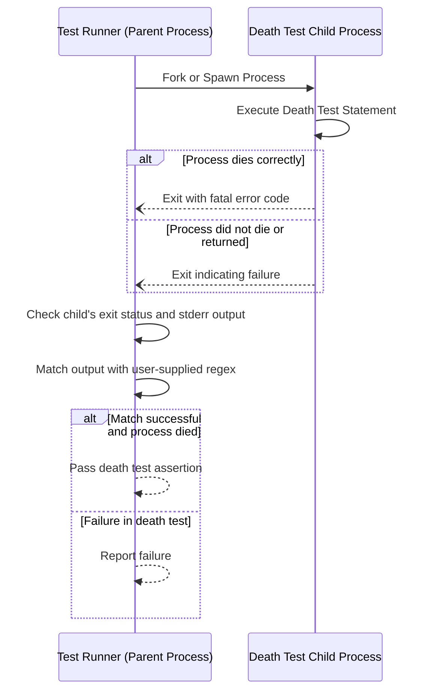

# Using Death Tests for Error Handling Verification

## Overview

Death tests are an essential technique for verifying that your C++ code properly handles fatal error conditions by causing the process to terminate. These tests confirm that assertions or other error-handling mechanisms designed to abort execution actually do so as intended, preventing undefined behavior or corruption.

This guide will walk you through understanding death tests, how to write them using GoogleTest, real-world usage scenarios, common pitfalls, and tips for effective debugging.

---

## What Are Death Tests?

Death tests verify that a block of code intentionally causes the program to exit, such as from a failed assertion or call to abort. Unlike regular tests that confirm correct execution outcomes, death tests confirm that incorrect or illegal states are caught by the program and the process terminates safely.

### Why Use Death Tests?

- **Ensure program correctness and safety**: Checks that invalid states trigger immediate termination, reducing the risk of further damage.
- **Validate assertions and precondition checks**: Confirms that checks designed to abort on bad inputs are actually triggered in failure scenarios.
- **Protect critical invariants**: Guarantees that invariants hold by testing their enforcement through fatal failures.

## Prerequisites

Before writing death tests, ensure the following:

- Your build environment supports death tests. GoogleTest requires platform support; some environments do not support them.
- You have `#include <gtest/gtest.h>` in your test source files.
- You are familiar with writing basic GoogleTest unit tests and using assertions.

## Expected Outcome

After following this guide, you will:

- Understand what death tests are and when to write them.
- Be able to write death tests using `EXPECT_DEATH` and `ASSERT_DEATH` macros.
- Know how to interpret death test failures and troubleshoot common problems.

## Time Estimate

Writing and verifying death tests for a component typically takes around 15-30 minutes, depending on the complexity of the error conditions.

## Difficulty Level

Intermediate—requires basic familiarity with GoogleTest and C++ exceptions.

---

## Writing Death Tests: Step-by-Step

### 1. Identify Error Conditions That Should Terminate

Determine which code paths should cause a fatal failure (e.g., via assertions, abort calls, or fatal exceptions). These are good candidates for death tests.

### 2. Use `EXPECT_DEATH` or `ASSERT_DEATH` Macros

GoogleTest provides macros to verify process termination:

- `EXPECT_DEATH(statement, matcher)` checks that executing `statement` causes the process to die, and that the error output matches `matcher`.
- `ASSERT_DEATH(statement, matcher)` does the same but aborts the current test on failure.

Example:

```cpp
TEST(MyDeathTest, DiesOnInvalidInput) {
  EXPECT_DEATH({ MyFunction(-1); }, "Invalid input");
}
```

Here `MyFunction(-1)` should cause the program to terminate and print an error message containing 'Invalid input'.

### 3. Use Compound Statements for Multiple Lines

If your death test code involves multiple statements, enclose them in braces:

```cpp
ASSERT_DEATH({
  Initialize();
  PerformIllegalOperation();
}, "Fatal error");
```

### 4. Understand Matchers and Error Output

The second argument can be:

- A string interpreted as a regular expression matching the error output printed to stderr.
- A matcher object like `ContainsRegex("text")`.

If the output does not match, the test will fail.

### 5. Control Test Behavior With Death Test Styles

GoogleTest supports two styles for death tests:

- **Fast style**: immediately runs the death test code after forking. Faster but less thread-safe.
- **Threadsafe style**: spawns a new process that re-executes the test binary filtered to just this death test. More stable in multi-threaded environments.

Set style programmatically or via the `--gtest_death_test_style` flag.

Example:

```cpp
int main(int argc, char** argv) {
  testing::InitGoogleTest(&argc, argv);
  GTEST_FLAG_SET(death_test_style, "threadsafe");
  return RUN_ALL_TESTS();
}
```

### 6. Handle Exit Codes and Signals

For more precise control, use `ASSERT_EXIT` or `EXPECT_EXIT` macros with predicates:

```cpp
EXPECT_EXIT(FatalFunction(), ::testing::ExitedWithCode(1), "error message pattern");
```

or verify process termination by signal:

```cpp
EXPECT_EXIT(KillProcess(), testing::KilledBySignal(SIGKILL), "Terminated");
```

### 7. Beware of Function Side Effects

Because death test statements run in a separate process, side effects like modifying global variables or freeing memory will not be observed in the parent process.

---

## Practical Examples

### Example 1: Testing Assertion Failure

```cpp
void CheckPositive(int n) {
  ASSERT_GT(n, 0) << "n must be positive";
}

TEST(CheckPositiveDeathTest, DiesOnNonPositive) {
  EXPECT_DEATH(CheckPositive(0), "n must be positive");
}
```

This test verifies that `CheckPositive` aborts execution if a non-positive number is passed.

### Example 2: Using Compound Statement in Death Test

```cpp
TEST(ComplexDeathTest, DiesOnErrorCondition) {
  EXPECT_DEATH({
    Setup();
    CauseError();
  }, "Fatal failure detected");
}
```

### Example 3: Debug Mode Specific Death Tests

Use `EXPECT_DEBUG_DEATH` to restrict death tests to debug builds:

```cpp
EXPECT_DEBUG_DEATH(DebugOnlyFail(), "debug assertion failed");
```

In release mode, the statement runs normally without asserting.

### Example 4: Death Test in a Loop

Testing multiple failure cases:

```cpp
TEST(LoopDeathTest, MultipleFatalInputs) {
  for (int i = -3; i <= 0; ++i) {
    EXPECT_DEATH(ProcessInput(i), "Error: invalid input") << "Failed for i=" << i;
  }
}
```

---

## Common Pitfalls and Troubleshooting

### Pitfall: Death Test Fails to Detect Process Death

- Ensure that the tested statement truly causes process termination and does not catch exceptions internally.
- The tested code must not `return` or throw an exception that escapes the test statement.

### Pitfall: Error Output Does Not Match

- Verify the regular expression or matcher given matches the actual output.
- Consider using a broad pattern like `".*"` to test only for process death.
- Use `EXPECT_DEATH_IF_SUPPORTED` in portable code to avoid failures on unsupported platforms.

### Pitfall: Multiple Threads Warning

- Death tests use `fork()` which may be unsafe in multi-threaded contexts.
- Use the `threadsafe` death test style for better thread handling.
- Limit threads in tests or isolate death tests into dedicated test suites named `*DeathTest`.

### Pitfall: Side-Effects Not Observable

- Since the death test executes in a separate process, any modifications to global state will not be seen in the parent process.
- Avoid relying on side effects or plan to verify state before/after death tests externally.

### Debugging Tips

- Write minimal death tests with explicit error messages.
- Use `SCOPED_TRACE` to add trace context to assertions failing inside helper functions called by death tests.
- Run tests with increased verbosity flags.
- For flaky death tests, use the `--gtest_repeat` flag to run tests multiple times.

---

## Best Practices

- Name test suites containing death tests with a `*DeathTest` suffix to help GoogleTest run them first and isolate from normal tests.
- Avoid putting multiple death test assertions on the same line to prevent compiler errors.
- Stream custom failure messages into death test macros to provide extra debug information.
- Use predicate matchers for exit codes and signals for precise condition checks.

---

## Next Steps & Related Documentation

- Explore [Assertions Reference](../reference/assertions.md#death) for detailed assertion macros fitting death tests.
- Dive into [Advanced GoogleTest Topics](../advanced.md#death-tests) for deeper explanation of death test styles and advanced usage.
- Learn about handling exceptions with death tests in [googletest-death-test_ex_test.cc](https://github.com/google/googletest/blob/main/googletest/test/googletest-death-test_ex_test.cc).
- Understand how to write robust mocks alongside death tests in the [Mocking Reference](../reference/mocking.md).

For practical introduction, see the [GoogleTest Primer](primer.md) and [Writing Effective Test Assertions](../guides/getting-started/writing-assertions.md).

---

## Additional Resources

- [GoogleTest Official GitHub](https://github.com/google/googletest)
- [GoogleTest Advanced Documentation](../docs/advanced.md)

---

## Summary Diagram of Death Test Flow



---

## Summary

Death tests are a critical safeguard to ensure your application correctly terminates on unrecoverable errors. GoogleTest offers robust macros such as `EXPECT_DEATH`, `ASSERT_DEATH`, and `EXPECT_EXIT` to verify such behavior, supporting both fast and threadsafe modes. Understanding how to write effective death tests and manage their peculiarities will strengthen your testing suite and your application's resilience.