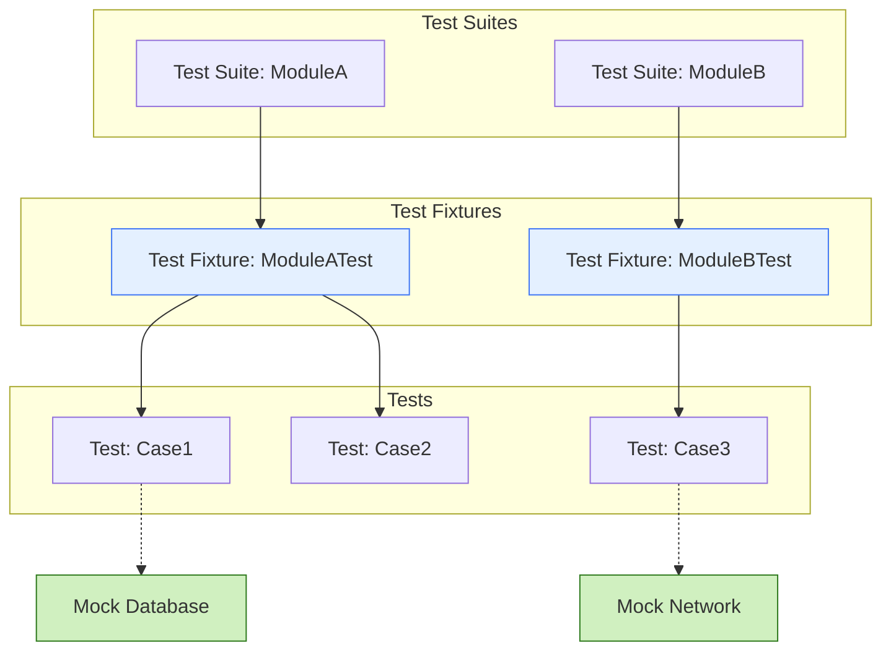

# Structuring Large and Maintainable Test Suites

## Workflow Overview

Organizing extensive test suites is critical to maintaining clarity, reducing complexity, and enabling effective test collaboration. This guide helps you structure your GoogleTest test code to handle large projects with many test cases and fixtures efficiently.

### Prerequisites

- Familiarity with writing basic GoogleTest tests and using test fixtures
- Installed and configured GoogleTest in your C++ project
- Understanding of basic mock objects if mocks are involved

### Expected Outcome

By following this guide, you will be able to:

- Organize tests into logical groups reflecting code structure
- Share setup/teardown code effectively across many tests
- Employ naming conventions that improve readability and maintenance
- Manage complex testing environments with appropriate isolation
- Improve continuous integration workflows through structured tests

### Time Estimate

Depending on familiarity with the framework, setting up an initial structured test suite takes approximately 1-2 hours.

### Difficulty Level

Intermediate – requires prior knowledge of GoogleTest basics and C++ testing patterns.

---

## Step-by-Step Instructions

### 1. Group Related Tests by Test Suites

- Use the `TEST()` macro with a consistent, descriptive test suite name reflecting the component or module under test.
- Group logically related test cases in the same suite.
- If tests share common setup/state, migrate to fixtures instead for better code sharing.

**Example:**
```cpp
TEST(StringUtils, CapitalizeEmptyString) {
  EXPECT_EQ(Capitalize(""), "");
}

TEST(StringUtils, CapitalizeWord) {
  EXPECT_EQ(Capitalize("hello"), "Hello");
}
```

### 2. Share Setup and Teardown using Test Fixtures

- Define fixture classes by inheriting from `testing::Test`.
- Place common objects and setup code in the fixture’s constructor or `SetUp()` method.
- Cleanup should be handled in the destructor or `TearDown()`.
- Use `TEST_F()` macro to write tests using the fixture.

**Best Practice:** Prefer `SetUp()`/`TearDown()` over constructors/destructors if exceptions or specific ordering is critical.

**Example:**
```cpp
class DatabaseTest : public ::testing::Test {
 protected:
  void SetUp() override {
    db_.Connect();
    db_.BeginTransaction();
  }

  void TearDown() override {
    db_.RollbackTransaction();
    db_.Disconnect();
  }

  Database db_;
};

TEST_F(DatabaseTest, InsertRecord) {
  EXPECT_TRUE(db_.InsertRecord("Alice"));
}
```

### 3. Establish Clear Naming Conventions

- Test suite names should reflect the class, module, or functionality:
  - Use PascalCase for test suite names/class tests.
  - Avoid underscores in test suite names.
- Test names should describe the behavior or scenario being tested, using camel case or underscore style:
  - Examples: `HandlesEmptyInput`, `ReturnsFalseOnError`
- For fixtures, use convention `<ClassUnderTest>Test`.

This consistency helps new contributors and facilitates test discovery.

### 4. Use Parameterized Tests for Repeated Test Logic

- When the same logic needs to be tested over multiple inputs, leverage `INSTANTIATE_TEST_SUITE_P` and test parameterization features.
- This reduces duplication and centralizes maintenance.

### 5. Organize Mocks and Helpers Centrally

- Define mocks and test helpers in separate header/source files.
- Locate them in a `test/` or `mock/` directory corresponding to the module.
- Favor reusable mocks over duplicating mock behavior in each test file.

### 6. Isolate Tests to Avoid Shared State

- Ensure each test runs independently:
  - Do not share mutable global or static state.
  - Reset mocks and shared dependencies between tests.
  - Use fresh `SetUp()` to prepare clean environment.

This avoids flaky tests and makes diagnosing failures easier.

### 7. Encapsulate Complex Setup in Helper Methods

- For tests that need similar but complex setup, encapsulate that logic in fixture helper methods.

**Example:**
```cpp
void PrepareTestUser(const std::string& name, int age) {
  user_ = User(name, age);
  user_.Authenticate();
}
```

- This simplifies individual test bodies and improves code reuse.

### 8. Leverage Sequences for Order-Dependent Tests

- When testing interactions with mocks where call order matters, use `InSequence` or `Sequence` objects.

Example:
```cpp
Sequence s;
EXPECT_CALL(mock, Step1()).InSequence(s);
EXPECT_CALL(mock, Step2()).InSequence(s);
```

### 9. Integrate with CI Pipelines

- Structure tests such that they can be run incrementally.
- Group tests logically to allow selective running (e.g., smoke tests, integration tests).
- Consider naming or annotating heavy tests distinctly to optimize pipeline performance.

---

## Practical Tips & Best Practices

- **Avoid Over-Specification:** Write minimal effective assertions and expectations to avoid brittle tests.
- **Suppress Uninteresting Call Warnings:** Use `NiceMock<T>` or selective `EXPECT_CALL(...).Times(AnyNumber())` for less noisy mocks.
- **Prevent Memory Leaks:** Always delete mocks or use smart pointers and verify mocks promptly, or allow leaks deliberately with `Mock::AllowLeak()` if justified.
- **Document Test Intent:** Use descriptive names and comments to convey intent explicitly.
- **Refactor Incrementally:** When suites grow too large, split logically based on functionality or dependencies.

<Tip>
Structure your tests so that failures pinpoint the root cause easily by keeping test setups minimal and focused.
</Tip>

<Tip>
Keep fixtures small and focused; if you find yourself adding too much to one fixture, consider refactoring or introducing helper classes.
</Tip>

---

## Common Pitfalls & Troubleshooting

### Tests Becoming Slow or Flaky

- Cause: Excessive shared state or costly setup.
- Solution: Minimize shared state usage and delegate expensive setup to fixtures with `SetUpTestSuite` (static fixtures), or consider mocking out expensive components.

### Tests Failing Randomly

- Cause: Shared global/static variables mutated across tests, threading issues.
- Solution: Isolation of tests; avoid shared mutable state, add synchronization if necessary, use `GoogleMock`'s thread safety rules.

### Mock Warnings for Uninteresting Calls

- Cause: Mocked method called without expectation setting.
- Solution: Use `NiceMock` to suppress or add catch-all expectations `.Times(AnyNumber())`.

### Overly Complex Test Setup

- Cause: Setup code duplicated or too much logic in `SetUp()`.
- Solution: Use helper setup functions or test utilities.

---

## Example: Organizing a Test Suite with Fixtures and Mocks

```cpp
#include <gtest/gtest.h>
#include <gmock/gmock.h>

using ::testing::Return;
using ::testing::NiceMock;
using ::testing::StrictMock;

class Database {
 public:
  virtual ~Database() {}
  virtual bool Connect() = 0;
  virtual bool InsertRecord(const std::string& name) = 0;
};

class MockDatabase : public Database {
 public:
  MOCK_METHOD(bool, Connect, (), (override));
  MOCK_METHOD(bool, InsertRecord, (const std::string&), (override));
};

class UserService {
 public:
  explicit UserService(Database* db) : db_(db) {}
  bool AddUser(const std::string& name) {
    if (!db_->Connect()) return false;
    return db_->InsertRecord(name);
  }
 private:
  Database* db_;
};

class UserServiceTest : public ::testing::Test {
 protected:
  void SetUp() override {
    // Configure default mock behaviors
    ON_CALL(db_, Connect()).WillByDefault(Return(true));
    ON_CALL(db_, InsertRecord(testing::_)).WillByDefault(Return(true));
  }

  NiceMock<MockDatabase> db_;
};

TEST_F(UserServiceTest, AddUserSuccess) {
  UserService service(&db_);
  EXPECT_CALL(db_, InsertRecord("Alice"));
  EXPECT_TRUE(service.AddUser("Alice"));
}

TEST_F(UserServiceTest, AddUserFailsIfConnectFails) {
  UserService service(&db_);
  EXPECT_CALL(db_, Connect()).WillOnce(Return(false));
  EXPECT_FALSE(service.AddUser("Bob"));
}
```

---

## Next Steps & Related Content

- Explore [Creating Your First Test Case](/guides/getting-started/create-first-test) for introductory coverage.
- Dive into [Designing and Using Mock Objects](/guides/advanced-mocking/designing-mock-objects) for mastering mocks.
- Review [Common Mocking Scenarios and Solutions](/guides/advanced-mocking/common-mocking-scenarios) to handle real-world use cases.
- Consult [Writing Effective Test Assertions](/guides/getting-started/writing-assertions) to improve test robustness.

---

## Summary Diagram: Test Suite Structure



---