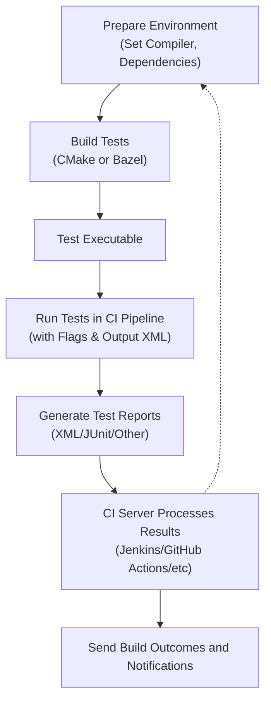

# Integration with Continuous Integration (CI) and Build Systems

This guide walks you through integrating GoogleTest and GoogleMock into your continuous integration (CI) pipelines and build systems. It covers practical tips for automation, platform-specific considerations, and optimization strategies to ensure robust test execution and rich reporting in automated environments.

---

## 1. Overview

Automating your tests with GoogleTest and GoogleMock within CI pipelines ensures your codebase remains stable and defects are caught early. This integration offers:

- Reliable test execution across various platforms and environments.
- Support for automation scripts and flexible reporting.
- Optimization options tailored to your build tools and platforms.

---

## 2. Preparing Your Environment

Before integrating tests into your CI workflow, ensure your environment meets the following:

- Minimum C++17 standard compliance for building GoogleTest and GoogleMock.
- Suitable compiler versions on your build nodes.
- Proper setup of threading and filesystem support as used by your tests.

Review the [System Requirements & Supported Platforms](https://github.com/google/googletest/blob/main/docs/getting-started/setup-prerequisites-installation/system-requirements-supported-platforms.md) for detailed prerequisites.

---

## 3. Integrating with Popular Build Systems

### 3.1 CMake Integration

GoogleTest and GoogleMock are designed to work seamlessly with CMake. To integrate your tests:

1. Add GoogleTest as a subdirectory or link it via `FetchContent`.
2. Use `enable_testing()` and `add_test()` to register your tests.
3. Include `gtest_main` or implement your own `main()` to run tests.

Example snippet:

```cmake
include(FetchContent)
FetchContent_Declare(
  googletest
  URL https://github.com/google/googletest/archive/refs/tags/release-1.14.0.zip
)
FetchContent_MakeAvailable(googletest)

enable_testing()

add_executable(my_tests test_main.cc my_tests.cc)
target_link_libraries(my_tests gtest_main gmock)
add_test(NAME MyTests COMMAND my_tests)
```

*Tips:*
- Use `ctest` to run your tests as part of CI.
- Control test execution with CTest labels and filters.
- Leverage `--gtest_output` options to generate XML reports consumable by CI tools.

### 3.2 Bazel

If you use Bazel, GoogleTest and GoogleMock are available as external dependencies. To set up:

- Add `@com_google_googletest//:gtest` and `@com_google_googletest//:gmock` targets in your `BUILD` files.
- Declare `cc_test` rules for your tests with `deps` on GoogleTest and GoogleMock.

Example `BUILD` snippet:

```starlark
cc_test(
    name = "my_test",
    srcs = ["my_test.cc"],
    deps = ["@com_google_googletest//:gtest", "@com_google_googletest//:gmock"],
)
```

---

## 4. Running Tests in CI Pipelines

### 4.1 Automated Scripts

Include GoogleTest executables in your CI build scripts. Key points:

- Run tests with `--gtest_output=xml:<path>` to generate XML reports compatible with Jenkins, GitLab, GitHub Actions, and others.
- Use flags like `--gtest_color=no` for environments without color support.
- Control verbosity or filter tests using flags like `--gtest_filter` or `--gmock_verbose`.

Sample execution command:

```bash
./my_tests --gtest_output=xml:/artifacts/test_results.xml --gtest_color=no
```

### 4.2 Handling Test Failures and Flakiness

To handle flaky tests or retries in CI:

- Use CI pipeline logic to rerun tests on failure.
- Mark persistent flaky tests with custom tags and exclude them if needed.
- Employ test sharding for parallel execution to shorten test time.

### 4.3 Reporting

Integrate test reports with your CI platform:

- Use generated XML files for native test result viewers.
- Optionally, transform XML to other formats if your CI requires it.


---

## 5. Platform and Tool-Specific Optimization

### 5.1 Windows

- Specify calling conventions in mocks using `MOCK_METHOD` with `Calltype` qualifiers when mocking Windows COM or WINAPI functions.

Example:

```cpp
MOCK_METHOD(bool, Foo, (int n), (Calltype(STDMETHODCALLTYPE)));
```

- Ensure your CI machines have consistent Windows SDK and compiler versions to avoid discrepancies.

### 5.2 Linux and macOS

- Leverage compiler caching tools like `ccache` to speed up test builds.
- Use thread sanitizer and address sanitizer options in CI when debugging concurrency or memory issues.

---

## 6. Tips for Robust Automation

- Use `NiceMock` wrappers to suppress spurious warnings on uninteresting calls when tests are under debug or development.
- Use `StrictMock` to enforce strict call rules during final validation stages.
- Always set up your default mock behaviors using `ON_CALL` carefully to avoid flaky behavior.
- Verify and clear expectations explicitly in long-running or complex tests to avoid false passes.

Example:

```cpp
using ::testing::NiceMock;
NiceMock<MockFoo> mock_foo;
ON_CALL(mock_foo, DoSomething()).WillByDefault(Return(true));
EXPECT_CALL(mock_foo, DoThis(5));
```

---

## 7. Common Pitfalls and Troubleshooting

<AccordionGroup title="Troubleshooting Integration Issues">
<Accordion title="Test Executables Not Found in CI">
Make sure your test executables are built and accessible with correct relative or absolute paths in your CI scripts.
</Accordion>
<Accordion title="Tests Pass Locally but Fail in CI">
Check for environment differences: compiler versions, default flags, platform-specific assumptions.
Use `--gmock_verbose=info` to enable detailed mock call tracing.
</Accordion>
<Accordion title="XML Report Not Generated or Invalid">
Ensure the `--gtest_output` flag is properly set with a writable directory.
Disable color output with `--gtest_color=no` to avoid malformed XML.
</Accordion>
<Accordion title="Slow Builds and Test Runs in CI">
Move mock class constructors and destructors to `.cc` files to reduce compile times.
Utilize parallel test execution and caching.
</Accordion>
</AccordionGroup>

---

## 8. Further Resources and Next Steps

To deepen your understanding and extend your CI integration, consult:

* [Mocking Workflow with GoogleMock](../guides/mocking-best-practices/mocking-workflow.md)
* [Best Practices and Patterns for Mocking](../guides/mocking-best-practices/mocking-patterns.md)
* [Advanced Mocking: Actions, Matchers, and Customizations](../guides/mocking-best-practices/advanced-mocking-actions.md)
* [System Requirements & Supported Platforms](../getting-started/setup-prerequisites-installation/system-requirements-supported-platforms.md)
* [Integrating GoogleTest into Your Workflow](../overview/integration-and-getting-started/integration-with-build-systems-and-tools.md)
* [GoogleTest Samples](../docs/samples.md)

---

## 9. Summary Diagram: Integration Workflow



---