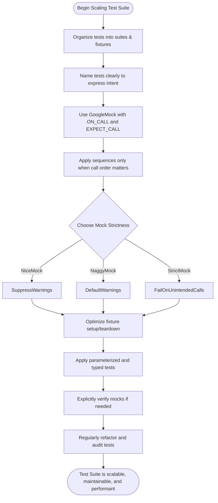

# Scaling Test Suites and Ensuring Maintainability

## Workflow Overview

### Task Description
This guide helps you grow and manage your GoogleTest-based test suites as your C++ project evolves. It covers proven best practices to organize tests, minimize flaky failures, tune test performance, and avoid accumulating technical debt in your test code.

### Prerequisites
- Familiarity with writing and running basic tests using GoogleTest.
- Understanding of mock classes and expectations with GoogleMock.

### Expected Outcome
By following this guide, you will be able to:
- Structure large test suites effectively to support ongoing development.
- Write tests with clear, maintainable naming conventions.
- Reduce flaky and brittle tests for more reliable automation.
- Optimize test suite execution time without sacrificing coverage.
- Prevent common pitfalls that cause test maintenance issues.

### Time Estimate
This guide will take approximately 20-40 minutes to implement key recommendations, depending on the size and maturity of your test suite.

### Difficulty Level
Intermediate: Requires knowledge of GoogleTest and GoogleMock basics.

---

## Best Practices for Scaling and Maintainability

### 1. Organizing Test Suites

- **Group related tests into logical test suites.** Use `TEST_F` fixtures when multiple tests share common setup or teardown logic.
- Maintain consistent directory and file structure that mirrors your product code structure. This makes it easier to locate and manage tests.

### 2. Naming Conventions

- Use descriptive test suite and test case names to clearly express the purpose.
  - Example: `TEST_F(NetworkClientTest, HandlesTimeoutsGracefully)` rather than vague names.
- Adopt naming that reflects user behavior or expected outcomes rather than internal implementation details.

### 3. Minimize Test Flakiness

- Avoid dependencies on external state such as databases, network, or environment variables.
- Use GoogleMock to replace such dependencies with mock objects, controlling behavior precisely.
- Apply `ON_CALL` for common behaviors and `EXPECT_CALL` only to verify critical interactions.
- Use sequences (`InSequence`, `Sequence`) to enforce call order only when required.
- Do not over-specify matchers or strict call counts; balance between too strict and too loose expectations.

### 4. Tuning Test Performance

- Prefer lightweight mocks over expensive integration tests.
- Use `NiceMock` to suppress noisy warnings from uninteresting calls, improving test log clarity.
- Avoid excessive calls to heavyweight operations during testing; simulate using mocks/fakes.
- Structure tests so setup and teardown are efficient. Use fixtures and shared resources appropriately.

### 5. Handling Technical Debt

- Regularly refactor test code for readability and simplicity.
- Avoid tightly coupling test code to implementation that is likely to change frequently.
- Use interfaces and adaptors when mocking external or third-party classes to isolate dependencies.
- Leverage parameterized tests and typed tests to reduce redundant code.
- Explicitly verify mocks using `Mock::VerifyAndClearExpectations()` when necessary.
- Use `Mock::AllowLeak()` sparingly to intentional suppress leaked mock warnings (e.g., for death tests).

### 6. Controlling Mock Strictness

- Default mocks are "naggy": they print warnings on uninteresting calls.
- Use `NiceMock<YourMock>` to suppress warnings for uninteresting calls when these are innocuous.
- Use `StrictMock<YourMock>` to treat uninteresting calls as errors for tighter validation when needed.

---

## Step-by-Step Instructions

<Steps>
<Step title="Define Clear Test Suites and Fixtures">
Group tests by feature or component. Use test fixtures (`TEST_F`) for tests sharing setup.

**Expected Result**: Organized, easy to navigate tests that facilitate maintainability.
</Step>
<Step title="Adopt Meaningful Naming Conventions">
Name test suites and tests to express behavior and intent clearly.

**Expected Result**: Self-explanatory test names easing debugging and review.
</Step>
<Step title="Use GoogleMock Effectively">
Create mock classes for external dependencies using `MOCK_METHOD`. Use `ON_CALL` for default behaviors and `EXPECT_CALL` to assert important interactions.

**Expected Result**: Tests isolated from flaky or slow external dependencies.
</Step>
<Step title="Sequence and Ordering Control When Needed">
Apply `InSequence` or `Sequence` to enforce call order only when order is crucial.

**Expected Result**: Precise interaction validation without over-constraining tests.
</Step>
<Step title="Select Appropriate Mock Strictness">
Use `NiceMock` or `StrictMock` to balance warning noise and strictness.

**Expected Result**: Reduced test log clutter and early detection of unexpected calls.
</Step>
<Step title="Optimize Fixture Setup and TearDown">
Move expensive setup/tear-down to test fixture constructors, destructors, or `SetUpTestSuite` / `TearDownTestSuite`.

**Expected Result**: Quicker test runs, avoid repeated expensive initialization.
</Step>
<Step title="Use Parameterized and Typed Tests">
Leverage `TEST_P` and `TYPED_TEST` to reduce redundant code across multiple input sets and data types.

**Expected Result**: Compact, reusable test logic covering broad scenarios.
</Step>
<Step title="Explicitly Verify and Clear Mocks If Needed">
Call `Mock::VerifyAndClearExpectations()` when your mock lives beyond test scope or when you need early verification.

**Expected Result**: Early feedback on expectation violations preventing false positives.
</Step>
<Step title="Regularly Refactor and Audit Tests">
Review tests periodically to remove obsolete, redundant, or brittle ones.
Update mocks to match evolving interfaces.

**Expected Result**: Test suite freshness, reduced maintenance overhead.
</Step>
</Steps>

---

## Practical Examples

### Example: Grouping Tests with Fixtures

```cpp
class DatabaseTest : public ::testing::Test {
 protected:
  void SetUp() override {
    // Expensive db connection setup simulation
    db_mock_.Connect();
  }

  MockDatabase db_mock_;
};

TEST_F(DatabaseTest, QueryReturnsData) {
  EXPECT_CALL(db_mock_, Execute("SELECT * FROM table"))
      .WillOnce(Return(true));
  // ... test code
}
```

### Example: Using ON_CALL and EXPECT_CALL

```cpp
using ::testing::Return;
using ::testing::_;

MockNetworkClient mock_client;

ON_CALL(mock_client, Connect(_))
    .WillByDefault(Return(true)); // Default behavior
EXPECT_CALL(mock_client, Connect("10.0.0.1"))
    .Times(1)                      // Must be called exactly once
    .WillOnce(Return(false));      // Return error for this ip

bool result = mock_client.Connect("10.0.0.1"); // returns false
bool result2 = mock_client.Connect("127.0.0.1"); // returns true
```

### Example: Enforcing Call Order with InSequence

```cpp
using ::testing::InSequence;

{
  InSequence seq;

  EXPECT_CALL(mock_turtle, PenDown());
  EXPECT_CALL(mock_turtle, Forward(100));
  EXPECT_CALL(mock_turtle, PenUp());
}

// If the tested code calls Forward before PenDown, test fails.
```

### Example: Using NiceMock

```cpp
using ::testing::NiceMock;

NiceMock<MockLogger> mock_logger;
// No warnings will be emitted if calls are made to mock_logger methods
// without specific EXPECT_CALL statements.
```

### Example: Parameterized Test

```cpp
class FooTest : public ::testing::TestWithParam<int> {};

TEST_P(FooTest, HandlesValues) {
  int param = GetParam();
  EXPECT_TRUE(DoWork(param));
}

INSTANTIATE_TEST_SUITE_P(
    ValidValues, FooTest, ::testing::Values(1, 2, 3, 4));
```

---

## Troubleshooting & Tips

### Common Issues

- **Flaky Tests:** Relying on external resources or non-deterministic conditions leads to flaky tests. Use mocks or fakes to isolate such dependencies.
- **Unexpected Call Warnings:** Use explicit `EXPECT_CALL` with `.Times(AnyNumber())` to suppress warnings for calls you consider inconsequential.
- **Compile-Time Errors with Mock Methods:** Wrap complex types with parentheses or provide type aliases when using `MOCK_METHOD` for types containing commas.
- **Incorrect Call Order Failures:** Review sequences and ordering expectations. Only enforce order when explicitly needed.
- **Leaked Mocks:** If mocks are never deleted, `EXPECT_CALL` verification may not happen. Use `Mock::AllowLeak()` to suppress warnings if intentional, otherwise ensure proper destruction.

### Best Practices

- Use `ON_CALL` for setting default mock behaviors; reserve `EXPECT_CALL` for calls you want to verify.
- Minimize the number of expectations to those critical to verifying behavior.
- Document your test intent clearly in test and fixture names.
- Keep mock classes small and focused on the interface under test.
- Use sequences to express partial or total call ordering but avoid overuse.

### Performance Considerations

- Avoid expensive setup in each test by using test suite (`SetUpTestSuite`) mechanisms.
- Prefer mocks and unit-like tests over large integration tests in the fast feedback cycle.
- Consider parallelizing test runs if supported by your environment.

### Alternative Approaches

- Use fake implementations for complex dependencies when mocking is cumbersome.
- Use `StrictMock` for high-confidence tests and `NiceMock` for reducing noise in large test suites.

---

## Next Steps & Related Content

### What's Next
- Explore the [Effective Testing Techniques](../effective-testing-techniques) guides for improving test quality.
- Review the [Mocking Workflows](../effective-testing-techniques/mocking-workflows) for detailed mock usage patterns.
- Dive into the [gMock Cookbook](https://google.github.io/googletest/gmock_cook_book.html) for advanced mocking recipes.

### Related Guides
- [Writing and Running Your First Test](/guides/getting-started/your-first-test)
- [Organizing and Grouping Tests](/guides/getting-started/test-structure)
- [Continuous Integration Integration](/guides/real-world-scenarios/continuous-integration)

### Advanced Topics
- Managing mock strictness levels (Nice, Naggy, Strict)
- Using parameterized and typed tests for complex scenarios

### Resources
- [GoogleTest Primer](overview/intro-product-core/what-is-googletest)
- [GoogleMock for Dummies](https://google.github.io/googletest/gmock_for_dummies.html)
- [Official GoogleTest Repository](https://github.com/google/googletest)

---

## Visualizing Test Suite Growth and Maintainability Workflow



<Info>
Keep this workflow in mind as your project evolves to sustain a healthy test suite that supports confident and efficient continuous development.
</Info>

