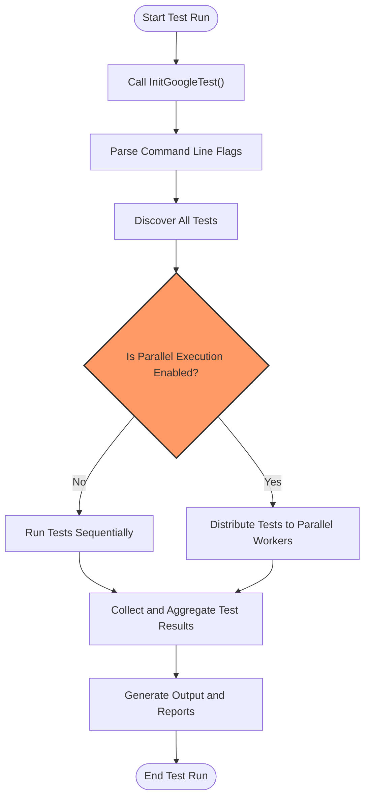

# Performance & Large-Scale Testing

## Overview

This guide empowers you to optimize test performance and reliability at scale using GoogleTest. It covers strategies to accelerate test execution by running tests in parallel, structuring your tests efficiently for large codebases, and leveraging environment flags and options to enable robust continuous testing workflows.

Whether you are maintaining a small project or managing tests at enterprise scale, these practices will help you maximize feedback speed without sacrificing test accuracy.

---

## 1. Optimize Test Execution with Parallel Runs

### Why Run Tests in Parallel?
Running tests sequentially can become time-consuming, especially as your test suite grows. Leveraging parallel execution splits the workload across cores or machines, slashing test runtime and accelerating development feedback.

### How to Enable Parallel Testing in GoogleTest
GoogleTest supports parallel test execution through external test runners like [`gtest-parallel`](https://github.com/google/gtest-parallel) or build systems aware of GoogleTest tests.

1. **Use `gtest-parallel` Test Runner:**
   - Install `gtest-parallel` (a Python script).
   - Run your test binary via:
     ```bash
     gtest-parallel your_test_binary
     ```
   - This will automatically detect and distribute tests across CPU cores.

2. **Integrate Parallel Testing with Build Systems:**
   - Configure your build system (e.g., Bazel, CMake) to run GoogleTest tests in parallel.
   - Ensure dependencies between tests and shared resources are managed correctly.

### Best Practices for Parallel Testing
- **Isolate Tests:** Avoid shared state or global side effects.
- **Use Test Fixtures Carefully:** Tests using fixtures should maintain independence.
- **Be Aware of Thread Safety:** GoogleTest assertions and mocks are thread-safe on most systems but avoid sharing mocks across threads.

<Note>
GoogleTest's internal multi-threading is limited; use external tooling for coordinating parallel runs.
</Note>

---

## 2. Structuring Tests for Large Codebases

### Organize Tests into Logical Test Suites
Group related tests clearly:
- Use descriptive test suite names reflecting component or module.
- Leverage `TEST_F` fixtures to share setup within suites.

### Use Parameterized and Typed Tests to Cover Multiple Cases Efficiently
- Write tests with `TEST_P` and `INSTANTIATE_TEST_SUITE_P` to run the same logic over multiple inputs without duplication.
- Typed tests (`TYPED_TEST_SUITE`) enable validating templates or multiple data types with the same test code.

### Manage Setup and TearDown Costs
- Use `SetUpTestSuite` and `TearDownTestSuite` for expensive initialization shared across tests.
- Avoid placing slow operations in each test's `SetUp` if shared setup suffices.

### Naming and Hierarchy Conventions
- Follow clear naming conventions for test cases and fixtures.
- Avoid underscores (`_`) in test suite and test names per GoogleTest guidelines.

<Info>
See the [Writing and Structuring Tests](https://google.github.io/googletest/primer.html#writing-structuring-tests) guide for detailed organization strategies.
</Info>

---

## 3. Leveraging Environment Options for Efficient Testing

GoogleTest offers flags and environment options to refine test running behavior, reduce runtime, and collect detailed diagnostics.

### Important Flags for Performance and Control

| Flag                          | Description                                                                                   |
|-------------------------------|-----------------------------------------------------------------------------------------------|
| `--gtest_filter=`             | Run only selected tests matching a pattern (useful to focus on impacted areas)               |
| `--gtest_repeat=`             | Run tests multiple times to detect flaky tests or performance degradation                      |
| `--gtest_shuffle`             | Shuffle test execution order to uncover unexpected dependencies                              |
| `--gtest_break_on_failure`   | Break into the debugger immediately on failure                                              |
| `--gtest_output=`             | Generate test results in XML for CI integration and performance analysis                      |
| `--gtest_print_time`          | Shows elapsed time per test to identify slow tests                                           |

### Using Disabled Tests for Iterative Testing
- GoogleTest lets you disable tests (prefix test name with `DISABLED_`) to exclude them from runs without deleting code.
- Enable only required tests during development to speed iterations.

### Test Sharding Support
- Use the environment variables `GTEST_TOTAL_SHARDS` and `GTEST_SHARD_INDEX` to split your tests into shards across multiple machines or processes.
- This enables distributed test execution in CI pipelines.

### Record and Use Test Properties
- Add metadata to tests with `RecordProperty()` to help track performance or categorize tests.

---

## 4. Continuous Integration and Large-Scale Test Reliability

### Tips for Integration
- Use `RUN_ALL_TESTS()` once per test run to avoid conflicts.
- Initialize GoogleTest with `InitGoogleTest()` to parse flags properly.
- Generate XML output to feed CI dashboards.

### Handling Flaky Tests
- Detect flakes via repeated runs (`--gtest_repeat`).
- Isolate flaky tests and fix or temporarily disable them.

### Performance Monitoring
- Collect timing info via `--gtest_print_time`.
- Profile test runs to identify bottlenecks.

### Best Practices
- Maintain tests that run quickly and independently.
- Use test fixtures for resource reuse but ensure no shared state leakage.
- Parallelize test execution for faster feedback loops.

<Warning>
Do not run tests concurrently that depend on shared external resources unless explicitly designed for concurrency.
</Warning>

---

## 5. Troubleshooting Performance Issues

### Common Pitfalls
- Tests sharing mutable global state causing flakiness.
- Excessive setup and teardown operations in each test.
- Tests that depend on file system or network resources without isolation.
- Over-parallelization leading to resource contention.

### How to Diagnose
- Use `--gtest_print_time` to find slow tests.
- Run with `--gtest_repeat` to identify flaky or non-deterministic tests.
- Isolate failing or slow tests by running subsets with `--gtest_filter`.

### Tips to Improve
- Refactor large tests into smaller, focused tests.
- Cache expensive resources in test fixtures shared across multiple tests.
- Mock external dependencies where possible.

---

## 6. Summary Diagram: Test Execution and Parallelization Flow



---

## Next Steps

- Explore the [Writing and Structuring Tests](https://google.github.io/googletest/primer.html#writing-structuring-tests) guide to optimize your test organization.
- Use [`gtest-parallel`](https://github.com/google/gtest-parallel) or build system integrations to set up parallel test execution.
- Configure your CI pipelines using GoogleTest flags for filtering, sharding, and output formatting.
- Review performance regularly with GoogleTest's timing options to keep tests fast and reliable.

For advanced performance topics, refer to the [Advanced Guide](advanced.md) and [Performance FAQ](faq.md#improving-test-performance).

---

## References

- [GoogleTest Primer](https://google.github.io/googletest/primer.html)
- [Parameterized and Typed Tests](../core-testing-workflows/parameterized-and-typed-tests.md)
- [Test Runner Initialization and Command-Line Flags](../api-reference/infrastructure-and-internals/test-runner-entrypoint.md)
- [gtest-parallel GitHub Repository](https://github.com/google/gtest-parallel)

## Troubleshooting Tips

<AccordionGroup title="Common Performance Issues and Solutions">
<Accordion title="Tests Sharing Global Mutable State">
Shared state causes flaky or slow tests. Refactor to isolate state or reset between tests.
</Accordion>
<Accordion title="Excessive Setup and Teardown">
Move costly setup to `SetUpTestSuite` rather than `SetUp` to run once per suite.
</Accordion>
<Accordion title="Slow External Dependencies">
Mock or stub dependencies like database, networking, or file I/O.
</Accordion>
<Accordion title="Over-Parallelization Problems">
Limit parallel jobs to avoid contention for CPU, disk, or memory.
</Accordion>
</AccordionGroup>

<Tip>
Regularly use `--gtest_print_time` to monitor and refactor slow tests.
</Tip>

<Warning>
Avoid sharing a mock object across threads; GoogleMock is thread-safe for separate mock objects only.
</Warning>

---

*End of Performance & Large-Scale Testing Guide.*
