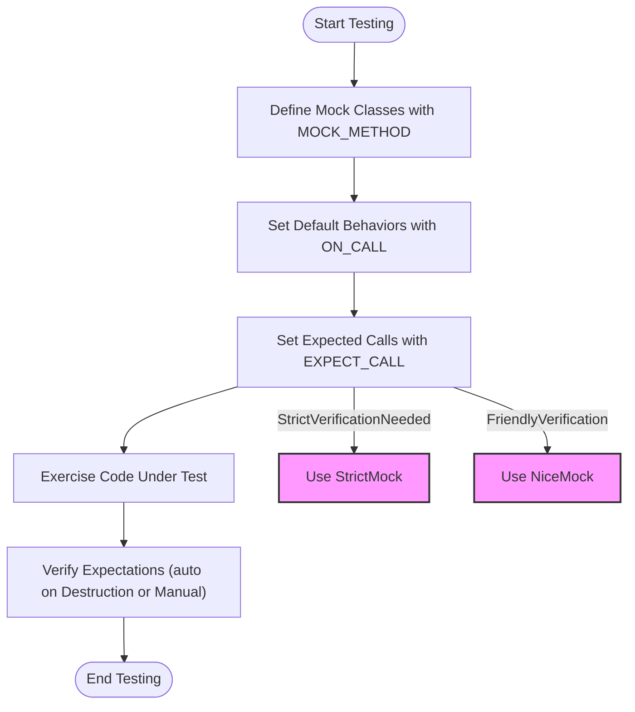

# Mocking Best Practices

## Introduction
Effective mocking is a cornerstone of robust automated testing in C++. This guide provides practical best practices and tips for structuring mocks, adopting appropriate test doubles strategies, avoiding common errors, and ensuring your tests remain maintainable and reliable over time.

This page focuses exclusively on mocking within the GoogleMock framework, empowering you to write flexible and resilient mocks that accurately verify your code's interaction contracts.

---

## 1. Organizing Your Mock Classes

### Define Clear and Concise Interfaces
- Always mock interfaces or abstract base classes instead of concrete classes.
- When concrete classes are involved, prefer writing adapter interfaces and mock those instead.

### Use `MOCK_METHOD` Correctly
- Place all `MOCK_METHOD` declarations in the `public:` section, regardless of the base method's access specifier.
- For const or noexcept methods, include the respective qualifiers (e.g., `(const, override)`).
- If method signatures contain commas, use parentheses or type aliases to avoid macro parsing issues.

### Avoid Over-mocking
- Mock only the interactions relevant to the behavior under test.
- Resist mocking every method blindly to prevent fragility and excessive coupling in tests.

### Minimize Boilerplate Using Templates
- For template classes, mock by specializing templates normally and use the same `MOCK_METHOD` syntax.

### Delegate to Fakes or Real Objects Where Helpful
- When feasible, delegate default behaviors to a fake or real object implementation using `ON_CALL` and lambdas.
- This helps reduce duplicated mock logic and better reflect actual behavior.


## 2. Setting Expectations Effectively

### Prefer `ON_CALL` for Default Behavior
- Use `ON_CALL` to specify default behavior of mock methods without asserting invocation.
- Helps reduce overly strict tests and embraces behavioral flexibility.

### Use `EXPECT_CALL` to Verify Critical Interactions
- Only use `EXPECT_CALL` to assert calls you specifically want to verify.
- Overusing `EXPECT_CALL` causes brittle tests that break with harmless internal changes.

### Set Cardinalities Appropriately
- Specify how many times a method should be called using `.Times()` when it matters.
- Rely on inferred cardinality for simple cases, but be explicit to avoid ambiguity.

### Use `.WillOnce()` and `.WillRepeatedly()` to Control Behavior
- Use `.WillOnce()` to set behavior for specific calls.
- Use `.WillRepeatedly()` to define fallback behavior for subsequent invocations.

### Sequence and Order
- Use `InSequence` or `.InSequence()` to enforce call order only when necessary.
- Use `.After()` for more flexible partial ordering of call expectations.

### Retire Expectations Explicitly
- Use `.RetiresOnSaturation()` to automatically disable expectations once their call count limit is reached.
- Prevents confusing failures due to sticky expectations.


## 3. Managing Mock Strictness

GoogleMock supports three modes for uninteresting calls (calls without a matching `EXPECT_CALL`):

| Mock Type  | Description                                                | When to Use                                  |
|------------|------------------------------------------------------------|---------------------------------------------|
| NiceMock   | Suppresses warnings on uninteresting calls.                 | Default for most tests to reduce noise.    |
| NaggyMock  | Prints warnings on uninteresting calls (default behavior).  | During debugging or test development.       |
| StrictMock | Fails tests on uninteresting calls.                         | When strict verification is essential.     |

### Tips for Choosing Mock Strictness
- Prefer `NiceMock<T>` for maintainable tests that tolerate implementation changes.
- Use `NaggyMock<T>` temporarily while diagnosing issues.
- Use `StrictMock<T>` sparingly to enforce strict interaction contracts.

### Creating Strictness-Controlled Mocks
```cpp
using ::testing::NiceMock;
using ::testing::NaggyMock;
using ::testing::StrictMock;

NiceMock<MockFoo> nice_mock;   // Friendly to uninteresting calls.
NaggyMock<MockFoo> naggy_mock; // Warns on uninteresting calls.
StrictMock<MockFoo> strict_mock; // Fails on uninteresting calls.
```


## 4. Avoiding Common Pitfalls

### Do Not Overconstrain Tests
- Restrict expectations to only what matters for the test's intent.
- Avoid specifying exact call counts or sequences unless behavior depends on order or count.

### Order of `EXPECT_CALL`
- GoogleMock matches calls against expectations in reverse order — newer expectations shadow older ones.
- Place general expectations first and more specific ones later.

### Beware of Sticky Expectations
- Expectations remain active (sticky) after saturation by default, causing surprising failures when reused.
- Use `.RetiresOnSaturation()` to retire them when appropriate.

### Handling Overloaded Methods
- Mock all overloads or bring unmocked ones into scope with `using` to avoid hiding base class methods.

### Deal Carefully with Move-only Types
- Use lambdas or callable objects in `WillOnce` and `WillRepeatedly` to support move-only arguments or return values.

### Naming and Location Best Practices
- Define mocks close to the interface owner to simplify maintenance.
- Avoid mocking classes you do not own unless providing thin adaptors.


## 5. Tips for Reliable and Maintainable Tests

### Keep Tests Focused
- Verify only one behavior or interaction per test.
- Name tests to document what they verify.

### Use Default Behaviors Generously
- Favor `ON_CALL` for common safe actions.
- Use catch-all expectations like `EXPECT_CALL(obj, Method(_)).Times(AnyNumber())` when unimportant calls are possible.

### Use Matchers Wisely
- Use simple matchers like `_` (wildcard) to avoid overspecification.
- Combine or parameterize matchers (`AllOf()`, `AnyOf()`, `Truly()`) when needed.

### Delegate to Real Implementations When Logic Is Complex
- Start with a fake and delegate default actions where standard mocks get complicated.

### Suppress Uninteresting Call Warnings in Bulk
- Use `NiceMock` or explicit `EXPECT_CALL(...).Times(AnyNumber())` on noisy methods instead of cluttering tests.

### Avoid Expectation Updates After Calls
- Set up all expectations **before** passing mocks to code or exercising code paths to avoid undefined behavior.


## 6. Troubleshooting Common Issues

### Unexpected or Uninteresting Call Warnings
- Verify if an `EXPECT_CALL` is missing for invoked methods.
- Add catch-all `EXPECT_CALL` or switch to `NiceMock` if calls are legitimate but uninteresting.

### Too Few or Too Many Calls Failures
- Check `.Times()` clauses match the real call counts.
- Use sequences or `RetiresOnSaturation()` to handle ordered or limited calls.

### Compiler Errors on Mocking
- Ensure mock methods are declared correctly with appropriate qualifiers.
- Wrap types with commas in parentheses or define type aliases.

### Mock Object Not Verified Due to Leaks
- Prefer stack allocation of mocks or call `Mock::VerifyAndClearExpectations(&mock)` manually.
- Enable heap checker if available.

### Overloading and Ambiguity
- Use `using` declarations to avoid hiding base overloads.
- Use `SafeMatcherCast` or explicit static casts with matchers to disambiguate.

---

## 7. Summary
Mocking effectively with GoogleMock requires deliberate structuring of mock classes, setting appropriate expectations, and controlling mock strictness to make tests maintainable and resilient. Adopting best practices such as delegating to fakes, avoiding brittle over-specification, and leveraging the `NiceMock`, `NaggyMock`, and `StrictMock` modes ensures smooth test development and debugging.


---

## References and Additional Resources

- [GoogleMock Reference - MOCK_METHOD, EXPECT_CALL, ON_CALL](https://google.github.io/googletest/reference/mocking.html)
- [gMock Cookbook - Recipes for effective mocking](https://google.github.io/googletest/gmock_cook_book.html)
- [gMock for Dummies - Introduction to mocking](https://google.github.io/googletest/gmock_for_dummies.html)
- [Using NiceMock, NaggyMock, and StrictMock](https://google.github.io/googletest/gmock_cook_book.html#NiceStrictNaggy)
- [Matchers Reference](https://google.github.io/googletest/reference/matchers.html)
- [Mocking Best Practices (this page)](/guides/real-world-workflows/mocking-best-practices)


---

## Next Steps

- Explore [Writing Your First Test](https://google.github.io/googletest/guides/getting-started.html#writing-your-first-test) to apply mocking basics.
- Review [Mock Class Definition and MOCK_METHOD Macros](https://google.github.io/googletest/reference/mocking-framework/mock-class-definition.html) for detailed syntax.
- Consult [Setting Expectations: EXPECT_CALL and ON_CALL](https://google.github.io/googletest/reference/mocking-framework/setting-expectations.html) to deepen your understanding of expectations.
- Learn about [Custom Matchers and Actions](https://google.github.io/googletest/concepts/custom-matchers.html) for extending mocking capabilities.


---

## Practical Tips

<Tip>
Remember to set all expectations before exercising the code under test. Setting expectations after a mock has been used leads to undefined behavior.
</Tip>

<Tip>
Use `NiceMock` to suppress warnings about uninteresting calls unless your test specifically needs strict verification.
</Tip>

<Tip>
When mocking methods with complex or frequently changing argument lists, consider delegating to a fake or simplify the interface in the mock.
</Tip>

<Warning>
Avoid excessive and brittle ordering constraints; only use sequences or partial orders to enforce order where the behavior critically depends on it.
</Warning>

## Example: Structuring Expectations with Sequences and Retiring

```cpp
using ::testing::InSequence;
using ::testing::Return;
using ::testing::RetiresOnSaturation;

{
  InSequence s;

  EXPECT_CALL(mock, Init()).WillOnce(Return(true)).RetiresOnSaturation();
  EXPECT_CALL(mock, Process(_)).Times(3);
  EXPECT_CALL(mock, Shutdown()).WillOnce(Return(true)).RetiresOnSaturation();
}
```

This ensures calls to `Init()` happen before `Process()` calls, which happen before `Shutdown()`, and limits expectations to avoid overly sticky states.

---

## Diagram: Mocking Workflow Overview




---

## Summary of Key Practices
- Mock interfaces, not concrete classes.
- Use `ON_CALL` for default behavior, `EXPECT_CALL` for verification.
- Keep tests focused; verify only one interaction per test.
- Select appropriate mock strictness (Nice, Naggy, Strict).
- Control call order only when necessary.
- Retire expectations with `.RetiresOnSaturation()` to avoid sticky failures.
- Delegate to fakes or real objects when logic is complex.
- Use matchers smartly to avoid brittle argument specifications.


---

## For More Help
If you encounter issues, refer to the [Common Issues Troubleshooting](https://google.github.io/googletest/faq/troubleshooting-usage/common-errors.html) and the [Understanding Uninteresting vs Unexpected Calls](https://google.github.io/googletest/gmock_cook_book.html#uninteresting-vs-unexpected) sections. Community support channels and GitHub discussions may also assist.


---

This guide complements related documentation on GoogleTest's core concepts, setup, and integration covered elsewhere in the docs.
