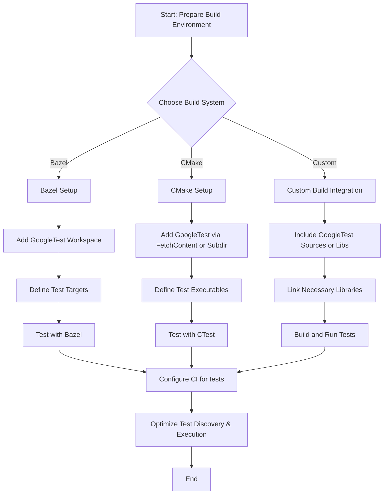

# Integrating GoogleTest into Build Systems

## Overview

This guide provides detailed instructions and best practices for integrating GoogleTest into large-scale build processes. Whether you use Bazel, CMake, or custom build workflows, this page will help you establish an effective testing setup. It covers strategies for continuous integration (CI) integration and optimizing test discovery to improve build and test performance.

---

## Prerequisites

Before starting integration, ensure the following prerequisites are met:

- You have a working GoogleTest download or source available, typically as part of your project or fetched as an external dependency.
- Your build system supports C++17 or later, which is required by GoogleTest.
- Familiarity with your build system's configuration syntax and rules (Bazel, CMake, or your custom build files).
- Access to your CI environment configuration if planning automated test execution.

---

## Integration Steps

The instructions below tailor setup workflows explicitly for Bazel, CMake, and custom build systems. They focus exclusively on integrating GoogleTest without broader build system introduction.

### 1. Integrating GoogleTest Using Bazel

GoogleTest provides first-class integration with Bazel with defined BUILD targets.

#### Step 1: Add GoogleTest as a dependency

Ensure your `WORKSPACE` file includes GoogleTest as a Bazel external repository, e.g.: 

```python
http_archive(
    name = "com_google_googletest",
    url = "https://github.com/google/googletest/archive/release-1.13.0.zip",
    strip_prefix = "googletest-release-1.13.0",
)
```

Add this or the corresponding stable version of GoogleTest for your project.

#### Step 2: Reference GoogleTest targets in BUILD files

In your test BUILD files, add dependencies on GoogleTest targets:

```bazel
cc_test(
    name = "my_test",
    srcs = ["my_test.cc"],
    deps = ["@com_google_googletest//:gtest_main"],
)
```

Use `gtest_main` to link the main function for test execution.

#### Step 3: Build and run tests

Use Bazel commands:

```bash
bazel test //path/to:my_test
```

Tests are built and run automatically with output parsing.

#### Step 4: Optimize test discovery

* Use Bazel's native parallelism and test sharding to speed test runs.
* Use test filters (`--test_arg`) to run selective tests in CI.

---

### 2. Integrating GoogleTest Using CMake

GoogleTest supports CMake with straightforward integration.

#### Step 1: Add GoogleTest as a subdirectory or external project

Option A: Clone GoogleTest into your project and add

```cmake
add_subdirectory(googletest)
```

Option B: Use CMake's `FetchContent` (preferred for external dependencies):

```cmake
include(FetchContent)
FetchContent_Declare(
  googletest
  URL https://github.com/google/googletest/archive/release-1.13.0.zip
)
FetchContent_MakeAvailable(googletest)
```

#### Step 2: Link GoogleTest libraries to your test targets

Define your test executable and link GoogleTest:

```cmake
add_executable(my_test my_test.cc)
target_link_libraries(my_test gtest_main)
add_test(NAME my_test COMMAND my_test)
```

#### Step 3: Configure test execution

Run tests with CTest, e.g.,

```bash
ctest --output-on-failure
```

In CI, invoke CTest commands to run tests.

#### Step 4: Optimize test runs

* Use `gtest_filter` to select subsets of tests.
* Leverage CTest's parallel test execution with `-j` flags.

---

### 3. Integrating GoogleTest into Custom Build Workflows

For projects without Bazel or CMake, GoogleTest can be integrated manually.

#### Step 1: Include GoogleTest source or pre-built library

Ensure GoogleTest sources or compiled libraries are available in your build system.

#### Step 2: Include necessary headers and link libraries

Reference GoogleTest and pthread (or equivalent threading library) if required:

```cpp
#include <gtest/gtest.h>
```

Link against GoogleTest and GoogleMock libraries:

```
-lgtest -lgmock -lpthread
```

Ensure you link to `pthread` or platform equivalent as GoogleTest uses threading.

#### Step 3: Define test executables

Create executables per your build workflow that include tests and link dependencies.

#### Step 4: Execute tests

Run test executables or integrate them into your CI pipelines.

#### Step 5: Optimize

* Organize test binaries by test suites.
* Use GoogleTest command-line flags (`--gtest_filter`, `--gtest_repeat`, etc.) to control execution.
* Parallelize test execution in your build orchestration.

---

## Strategies for CI Integration

- **Automate test runs:** Invoke your test execution commands (Bazel test, CTest, custom commands) in your CI workflows.
- **Use filters and sharding:** To reduce CI build times, run subsets of tests based on code changes or shard tests across parallel runners.
- **Enable verbose output:** Configure GoogleTest verbosity flags like `--gtest_verbose=info` for detailed logs useful in diagnosing failures.
- **Fail fast:** Configure CI to halt on first test failure to save resources.
- **Collect and archive test results:** Integrate GoogleTest’s XML output options (`--gtest_output=xml`) to enable CI systems to record and display test reports.

---

## Best Practices for Optimizing Test Discovery

* Structure your tests with unique and descriptive names to allow effective filtering.
* Categorize tests using `TEST_F`, `TEST_P`, or labels to group related tests.
* Leverage command-line flags to discover tests with `--gtest_list_tests`.
* Use regex filters with `--gtest_filter` to run focused subsets.
* Minimize test dependencies to enable parallel run.
* For large test suites, group tests into logical executables/binaries to optimize granularity.

---

## Troubleshooting

### Common Issues

- **Tests not executing:** Confirm test targets/executables are correctly built and linked.
- **Linker errors:** Ensure GoogleTest and GoogleMock libraries and threading libraries are linked.
- **Unrecognized test macros:** Verify `#include <gtest/gtest.h>` is included.
- **Tests not discovered:** Use `--gtest_list_tests` to verify test discovery.
- **Slow test execution:** Employ test filtering, sharding, or parallel test runs.
- **Build system errors:** Verify workspace setups and dependency declarations.

### Tips

- Always specify `gtest_main` in Bazel or link `gtest_main` in CMake to get the test main function.
- Use naming conventions consistent with your build system for test targets.
- Regularly update GoogleTest to benefit from performance and feature improvements.
- If integrating with CI, collect detailed logs and test reports for analysis.

---

## Next Steps & Related Documentation

- [Setting Up GoogleTest in Your Project](/guides/getting_started/setting-up-environment) for detailed environment preparation.
- [Your First Test: Writing and Running](/guides/getting_started/first-test) to create and execute your first tests.
- [Writing Powerful Assertions](/guides/core_workflows/writing-assertions) for mastering test validation.
- [Mocking Dependencies with GoogleMock](/guides/core_workflows/mocking-basics) to extend testing with mocks.
- Official GoogleTest & GoogleMock repositories:
  - https://github.com/google/googletest
  - https://google.github.io/googletest/

---

## Summary Diagram


