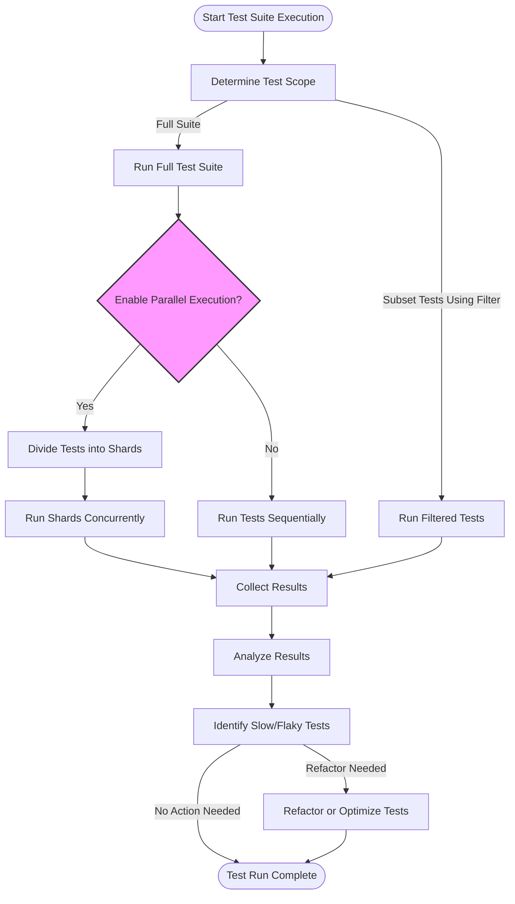

# Performance and Scale: Optimizing Large Test Suites

## Overview

This guide provides pragmatic techniques to keep large test suites in GoogleTest and GoogleMock fast, responsive, and maintainable. When test suites grow, performance and reliability can degrade, making continuous integration and iterative development slower and more frustrating. This document focuses on user-oriented workflows for optimizing test execution by selectively running tests, parallelizing workloads, and diagnosing slow tests—ensuring sustainable test-driven development (TDD) in production environments.

---

## 1. Workflow Overview

### Task Description
Enable developers to optimize large GoogleTest suites for speed and reliability. Learn how to run subsets of tests strategically, leverage parallel test execution, and isolate slow or flaky tests for debugging.

### Prerequisites
- A fully integrated GoogleTest/GoogleMock environment.
- Tests organized into logical suites and fixtures.
- Access to CI or build system capable of running multiple jobs in parallel.

### Expected Outcome
- Ability to run targeted subsets of tests to save time.
- Harnessing parallel execution to run suites efficiently.
- Understanding and troubleshooting slow tests.

### Time Estimate
Setting up and applying these practices may take from a few minutes to several hours depending on suite size and infrastructure.

### Difficulty Level
Intermediate: requires familiarity with GoogleTest framework and test tooling.

---

## 2. Selective Test Running

Running your entire large test suite every time can be time-consuming. Selective test running helps focus on relevant tests.

### Actionable Steps

1. **Use `--gtest_filter` flag** to run a subset of tests by name patterns.

   ```bash
   ./my_test_binary --gtest_filter=MySuite.*
   ./my_test_binary --gtest_filter=-*FlakyTest
   ./my_test_binary --gtest_filter=FooTest.Bar:BarTest.Baz
   ```

2. **Combine positive and negative patterns** to exclude long-running or flaky tests.

3. **Create groups of tests logically** by naming conventions or custom tags to make filtering easier.

4. **Leverage `DISABLED_` prefix** on test names you want to exclude temporarily without removing them.

### Verification
Confirm that filtered runs only include or exclude expected tests by examining the output listing.

### Tips & Best Practices
- Use specific filters to reduce test execution times during development.
- Avoid overly broad filters that cause significant test overlaps.
- Maintain naming conventions to facilitate filtering.

---

## 3. Parallel Test Execution

Leverage multiple CPUs or CI agents to run tests in parallel, dramatically reducing total runtime.

### Pre-Requisites
- Your build system or CI supports parallel jobs (e.g., Bazel, CMake, Jenkins).
- Tests are independent (do not share state or rely on global fixtures without proper synchronization).

### Actionable Steps

1. **Split tests into shards** using environment variables:

   - `GTEST_TOTAL_SHARDS`: Total number of shards.
   - `GTEST_SHARD_INDEX`: Index of this shard (0-based).

   ```bash
   export GTEST_TOTAL_SHARDS=4
   export GTEST_SHARD_INDEX=0
   ./my_test_binary
   ```

2. **Run multiple test instances concurrently**, each with different `GTEST_SHARD_INDEX` values.

3. **Integrate parallel execution into CI pipelines**, configuring it to run shards on separate agents.

4. **Verify results by aggregating outputs** from all shards.

### Verification
Ensure each test runs exactly once across all shards. Look for reports about missing or duplicated tests.

### Tips & Best Practices
- Avoid stateful tests or use proper isolation.
- Parallelize at the test binary or suite level for best performance.
- Use build system native support for test parallelism when possible.

---

## 4. Identifying and Debugging Slow Tests

Slow tests degrade developer velocity and CI throughput. Isolate them to maintain suite health.

### Actionable Steps

1. **Run tests with timing enabled**:

   ```bash
   ./my_test_binary --gtest_print_time=1
   ```

2. **Analyze test output** for tests with long execution times.

3. **Use GoogleTest's XML or JSON output** for machine parsing and aggregation.

4. **Mark slow tests with custom tags or naming conventions** (e.g., `SlowTest`).

5. **Isolate slow tests using `--gtest_filter`** to run them independently.

6. **Consider breaking up large tests into smaller units** or converting into parameterized tests.

7. **Profile slow tests** to identify bottlenecks.

### Verification
Slow tests should be clearly identified and reproducible independently.

### Tips & Best Practices
- Regularly monitor test durations in CI.
- Treat significantly slower tests as candidates for optimization or refactoring.
- Use `DISABLED_` prefix for flaky or very slow tests during active development.

---

## 5. Best Practices and Common Pitfalls

- **Use `ON_CALL` for default mock behaviors**, not `EXPECT_CALL`, unless verifying the call is critical—this prevents overly strict tests.
- **Avoid brittle tests by not over-constraining calls**: match only essential arguments.
- **Suppress uninteresting call warnings with `NiceMock`** when appropriate.
- **Use `RetiresOnSaturation()` to manage expectations lifecycle** and avoid sticky expectations causing failures.
- **Run tests in isolated environments** to prevent external factors from affecting timings.
- **Do not disable tests permanently**; strive to fix flaky or slow tests.
- **Keep your test suites modular** to allow targeted runs and parallelization.

<Tip>
Check your tests for dependencies on shared state when running in parallel to avoid flaky failures.
</Tip>

<Tip>
Use the `--gmock_verbose=info` flag to get detailed traces of mock calls when diagnosing unexpected behaviors or slow tests.
</Tip>

<Warning>
Do not overuse `EXPECT_CALL` without `WillOnce` or `WillRepeatedly`—this can cause unexpected test failures or increased test fragility.
</Warning>

---

## 6. Sample Scenario: Improving a Large Suite

Suppose you have a suite with 10,000 tests taking 3 hours to run.

**Step 1:** Identify slow tests

```bash
./test_binary --gtest_print_time=1 > timed-run.log
```

Parse `timed-run.log` to find tests taking over 10 seconds.

**Step 2:** Filter out slow tests during development

```bash
./test_binary --gtest_filter=-*SlowTest
```

**Step 3:** Run slow tests in isolation or with dedicated resources.

**Step 4:** Use `GTEST_TOTAL_SHARDS` and `GTEST_SHARD_INDEX` to shard tests across multiple CI nodes:

```bash
export GTEST_TOTAL_SHARDS=10
export GTEST_SHARD_INDEX=0  # on node 1
./test_binary
```

Repeat on nodes 2–10 with appropriate index.

**Step 5:** Gradually refactor and optimize slow tests.

---

## 7. Troubleshooting & Tips

### Common Issues

- **Unintended test exclusions**: Verify filters and shard indices carefully.
- **Race conditions in parallel runs**: Ensure tests do not share global state or use proper synchronization.
- **Flaky tests misidentified as slow or failing**: Investigate stability separately; flaky tests cause intermittent failures unrelated to performance.
- **Warnings on uninteresting mock calls**: Use `NiceMock` or explicitly allow calls.

### Tips

- Use logging and timing macros to profile tests.
- Adopt naming conventions to mark and control test categories.
- Automate performance monitoring as part of CI to prevent regressions.

---

## 8. Next Steps & Related Content

- Explore [Structuring and Organizing Test Suites](https://google.github.io/googletest/guides/core_workflows/structuring-tests) for maintaining modular large tests.
- Use [Mocking Dependencies with GoogleMock](https://google.github.io/googletest/guides/core_workflows/mocking-basics) to manage mocks and expectations efficiently.
- Review [Troubleshooting Common Setup Issues](https://google.github.io/googletest/getting-started/configuration-validation/troubleshooting-common-issues) for environment-specific performance tips.
- Consult the [gMock Cookbook](https://google.github.io/googletest/gmock_cook_book.html) for advanced mocking patterns affecting performance.

---

## References

- GoogleTest Official Repository: https://github.com/google/googletest
- gMock Cookbook
- GoogleTest Primer
- GoogleTest Flags and Options

---

## Diagram: Large Test Suite Execution Flow with Parallelization


