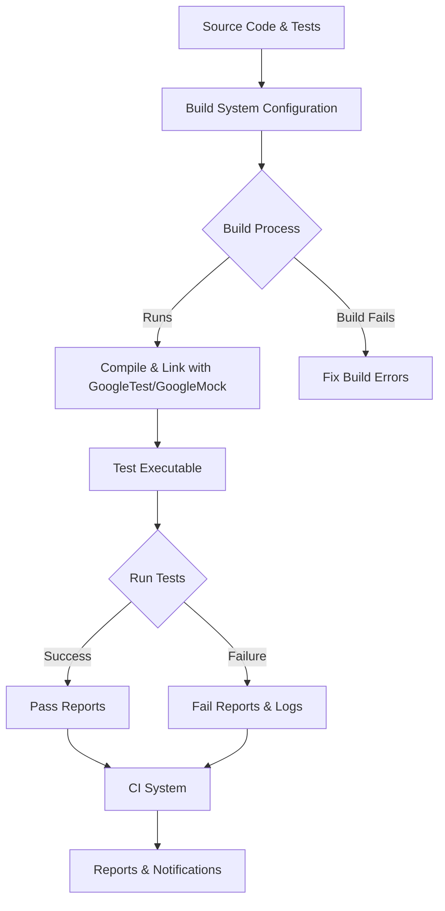

# Integrating with Build Systems and CI

## Overview
This guide provides a practical, step-by-step workflow for integrating GoogleTest and GoogleMock into your C++ projects using common build tools like CMake and Bazel, as well as best practices for automated test execution within Continuous Integration (CI) pipelines. You will learn how to configure build environments, link test binaries properly, automate test runs, and generate test reports to maintain robust and scalable testing workflows.

---

## 1. Integration Workflow Overview

### Task Description
Enable seamless incorporation of GoogleTest/GoogleMock into your project's build pipeline and CI environment to automate testing, enforce code quality, and receive reliable test reports.

### Prerequisites
- A C++ project with an established build system (CMake or Bazel).
- GoogleTest and GoogleMock source code available either via submodules, fetched during build, or installed libraries.
- Basic familiarity with your build tool’s syntax and concepts.

### Expected Outcome
- Successfully configured project files that build and link GoogleTest/GoogleMock.
- Executable test binaries that run automatically during builds.
- Integration of test execution within CI pipelines with automated reporting.

### Time Estimate
30 to 60 minutes for initial setup, depending on existing build environment complexity.

### Difficulty Level
Intermediate

---

## 2. Step-By-Step Integration Instructions

### For CMake-Based Projects

<Steps>
<Step title="1. Adding GoogleTest and GoogleMock Source">
Include GoogleTest and GoogleMock either as a submodule, downloaded dependency, or part of your source tree.

- Option A: Use CMake's `FetchContent` to download GoogleTest:

```cmake
include(FetchContent)
FetchContent_Declare(
  googletest
  URL https://github.com/google/googletest/archive/refs/heads/main.zip
)
FetchContent_MakeAvailable(googletest)
```

- Option B: Add GoogleTest/GoogleMock source directory via `add_subdirectory`:

```cmake
add_subdirectory(path/to/googletest)
add_subdirectory(path/to/googlemock)
```

This ensures GoogleTest and GoogleMock targets are available for linking.
</Step>

<Step title="2. Linking Test Executables with GoogleTest/GoogleMock">
Create your test executable and link it against the appropriate GoogleTest/GoogleMock libraries.

- For tests using only GoogleTest:

```cmake
add_executable(my_tests test1.cpp test2.cpp)
target_link_libraries(my_tests PRIVATE gtest_main)
```

- For tests using GoogleMock (which depends on GoogleTest):

```cmake
add_executable(my_mock_tests mock_tests.cpp)
target_link_libraries(my_mock_tests PRIVATE gmock_main)
```

The `gtest_main` and `gmock_main` libraries provide a ready-made `main()` function for running all tests.

- If you want custom `main()`, link to `gtest` or `gmock` libraries instead, and provide your own entry point.
</Step>

<Step title="3. Configuring Test Discovery and Execution">
Add test targets to CTest to integrate with the CMake test runner:

```cmake
include(CTest)
add_test(NAME MyTests COMMAND my_tests)
add_test(NAME MyMockTests COMMAND my_mock_tests)
```

This makes tests runnable via `ctest` or supported CI systems.

Optionally add labels and properties for filtering and reporting.
</Step>

<Step title="4. Build and Run Tests Locally">
Build your project and execute tests:

```bash
cmake -B build -S .
cmake --build build --config Debug
ctest --test-dir build
```

You should see output confirming tests passed or failed.
</Step>

<Step title="5. Integrate Tests into CI Pipelines">
Configure your chosen CI system (e.g., GitHub Actions, Jenkins, GitLab CI) to run the build and test commands as part of the pipeline.

Best practices:
- Use `ctest --output-on-failure` to show failing test output.
- Store XML test result reports using CTest's `--output-junit` option or with GoogleTest flags.
- Fail the pipeline if any tests fail.

Example GoogleTest XML output command-line flag:
```
./my_tests --gtest_output=xml:report.xml
```

Upload the XML report to CI to enable test reporting features.
</Step>
</Steps>

### For Bazel-Based Projects

<Steps>
<Step title="1. Adding GoogleTest and GoogleMock to Bazel Workspace">
Declare GoogleTest and GoogleMock dependencies in your `WORKSPACE` file, typically through rules_closure or prebuilt repos.

Example snippet:
```python
http_archive(
    name = "com_google_googletest",
    urls = ["https://github.com/google/googletest/archive/release-1.11.0.tar.gz"],
    strip_prefix = "googletest-release-1.11.0",
)
```

Import targets in your `BUILD` files accordingly.
</Step>

<Step title="2. Defining Test Targets in BUILD Files">
Create Bazel `cc_test` targets for your test code linking to GoogleTest and GoogleMock libraries.

Example:
```python
cc_test(
    name = "my_test",
    srcs = ["my_test.cpp"],
    deps = ["@com_google_googletest//:gmock_main"],
)
```

This includes both GoogleMock and GoogleTest libraries and main function.
</Step>

<Step title="3. Running Tests Locally and in CI">
Execute Bazel test commands locally:

```bash
bazel test //path/to:my_test
```

Configure your CI to run `bazel test` commands.

For test reporting, configure Bazel to output JUnit XML reports:

```bash
bazel test --test_output=errors --test_summary=short --test_arg=--gtest_output=xml
```

Collect and publish these XML reports in your CI system.
</Step>
</Steps>

---

## 3. Best Practices for Build and CI Integration

- **Use Provided Main Libraries:** Prefer linking against `gtest_main` or `gmock_main` to avoid writing your own test entry point unless customization is needed.
- **Consistent Compiler Flags:** Make sure GoogleTest and your project use the same compiler settings (especially related to C++ standard and runtime linkage) to avoid ABI issues.
- **Enable Verbose Test Output:** In CI, enable detailed logs (`--gtest_verbose`, `--gtest_color`) to help diagnose failures.
- **Filter Tests in CI When Needed:** Use GoogleTest filters (`--gtest_filter=TestSuite.TestName`) to run critical tests faster.
- **Automate XML Report Generation:** Always produce machine-readable test reports (`--gtest_output=xml:filename.xml`) to integrate with CI dashboards and analytics.

---

## 4. Common Pitfalls and Troubleshooting

### Tests Are Not Found or Run
- Verify the test executable is linked against `gtest_main` or `gmock_main` (provides main).
- Confirm tests are registered properly with `add_test` in CMake or `cc_test` in Bazel.

### Linking Errors
- Ensure GoogleTest and GoogleMock source code or libraries are correctly included.
- Confirm consistent compiler flags across GoogleTest, GoogleMock, and your code.

### CI Test Output Too Sparse
- Use `ctest --output-on-failure` or pass `--gtest_verbose=info` to test executables to get more insight.

### XML Reports Not Generated
- Add `--gtest_output=xml:<file>` to test execution commands.
- Confirm CI setup is configured to collect and upload these files.

---

## 5. Example CMake Configuration
```cmake
cmake_minimum_required(VERSION 3.16)
project(MyProject CXX)

include(FetchContent)
FetchContent_Declare(
  googletest
  URL https://github.com/google/googletest/archive/refs/heads/main.zip
)
FetchContent_MakeAvailable(googletest)

add_executable(unit_tests
    test_main.cpp
    example_test.cpp
)
target_link_libraries(unit_tests PRIVATE gmock_main)

enable_testing()
add_test(NAME UnitTests COMMAND unit_tests)
```

## 6. Example Bazel BUILD File Snippet
```python
cc_test(
    name = "example_test",
    srcs = ["example_test.cpp"],
    deps = ["@com_google_googletest//:gmock_main"],
)
```

---

## 7. Next Steps & Related Content

- **Setting Up and Building GoogleTest:** Learn deeper details on building and customizing GoogleTest with CMake in the [Setup and Building Guide](../getting_started_core_workflows/setup_and_build.md).
- **Writing Your First Test:** Get started with test creation in the [Writing Your First Test](../getting_started_core_workflows/writing_first_test.md) guide.
- **Mocking Dependencies:** Harness mock objects via the [Mocking Dependencies Guide](../getting_started_core_workflows/mocking_dependencies.md).
- **Running and Interpreting Test Results:** Master test execution best practices in [Running Tests Guide](../getting_started_core_workflows/running_tests.md).
- **Integration with C++ Environments:** Explore environment-specific integration [here](../overview/integration-getting-started/integration-with-environments.md).

---

<Tip>
Ensure your build system runs tests with the correct flags to generate XML reports for your CI system’s test reporting feature. This elevates the visibility and reliability of your testing pipeline.
</Tip>

<Warning>
Avoid mixing debug and release builds between your project and GoogleTest/GoogleMock to prevent runtime incompatibility and obscure test failures.
</Warning>

---

## Diagram: Simplified Integration Flow


---

## Summary
This guide equips you with the knowledge to integrate GoogleTest and GoogleMock seamlessly into your C++ build and CI environments, using CMake or Bazel. By following the outlined steps, you can build, link, automate, and report tests reliably, fostering confidence in your code quality and streamlining developer workflows.

---

## Additional Resources
- [GoogleTest GitHub Repository](https://github.com/google/googletest)
- [GoogleMock README](https://github.com/google/googletest/tree/main/googlemock#readme)
- [GoogleTest Primer](https://google.github.io/googletest/primer.html)
- [CTest Documentation](https://cmake.org/cmake/help/latest/manual/ctest.1.html)
- [Bazel Documentation](https://bazel.build)

---

## Contact & Support
If you encounter any issues during integration, please consult the [Common Installation Issues](../../getting-started/troubleshooting/common-issues.md) and [Validation Checks](../../getting-started/troubleshooting/validation-checks.md) pages, or seek help from the GoogleTest community forums.


