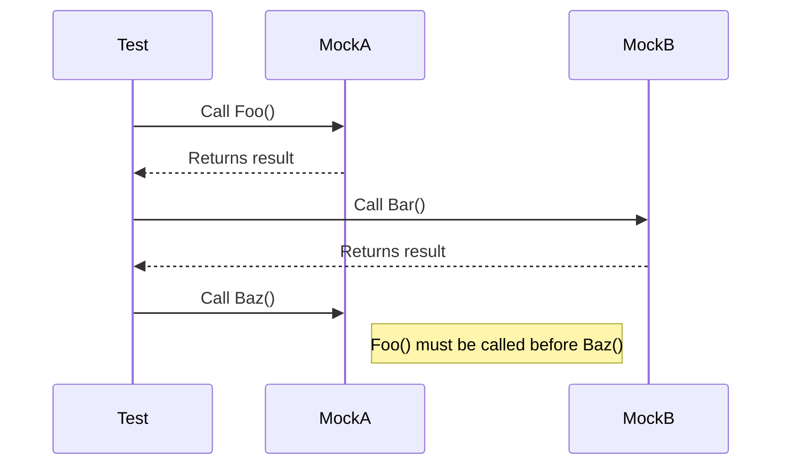

# Best Practices and Case Studies

Enhance your test suites with curated advice and real-world examples focused on sustainable test architecture, intuitive naming conventions, and maintainability strategies that scale with your project.

---

## 1. Designing Test Suites for Longevity

### Why Architecture Matters

As your codebase grows, your test suite should scale by remaining clear, fast, and easy to maintain. Adhering to solid test architecture saves time and reduces friction for both new and experienced team members.

### Start with a Clear Structure

- **Separate tests by feature or component:** Group related tests logically to encourage discoverability.
- **Use test fixtures to share setup:** Avoid redundant code and keep tests focused on behavior.
- **Keep test files small and focused:** Large test files become hard to navigate and review.

### Implement Testing Pyramid Principles

- Favor fast, isolated **unit tests** at the base.
- Use a smaller number of more complex and slower **integration tests**.
- Include minimal but critical **end-to-end tests**.

This layered approach balances speed, coverage, and robustness.

### Manage Test Dependencies

- Use mocks/stubs (e.g., with gMock) to isolate units under test.
- Avoid direct dependencies on external systems for unit tests.
- Clearly document when and how to use real components or test doubles.

<Tip>
Leverage GoogleMock's ability to create mocks easily and control their strictness to make tests resilient and expressive.
</Tip>

---

## 2. Naming Conventions and Expressive Tests

### Strive for Readability and Intent

Test names should clearly convey what behavior or scenario is under test without needing to read the implementation.

- **Use descriptive test case class names:** e.g., `ProfileManagerTest` rather than vague terms like `ManagerTests`.
- **Name tests with behavior in mind:** e.g., `ReturnsErrorWhenInputIsInvalid()`
- **Use Given/When/Then style for clarity:**
  - Given some preconditions,
  - When some action occurs,
  - Then expect certain results.

### Consistency is Key

Maintain a consistent naming pattern across your project. This helps users quickly understand the purpose of tests and improves tooling support.

Example:
```cpp
TEST(LoginManagerTest, GivenValidCredentials_WhenAuthenticate_ThenReturnsSuccess) {
  // ...
}
```

### Use Comments Sparingly

Prefer self-explanatory code and tests over excessive comments. Use comments only to explain why, not what.

---

## 3. Handling Test Flakiness and Reliability

### Common Causes of Flaky Tests

- Relying on real network calls or external services.
- Unsynchronized multi-threaded tests.
- Time-dependent logic without control.

### Best Practices to Mitigate Flakiness

- Use mock objects (with gMock) to simulate dependencies and control their behavior deterministically.
- Prefer dependency injection to allow substituting real components with fakes or mocks.
- Use synchronization primitives or mocks with thread-safety when testing multi-threaded code.
- Avoid reliance on real timers or clocks. Inject a mock clock if timing is important.

<Note>
GoogleMock provides support for controlling mock strictness (`NiceMock`, `NaggyMock`, `StrictMock`) which when used wisely can reduce noise and help highlight real test failures.
</Note>

---

## 4. Managing Mock Strictness and Behavior

### Choosing the Right Strictness

- **NaggyMock (default):** Warns on unexpected uninteresting calls. Useful during development.
- **NiceMock:** Suppresses noisy warnings, useful for stable tests focusing on a subset of interactions.
- **StrictMock:** Converts uninteresting calls to test failures. Use sparingly when you want confidence to catch any unwanted interaction.

### Practical Guidance

- Start by using **NiceMock** for most tests to reduce churn.
- Use **StrictMock** selectively where precise interaction is critical.
- Use **NaggyMock** when diagnosing flaky tests or understanding call sequences.

```cpp
using ::testing::NiceMock;
using ::testing::StrictMock;

// Nice mock: no warnings for calls without expectations
NiceMock<MockFoo> nice_mock;

// Strict mock: treat uninteresting calls as failures
StrictMock<MockFoo> strict_mock;
```

### Avoid Overly Strict Tests

Overly strict tests are brittle and prone to break on refactorings. Write expectations only for interactions you truly want to guarantee.

<Tip>
Use `ON_CALL()` to set default behavior on mocks. Reserve `EXPECT_CALL()` for interactions you want to verify.
</Tip>

---

## 5. Case Study: Refactoring a Legacy Test Suite

### The Problem

A legacy test suite had large tests with multiple expectations per test and direct dependency on real components, leading to slow and brittle tests with hard to diagnose failures.

### Approach

- **Extract interfaces and mocks:** Create interfaces covering collaborators and replace real implementations with mocks.
- **Use GoogleMock for interactions:** Define mocks with `MOCK_METHOD` and setup expectations clearly.
- **Decompose large tests:** Split tests into focused units verifying one aspect each.
- **Control mock behavior:** Use `ON_CALL` for default stubs, `EXPECT_CALL` for verification, and apply required strictness.
- **Add sequences for order sensitive verification:** Use `InSequence` or `Sequence` objects when call order matters.

### Outcomes

- Faster and deterministic tests.
- Less maintenance overhead.
- Easier to understand test failures.

```cpp
TEST(TransactionTest, ProcessesPaymentInOrder) {
  MockBankService bank_service;
  MockLogger logger;

  {
    InSequence seq;

    EXPECT_CALL(bank_service, VerifyCard(_));
    EXPECT_CALL(bank_service, ChargeCard(_, _));

    EXPECT_CALL(logger, Log(_));
  }

  PaymentProcessor processor(&bank_service, &logger);
  processor.ProcessPayment(card, amount);
}
```

---

## 6. Avoiding Common Mistakes

### Don’t Mock Non-Virtual Methods Without Good Reason

Mocking non-virtual methods requires special patterns and should be avoided unless necessary. Prefer abstract interfaces.

### Don’t Over-Specify Calls

Avoid expectations for method calls that aren't critical to your test's intent.

### Always Put `MOCK_METHOD` in `public:`

Even when mocking `private` or `protected` methods, the `MOCK_METHOD` macro must appear in the `public` section of the mock class to allow GoogleMock to work correctly.

### Beware of Unprotected Commas

Wrap argument or return types involving commas (e.g., `std::pair<bool, int>`) in parentheses or use type aliases to avoid macro parsing errors.

### Verify All Methods Called If Needed

Remember: mock objects verify expectations upon destruction, but you may need to force verification early if your mock has unusual lifetime.

---

## 7. Tips for Writing Maintainable Expectations

- Use `WillOnce()` and `WillRepeatedly()` wisely to manage behavior across multiple calls.
- Use `.RetiresOnSaturation()` to retire expectations once they meet their limits to avoid conflicts.
- Use sequences to enforce order only when necessary.
- Suppress uninteresting call warnings using `NiceMock` if noisy.

---

## 8. Visualizing Test Flow with Sequences



Sequences help control partial order of calls to multiple mock methods.

---

## 9. Troubleshooting Common Issues

### Warnings About Uninteresting Calls

If gMock warns about uninteresting calls, it means you did not specify `EXPECT_CALL` for method invocations that happened. Use `NiceMock` or add general expectations with `Times(AnyNumber())`.

### Unexpected Calls Fail Tests

When a method is called with arguments that don't match any `EXPECT_CALL`, the test fails immediately. Review matchers and expectations closely.

### Method Overloads Cause Ambiguities

Disambiguate overloaded methods by specifying argument matchers explicitly or use the `using` directive to bring base methods into scope.

---

## 10. Next Steps

- Explore [Writing and Using Mock Objects Effectively](../guides/writing-and-running-tests/using-mock-objects.md) for deeper examples.
- Review the [Mocking Reference](../api-reference/core-apis/mocking.md) for detailed API.
- Consult the [gMock Cookbook](../docs/gmock_cook_book.md) for advanced recipes.
- Understand strictness modifiers in [Mock Strictness and Behavior](../guides/test-design-and-best-practices/mock-strictness-and-behavior.md).

---

## Resources

- **gMock Cookbook:** Detailed recipes on mocking techniques.
- **Mocking Reference:** Comprehensive API documentation.
- **gMock Cheat Sheet:** Quick syntax guide.
- **gMock for Dummies:** Beginner-friendly introduction.


---

© Google Test & Mock Documentation, 2024

