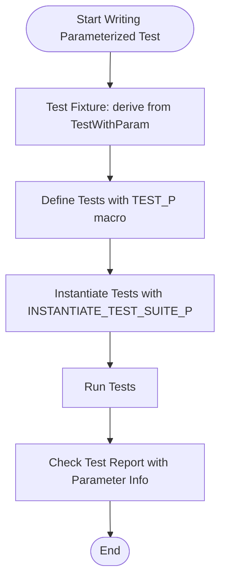

# Parameterized and Typed Tests

## Overview

This guide provides practical, real-world examples and usage patterns for writing **value-parameterized** and **type-parameterized** tests using GoogleTest. It shows how you can design test suites that execute the same logic on different data sets or across various types, maximizing test coverage while keeping your code clean and reducing duplication.

This page focuses specifically on the test patterns, macro usage, and instantiation workflows for parameterized tests—not the entire GoogleTest framework.

---

## What Are Parameterized and Typed Tests?

- **Value-Parameterized Tests** let you run the same test logic with different input values. This avoids writing many repetitive tests for various inputs.
- **Typed Tests** (also called *type-parameterized tests*) allow running the same tests on different C++ types, facilitating generic code testing.

Together, these test styles provide powerful patterns to improve test coverage and reduce boilerplate.

---

## Value-Parameterized Tests: Workflow and Usage

### Task Description
Create tests that run multiple times each with a distinct parameter value, to validate logic against varying inputs.

### Prerequisites
- Familiarity with GoogleTest basic test cases.
- A test fixture class derived from `testing::TestWithParam<T>` where `T` is the parameter type.

### Expected Outcome
A suite of tests that execute independently for each parameter provided, with test names reflecting parameters for easy identification.

### Time Estimate
5 to 10 minutes to write and instantiate basic parameterized tests.

### Difficulty Level
Beginner to Intermediate.

---

### Step-by-Step Instructions

<Steps>
<Step title="Define a Test Fixture Inheriting from TestWithParam">
Create a test fixture class template with a specific parameter type:

```cpp
class MyTest : public ::testing::TestWithParam<int> {
  // Fixture members go here
};
```

This class prepares the environment to access the current test parameter value via `GetParam()`.
</Step>

<Step title="Write Parameterized Tests Using TEST_P">
Define individual parameterized tests using the `TEST_P` macro:

```cpp
TEST_P(MyTest, HandlesPositiveValues) {
  int value = GetParam();
  EXPECT_GT(value, 0);
}
```

Here, `GetParam()` fetches the current test parameter for each test instantiation.
</Step>

<Step title="Instantiate Test Suites with Various Parameters">
Use `INSTANTIATE_TEST_SUITE_P` to specify the parameter values:

```cpp
INSTANTIATE_TEST_SUITE_P(MyInstantiation, MyTest, ::testing::Values(1, 2, 3));
```

You can use various generators:
- `Values(v1, v2, v3, ...)` - explicit list
- `Range(start, end [, step])` - values in numeric range
- `ValuesIn(container)` - values from containers or arrays
- `Bool()` - shorthand for {false, true}
- `Combine(g1, g2, ...)` - Cartesian product of multiple generators

</Step>

<Step title="Run the tests">
Run your test binary as usual. Each test will run once per parameter, with test names reflecting the parameters for clarity.
</Step>
</Steps>

### Expected Results
- Multiple test cases with the same test names but different parameters.
- Parametrized test results distinguishable by parameter values.

### Decision Points
- Choose the right parameter generator: simple values, collections, or combined variants.
- Determine if custom test naming is needed (see custom name generators).

### Verification
- Run tests and confirm each parameterized test runs independently.
- Validate output reflects the correct parameter values.

---

### Example: Value-Parameterized Test

```cpp
class FlagDependentTest : public ::testing::TestWithParam<bool> {};

TEST_P(FlagDependentTest, FeatureWorks) {
  bool external_flag = GetParam();
  // Test logic using external_flag
  EXPECT_TRUE(true);  // Example
}

INSTANTIATE_TEST_SUITE_P(BoolSequence, FlagDependentTest, ::testing::Bool());
```

This example runs the `FeatureWorks` test twice: once with `false` and once with `true`.


---

## Typed Tests: Workflow and Usage

### Task Description
Create tests that execute the same logic over a set of C++ types instead of values. This is critical for testing templates or generic classes.

### Prerequisites
- A test fixture class template templated on type parameter `T`, inheriting from `testing::Test`.
- A list of types to test in the form of `::testing::Types<T1, T2, ...>`.

### Expected Outcome
A single test suite instantiated multiple times with different types, each running the same tests defined.

### Time Estimate
10 to 15 minutes for setting up typed tests.

### Difficulty Level
Intermediate.

---

### Step-by-Step Instructions

<Steps>
<Step title="Define a Fixture Class Template">
Write a test fixture template class for generic type `T`:

```cpp
template <typename T>
class MyTypedTest : public ::testing::Test {
 public:
  T value_;
};
```

This provides the test context parameterized by a type.
</Step>

<Step title="Define the Type List and Associate It with the Fixture">
Define your test type list and associate it with your fixture using `TYPED_TEST_SUITE`:

```cpp
using MyTypes = ::testing::Types<int, double, std::string>;
TYPED_TEST_SUITE(MyTypedTest, MyTypes);
```

</Step>

<Step title="Write Typed Tests Using TYPED_TEST">
Write tests using the `TYPED_TEST` macro. Use `TypeParam` as the current type:

```cpp
TYPED_TEST(MyTypedTest, DefaultValueIsZero) {
  TypeParam default_value = TypeParam();  // Default-constructed
  // Test specific to TypeParam
  EXPECT_EQ(default_value, TypeParam());
}
```

</Step>

<Step title="Run the Tests">
Build and run the tests. GoogleTest will execute tests once per type listed in the type list with separate reporting.
</Step>
</Steps>

### Expected Results
- For each type in the list, all typed tests run individually.
- Test report shows test names decorated with the type being tested.

### Decision Points
- Select types meaningful to your test coverage.
- Use a custom `NameGenerator` if you want human-readable type suffixes.

### Verification
- Verify each type-specific test executes by reviewing output names.

---

### Example: Typed Test

```cpp
template <typename T>
class ContainerTest : public ::testing::Test {
public:
  T container_;
};

using TestTypes = ::testing::Types<std::vector<int>, std::list<int>>;
TYPED_TEST_SUITE(ContainerTest, TestTypes);

TYPED_TEST(ContainerTest, IsInitiallyEmpty) {
  EXPECT_EQ(0u, this->container_.size());
}
```

This runs `IsInitiallyEmpty` for `std::vector<int>` and `std::list<int>`.

---

## Type-Parameterized Tests: Workflow and Usage

### Summary
Type-parameterized tests are abstract test patterns where the test types are not fixed upfront but declared and defined separately from their instantiations. They allow defining reusable test requirements for interfaces or concepts.

### Workflow
1. Define a fixture template and declare a type-parameterized test suite using `TYPED_TEST_SUITE_P`.
2. Write test bodies using `TYPED_TEST_P`.
3. Register the tests with `REGISTER_TYPED_TEST_SUITE_P`.
4. Instantiate them with concrete types using `INSTANTIATE_TYPED_TEST_SUITE_P`.

This allows defining tests once and instantiating them multiple times, even across translation units.

---

## Customizing Test Names

By default, parameterized and typed tests generate names that are sometimes cryptic or lengthy. You can provide custom name generators to make test names clear and manageable.

For instance, in value-parameterized tests:

```cpp
INSTANTIATE_TEST_SUITE_P(
    MyInstantiation, MyTestSuite, testing::Values(1, 2, 3),
    [](const testing::TestParamInfo<MyTestSuite::ParamType>& info) {
      return std::to_string(info.param);
    });
```

For typed tests, implement a class with a `static std::string GetName(int)` method template:

```cpp
class MyTypeNames {
 public:
  template <typename T>
  static std::string GetName(int) {
    if constexpr (std::is_same_v<T, int>) return "int";
    if constexpr (std::is_same_v<T, double>) return "double";
    // ...
  }
};

TYPED_TEST_SUITE(MyFixture, MyTypes, MyTypeNames);
```

---

## Best Practices and Tips

- Use `Range`, `Values`, and `ValuesIn` for simple, readable parameterization.
- Combine generators with `Combine` to cover multiple parameters.
- Use `ConvertGenerator` for explicit parameter type conversions.
- Be mindful of the lifetime and copying semantics when using custom converters or complex types.
- Use custom name generators to produce descriptive test names, aiding debugging and CI logs.
- For templated code, prefer typed or type-parameterized tests to ensure broad coverage.
- Leverage test environments (`Environment`) to monitor that all parameterized tests run as expected.

---

## Troubleshooting

<AccordionGroup title="Common Issues and Solutions">
<Accordion title="Tests Not Instantiating or Running">
Ensure that for every value-parameterized `TEST_P` test, there is a matching `INSTANTIATE_TEST_SUITE_P` with appropriate parameters. Missing instantiations lead to silent skipped tests.

Use `GTEST_ALLOW_UNINSTANTIATED_PARAMETERIZED_TEST` to suppress failures if intentional.
</Accordion>
<Accordion title="Parameter Type Conversion Errors">
If the parameter type is not implicitly constructible from generated values, use `ConvertGenerator<T>` with a custom converter lambda to enforce explicit conversions.

Watch for dangling references in converters involving `std::string_view`.
</Accordion>
<Accordion title="Cryptic or Overly Long Test Names">
Implement custom name generators for typed or parameterized tests to generate clear and manageable test names.
Avoid default names that print entire complex types or values directly.
</Accordion>
</AccordionGroup>

---

## Next Steps & Related Content

- Learn more about [Value-Parameterized Tests](../advanced.md#value-parameterized-tests).
- Explore [Typed Tests and Type-Parameterized Tests](../advanced.md#typed-tests).
- Consult the [Testing Reference](../reference/testing.md) for macro and API details.
- Continue with [Writing Your First Test Cases](../getting-started/writing-your-first-tests.md) for basic test authoring.
- Inspect [Using Assertions Effectively](../testing-techniques/advanced-assertions.md) to write robust validation logic.
- Explore integration and mocking in related guides under [Mocking with GoogleMock](../mocking-with-googlemock/introduction-to-mocking.md).

---

## References

- **GoogleTest Documentation: [Testing Reference - Parameterized Tests](../reference/testing.md#TEST_P)**
- **Examples in `googletest/test/googletest-param-test-test.cc`** demonstrating value-parameterized test implementation
- **Examples in `googletest/test/gtest-typed-test_test.cc` and related headers** for typed and type-parameterized tests

---

## Summary Diagram of Parameterized Test Flow




---

## Final Notes
Using parameterized and typed tests lets you: 
- Write once, test many times with varied data or types
- Improve code coverage efficiently
- Keep tests clean and maintainable

Mastering these patterns will elevate your testing rigour and confidence.

---

For more detailed examples and API descriptions, see the [Testing Reference](../reference/testing.md).

