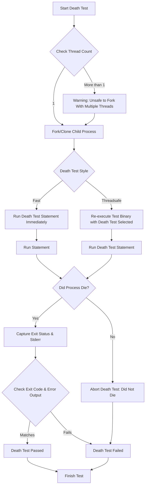

# Writing and Managing Death Tests

## Overview

This guide empowers you to write reliable and effective death tests in GoogleTest. Death tests verify that your code correctly terminates under exceptional or invalid conditions, ensuring program robustness. Using GoogleTest's dedicated macros and best practices, you will learn how to craft, run, and troubleshoot death tests to maintain strong test coverage for failure scenarios that cause process termination.

---

## 1. Understanding Death Tests

### What Is a Death Test?

A death test is a test that verifies the program terminates (dies) in an expected manner under certain conditions.

- This includes exiting with a specific exit code, terminating due to a signal, or crashing.
- Death tests **do not** consider exceptions as death, as those can be caught and handled.
- These tests are essential when validating assert statements or fatal failure checks that cause your program to abort.

### When to Use Death Tests

Use death tests when you want to ensure:

- Your code properly aborts on invalid input or corrupt state.
- Critical failures cause the program to exit as expected.
- Specific error messages or signals accompany the unexpected termination.

### How Death Tests Execute

- Death test code runs in a **child process**, isolated from the test runner.
- The child process attempts to run the death test statement; if it exits or crashes as expected, the test passes.
- The parent process monitors the child's exit status and stderr output to confirm correct death.

### Important Considerations

- Side effects within death test code are not visible to the parent process since they run in separate processes.
- Death tests should avoid interfering with multi-threaded environments where possible.

---

## 2. Prerequisites

Before writing death tests, ensure:

- Your GoogleTest environment is correctly installed and configured.
- You understand basic GoogleTest assertions and test fixtures.
- You are aware of the limitations around multi-threading and forking.

---

## 3. Writing Death Tests

### Core Macros

GoogleTest provides several macros for death tests:

| Macro               | Description                                                        |
|---------------------|------------------------------------------------------------------|
| `ASSERT_DEATH(stmt, regex)`   | Fatal assertion: Fails test if `stmt` does not die with output matching `regex`.|
| `EXPECT_DEATH(stmt, regex)`   | Nonfatal assertion: Allows test to continue even if `stmt` does not die.         |
| `ASSERT_EXIT(stmt, predicate, regex)` | Asserts that `stmt` terminates with exit status matching `predicate` and output matching `regex`.
| `EXPECT_EXIT(stmt, predicate, regex)` | Same as ASSERT_EXIT but nonfatal.
| `EXPECT_DEBUG_DEATH(stmt, regex)` | Asserts death in Debug mode only; runs `stmt` silently in Release(/opt) mode.


### Basic Syntax Examples

```cpp
// A simple death test using ASSERT_DEATH:
TEST(MyDeathTest, DiesOnInvalidInput) {
  ASSERT_DEATH(DoSomethingInvalid(), "Invalid input detected");
}

// Using EXPECT_DEATH in a loop:
TEST(MyDeathTest, AllInputsDie) {
  for (int i = 0; i < 5; ++i) {
    EXPECT_DEATH(ProcessRequest(i), "Request .* invalid");
  }
}

// Using ASSERT_EXIT to check exit code and output:
TEST(MyDeathTest, ExitsGracefully) {
  ASSERT_EXIT(ExitNow(), ::testing::ExitedWithCode(0), "Exiting");
}

// Using a predicate to check signal termination:
bool KilledBySIGHUP(int exit_code) {
  return WIFSIGNALED(exit_code) && WTERMSIG(exit_code) == SIGHUP;
}

TEST(MyDeathTest, KilledBySignal) {
  ASSERT_EXIT(HangUpServer(), KilledBySIGHUP, "Hanging up!");
}
```

### Using Compound Statements

Because the `statement` argument can be any valid statement, you can write compound statements inside death tests:

```cpp
ASSERT_DEATH({
  int n = Initialize();
  RunFatalOperation(n);
}, "fatal error");
```

### Notes on Regex

- The `matcher` is interpreted as a regex on the subprocess stderr.
  - On POSIX systems, POSIX extended regex syntax is used.
  - On Windows/macOS, a limited regex syntax is provided (no alternations, groups, or repetition counts).
- Invalid regex features will cause test runtime failure.

---

## 4. Death Test Styles and Configuration

GoogleTest supports two styles of death tests controlled by the `--gtest_death_test_style` flag:

| Style      | Description                                                                                   | Pros                         | Cons                       |
|------------|-----------------------------------------------------------------------------------------------|------------------------------|----------------------------|
| `fast`     | Child process forks and runs death test logic immediately.                                   | Faster test execution         | Not thread-safe             |
| `threadsafe` | Child process re-executes the test binary and runs only the death test defined.              | Thread-safe; safer for multi-threading | Slower execution          |

You can set this flag programmatically or via command line:

```cpp
GTEST_FLAG_SET(death_test_style, "threadsafe");
```

### Warning on Threads

- Death tests require forking, which is unreliable if multiple threads are running.
- GoogleTest emits warnings if more than one thread exists when running death tests.
- It's best to ensure only one thread is running during death tests or use the `threadsafe` style.

---

## 5. Best Practices for Reliable Death Tests

- **Move as much code as possible inside death tests**: This reduces chances of interference with other threads or shared state.
- **Avoid side effects on shared resources**: Since death tests run in isolated subprocesses.
- **Use `threadsafe` style when working within complex multi-threaded setups**.
- **Avoid multiple death tests on the same line in code**: This can lead to confusing error messages.
- **Write clear and specific regexes** for error message matching to avoid false positives.
- **If your death test involves mocks**, use `Mock::AllowLeak()` on relevant mocks to avoid leak errors since the child process exit skips normal cleanup.

---

## 6. Advanced Usage

### Using Predicates with ASSERT_EXIT/EXPECT_EXIT

Predicates check the exit status of your program beyond simply dying:

- Use `::testing::ExitedWithCode(code)` to check for normal exit.
- Use `::testing::KilledBySignal(signal_num)` (POSIX only) to check for termination by signal.

Example:

```cpp
EXPECT_EXIT(MyFunction(), ::testing::ExitedWithCode(0), "Success");
EXPECT_EXIT(MyFunction(), ::testing::KilledBySignal(SIGSEGV), "segfault");
```

### Debug Death Tests

`EXPECT_DEBUG_DEATH` and `ASSERT_DEBUG_DEATH` execute death assertions only in debug builds. In optimized builds, the statement runs normally.

---

## 7. Handling Failure Scenarios

### Common Issues

- **Test hangs or crashes unexpectedly**:
  - Ensure your death test code is safe to run in a child process.
  - Confirm only one thread exists when using `fast` style death tests.

- **Death test does not detect death**:
  - Verify the statement actually causes termination.
  - Check that your regex matcher correctly matches stderr output.

- **Multiple threads warning**:
  - Try switching to `threadsafe` style (`GTEST_FLAG_SET(death_test_style, "threadsafe")`).
  - Reduce stray background threads if possible.

- **Regex mismatch errors**:
  - Use simple regex syntax as supported.
  - Run regexes manually to confirm matching stderr outputs.

### Debugging Tips

- Insert explicit logging to stderr inside your death test statement for diagnostic info (visible when tests fail).
- Run tests with death test style switched to `fast` or `threadsafe` to compare behavior.
- Use `EXPECT_EXIT` with predicates to verify exit status clearly.

---

## 8. Examples

### Example 1: Testing Process Crash

```cpp
TEST(CrashTest, CrashesOnBadPointer) {
  EXPECT_DEATH({
    int* p = nullptr;
    *p = 42;
  }, ".*");  // Regex matches any stderr output
}
```

### Example 2: Testing Expected Error Message

```cpp
void FunctionWithAssert(bool fail) {
  if (fail) {
    fprintf(stderr, "Fatal error: invalid state\n");
    abort();
  }
}

TEST(ErrorMessageTest, PrintsExpectedError) {
  ASSERT_DEATH(FunctionWithAssert(true), "Fatal error: invalid state");
}
```

### Example 3: Testing Exit Code with Predicate

```cpp
void ExitWithCode(int code) { _Exit(code); }

TEST(ExitCodeTest, ExitsWith42) {
  ASSERT_EXIT(ExitWithCode(42), ::testing::ExitedWithCode(42), "");
}
```

### Example 4: Using EXPECT_DEBUG_DEATH

```cpp
int DieInDebug(int* side_effect) {
  if (side_effect) *side_effect = 42;
#ifndef NDEBUG
  abort();
#endif
  return 0;
}

TEST(DebugDeathTest, DiesOnlyInDebug) {
  int side_effect = 0;
  EXPECT_DEBUG_DEATH(DieInDebug(&side_effect), "abort");
#ifdef NDEBUG
  EXPECT_EQ(side_effect, 42);  // side effect visible in release
#else
  EXPECT_EQ(side_effect, 0);   // side effect invisible in debug
#endif
}
```

---

## 9. Troubleshooting

<AccordionGroup title="Troubleshooting Common Death Test Issues">
  <Accordion title="Test Hangs Indefinitely">
  - Ensure no background threads exist when using `fast` style; switch to `threadsafe` if needed.
  - Confirm correct use of `ASSERT_DEATH` or `EXPECT_DEATH` macros.
  - Check your test function does not inadvertently block indefinitely.
  </Accordion>
  <Accordion title="Death Test Fails Because Regex Does Not Match">
  - Simplify regex and verify against stderr output.
  - Use `ContainsRegex` syntax compatible with your platform.
  - Verify your error message is being printed to stderr.
  </Accordion>
  <Accordion title="Side Effects Inside Death Tests Are Not Observed">
  - Remember death tests run in subprocess; side effects on memory or mocks do not propagate.
  - Place any expectations related to mocks inside the death test macro.
  </Accordion>
  <Accordion title="Multiple Threads Warning Before Death Test">
  - Minimize pre-existing threads before death test.
  - Use `threadsafe` death test style for better safety.
  </Accordion>
</AccordionGroup>

---

## 10. Next Steps

- Explore the [Assertions Reference](reference/assertions.md#death) for detailed macro behaviors.
- Read the [Advanced Topics - Death Tests](docs/advanced.md#death-tests) for best practices and internals.
- Use [SCOPED_TRACE](docs/advanced.md#using-assertions-in-sub-routines) to improve diagnostics within loops or nested calls in death tests.
- Understand thread safety implications via the [FAQ - Death test hangs or seg-faults](docs/faq.md#My-death-test-hangs-or-seg-faults-How-do-I-fix-it).
- Review real-world examples in [googletest-death-test-test.cc](googletest/test/googletest-death-test-test.cc) for more structured use cases.

---

## References

- GoogleTest Death Assertions: [ASSERT_DEATH(), EXPECT_DEATH(), ASSERT_EXIT(), EXPECT_EXIT()](reference/assertions.md#death)
- Advanced Guide on Death Tests: [docs/advanced.md#death-tests](docs/advanced.md#death-tests)
- FAQ on Death Tests and Threading Issues: [docs/faq.md#My-death-test-hangs-or-seg-faults-How-do-I-fix-it](docs/faq.md#My-death-test-hangs-or-seg-faults-How-do-I-fix-it)
- Code Examples: [googletest-death-test-test.cc](googletest/test/googletest-death-test-test.cc)

---

## Summary

Death tests are essential for asserting that your code handles fatal errors correctly by terminating as expected. GoogleTest facilitates death testing with powerful macros that isolate test statements in subprocesses, providing mechanisms to verify exit codes, signals, and stderr output. By following best practices, handling thread safety, and using the appropriate death test style, you can confidently ensure your program reacts robustly to errors.

---

## Diagram: Death Test Execution Flow


